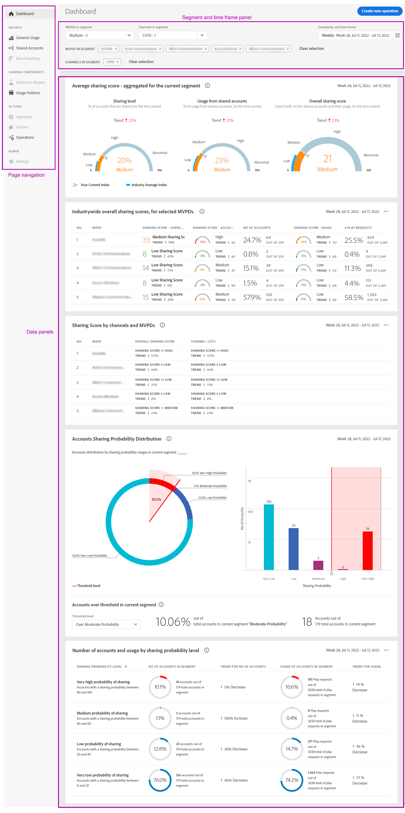

# 儀表板 {#dashboard}

「控制面板」會摘要並彙總圖表與報表集合中的資料，這些圖表與報表的設計目的是提供帳戶共用範圍與影響的概觀。 它提供包含Account IQ主要報表和量度的單一頁面。

+++程式設計師 — 儀表板

圖：程式設計人員使用者的控制面板

+++

+++MVPD — 儀表板

MVPD使用者的儀表板與程式設計人員使用者的儀表板稍有不同。

圖：MVPD使用者的儀表板

+++

## 平均共用分數 — 針對目前區段彙總 {#aggregated-sharing}

「彙總共用分數」面板提供頂行讀數，以總結帳戶和串流數量方面的共用數量和影響。

這些值可協助您瞭解訂閱者共用認證的程度，從而提供據以採取行動的必要性度量。

*圖：平均共用分數面板 — 針對目前區段彙總*

以下三個量度是「平均共用分數」的元件。

### 共用層級 {#sharing-level}

共用層級量測計會顯示所選時間範圍內所有已共用的訂戶帳戶（在定義的區段中）的百分比。

根據所選MVPD集合中每個帳戶計算出的平均共用機率計算出的值，這些帳戶在所選時間範圍內已從其中一個所選程式設計人員管道串流。

*圖：共用層級*

趨勢指標顯示中量度值與上一個時間範圍相比的百分比變化。

### 共用帳戶的使用情況 {#usage-from-shared-accounts}

此量規指出已定義區段和時段之共用帳戶中，所有訂閱者帳戶的使用百分比。 量規會以0到100%的比例標籤使用範圍（從共用帳戶）。 這些範圍（名為「低」、「中」、「高」和「異常」）是根據產業平均值而定。

您也可以檢視趨勢指標，此指標可描述共用帳戶的使用率與先前的時間範圍相比出現上升或下降的情況。

*圖：共用帳戶的使用情況*

### 整體共用分數 {#overall-sharing-score}

整體共用分數是共用分數的組合，包括「共用層級」和「共用帳戶的z使用量」。

它提供的值旨在反映相較於產業共用所產生的相對影響。 其用途類似於信用評分，以單一數字摘要情況。 但在此情況下，數字越大，潛在危害就越大。

*圖：整體共用分數*

<!--### MVPDs in segment {#mvpd-in-segment}

It is a table of risk indices and accounts totals for the top MVPDs ranked by overall usage or account sharing.

-->

## MVPD的全產業整體共用分數 {#top-mvpds}

此表格提供區段中MVPD之不同彙總共用分數的比較檢視。

>[!NOTE]
>
>此表格會使用整體產業資料作為比較用途，而非該區段中的MVPD所代表的資料。

*圖：依整體評分的區段排名前MVPD*

## 依管道和MVPD分享分數 {#sharin-score-by-channels-and-mvpds}

此表格提供共用目前區段中MVPD所選管道分數的比較檢視。

*圖：依管道和MVPD共用分數*

## 帳戶共用機率 {#accounts-sharing-probability}

此圖表將帳戶劃分成從非常低(0-20%)到非常高(80=100%)的共用機率四分位數的範圍。

>[!NOTE]
>
>長條圖使用對數刻度。

*圖：不同共用機率範圍內的訂閱者帳號數目和百分比*

## 共用機率層級的帳戶數量和使用狀況 {#number-of-accounts-usage-sharing-probability}

此面板提供表格檢視的帳戶，這些帳戶被分割成從極低(0-20%)到極高(80-100%)的共用機率四分位數的範圍，每個四分位數的關聯使用量都來自共用帳戶。

*圖：落入各種機率範圍的帳戶、趨勢和使用情況數量*

<!--
+++Dashboard for programmers

*Figure: The dashboard*

>>>>>>> 7ab48cf61552febab21a5d5c05586e0aefe8ce17
## Average sharing score - aggregated for the current segment {#aggregated-sharing}

The Aggregated Sharing Score panel provides a top line readout summarizing the quantity and impact of sharing in terms of accounts and streaming volume.

The values help you understand the magnitude of credential sharing by your subscribers, hence providing a measure of the need to act upon it.

*Figure: Average sharing score panel - aggregated for the current segment*

The following three metrics are components of the Average Sharing Score.

### Sharing level {#sharing-level}

The sharing level gauge shows the percentage of all your subscriber accounts (in the defined segment) that are shared, during the selected time frame.  

A value calculated based on an average of the sharing probability computed for every account for the selected MVPD(s) that has streamed from a one of the selected programmer channels during the selected time frame.

*Figure: Sharing level*

The Trend indicator shows the percentage change in the value of the metric in from the previous time frame.

### Usage from shared accounts {#usage-from-shared-accounts}

This gauge indicates what percent of the usage of all the subscriber accounts is from the shared accounts for the defined segment and time period. The gauge marks the ranges of usage (from shared accounts) on the scale of 0 to 100%. These ranges (named Low, Medium, High, and Abnormal) are based on the industry average.

You can also see the Trend indicator, which depicts a rise or fall in the usage from shared accounts as compared to the previous time frame.

*Figure: Usage from shared accounts*

### Overall sharing score {#overall-sharing-score}

Overall sharing score is composite of sharing scores including "Sharing level" and "Usage from shared accounts".

It provides a value meant to reflect the relative impact of sharing when compared to the industry. Its purpose is similar to that of a credit score, summarizing the situation with a single number. But in this case, the higher the number the greater the potential harm.

*Figure: Overall sharing score*

## Industrywide overall sharing scores {#mvpd-in-segment}

+++Programmer- MVPDs in segment

This table provides a comparative view of the different Aggregated Sharing Scores for the MVPDs in the segment.

*Figure: Panel showing top MVPDs in a segment*

>[!NOTE]
>
>This table uses overall industry data for comparative purposes, not the data represented by those MVPDs in the segment.

+++

+++MVPD- Programmers in segment

This table provides a comparative view of the different Aggregated Sharing Scores for the programmers in the segment.

*Figure: Panel showing top programmers in a segment*

+++

## Sharing score by channels and MVPDs {#sharin-score-by-channels-and-mvpds}

+++Programmer- MVPDs in segment

This table provides a comparative view of sharing scores of the selected channels for the MVPDs in the current segment.

*Figure: Sharing scores by channels and MVPDs*

>[!NOTE]
>
>**Sharing score by channels and MVPDs** panel is available only for programmer login.

+++

## Accounts sharing probability distribution{#accounts-sharing-probab-dist}

This panel partitions accounts into ranges of sharing probability quintiles from very low (0-20%) to very high (80-100%).

Pie chart shows the proportions (in term of percentages) of user accounts in various sharing probability ranges. Whereas, column chart shows the absolute numbers of accounts in different probability ranges.

>[!NOTE]
>
>The column chart uses a logarithmic scale.

*Figure: Percentages and number of subscriber accounts in different sharing probability ranges*

### Accounts over threshold in current segment {#acc-over-threshold-in-segment}

You can select a level of sharing probability, out of the following to view number and percentage of accounts above it:

* Over very low (0%-20%) probability

* Over low (20%-40%) probability

* Over moderate (40%-60%) probability

* Over high (60%-80%) probability

## Number of accounts and usage by sharing probability level {#number-of-accounts-usage-sharing-probability}

This panel provides tabular view of  accounts partitioned into ranges of sharing probability quintiles from very low (0-20%) to very high (80-100%) with each quintile's associated usage from shared accounts.

*Figure: Number of accounts, trends, and usages falling in various probability ranges*

-->