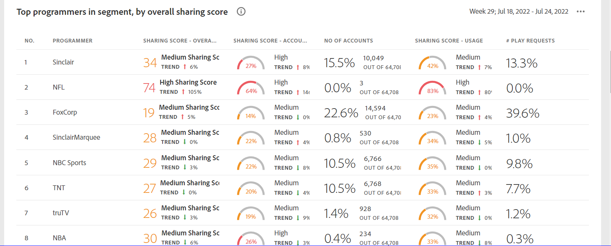

# 儀表板 {#dashboard}

「控制面板」匯總和聚合圖表和報表的集合中的資料，這些圖表和報表旨在對帳戶共用的範圍和影響進行高級別概述。 它提供一頁，其中包含來自帳戶IQ的主要報告和度量。

<table><tr><th>

+++程式設計師儀表板

*圖：儀表板*

## 平均共用分數 — 當前段的聚合 {#aggregated-sharing}

「聚合共用分數」面板提供頂行讀出，概括了從帳戶和流量量角度共用的數量和影響。

這些值有助於您瞭解訂閱者共用憑據的大小，從而提供了對此採取行動的必要性的度量。

*圖：平均共用分數面板 — 當前段的聚合*

以下三個指標是平均共用分數的元件。

### 共用級別 {#sharing-level}

共用級別規格顯示在所選時間範圍內共用的所有訂閱伺服器帳戶（在定義的段中）的百分比。

基於在所選時間幀期間從所選程式設計師通道之一流化的一組所選MVPD中的每個帳戶計算的共用概率的平均值計算的值。

*圖：共用級別*

趨勢指示器顯示度量值與上一時間幀相比的百分比變化。

### 來自共用帳戶的使用 {#usage-from-shared-accounts}

此標尺指示所有訂閱者帳戶的使用百分比來自定義的段和時間段的共用帳戶。 該儀表將使用範圍（從共用帳戶）標籤為0到100%。 這些範圍（稱為「低」、「中」、「高」和「異常」）均基於行業平均值。

您還可以看到「趨勢」指示器，它描述了與上一個時間框架相比來自共用帳戶的使用情況的增減。

*圖：來自共用帳戶的使用*

### 總體共用分數 {#overall-sharing-score}

總體共用分數是共用分數的組合，包括「共用級別」和「共用帳戶的z使用」。

它提供的價值旨在反映與行業相比共用的相對影響。 目的類似於信用評分，用一個數字來概括情況。 但在這種情況下，數量越大，潛在的傷害就越大。

*圖：總體共用分數*

<!--### MVPDs in segment {#mvpd-in-segment}

It is a table of risk indices and accounts totals for the top MVPDs ranked by overall usage or account sharing.

-->

### 全行業MVPD總體共用分數 {#top-mvpds}

此表提供了段中MVPD的不同聚合共用分數的比較視圖。

>[!NOTE]
>
>此表使用整個行業資料進行比較，而不是段中那些MVPD所表示的資料。

*圖：按總得分劃分的段中的頂級MVPD*

### 按渠道和MVPD共用分數 {#sharin-score-by-channels-and-mvpds}

此表提供了共用當前段中MVPD的選定通道分數的比較視圖。

*圖：按頻道和MVPD共用分數*

### 帳戶共用概率 {#accounts-sharing-probability}

此圖表將共用概率的範圍從非常低(0-20%)劃分為非常高(80=100%)。

>[!NOTE]
>
>條形圖使用對數刻度。

*圖：不同共用概率範圍中的訂戶帳戶的數量和百分比*

### 通過共用概率級別計算的帳戶數和使用情況 {#number-of-accounts-usage-sharing-probability}

此面板提供了帳戶的表格視圖，這些帳戶被劃分為從非常低(0-20%)到非常高(80-100%)的共用概率，每個五分之一的帳戶從共用帳戶的相關使用。

*圖：在各種概率範圍內發生的帳戶、趨勢和使用次數*

+++

</th><th>

+++MVPD的儀表板MVPD用戶的儀表板與程式設計師用戶的儀表板稍有不同。

*圖：MVPD的儀表板*

## 按總體共用分數劃分的段內頂級程式設計師 {#}

*圖：顯示段中頂級程式設計師的面板*
+++

</th>
</tr>

</table>

<!--
+++Dashboard for programmers

*Figure: The dashboard*

## Average sharing score - aggregated for the current segment {#aggregated-sharing}

The Aggregated Sharing Score panel provides a top line readout summarizing the quantity and impact of sharing in terms of accounts and streaming volume.

The values help you understand the magnitude of credential sharing by your subscribers, hence providing a measure of the need to act upon it.

*Figure: Average sharing score panel - aggregated for the current segment*

The following three metrics are components of the Average Sharing Score.

### Sharing level {#sharing-level}

The sharing level gauge shows the percentage of all your subscriber accounts (in the defined segment) that are shared, during the selected time frame.  

A value calculated based on an average of the sharing probability computed for every account in the set of selected MVPDs that has streamed from a one of the selected programmer channels during the selected time frame.

*Figure: Sharing level*

The Trend indicator shows the percentage change in the value of the metric in from the previous time frame.

### Usage from shared accounts {#usage-from-shared-accounts}

This gauge indicates what percent of the usage of all the subscriber accounts is from the shared accounts for the defined segment and time period. The gauge marks the ranges of usage (from shared accounts) on the scale of 0 to 100%. These ranges—named Low, Medium, High, and Abnormal—are based on the industry average.

You can also see the Trend indicator, which depicts a rise or fall in the usage from shared accounts as compared to the previous time frame.

*Figure: Usage from shared accounts*

### Overall sharing score {#overall-sharing-score}

Overall sharing score is composite of sharing scores including “Sharing level” and “z Usage from shared accounts”.

It provides a value meant to reflect the relative impact of sharing when compared to the industry. It’s purpose is similar to that of a credit score, summarizing the situation with a single number. But in this case, the higher the number the greater the potential harm.

*Figure: Overall sharing score*

<!--### MVPDs in segment {#mvpd-in-segment}

It is a table of risk indices and accounts totals for the top MVPDs ranked by overall usage or account sharing.

### Industrywide overall sharing scores for MVPDs {#top-mvpds}

This table provides a comparative view of the different Aggregated Sharing Scores for the MVPDs in the segment.

>[!NOTE]
>
>This table uses overall industry data for comparative purposes, not the data represented by those MVPDs in the segment.

*Figure: Top MVPDs in segment by overall score*

### Sharing score by channels and MVPDs {#sharin-score-by-channels-and-mvpds}

This table provides a comparative view of sharing scores of the selected channels for the MVPDs in the current segment.

*Figure: Sharing scores by channels and MVPDs*

### Accounts sharing probability {#accounts-sharing-probability}

This chart partitions accounts into ranges of sharing probability quintiles from very low (0-20%) to very high (80=100%).

>[!NOTE]
>
>The bar graph uses a logarithmic scale.

*Figure: Numbers and percentages of subscriber accounts in different sharing probability ranges*

### Number of accounts and usage by sharing probability level {#number-of-accounts-usage-sharing-probability}

This panel provides tabular view of  accounts partitioned into ranges of sharing probability quintiles from very low (0-20%) to very high (80-100%) with each quintile’s associated usage from shared accounts.

*Figure: Number of accounts, trends, and usages falling in various probability ranges*

+++

+++Dashboard for MVPDs
The dashboard for MVPD users is slightly different from those of the programmer users.

*Figure: MVPD's Dashboard*

## Top programmers in segment by overall sharing score {#}

*Figure: Panel showing top programmers in a segment*
+++

+++Dashboard for MVPDs
The dashboard for MVPD users is slightly different from those of the programmer users.

*Figure: MVPD's Dashboard*

## Top programmers in segment by overall sharing score {#}

*Figure: Panel showing top programmers in a segment*
+++
-->