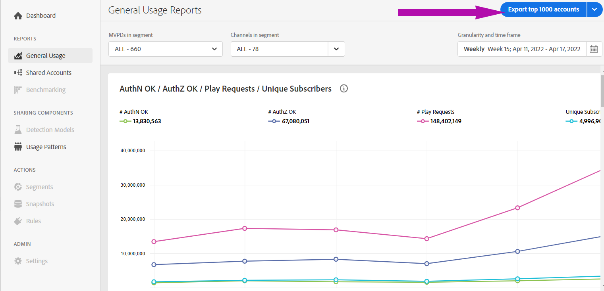

# 導出共用分數高的帳戶資訊 {#export-account-info-high-score}

帳戶IQ允許您根據前1000個訂閱者帳戶導出帳戶共用詳細資訊 [共用概率](/help/AccountIQ/product-concepts.md#account-sharing-probability-def)。 導出的CSV檔案中的資料按訂閱者帳戶共用概率的遞減順序排序，訂閱者帳戶共用概率為 [分部](/help/AccountIQ/product-concepts.md#segment-def)的 [指定時間幀](/help/AccountIQ/product-concepts.md#time-frame-def)。

可以選擇導出帳戶共用資訊 [常規使用情況報告](/help/AccountIQ/general-usage-reports.md) 和 [共用帳戶報告](/help/AccountIQ/shared-acc-reports.md) 頁。

>[!NOTE]
>
>下載的CSV檔案中的數字對於「一般用法」和「共用帳戶」報告頁不同。 這是因為「一般用途報告」頁為程式設計師提供了其他篩選器，以便為設備、 IP和郵遞區號數選擇閾值。 因此，從「一般使用情況」報告導出的資料基於應用的附加閾值篩選器。

要導出訂閱者的帳戶共用資訊，請執行以下操作：

1. 按照中的步驟定義所需段 [如何定義段和選擇時間範圍](/help/AccountIQ/howto-select-segment-timeframe.md) 從 [段和時間](/help/AccountIQ/segments-timeframe.md) 的子菜單。

1. 選擇 **導出前1000個帳戶** 選項，可導出共用概率最高的1000個訂閱者的帳戶資訊。

使用導出選項時，具有最高共用概率（對於定義的時間範圍）的1000個帳戶的統計資訊將下載到本地電腦的「下載」資料夾中。

>[!NOTE]
>
>可以使用讀取CSV檔案的任何應用程式(例如MicrosoftExcel)開啟下載的CSV檔案。

*圖：以CSV格式導出的共用帳戶資料*

## 導出報表中的列 {#columns-in-export}

**周/月**

您選擇的周或月 **粒度和時間幀** 選項，以查找共用統計資訊。

**MVPD**

如果您是程式設計師用戶，該列將顯示訂閱者帳戶所屬的MVPD。

**訂戶ID**

我們一直在討論的特定帳戶。

**最少設備數**

實際設備數（即流內容）幾乎肯定大於為特定帳戶指定的最小設備數。

>[!NOTE]
>
>實際設備數（該流內容）肯定大於為特定帳戶指定的設備最小數量。

**最低人數**

使用這些設備對活動內容進行流式處理的絕對最小人數。

>[!NOTE]
>
>實際人數（該流內容）幾乎肯定比為特定帳戶指定的人數最低數目要多得多。

**IP數**

從中流式傳輸內容的IP地址數。

**位置**

從中流式傳輸內容的位置數（基於郵遞區號）。

**#城市**

流媒體播放的城市數量。

**狀態數**

已進行流處理的狀態數。

**群集數**

不同的數 [群集](/help/AccountIQ/product-concepts.md#cluster-def) 流播的地方。

**地理範圍（英里）**

與帳戶關聯的流位置之間的最大距離。

**# AuthN確定**

在此期間使用該帳戶的用戶登錄的次數。

**# AuthZ確定**

MVPD授權流或授予（訪問內容）該帳戶的次數。

>[!NOTE]
>
>的 **# AuthZ確定** 與 **播放請求數**;它比 **播放請求數** 因為Adobe會快取MVPD的授權，通常為24小時。

**播放請求數**

期間內的實際流數。

**通道數**

帳戶在該時間段內監視的不同渠道的總數。

>[!NOTE]
>
>**通道數** 包括不一定屬於登錄程式設計師的通道。
>
>此帳戶的編號顯示是因為該帳戶監視了您的頻道，但在該時間段內，它也訪問了其他頻道。

**使用模式**

此列中的數字是標識符，它映射到我們將所有用戶帳戶標識為的14種模式之一。

*表：使用模式導出的CSV映射中的使用模式標識符*

| ID | 1 | 2 | 3 | 4 | 5和8 | 6 | 7 | 9 | 10和11 | 12 | 13 | 14 |
|---|---|---|---|---|---|---|---|---|---|---|---|---|
| 使用模式 | 常規用戶 | 旅行者或通勤者 | 大家族 | 親朋好友 | 社會群共用 | 一大群朋友 | 併發流 | 社區共用 | 不確定行為 | 小家庭 | 第二個家庭 | 異常使用 |

{style="table-layout:auto"}

**共用概率**

共用概率是特定帳戶共用其憑據的概率。

>[!NOTE]
>
> 所有帳戶（在選定的段中）的共用概率平均值用於計算 [共用級](/help/AccountIQ/dashboard.md#sharing-level) 的 [聚合共用分數](/help/AccountIQ/dashboard.md#aggregated-sharing)。
