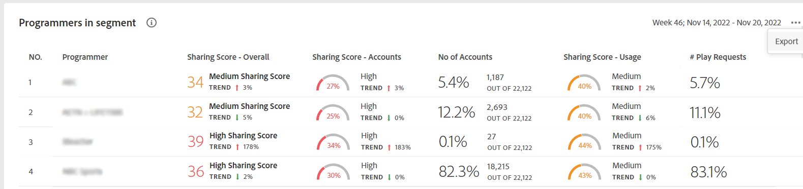
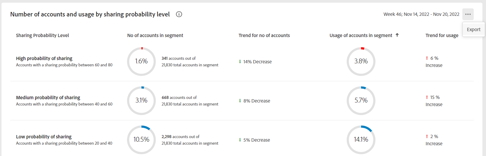
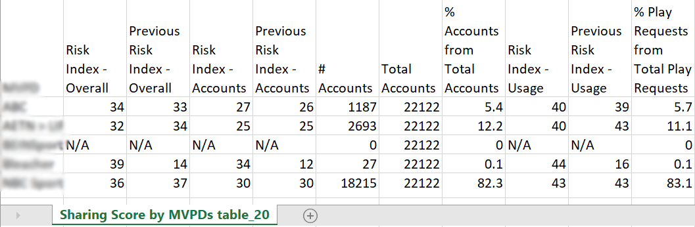

# 匯出MVPD和選定程式設計員的量度 {#export-metric}

「科目IQ」中的「面板」會顯示所選節段中的訂戶科目之證明資料共用統計資料的表格與圖形。 除了檢視共用模式與分數之外，您也可以從這些表格匯出所選區段中MVPD和管道訂閱者的帳戶使用量度與共用分數。

若要匯出MVPD和所選程式設計人員的測量結果，在您以授權MVPD使用者身分登入後：

1. 請依照中的步驟定義所需的區段 [如何定義區段並選取時間範圍](/help/AccountIQ/howto-select-segment-timeframe.md) 評估來源 [區段和時間範圍](/help/AccountIQ/segments-timeframe.md) 面板。

1. 前往下列其中一個面板：

   * 區段中的程式設計師
      

   * 共用機率層級的帳戶數量和使用狀況

      

1. 選取 **匯出** 面板右上角可用的選項。

資料會匯出為CSV格式，而檔案則會下載到您裝置上的本機。 您可以使用所需的CSV檢視器和編輯器來開啟匯出的報表。

* 區段中的程式設計師

   

* 共用機率層級的帳戶數量和使用狀況

   
