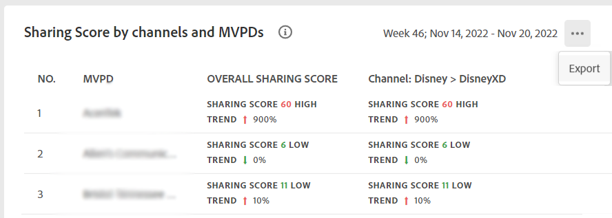

# 導出段中程式設計師和選定MVPD的度量 {#export-metric}

帳戶IQ中的儀表板顯示選定段中訂閱伺服器帳戶的憑據共用統計資訊的表和圖表。 除了查看共用模式和分數外，您還可以從這些表中導出帳戶使用度量和共用選定段中MVPD和渠道的訂戶的分數。

要導出特定程式設計師和段中選定的MVPD的度量，請在您以授權程式設計師用戶身份登錄後：

1. 按照中的步驟定義所需段 [如何定義段和選擇時間範圍](/help/AccountIQ/howto-select-segment-timeframe.md) 從 [段和時間](/help/AccountIQ/segments-timeframe.md) 的子菜單。

1. 轉到以下面板之一：

   * 行業範圍內的總共共用分數，用於選定的MVPD
      

   * 按渠道和MVPD共用分數

      

   * 通過共用概率級別計算的帳戶數和使用情況

      

1. 選擇 **導出** 選項。

資料以CSV格式導出，檔案將在您的設備上本地下載。 可以使用所需的CSV查看器和編輯器開啟導出的報告。

* 所選MVPD的行業級共用分數

   

* 按通道和段中的MVPD共用分數

   

* 通過共用概率級別計算的帳戶數和使用情況

   
