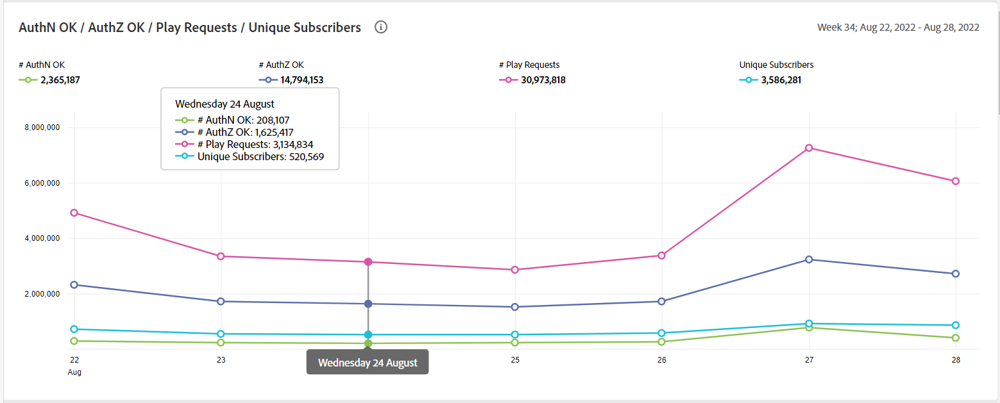
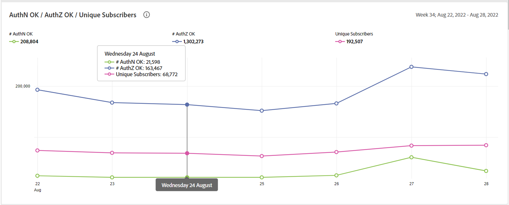
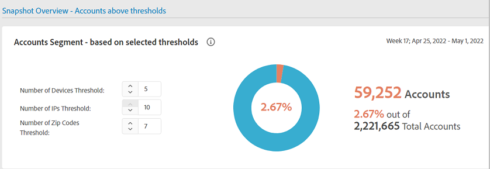
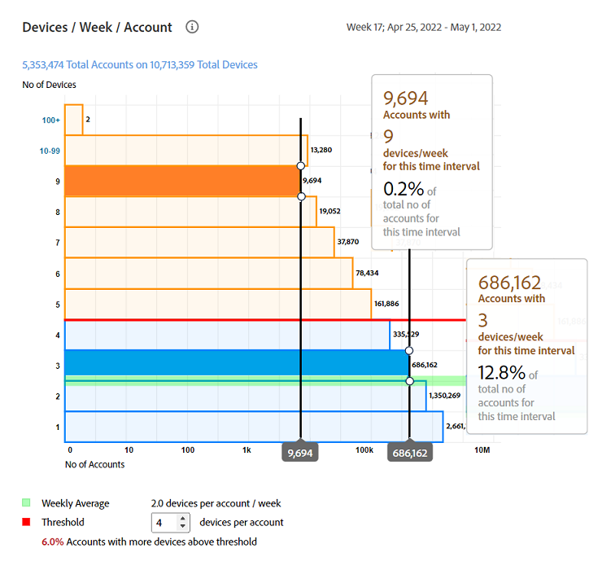
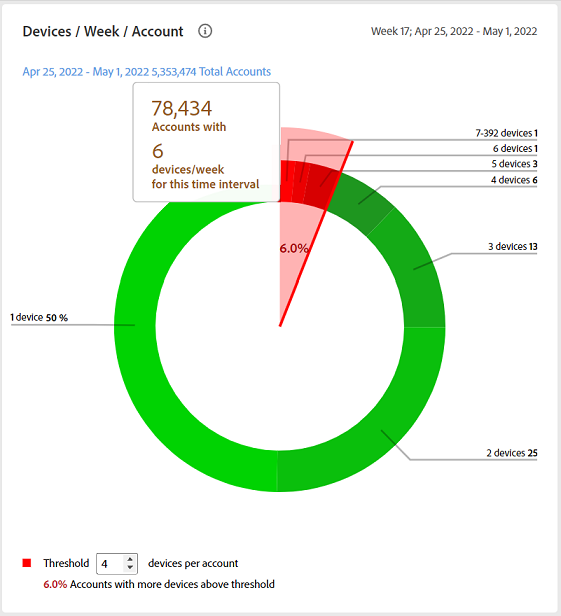
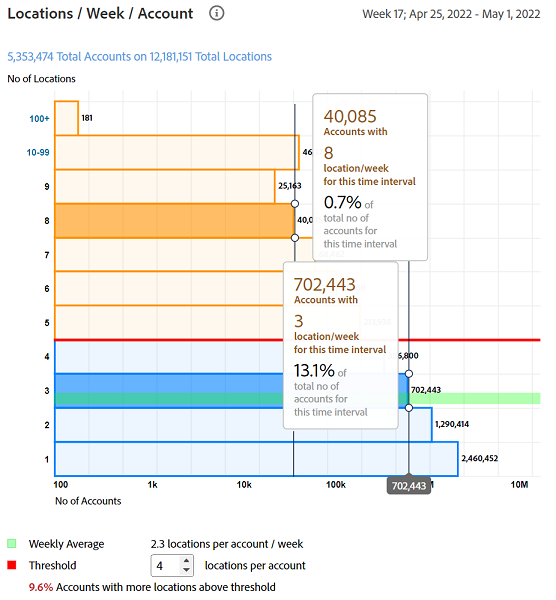
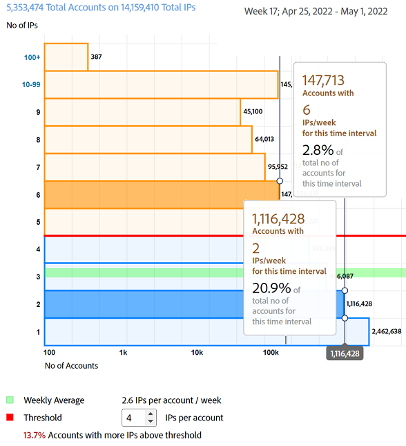

# 一般使用情況報表 {#general-usage-reports}

帳戶IQ報表是基本的分析工具和報表，可讓您深入檢視資料以隔離 [同類群](/help/AccountIQ/product-concepts.md#segmet-def)、識別異常，並了解您的帳戶特性。

「一般使用情況報表」頁面提供工具，讓您根據使用中的帳戶裝置數、偵測到的IP數，以及各自的郵遞區號，劃分子群量度。

<!--Divide the content in cohorts.

Content filters
device filters

segment and definition replicate to cohorts. Number of people and number of account that ......
content consumption.....-->

這些報表都以目前選取的區段為基礎，使用 [區段與時間範圍](/help/AccountIQ/howto-select-segment-timeframe.md) 中。 您可以在 [快照概述 — 超過閾值的帳戶](#snapshot-overview) 中。

<!--To view General Usage Reports:

1. Select the desired MVPDs from the **MVPDs in Segment** option.

2. Select the desired programmer channels from the **Channels in Segment** Option.

3. Select an appropriate time frame from the **Granularity and time frame** option.

   Using the above options you have defined segments for your analysis. Based on your segment selection, following graphs and reports are displayed.

4. You can fine tune your selection and further narrow it down by specifying (number of devices, number of IPs, and number of zip codes) thresholds in [Snapshot Overview - Accounts above thresholds](#snapshot-overview) widget/panel.-->

## AuthN OK / AuthZ OK /播放請求/不重複訂閱者 {#authn-authz-playreq-uniquesubs}

此處的折線圖可讓您檢視在定義區段之選定時間範圍內，AuthN OK、AuthZ OK、播放請求和不重複訂閱者等值隨時間的變化。

+++程式設計師 —  **AuthN OK / AuthZ OK /播放請求/不重複訂閱者**

*圖：AuthN OK / AuthZ OK /播放請求/程式設計師用戶的不重複訂閱者*

+++

+++MVPD- **AuthN OK / AuthZ OK /不重複訂閱者**

*圖：AuthN OK / AuthZ OK / MVPD使用者的不重複訂閱者*

+++

X軸表示當前時間範圍內的單位，Y軸表示該期間的基本訂閱者活動度量。 折線圖可讓您比較在區段選取面板中選取之MVPD和頻道的訂閱者的下列值：

* **AuthN確定**

   AuthN OK是成功驗證的數量。 如需詳細資訊和定義，請參閱 [產品概念：AuthN確定](/help/AccountIQ/product-concepts.md#authn-ok-def).

* **AuthZ確定**

   AuthZ OK是成功授權的數量。 如需詳細資訊和定義，請參閱 [產品概念：AuthZ確定](/help/AccountIQ/product-concepts.md#authz-ok-def).

* **播放要求**

   Play requests是Play Requests的數量。 如需詳細資訊和定義，請參閱 [產品概念：播放要求](/help/AccountIQ/product-concepts.md#play-requests-def)

   >[!NOTE]
   >
   >MVPD使用者無法使用播放請求折線圖。

* **不重複訂閱者**

   唯一訂閱者是成功的唯一訂閱者數目。 如需詳細資訊和定義，請參閱 [產品概念：不重複訂閱者](/help/AccountIQ/product-concepts.md#unique-subscriber-def)

   >[!NOTE]
   >
   >如果程式設計師使用AdobeTempPass（免費預覽）是區段的一部分，則唯一訂閱者的總數也包括唯一設備的數量。

## 快照概述 — 超過閾值的帳戶 {#snapshot-overview}

使用這個額外的篩選器來微調您的分析和報表，以設定各種使用臨界值。 選取所需的MVPD和管道，以定義分析的區段（或同類群組）後，您也可以使用下列篩選器來分析訂閱者行為：

* 設備數閾值

* IP數閾值

* 郵遞區號臨界值數

當您在 [帳戶區段 — 根據選取的臨界值](#account-segments-basedon-segments) 面板中，您可以在下列位置查看影響：

* [每個帳戶每週（或每月）的裝置](#devices-week-account)

* [每個帳戶的每週（或月）位置](#locations-week-account)

* [每個帳戶每週（或每月）的IP](#ip-week-account)

* [帳戶區段的歷史檢視](#account-segment-historical-view)

>[!NOTE]
>
>每個臨界值的預設值為4。 也就是說，「一般使用情形」頁面會顯示MVPD的分析，其訂閱者使用四部（及四部以上）裝置，從四個（及更多）不同地理位置和四個（及更多）不同郵遞區號消耗內容。

### 帳戶區段 — 根據選取的臨界值 {#account-segments-basedon-segments}

此 **帳戶區段 — 根據選取的臨界值** 面板提供設定臨界值（1到10之間）的選項，包括裝置數、IP數和郵遞區號數。

圖表會顯示：

* 訂戶帳戶的絕對數，以及

* 佔該段的訂戶帳戶總數的百分比，

   使用X個裝置數、Y個IP數和Z個郵遞區號，在時間範圍內從您的頻道中取用（定義的區段）MVPD的內容。

## 每週（或每月）每個帳戶的裝置 {#devices-week-account}

此 **條狀圖** 針對訂閱者如何使用其裝置存取內容，提供使用行為的深入分析。

X軸繪製「帳戶數」，Y軸繪製「設備數」。 它會根據您為每個帳戶設定的裝置數量臨界值，標籤在一週內從特定裝置數量中消費內容的訂閱者帳戶絕對數量。

將滑鼠游標暫留在長條上時（特定於裝置數量），會顯示標籤，提供每週使用這些多部裝置串流頻道內容的訂閱者帳戶數（以及區段中訂閱者帳戶總數的百分比）的相關資訊。

圖形也會標籤下列項目：

* 用於標籤您設定的臨界值的紅線。

* 用於標籤訂閱者帳戶每週（或月）所使用不同設備數量的平均值的綠線。

您可以比較臨界值的層級與帳戶使用之不同裝置的每週平均數量，以判斷共用的層級。

此圖表也提供使用比設定臨界值更多裝置的訂閱者帳戶百分比的一瞥。

環圈圖可協助您一覽地判斷使用超過設定臨界值（在時間範圍內）之裝置之頻道內容之訂閱者帳戶的大小。

## 每個帳戶的每週（或月）位置 {#locations-week-account}

贊 [每週（或每月）每個帳戶的裝置](#devices-week-account), 「每週位置」（或「每月」）「每帳戶」量度可協助您分析不同位置的訂閱者帳戶使用量，以更密切地識別密碼共用。 X軸繪製「帳戶數」，Y軸繪製「位置數」。

此量度的結果與數量 [每週（或每月）每個帳戶的裝置](#devices-week-account) 和數目 [每個帳戶每週（或每月）的IP](#ip-week-account) 幫助您更準確地判斷密碼共用實例；這樣就不會將真實的使用者計算在內。

定義區段並設定位置數的臨界值後，您就可以從圖表中識別：

* 一週內從（特定）x個位置消費內容的訂閱者人數（和百分比）。

* 從多於閾值的位置查看內容的訂閱者帳戶總數的百分比。

* 將每週平均值（帳戶的不同位置數）與臨界值進行比較。

## 每個帳戶每週（或每月）的IP {#ip-week-account}

類似 [每週（或每月）每個帳戶的裝置](#devices-week-account) 和 [每個帳戶的每週（或月）位置](#locations-week-account), **每個帳戶每週的IP數量** 量度可讓您更精確、更精細地分析密碼共用。

X軸繪製「帳戶數」 ,Y軸繪製「IP數」。

定義區段（透過選取MVPD和通道）並設定IP數的臨界值後，您就可以從圖表中識別：

* 一週內從（特定）x IP數量消耗內容的訂閱者人數（和百分比）。

* 從多於閾值的IP地址查看內容的總訂閱者帳戶的百分比。

* 將每週平均值（帳戶的不同IP數）與臨界值進行比較。

## 帳戶區段 — 歷史檢視 {#account-segment-historical-view}

「歷史檢視」長條圖可協助您比較不同時間範圍內的使用量度。 此外，它會共同繪製各種使用量度，例如 [每週（或每月）每個帳戶的裝置](#devices-week-account), [每個帳戶的每週（或月）位置](#locations-week-account)，和 [每個帳戶每週（或每月）的IP](#ip-week-account).

* X軸繪製時間範圍，Y軸繪制訂戶帳戶、設備、位置和IP的數量。

* 橙色顏色條表示不同時段中的段。

* 折線圖繪製 [每週（或每月）每個帳戶的裝置](#devices-week-account), [每個帳戶的每週（或月）位置](#locations-week-account)，和 [每個帳戶每週（或每月）的IP](#ip-week-account) 根據臨界值跨越時間範圍的值。

* 藍色長條表示整個行業內某個時間範圍內的活躍訂閱者總數。

* 您可以選取特定圖例，並協助您縮放圖形。

>[!MORELIKETHIS]
>
>* 了解如何使用一般使用量報表中的篩選器，匯出所選區段中前1000名訂閱者的報表，使用 [導出前1000個帳戶](/help/AccountIQ/export-acc-information.md) 選項。

