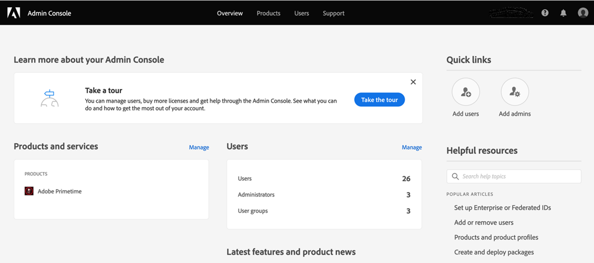

# 如何上線並開始使用Account IQ {#onboard}

帳戶IQ是託管的Web應用程式。 若要開始將此分析工具用作D2C串流提供者、程式設計人員或散發者(MVPD)並緩解憑證共用，您需要讓您的組織加入Adobe Experience Cloud組織，並將組織使用者指派給 **Primetime帳戶IQ** 設定檔於 [Adobe Admin Console](https://adminconsole.adobe.com/). 請閱讀下文，瞭解入門的先決條件和詳細資訊。

## 瀏覽器必要條件 {#browser-prerequisites}

帳戶IQ與下列瀏覽器的最新版本相容：

* Google Chrome
* Safari
* Mozilla Firefox

## 入門步驟 {#steps-to-onboard}

1. 若要讓您的組織註冊，請 **Adobe Experience Cloud** 組織聯絡人 **Adobe** 傳送電子郵件至tve-support@adobe.com。

1. 將組織使用者指派給 **TVE儀表板讀寫** 或 **TVE儀表板唯讀** 中的設定檔 [Adobe Admin Console](https://adminconsole.adobe.com/).

   您組織中的管理員使用者可以建立使用者，並授予他們帳戶IQ儀表板和報表的存取權。 若要授與組織使用者對帳戶IQ的存取權，組織管理員需要：

   1. 登入 [Adobe Admin Console](https://adminconsole.adobe.com/).

      

   1. 選取 **Adobe Primetime** 從 **產品和服務**.

   1. 從 **產品設定檔**，選取 **TVE儀表板讀寫** 或 **TVE儀表板唯讀** 設定檔。

      

      >[!NOTE]
      >
      >在不久的將來，Primetime帳戶IQ將從TVE儀表板中拆分。

   1. 您可以在此處建立使用者群組，或選取要新增使用者的現有群組。

      

   1. 選取 **新增使用者** 新增使用者的選項。

>[!IMPORTANT]
>
>如果您的使用者無法存取帳戶IQ儀表板，請聯絡Adobe支援，確認貴組織的ID已加入帳戶IQ的白名單。
