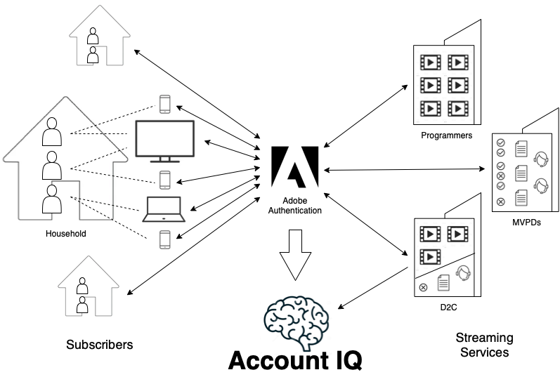

# Account IQ概述 {#account-iq-overview}

串流服務訂閱者的憑證共用是業界一個重大且不斷增加的問題。 要增加這項功能，瞭解、識別及執行認證共用是一項複雜的程式。 瞭解訂閱者的使用行為，並開發其活動的整體檢視涉及複雜性，例如，區分同一家庭內外成員之間的共用。 由於此挑戰，串流服務提供者可能會抑制對憑證共用採取動作。

一般而言，視訊串流服務供應商瞭解與其業務共用的風險和成本，但有有限的補救措施，例如封鎖分享者或提供優惠方案。 然而，我們建議採取明智且目標明確的方法，讓服務人員能夠準確瞭解分享內容，並採納獎勵良好觀看行為並同時鎖定業務成長的策略。 

*圖：帳戶IQ資訊流程*

Adobe Primetime帳戶IQ可讓視訊串流服務瞭解訂閱者使用模式，並識別憑證共用。 透過使用Adobe專屬的多層機器學習模型，深入分析每位訂閱者留下的長期資料記錄，串流服務可瞭解使用行為，並更明確識別憑證共用。 此外，它可讓您透過與其他系統的整合來執行動作，例如限制同時串流或自訂選件，並驗證這些動作的影響，不論是鼓勵合法的觀看行為或增加訂閱者和收入。

Account IQ提供的工具和功能可測量、管理認證共用並從中獲利。 報表、分析和儀表板可讓您探索資料以識別模式。 直接動作可透過匯出和與Adobe和第三方系統的整合來支援，例如行銷活動管理、貨幣限制或訂閱者註冊。 而專用的追蹤工具會衡量這些動作成功與否，以便加以更新或擴充。

以下幾節將說明帳戶IQ應用程式工具和功能：

* [儀表板](/help/AccountIQ/dashboard.md)
* [一般使用報表](/help/AccountIQ/general-usage-reports.md)
* [共用帳戶報表](/help/AccountIQ/shared-acc-reports.md)
* [使用模式](/help/AccountIQ/usage-patterns.md)
* [作業](/help/AccountIQ/operations.md)

讓我們深入瞭解一下這些區段中的圖表和報告。

>[!MORELIKETHIS]
>
>* [如何開始使用帳戶IQ](/help/AccountIQ/get-started.md)
>* [儀表板](/help/AccountIQ/dashboard.md)
>* [一般使用報表](/help/AccountIQ/general-usage-reports.md)
>* [共用帳戶報表](/help/AccountIQ/shared-acc-reports.md)
>* [使用模式](/help/AccountIQ/usage-patterns.md)
>* [產品術語表](/help/AccountIQ/product-concepts.md)
>* [Account IQ白皮書](https://www.adobe.com/content/dam/dx/us/en/products/primetime/resources/primetime-account-iq-whitepaper.pdf)

<!-- Credential sharing is rampant and prevalent among subscribers in the video streaming industry. To add to it, understanding, identifying, and acting on password sharing is a complex process. There is complexity involved in understanding the subscriber usage behavior and developing a holistic view of viewer activity—for example, distinguishing sharing among members within the same household and outside. Due to this challenge, streaming service providers have inhibitions in acting against password sharing.

Generally, video streaming service providers consider password sharing as fatal for business and act strongly against it, by blocking the sharers. However, it is advised to follow a holistic approach that enables them to understand sharing accurately and adopt strategies to reward good viewing behavior and target business growth simultaneously.

*Figure: Account IQ information flow*

Adobe Primetime Account IQ enables video streaming services understand the subscriber usage patterns and identify password sharing by analyzing usage behavior. Moreover, it validates the impact of applying actions to encourage legitimate viewing behavior while maximizing business ROI, eventually growing subscribers and revenue.

By deeply analyzing the long, winding trail of data left behind by each subscriber using Adobe's proprietary multi-layer machine learning model, customers can understand usage behavior and identify password sharing with a greater degree of certainty, use the insights to validate the impact of applying actions to encourage legitimate viewing behavior while maximizing business growth, eventually act on password sharing using validated tactics to improve viewer experience, growing subscribers and revenue (for e.g. converting sharers to paid subscribers, managing ad loads based on sharing behavior, rewarding good behavior with better viewer experience).

Account IQ is helps you understand usage patterns and identify password sharing by leveraging the Primetime Authentication  solution that processes a huge volume of TV Everywhere transactions. A proprietary multi-layer machine learning model trained by this real-world TVE data accurately characterizes usage patterns and helps video streaming services understand usage patterns and identify password sharing at an individual account level. Based on Adobe's customer experience management solutions, Account IQ enables video streaming services to effectively use their audience data to create actionable sharing profiles as well powers integrations with other Adobe Digital Experience and 3rd party solutions—for example, Adobe Primetime Concurrency Monitoring or Adobe Analytics—to enable understanding usage patterns, identify and act upon password sharing.

<!-- The widespread availability of video content and streaming services bring with it problem of account sharing; eventually leading to the loss of revenue by content providers. Account IQ helps TV Everywhere and VOD (video on demand) providers understand the risks to their revenue and business operations, and determine the most effective actions to take to mitigate the impacts of credential fraud. It helps these media companies (MVPDs, Programmers, and VOD providers) manage and uncover the instances of password sharing with a high level of confidence, enabling them deliver better business outcomes and provide better viewing experiences for subscribers.

To help media companies better understand the password sharing within their businesses, Primetime Account IQ determines **Password Sharing Risk Index** that rates every subscriber on their likelihood of sharing account credentials for subscription passwords, from very low to very high. Based on these calculations and the resulting indices, analytics are performed and visuals are generated for better understanding and interpretation of the account sharing behavior. Account IQ is a hosted web application, which you can access using your browser.

Account IQ assigns sharing scores to different subscriber accounts, so that the content providers (media companies, programmers, MVPDs, and VOD providers) can take informed decisions about subscriber accounts and check the illicit sharing.

Passwords are the main methods for viewers to authenticate, and there is a misconception that credential sharing is allowed. This idea makes illicit password sharing a common practice; necessitating the need for media companies to educate their viewers about permissible sharing and prevent illicit sharing.-->
