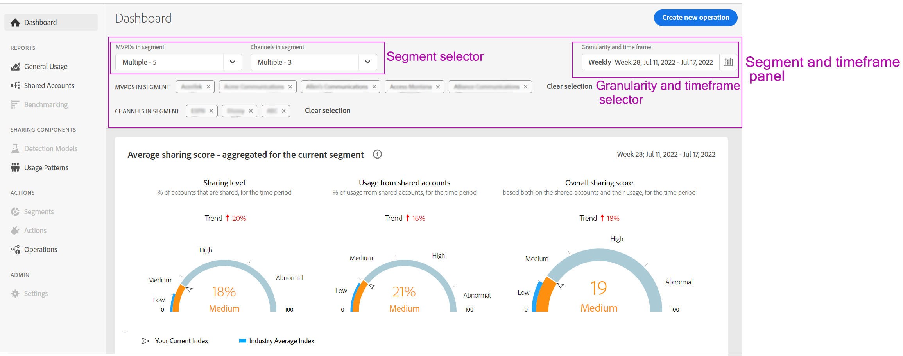

# 定義區段和時間範圍 {#define-segment}

在「科目IQ」中所有的分析或檢視報表，都是從定義區段及選取評估的時間範圍開始。 [區段](/help/AccountIQ/product-concepts.md#segmet-def) 指符合您評估標準（訂閱MVPD和檢視特定管道）的所有訂閱者或檢視者。

*圖：區段和時間範圍選取*

在帳戶IQ中的所有報表頁面頂端，有一個面板，可透過選取MVPD、管道程式設計師以及詳細程度和時間範圍來定義區段。

## 區段選取 {#select-segment}

### 選取區段中的MVPD {#select-segment-mvpds}

若要選取MVPD，請執行下列步驟： **區段中的MVPD** 選項：

1. 按一下或點選 **區段中的MVPD** 下拉式清單選項。

   >[!NOTE]
   >
   >**全部** 依預設會選取產業MVPD。 從這裡，您可以選擇 **分享分數排名前10的MVPD**， **使用量前10個MVPD**， **依帳戶排名前10的MVPD**&#x200B;或個別MVPD。 但是，若要選取個別MVPD，您必須取消選取 **全部**.

1. 按一下或點選所需的MVPD。

   您可以取消選取MVPD，將其從選取範圍中移除。

1. 按一下或點選 **套用選取範圍** 以使您的選取生效。 否則，您將會鬆開您所做的選取。

   >[!NOTE]
   >
   >如果您選取「隔離」模式，則無法選取其他任何MVPD。

### 選取區段中的管道 {#select-segment-channels}

若要從中選擇所需的程式設計人員管道 **區段中的管道** 選項：

1. 按一下或點選 **區段中的管道** 下拉式清單選項。

   >[!NOTE]
   >
   >**全部** 貴公司的程式設計人員管道預設為選取。 若要選取個別的管道或程式設計人員，您必須先取消選取 **全部**.

1. 按一下或點選所需的管道或程式設計人員。

   中的最上層清單專案 **區段中的管道** 為 [程式設計師](/help/AccountIQ/product-concepts.md#programmer-def) 公司和程式設計師名稱下的清單專案為其 [管道](/help/AccountIQ/product-concepts.md#channel-def). 您可以在程式設計師底下選取個別管道，或選取程式設計師，而該程式設計師底下管道的所有活動都會納入報表和圖表結果中。

   

   *圖：頻道選取器中列出的程式設計師和頻道*

   >[!IMPORTANT]
   >
   >在程式設計師底下選取個別通道的結果與選取程式設計師的結果不同。
   >
   >
   >當您選取個別管道時，這些管道的活動會在某些報表中個別劃分。 不過，當您選取所有這些管道的父級程式設計師時，這些管道的所有活動都會納入，但不會在報表中個別劃分。

1. 按一下或點選 **套用選取範圍** 以使您的選取生效。

>[!NOTE]
>
>您無法在MVPD或程式設計師下拉式功能表中選取超過10個專案。

### 取消選取MVPD和通道 {#deselect-segment-mvpds-channels}

除了變更您在 **區段中的MVPD** 和 **區段中的管道** 區段選取器，您可以透過以下方式取消選取先前選取的MVPD和色版：

* 選取 **移除** 圖示()的區段選取器下方所顯示的這些選定MVPD和通道名稱。

* 您也可以使用 **清除選取專案** 移除所有先前選取的MVPD或通道。

*圖：在區段和時間範圍面板中選取的MVPD和通道*

## 詳細程度和時間範圍選擇 {#granularity-timeframe}

若要選取評估期間，請執行下列動作：

1. 選取 **詳細程度和時間範圍** 日期選擇器。

1. 選取 **周** 或 **月** 從 **彙總依據** 用於設定評估粒度的選項。

   

   *圖：日期選擇器，用於選取詳細程度和時間範圍*

1. 選取詳細程度後，您就可以使用向前或向後箭頭，以準時向前或向後移動。

1. 指定過去（根據選取的詳細程度，以月或周為單位）用於評估的時間段。

1. 選取 **套用選取範圍** 以確保您的選取生效。
