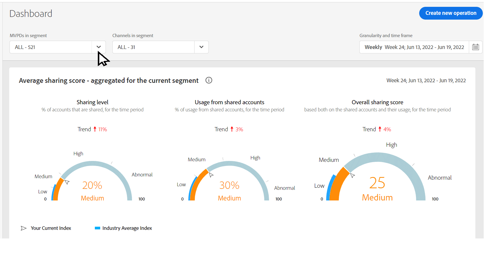

# 以隔離模式檢視共用報告 {#report-isolation-mode}

在隔離模式中，MVPD （例如Xfinity）會一致地識別跨裝置的訂閱者，但會根據與其互動的程式設計師以不同方式識別其訂閱者。 而在標準模式中，MVPD會一致地識別跨裝置的訂閱者，無論程式設計師為何。

例如，在下圖中，如果隔離模式MVPD的訂閱者B （例如Xfinity）使用相同裝置存取由兩個不同程式設計師提供的內容，則MVPD會將不同的識別碼與兩個不同的存取嘗試建立關聯。 因此，對於這些程式設計師（圖中的L和M）和Account IQ而言，似乎有兩個不同的訂閱者存取內容。 不過，對於標準MVPD，如果訂閱者B存取由兩個不同程式設計師提供的內容，則MVPD將會為兩個存取嘗試關聯單一存取識別碼。 隔離模式中的MVPD （例如Xfinity）無法一致地識別訂閱者，即使訂閱者跨不同的程式設計人員使用相同的裝置亦然。

*圖：隔離模式MVPD識別四個不同的訂閱者，而不是兩個*

為了管理資料的失真（因為存取不同的程式設計師將相同的訂閱者識別為不同的訂閱者），隔離模式將有關程式設計師的活動限製為該程式設計師的應用程式上的活動。 例如，針對上圖中的隔離模式，程式設計師L只根據身分W和Y的活動來檢視資料，而忽略身分X和Z。

>[!IMPORTANT]
>
> 缺點是，由於與L以外的任何程式設計人員的活動，程式設計人員L無法分享所收集到的關於訂閱者A和B的資訊。

在隔離模式中，所有為取得「共用分數」和所有相關量度而進行的計算，都只使用從屬於所選程式設計人員和管道的應用程式串流處理的裝置活動來進行。
只會使用從目前所選管道開始的資料流，來計算共用分數和機率。

若要以隔離模式檢視測量結果：

1. 選取 **隔離模式** 從 **區段中的MVPD** 下拉式選項，然後選取 **套用選取範圍**.

   

   *圖：隔離模式中的MVPD選擇*

1. 從中選擇所需的色版 **區段中的管道** 下拉式選項，然後選取 **套用選取範圍**. 另外，選取 [時間段](/help/AccountIQ/product-concepts.md#granularity-def).

   >[!IMPORTANT]
   >
   >因為在針對所有程式設計人員的應用程式進行串流測量時，帳戶共用更為相關，因此在隔離模式中，您會看到較低的共用分數，以及量度中的一些差異。

   

   *圖：在隔離模式下共用機率量測計*

   請注意，上述測量結果顯示，只有6%的帳戶被共用，而且只有8%的內容被這8%的人使用。 因此，這些通道可以在「隔離模式」中與其他MVPD的分數進行比較。 因此，使用隔離模式取得的資訊應與其他資料有不同的解譯。
