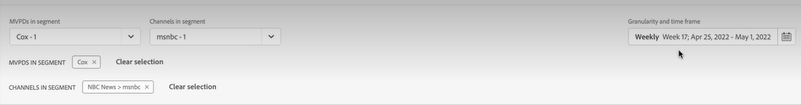
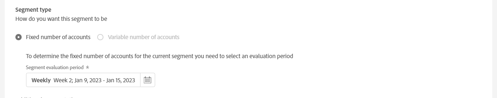
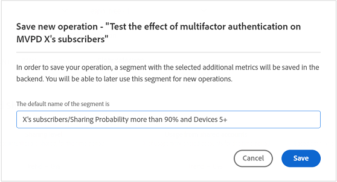

# 在使用者區段上建立操作 {#operation-to-track-segment}

帳戶IQ上的每個報表頁面都有一個 **建立新作業** 選項可協助您建立工作流程，以自動化（及簡化）訂閱者帳戶上的各種（大量）動作；定義規則以指定範例、定義動作，以及記錄和分析這些動作的影響。 在要建立作業的頁面上，您可以定義將在其中執行作業的使用者群組範例，並排程作業在未來的日期執行。

若要建立作業，請執行下列步驟：

1. 使用下列步驟，定義您的區段（同類群組），以在任何報告或儀表板頁面上進行分析 [定義區段和時間範圍](/help/AccountIQ/howto-select-segment-timeframe.md).

1. 選取 **建立新作業** 選項適用於任何報告或儀表板頁面。 此 **建立新作業** 頁面隨即顯示。

   
   *圖：建立新作業的頁面*

1. 於 **建立新作業** 頁面，在表單欄位中填寫下列專案的詳細資訊：

   * [作業名稱](#operation-details) 在作業詳細資訊中
   * 要在下執行作業的區段 [目標區段](#segment) 並使用調整區段 [其他細分](#additional-segmentation)
   * [區段型別](#segment-type) 在 [目標區段](#segment)
   * [動作](#action)
   * [排程啟用](#schedule)

1. [儲存操作](#save-operation).

## 作業詳細資料 {#operation-details}

+++程式設計師 — 作業詳細資料

將新作業命名為 **作業名稱** 「作業詳細資料」下的欄位。 例如，「*測試多重驗證對MVPD X的訂閱者的影響」或「限制並行監視中的資料流數量」或「限制MVPD D的訂閱者檢視20個以上裝置的頻道「N」*「。

+++

+++MVPD — 操作詳細資料

將新作業命名為 **作業名稱** 「作業詳細資料」下的欄位。 例如，「*測試多重驗證對頻道N的檢視器的影響」或「限制並行監視中的資料流數量」或「限制從20個以上的裝置檢視頻道「N」的訂閱者*「。

+++

## 目標區段 {#segment}

+++程式設計師 — 目標區段

此 **區段** 此處定義將透過此作業操作的使用者，或您作業的範例群組。 預設區段為 **區段** 您使用以下專案選取 [區段和時間範圍面板](/help/AccountIQ/howto-select-segment-timeframe.md) 位於上述步驟1中的主要報表或儀表板頁面上。

<!--* The first segment entry in the **Segment** section, by default, shows the **segment** you selected in the step 1.

* The **segment evaluation period** is the time period of analysis you selected in step 1 from **Granularity and Timeframe** option.

*Figure: Segment and timeframe selection on the main page*-->

此區段會定義將受到所建立作業影響的訂閱者。 例如，您選取的區段可指定 *名為&#39;C&#39;且檢視頻道&#39;N Sports&#39;的MVPD所有訂閱者帳戶*.

+++

+++MVPD — 目標區段

此 **區段** 此處定義將透過此作業操作的使用者，或您作業的範例群組。 預設區段為 **區段** 您使用以下專案選取 [區段和時間範圍面板](/help/AccountIQ/howto-select-segment-timeframe.md) 位於上述步驟1中的主要報表或儀表板頁面上。

<!--* The first segment entry in the **Segment** section, by default, shows the **segment** you selected in the step 1.

* The **segment evaluation period** is the time period of analysis you selected in step 1 from **Granularity and Timeframe** option.

*Figure: Segment and timeframe selection on the main page*-->

此區段會定義您的訂閱者（哪些是特定頻道的檢視者），這些訂閱者將受到所建立操作的影響。 例如，您的（預設）區段包括 *所有檢視頻道「N Sports」的訂閱者帳戶*.
+++

### 其他細分 {#additional-segmentation}

此外，您可以新增更多量度以縮小目標區段。 例如，您可以將大於90%的分享機率新增為另一個量度。 因此，現在問題陳述式會顯示 *「為名為&#39;C&#39;且正在檢視共用機率大於90%之頻道&#39;N Sports&#39;的MVPD訂閱者帳戶建立作業」*.

*圖：其他細分*

此外，如果您藉由為裝置數量新增另一個量度來調整作業，則更新的問題陳述式會顯示 *「針對名為&#39;C&#39;且正在檢視頻道&#39;N Sports&#39; （共用分數超過90）並在評估期間使用5部以上的裝置檢視內容)的MVPD訂閱者帳戶建立操作」*.

*圖：使用整體共用分數和裝置數量量度來完善範例區段*

如此一來，使用者群組就會變得更加精細。 因此，透過新增更多量度和條件，您可以進一步限定區段，以定義要操作的帳戶。

### 區段型別 {#segment-type}

「區段型別」是在整個作業評估期間處理區段的方式。

*圖：調整要使用「區段」型別操作的區段數*

<!--The segment type option allows you to further refine your segment based on the evaluation period (or time).

**Fixed number of accounts** 

When you select **Fixed number of accounts** segment type, then you need to specify an evaluation period as well.

By doing so, you are fixing the sample size for evaluation in terms of numbers. You are making Account IQ identify a specific set of users (that meet the criteria of defined evaluation period and segment metrics) to operate on. The analysis and graphs will be generated for this specific set of users only (identified initially) throughout the operation.

**Variable number of accounts**

When you select **Variable number of accounts** segment type, you do not limit the number of accounts in segment. The accounts which fall under the defined segment metrics are the part of the segment, and the number of accounts will change continuously during the course of operation.-->

>[!IMPORTANT]
>
>您只能使用 **固定帳戶數量** 選項（截至目前）。 要選取的選項 **帳戶數量可變** 將在即將發行的版本中提供。

<!--

you tell Account IQ in the beginning of the operation which number of accounts to operate on.

Account IQ system only has a segment definition, and during the operation it looks into all the accounts that fit that segments.

the number of accounts in segment is not limited, the accounts that fall under defined segment metrics will be part of the segment, and the no of accounts will change continuously, as there are no specific limitations - like an evaluation period in the past.When the segment is defined (which in this example is, subscriber accounts of MVPD 'C' who are viewing the channel 'N Sports' that have a sharing score above 80 and are using 10 different IPs) and we also identified a time period to evaluate a segment. This identifies X number of accounts as sample (for example 5000). How many devices they are using?
It identifies x-number of accounts (5000)...a very specific set of users that meet this criteria.
for every period that we schedule (within that operation) during that operation) we will look at those 5K users that are originally identified and we will present graph about them. How are the sharing scores coming up?u We identified a period. Are their sharing scores going up? Are there fewer of them who are meeting this definition?
Fixed versus variable is the way the treated in fixed or variable way.

1. we identified a fixed set of accounts.
2. we evaluate those specific accounts on criteria throughout the operation.

General idea independent of graph is that we will evaluate a set of accounts identified initially, for no of periods during operation and generate graphs against that.
Those are the 5000 users for which I will create graphs for for every period of the operation.

**Variable number of accounts**
We do not identify any initial set of accounts, we just have a segment definition.
Each period during the operation, we go and look into all the accounts that fit that segments.
If it is not a fixed segment, I won't initially evaluate it. I won't have an initial set of 5000. Instead at every period during the evaluation I will evaluate the segment then, and then I will produce graph about the next 3000 users.
the......will vary from period to period.

if not fixed segment, then I won't initially evaluate or have initial set of 5000, instead at every period during an operation and the.-->

## 動作 {#action}

此 **動作** 定義您要在定義的區段上執行的操作。

您可採取兩種動作：

* 使用與Account IQ整合之系統的動作；例如 **並行監視** <!--[Concurrency Monitoring](https://tve.helpdocsonline.com/concurrency-monitoring-introduction), or Adobe Target-->.

* 用於建立和處理Account IQ外部且未與Account IQ系統整合的工作流程的動作。 例如，頻道程式設計師&#39;N&#39;傳送大量電子郵件給MVPD &#39;C&#39;所有訂閱者的動作。

>[!NOTE]
>
>透過建立作業，您不僅可以指定動作並定義其範圍，而且可以開始記錄這些作業的效果。

## 排程{#schedule}

您可以設定開始和結束日期，以排程作業的啟動。

>[!NOTE]
>
>開始日期和結束日期的粒度與您為定義區段時使用的評估選取的粒度相同。 **區段和時間範圍面板**，在步驟1。
>
>
>因此，如果您選取詳細程度為「週」，則開始和結束日期會以周為單位（例如「第14週」）；如果您選取詳細程度為「月」，則開始和結束日期會以月為單位。

>[!IMPORTANT]
>
>開始日期必須晚於評估期間，也晚於目前日期。 同樣地，結束日期也必須晚於開始日期和目前日期。

### 儲存操作 {#save-operation}

儲存作業時，會顯示訊息畫面，通知您在此作業中定義的區段也儲存以供日後使用。 不過，您必須為此區段命名。

*圖：儲存作業並指定區段名稱*

>[!NOTE]
>
>最佳實務是根據您正在執行的動作以及將要執行的區段來命名作業。

<!--In future you can select this saved segment when defining a segment for your analysis on the main reports page. Moreover, the saved segment is also listed when you create an operation the next time.

*Figure: Saved segments in segment selector on Create new operations page* 

>[!IMPORTANT]
>
>When creating an operation, if you select a segment that was previously created then you cannot add new metrics to it and refine it.
>
>Adding new metrics creates a new segment, but you cannot modify an existing segment.-->

建立作業後，該作業將從開始日期執行至您指定的結束日期。

您儲存的作業詳細資訊可在首頁面上檢視 [作業](/help/AccountIQ/operations.md) 頁面。

*圖：新建立的作業會列在主作業頁面上*
