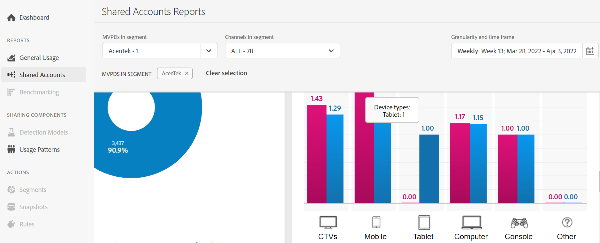

# 查看帳戶共用報告：特定MVPD <!--and programmer--> {#report-sp-mvpd}

如果您作為通道登錄到帳戶IQ應用程式 [程式](/help/AccountIQ/product-concepts.md#programmer-def)，則可以查看特定頻道查看器的共用報告 [MVPD](/help/AccountIQ/product-concepts.md#mvpd-def) 他們已經訂了。

要在帳戶IQ中查看報告，請在您以程式設計師身份成功登錄到應用程式後：

1. 使用中的步驟定義訂閱者段以分析和查看報表 [如何定義段](/help/AccountIQ/howto-select-segment-timeframe.md)。

   >[!NOTE]
   >
   >您可以選擇一個、兩個或多個MVPD，甚至可以選擇前10個MVPD的預設選擇（通過共用分數、使用情況或帳戶）。
   >
   >
   >但是，您可以選擇 [最多10個MVPD](/help/AccountIQ/limitations.md) 在 [段和時間框面板](/help/AccountIQ/segments-timeframe.md)。

1. 從左側導航中選擇所需的報告頁：

* [常規用法](/help/AccountIQ/general-usage-reports.md)

   
* [共用帳戶](/help/AccountIQ/shared-acc-reports.md)

   
* [使用模式](/help/AccountIQ/usage-patterns.md)

   

* [儀表板](/help/AccountIQ/dashboard.md) （儀表板可從不同的報告頁面中查看所選圖形）。

   

每頁都反映活動。

<!--## If you are logged in as an MVPD {#report-sp-programmer}

To view reports in Account IQ, once you have successfully logged in to the application as an MVPD:

1. Select the desired programmer channel(s) from from the **Channels in segment** drop-down option.

   

 1. From the **Granularity and time frame** option, select the time interval to view reports. You can aggregate the time intervals week-wise or month-wise.

1. Select a desired reports page from the left navigation-[General Usage](/help/AccountIQ/general-usage-reports.md), [Shared Accounts](/help/AccountIQ/shared-acc-reports.md), [Usage Patterns](/help/AccountIQ/usage-patterns.md), or even [Dashboard](/help/AccountIQ/dashboard.md) (dashboard gives a glimpse of the selected graphs from different reports pages).

-->