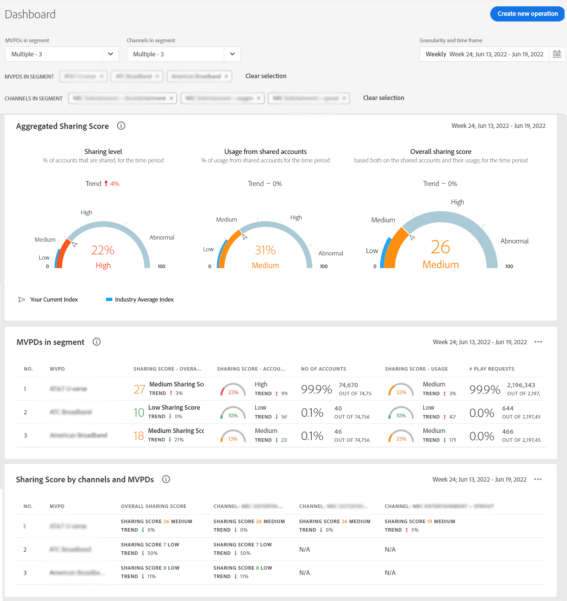

# 檢視特定程式設計師的帳戶共用報告 {#report-sp-programmers}

若要在「帳戶IQ」中檢視報表，當您以MVPD成功登入應用程式後：

1. 當您使用中的步驟定義要分析和檢視報表的訂閱者區段時，請選取特定的程式設計師 [如何定義區段](/help/AccountIQ/howto-select-segment-timeframe.md).

   

1. 從左側導覽中選取所需的報表頁面：

* [一般使用](/help/AccountIQ/general-usage-reports.md)

   
* [共用帳戶](/help/AccountIQ/shared-acc-reports.md)

   
* [使用模式](/help/AccountIQ/usage-patterns.md)

   

* [儀表板](/help/AccountIQ/dashboard.md) （控制面板可讓您從不同的報表頁面中一覽選取的圖形）。

   

每個頁面都會反映所選區段的活動。
