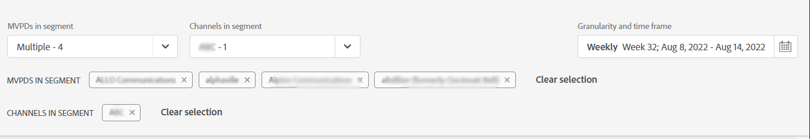
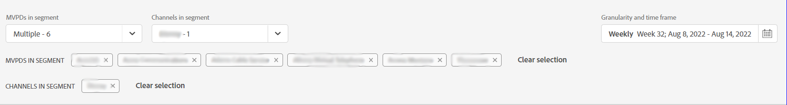
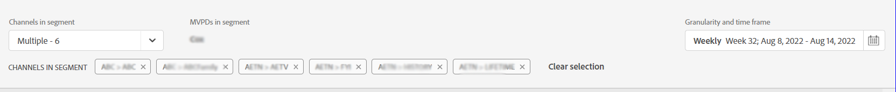

# 訂閱者區段和時間範圍 {#cohorts-segments}

登入Account IQ時，頂端有一個面板，可讓您定義訂閱者 [區段](/help/AccountIQ/product-concepts.md#segment-segmet-def) 篩選結果以檢視訂閱者共用行為與模式的報表。

<!---->

+++程式設計師的區段選取面板

<!---->

下列下拉式清單選項可用來定義區段：

**區段中的MVPD**

此 **區段中的MVPD** 選擇器可讓您選擇 [MVPDs](/help/AccountIQ/product-concepts.md#mvpd-def) （個人或群組），為其訂閱者檢視帳號共用報告。

在此選取器中，除了選取個別MVPD外，您還可以選取下列群組：

* [分享分數排名前10的MVPD](/help/AccountIQ/product-concepts.md#top-mvpds-def)

* [使用量前10大MVPD](/help/AccountIQ/product-concepts.md#top-mvpds-def)

* [前10個MVPD （依帳戶）](/help/AccountIQ/product-concepts.md#top-mvpds-def)

* [隔離模式](/help/AccountIQ/isolation-mode.md)

**區段中的管道**

當您以程式設計人員使用者身分登入時，您可以選取管道來檢視其帳戶共用分析。 使用 **區段中的管道** 下拉式清單選項來選取組織中的個別或多個管道。

+++

+++MVPD的區段選取面板

下列下拉式清單選項可用來定義區段：

**區段中的管道**

此 **區段中的管道** 選取器可讓您進一步縮小篩選範圍，以選取與所選MVPD對應的通道。

* [前10名程式設計人員（分享分數）](/help/AccountIQ/product-concepts.md#top-mvpds-def)

* [依使用量區分的前10名程式設計師](/help/AccountIQ/product-concepts.md#top-mvpds-def)

* [依帳戶排名的10大程式設計師](/help/AccountIQ/product-concepts.md#top-mvpds-def)

**區段中的MVPD**

當您以MVPD使用者身分登入時，您的名稱會顯示在欄位中 **區段中的MVPD**.

+++

<!--For example, you can define your segment as the "subscribers of the MVPD A that watched the channels X, Y, and Z".-->

## 詳細程度和時間範圍 {#granularity-timeframe}

此 **詳細程度和時間範圍** 選取器可讓您指定日期和持續時間，或您想要檢視訂閱者共用行為的時間大小。

因此，透過這些控制項，您可以將問題陳述式定義為「5月份觀看頻道X、Y和Z的MVPD A訂閱者」。

