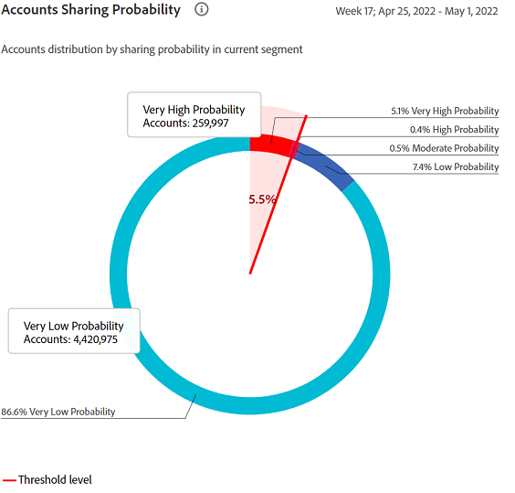
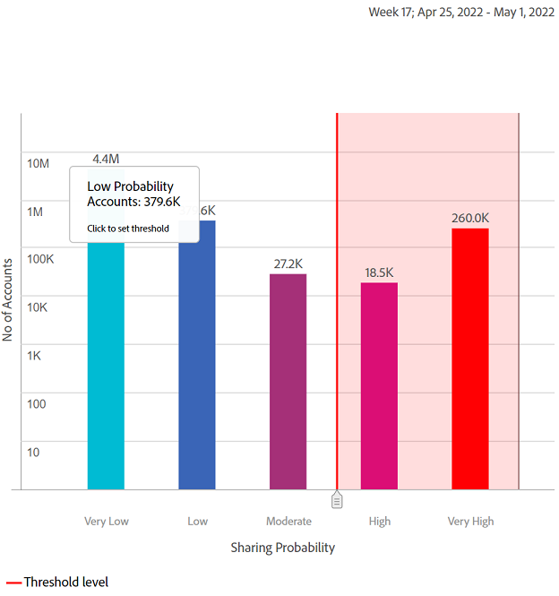
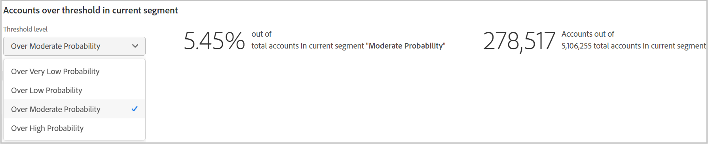
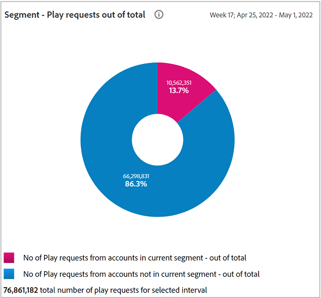
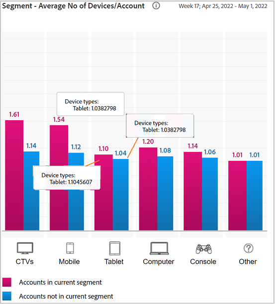
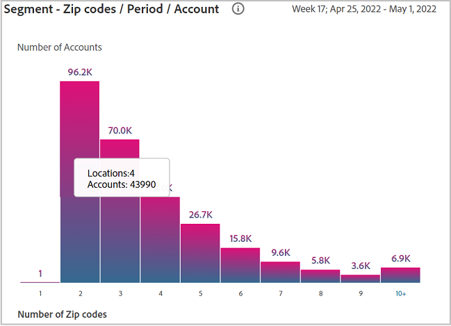
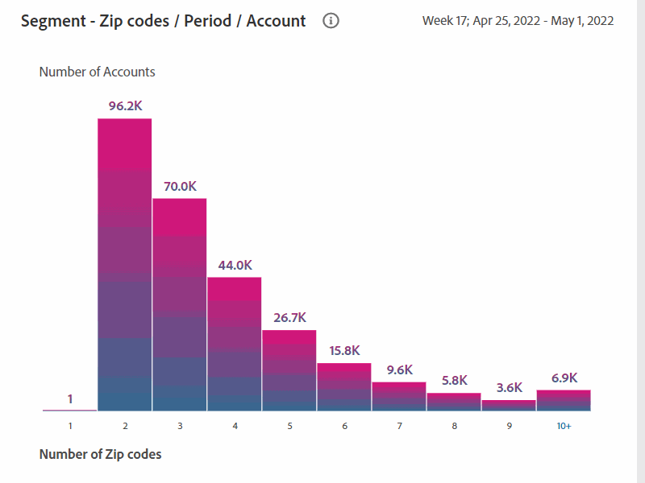
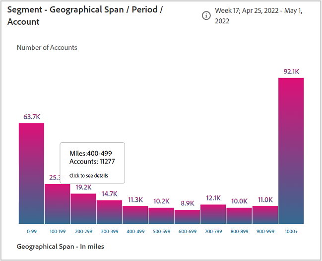

# 共用帳戶報告 {#shared-accounts-reports}

「共用帳戶報告」按選定的共用概率範圍細分設備和設備類型等度量 **中等概率** 和 **超低概率** 的下界。

然後，這些範圍可以用作用戶定義的閾值，並且基於所選閾值更新圖形。

帳戶IQ根據已定義段的所有訂閱者帳戶的共用概率將其分類為以下五類帳戶：

* 非常高（八至一成）
* 高（6到8成）
* 中等（四六成）
* 低（兩成至四成）
* 非常低（零至二成）

## 帳戶共用概率 {#accounts-sharing-probability}

此處的甜甜圈圖對不同概率類別的用戶帳戶的百分比（和絕對數）進行分類和顯示。

紅線標籤用戶在 [當前段中超過閾值的帳戶](#threshold-selector) 的子菜單。

條形圖以Y軸上的帳戶數繪製各種類別的共用概率（以X軸繪製）。

紅線標籤閾值範圍，可在條形圖中調整。 條形圖中調整的閾值反映在圓形圖中的閾值範圍內。

<!---->

### 當前段中超過閾值的帳戶{#threshold-selector}

通過此面板，您可以從以下範圍中選擇一個範圍作為訂閱者帳戶的閾值（基於其分類概率）:

* 帳戶 **很低** 共用 **概率**

* 帳戶 **低** 共用 **概率**

* 帳戶 **中等** 共用 **概率**

* 帳戶 **高** 共用 **概率**

選擇閾值後，該面板將顯示選定段中所有訂閱者帳戶中帳戶的百分比（和數目）。

## 段 — 播放請求總數 {#play-request-out-total}

甜圈圖顯示了訂閱者在該段中發出的播放請求的百分比（和數目）;並允許您比較未在定義段中的訂閱者發出的播放請求。

當您在圓形圖上移動游標時，它還顯示來自各種概率範圍的訂戶百分比和數字。

<!---->

## 每帳戶的設備數量{#avg-devices-account}

條形圖顯示當前段中的訂戶和當前段中未使用的訂戶使用的每種設備類型的平均設備數。

## 段 — 每個帳戶的每個期間的郵遞區號 {#zip-codes-period-account}

此圖表通知您在一個時間框架內從不同位置消費內容的訂閱者數量。

您可以放大以縮小範圍並查看圖形中繪製一系列位置的條形圖的細節。

<!---->

## 段 — 地理範圍/期間/帳戶 {#geo-span-period-account}

此條形圖以英里為單位繪製與不同地理範圍相關的訂戶帳戶數。 該範圍基於在時間幀期間訂戶已從其流式傳輸的位置之間的最大距離。

<!--Total number of users ...

How many accounts are within 99 miles of each other.....and how many are apart. 

Based on points on the map.-->

當您選擇一個表示地理距離範圍的欄時，它會擴展該範圍以顯示更多詳細資訊。

<!---->
