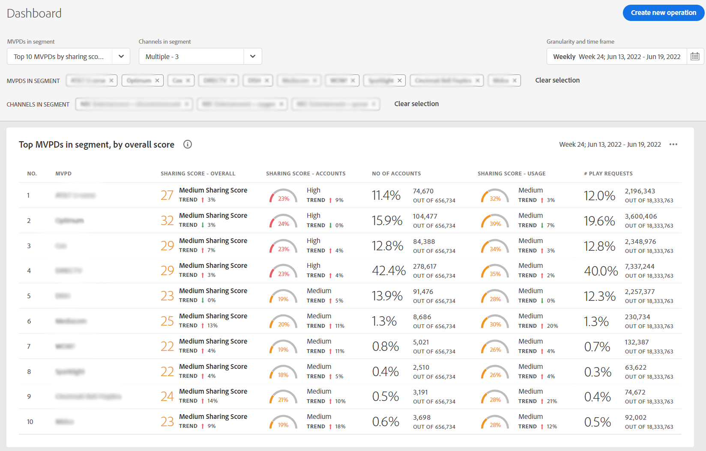

# 檢視前10個MVPD的帳戶共用報表 <!--and Programmers--> {#view-top-10-mvpd-reports}

Account IQ可協助您檢視及分析前10個MVPD的帳戶共用統計資料(在定義的 [區段](/help/AccountIQ/product-concepts.md#segmet-def))具有：

* 共用帳號的訂閱者百分比最高

* 共用帳戶中最大使用量的訂閱者

* 密碼共用量值（整體共用分數）最高的訂閱者

>[!NOTE]
>
>計算基礎（從區段取得熱門MVPD清單）是整個視訊串流產業的資料，而不只是特定程式設計師的MVPD。

>[!NOTE]
>
>只有至少擁有50,000個作用中訂閱者帳戶的MVPD才會被視為取得這些報告。

對於登入的程式設計人員使用者，以下三個預設選項（檢視前10個MVPD的報表）可供使用：

* [分享分數排名前10的MVPD](#top-10mvpds-sharingscore)

* [使用量前10個MVPD](#top-10mvpds-usage)

* [依帳戶排名前10的MVPD](#top-10mvpds-accounts)

## 分享分數排名前10的MVPD {#top-10mvpds-sharingscore}

當您使用選取範圍時 **前10名MVPD （依分享分數）** 若要定義您的區段，Account IQ系統會識別整個產業的10個MVPD，依照其遞減順序列出最多10個MVPD （連同其對應的量度） [整體共用分數](/help/AccountIQ/product-concepts.md#overall-sharing-score)

若要透過共用管道的分數來檢視前10個MVPD的清單和報表：

1. 使用 [區段和時間範圍面板](/help/AccountIQ/segments-timeframe.md)，若要依照中的步驟定義區段 [如何定義區段及選取時間範圍](/help/AccountIQ/howto-select-segment-timeframe.md) 以進行評估。 對於此評估，請選取 **前10名MVPD （依分享分數）** MVPD清單中的選項。

1. 從以下任一項中選取報表頁面： [一般使用](/help/AccountIQ/general-usage-reports.md)， [共用帳戶](/help/AccountIQ/shared-acc-reports.md)， [使用模式](/help/AccountIQ/usage-patterns.md)，或 [儀表板](/help/AccountIQ/dashboard.md) （圖示板可讓您從不同的報表頁面中一覽選取的圖形）。

每一個頁面都會反映此活動。

## 使用量前10個MVPD {#top-10mvpds-usage}

當您使用選取範圍時 **前10個MVPD （依使用狀況）** 若要定義您的區段，Account IQ系統會識別整個產業的10個MVPD，依照其遞減順序列出最多10個MVPD （連同其對應的量度） [來自共用帳戶的使用情況](/help/AccountIQ/product-concepts.md)

若要透過共用管道的分數來檢視前10個MVPD的清單和報表：

1. 使用 [區段和時間範圍面板](/help/AccountIQ/segments-timeframe.md)，若要依照中的步驟定義區段 [如何定義區段及選取時間範圍](/help/AccountIQ/howto-select-segment-timeframe.md) 以進行評估。 對於此評估，請選取 **前10個MVPD （依使用狀況）** MVPD清單中的選項。

1. 從以下任一項中選取報表頁面： [一般使用](/help/AccountIQ/general-usage-reports.md)， [共用帳戶](/help/AccountIQ/shared-acc-reports.md)， [使用模式](/help/AccountIQ/usage-patterns.md)，或 [儀表板](/help/AccountIQ/dashboard.md) （圖示板可讓您從不同的報表頁面中一覽選取的圖形）。

每一個頁面都會反映此活動。

## 依帳戶排名前10的MVPD {#top-10mvpds-accounts}

當您使用選取範圍時 **前10個MVPD （依帳戶）** 若要定義您的區段，Account IQ系統會以遞減順序識別整個產業的10個MVPD，至多有10個MVPD （連同其對應的量度） [共用層級](/help/AccountIQ/product-concepts.md)

若要檢視前10個MVPD的清單和報表（依您的頻道共用的帳戶數而定），請執行下列動作：

1. 使用 [區段和時間範圍面板](/help/AccountIQ/segments-timeframe.md)，若要依照中的步驟定義區段 [如何定義區段及選取時間範圍](/help/AccountIQ/howto-select-segment-timeframe.md) 以進行評估。 對於此評估，請選取 **前10名MVPD （依帳戶）** MVPD清單中的選項。

1. 從以下任一項中選取報表頁面： [一般使用](/help/AccountIQ/general-usage-reports.md)， [共用帳戶](/help/AccountIQ/shared-acc-reports.md)， [使用模式](/help/AccountIQ/usage-patterns.md)，或 [儀表板](/help/AccountIQ/dashboard.md) （圖示板可讓您從不同的報表頁面中一覽選取的圖形）。

每一個頁面都會反映此活動。

