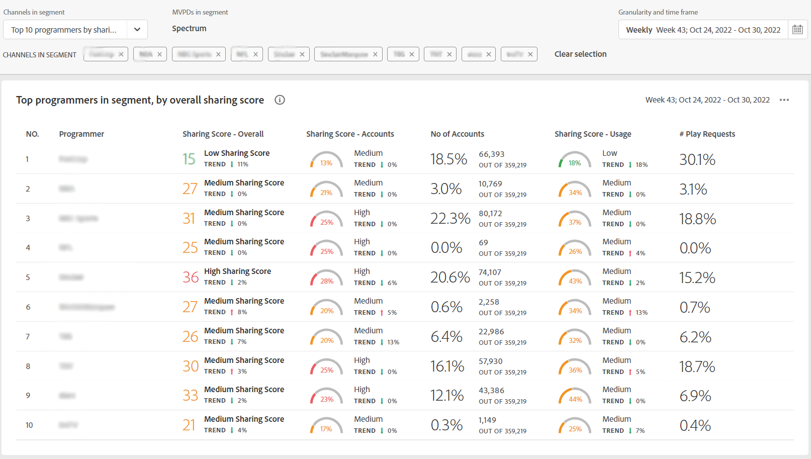

# 查看前10名程式設計師的帳戶共用報告 {#view-top-10-programmer-reports}

帳戶IQ功能可幫助您查看和分析前10名程式設計師(在已定義的 [分部](/help/AccountIQ/product-concepts.md#segmet-def))有：

* 共用帳戶的訂閱者百分比最高

* 來自共用帳戶的訂閱者的使用量最大

* 密碼共用的最大（總共共用分數）訂閱者

>[!NOTE]
>
>計算的基礎是從一個片段中獲得頂級程式設計師的清單，它是整個視頻流行業的資料，而不僅僅是特定MVPD的程式設計師。

<!--
>[!NOTE]
>
>Only the MVPDs that have a minimum of 50,000 active subscriber accounts are considered to obtain these reports.
-->

對於已登錄的MVPD用戶，可以選擇以下三種預設選項（查看前十個MVPD的報告）:

* [通過共用分數排名前10位程式設計師](#top-10prog-sharingscore)

* [10大程式設計師](#top-10prog-usage)

* [按帳戶排列的前10位程式設計師](#top-10prog-accounts)

## 通過共用分數排名前10位程式設計師 {#top-10prog-sharingscore}

使用所選內容時 **分享分數排名前十的程式設計師** 要定義段，帳戶IQ系統將標識整個行業中的10個MVPD，以按MVPD的降序順序列出最多10個MVPD（及其相應度量） [總共共用評分](/help/AccountIQ/product-concepts.md#overall-sharing-score)

要通過共用渠道的分數查看前十個MVPD的清單和報告，請執行以下操作：

1. 使用 [段和時間面板](/help/AccountIQ/segments-timeframe.md)，以按照中的步驟定義段 [如何定義段和選擇時間範圍](/help/AccountIQ/howto-select-segment-timeframe.md) 的下界。 對於此評估，選擇 **分享分數排名前十的程式設計師** 選項。

1. 從以下任一項中選擇報告頁 [常規用法](/help/AccountIQ/general-usage-reports.md)。 [共用帳戶](/help/AccountIQ/shared-acc-reports.md)。 [使用模式](/help/AccountIQ/usage-patterns.md)或 [儀表板](/help/AccountIQ/dashboard.md) （儀表板可從不同的報告頁面中查看所選圖形）。

每頁都反映活動。

## 10大程式設計師 {#top-10prog-usage}

使用所選內容時 **按使用情況排名前10位的程式設計師** 要定義段，帳戶IQ系統將標識整個行業中的10個MVPD，以按MVPD的降序順序列出最多10個MVPD（及其相應度量） [共用帳戶的使用](/help/AccountIQ/product-concepts.md)

要通過共用渠道的分數查看前十個MVPD的清單和報告，請執行以下操作：

1. 使用 [段和時間面板](/help/AccountIQ/segments-timeframe.md)，以按照中的步驟定義段 [如何定義段和選擇時間範圍](/help/AccountIQ/howto-select-segment-timeframe.md) 的下界。 對於此評估，選擇 **按使用情況排名前10位的程式設計師** 選項。

1. 從以下任一項中選擇報告頁 [常規用法](/help/AccountIQ/general-usage-reports.md)。 [共用帳戶](/help/AccountIQ/shared-acc-reports.md)。 [使用模式](/help/AccountIQ/usage-patterns.md)或 [儀表板](/help/AccountIQ/dashboard.md) （儀表板可從不同的報告頁面中查看所選圖形）。

每頁都反映活動。

## 按帳戶排列的前10位程式設計師 {#top-10prog-accounts}

使用所選內容時 **按帳戶排名前10位的程式設計師** 要定義段，帳戶IQ系統會按MVPD的降序順序標識行業內的10個MVPD（以及其相應度量） [共用級](/help/AccountIQ/product-concepts.md)

要按為您的渠道共用的帳戶數查看前十個MVPD的清單和報告，請執行以下操作：

1. 使用 [段和時間面板](/help/AccountIQ/segments-timeframe.md)，以按照中的步驟定義段 [如何定義段和選擇時間範圍](/help/AccountIQ/howto-select-segment-timeframe.md) 的下界。 對於此評估，選擇 **前10位程式設計師** 選項。

1. 從以下任一項中選擇報告頁 [常規用法](/help/AccountIQ/general-usage-reports.md)。 [共用帳戶](/help/AccountIQ/shared-acc-reports.md)。 [使用模式](/help/AccountIQ/usage-patterns.md)或 [儀表板](/help/AccountIQ/dashboard.md) （儀表板可從不同的報告頁面中查看所選圖形）。

每頁都反映活動。

