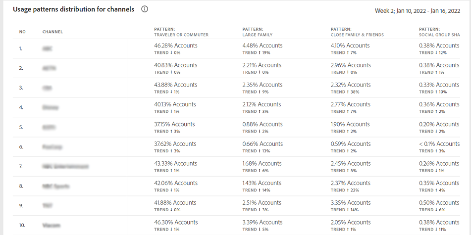

# 使用模式 {#usage-patterns}

帳戶IQ會根據使用者的社交行為，將訂閱者帳戶的使用者分類為不同類別，例如旅行者或通勤者、大型家庭和社群分享。 此 **使用模式** 頁面會顯示這些使用者型別的數個不同分析和報表。 例如， **使用模式分佈 — 區段中的使用者與總計** 報表會比較目前區段與整個產業的使用行為。

如同應用程式中的其他頁面，此處的分析和報表也是以「 」中定義的目前區段為基礎 [區段面板](/help/AccountIQ/segments-timeframe.md).

## 使用模式分佈 {#usage-pattern-dis}

中的長條圖 **使用模式分佈 — 區段中的使用者與總計** 說明每個社交行為或使用模式的訂閱者數目和百分比。 除了將目前區段中的每個使用模式與整個產業進行比較，也會將它們與包含所有頻道的區段進行比較。

## 區段中的使用模式分佈(#usage-pattern-dis-segment)

此 **區段中的使用模式分佈** 面板會針對每個使用者模式列出下列資訊：

* 個別帳戶所屬的分享機率範圍
* 該模式中的帳戶數目和百分比
* 該類別中訂閱者在播放要求方面的整體使用率和百分比

例如，在上圖中：

* 在定義的區段中，一般使用者（只有單一位置具有有限裝置數量的一對少數人）的帳戶共用機率介於0到5%之間。

* 而訂閱者帳戶總數（5,981,648個）中的36.8% （2,201,935個）為一般使用者。

* 而15.7% (24,073,311)的播放請求總數(153,076,350)是由一般使用者發出。

## 依區段合作夥伴的使用模式分佈 {#usage-pattern-dis-mvpd}

+++程式設計師 — 總區段和區段合作夥伴的使用模式分佈

此 **使用模式分佈** 此表格提供目前區段中MVPD的使用模式分佈比較。

+++

+++MVPD — 總區段和區段合作夥伴的使用模式分佈

此 **使用模式分佈** 此表格提供目前區段中程式設計人員管道的使用模式分佈比較。

+++
