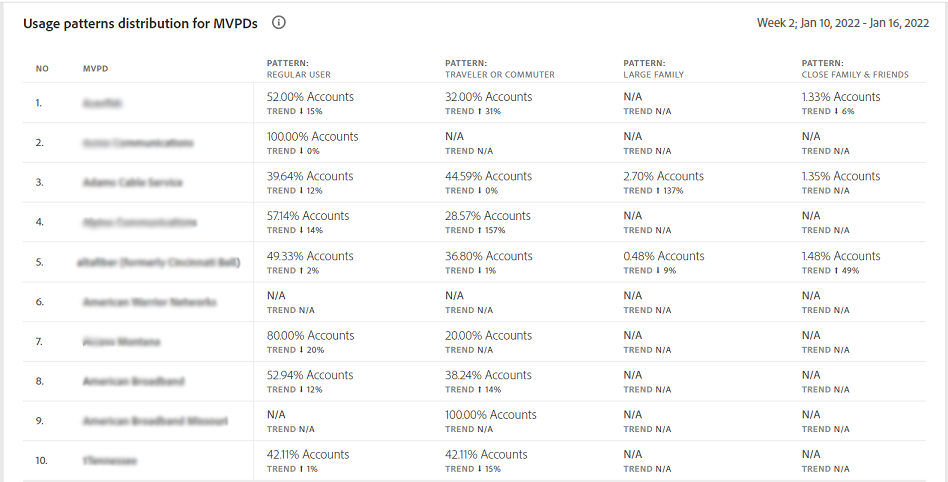

# 使用模式 {#usage-patterns}

帳戶IQ根據用戶的社交行為，將用戶帳戶的用戶分為不同類別，如旅行者或通勤者、大家庭和社區共用。 的 **使用模式** 頁面顯示了這些用戶類型的幾種不同的分析和報告。 比如說， **使用模式分佈 — 細分市場用戶與行業用戶** 報告比較當前段與整個行業的使用行為。

與應用程式中的其他頁面一樣，此處的分析和報告基於在 [段面板](/help/AccountIQ/segments-timeframe.md)。

## 使用模式分佈 {#usage-pattern-dis}

中的條形圖 **使用模式分佈 — 細分市場用戶與行業用戶** 描述每個社交行為或使用模式的訂戶數和百分比。 除了將當前段中的每個使用模式與整個行業進行比較之外，它還將它們與包含所有渠道的段進行比較。

## 段(#usage-pattern-dis-segment)中的使用模式分佈

的 **段中的使用模式分佈** 面板為每個用戶模式列出以下資訊：

* 共用個人帳戶落入的概率範圍
* 該模式中的帳戶數和百分比
* 按播放請求計算，該類別訂戶的使用總數和百分比

例如，在上圖中：

* 在定義的段中的常規用戶（只在一個位置具有有限數量的設備的一至少數人）的帳戶共用概率在0%到5%之間。

* 用戶賬戶總數（5,981,648個）中，36.8%（2,201,935個）是常用戶。

* 而15.7%(24,073,311)的播放請求(153,076,350)是由普通用戶發出的。

## MVPD的使用模式分佈 {#usage-pattern-dis-mvpd}

的 **MVPD的使用模式分佈** 表提供當前段中MVPD的使用模式分佈的比較。

