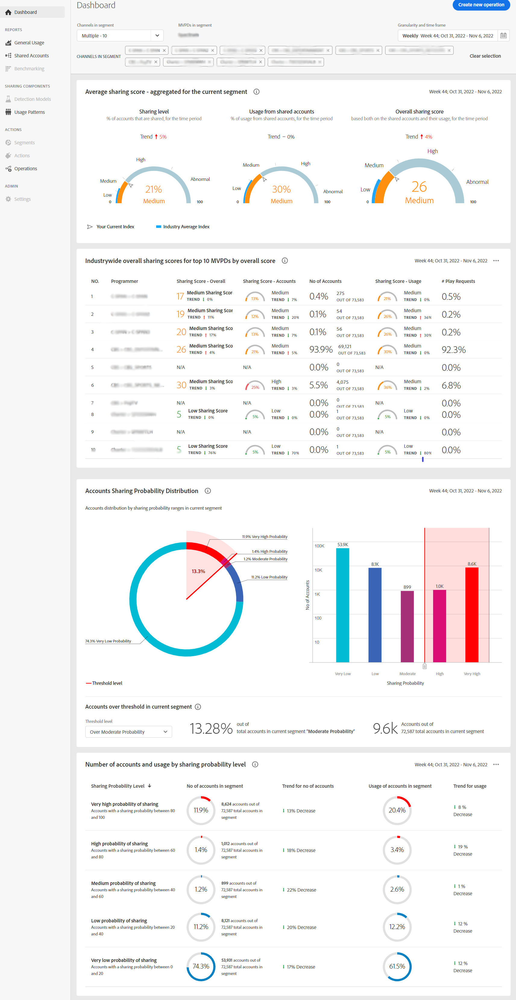

# 查看多個程式設計師和渠道的帳戶共用報告 {#viewreport-multiple-programmer-channel}

帳戶智商是一種強健且可擴展的分析工具，使您能夠查看、分析和比較訂閱者帳戶在指定時間共用統計資訊（不僅針對一、二或三），還針對更多程式設計師。

>[!NOTE]
>
>但是，到目前為止，您最多可以從段和時間框架面板中選擇10個單獨的通道（或程式設計師）以查看訂閱者共用統計資訊。

要查看多個通道的訂閱者帳戶共用統計資訊，請執行以下操作：

1. 按照中的步驟定義所需段 [如何定義段和選擇時間範圍](/help/AccountIQ/howto-select-segment-timeframe.md) 從 [段和時間面板](/help/AccountIQ/segments-timeframe.md)。

1. 從左側導航中選擇所需的報告頁：

* [儀表板](/help/AccountIQ/dashboard.md) （儀表板可從不同的報告頁面中查看所選圖形）。

   

   *圖：多個程式設計師的儀表板報告*

* [常規用法](/help/AccountIQ/general-usage-reports.md)

* [共用帳戶](/help/AccountIQ/shared-acc-reports.md)

* [使用模式](/help/AccountIQ/usage-patterns.md)

這些頁面中的每一頁都將反映選定段的活動。
