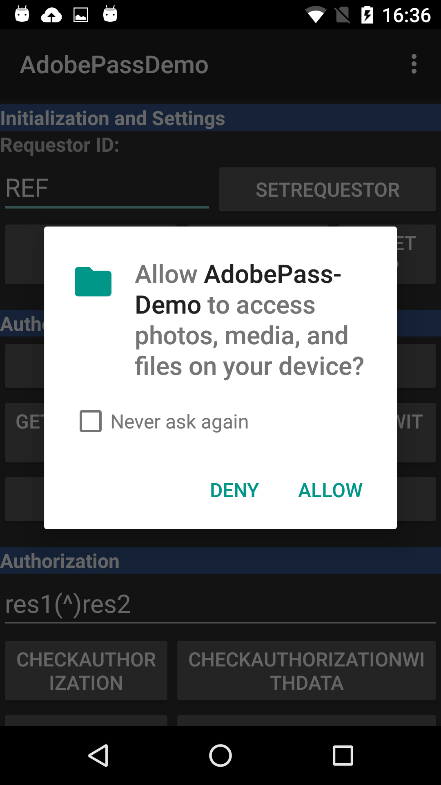

# Adobe Primetime驗證和Android 6「Marshmallow」新許可權模型 {#adobe-primetime-authentication-and-the-android-6-marshmallow-new-permissions-model}

>[!NOTE]
>
>此頁面上的內容僅供參考之用。 使用此API需要來自Adobe的目前授權。 不允許未經授權的使用。

</br>

全新Android 6 Marshmallow發行版本引進了許可權模型的一些更新，這可能會影響使用現有Adobe Primetime驗證SDK 1.8版和更舊版本的應用程式行為。 

新版Android作業系統提供的一項新功能 [精細地控制應用程式在安裝時和執行階段所需的許可權](https://developer.android.com/about/versions/marshmallow/android-6.0-changes.html).

>[!IMPORTANT]
>
>以下所述的變更將 **只會影響專為Android 6.0開發的應用程式** (targetSdkVersion=23)。 升級至Android 6.0時，不會影響使用者裝置上已安裝的舊版應用程式。 


具體來說，適用於在Android Studio中開發的應用程式，使用 [API層級23](http://developer.android.com/sdk/api_diff/23/changes.html) 且使用Adobe Primetime Authentication SDK的客戶，開發人員將需要撰寫自訂程式碼（請參閱下方的程式碼片段） [以觸發允許/拒絕許可權對話方塊](https://developer.android.com/training/permissions/requesting.html). 

以下是用來要求裝置外部儲存裝置的寫入存取權的程式碼摘錄：

```java
// Here, thisActivity is the current activity
if (ContextCompat.checkSelfPermission(thisActivity,
                Manifest.permission.WRITE_EXTERNAL_STORAGE)
        != PackageManager.WRITE_EXTERNAL_STORAGE) {

    // Should we show an explanation?
    if (ActivityCompat.shouldShowRequestPermissionRationale(thisActivity,
            Manifest.permission.WRITE_EXTERNAL_STORAGE)) {

        // Show an expanation to the user *asynchronously* -- don't block
        // this thread waiting for the user's response! After the user
        // sees the explanation, try again to request the permission.

    } else {

        // No explanation needed, we can request the permission.

        ActivityCompat.requestPermissions(thisActivity,
                new String[]{Manifest.permission.WRITE_EXTERNAL_STORAGE},
                MY_PERMISSIONS_REQUEST_WRITE_EXTERNAL_STORAGE);

        // MY_PERMISSIONS_REQUEST_WRITE_EXTERNAL_STORAGE is an
        // app-defined int constant. The callback method gets the
        // result of the request.
    }
}
```


**從使用者的角度**，安裝後，使用者會看到一個視窗，提示他們確認檔案的讀取/寫入許可權（請參閱下圖2）。 這會導致以下兩種結果之一：

1. 若使用者 **確認** 許可權、一般驗證流程將保留，而Token將儲存於全域儲存空間。 只要代號有效，使用者便會在應用程式中或跨應用程式使用Adobe Primetime驗證來保持驗證。
1. 若使用者 **拒絕** 存放區中的許可權、寫入動作將會失敗，而且使用者只有在退出應用程式之後才會通過驗證。 請注意，某些應用程式在前景和背景之間切換時會重新初始化，因此使用者將在執行此動作時登出。 不會儲存Token，使用者每次使用應用程式時都需要進行驗證。 


>[!TIP]
>
>Adobe Primetime驗證SDK 1.9目前正在開發引入儲存彈性的功能。新SDK已鎖定目標 **在10月最後一週發行**. 當無法使用一般儲存體時，應用程式將回覆為寫入應用程式的沙箱儲存體。 這涵蓋的情況是，對於在API層級23中開發的應用程式，使用者不接受全域儲存中的讀取/寫入許可權。 Token會依應用程式個別儲存，這表示使用Adobe Primetime驗證的應用程式之間的單一登入功能將會停用。




*圖：針對API層級23所編寫應用程式的許可權要求對話方塊*

>[!IMPORTANT]
>
> Adobe建議 **其合作夥伴將使用API Level 22 (targetSdkVersion=22)或更舊版本開發應用程式，以確保在驗證程式中享有最佳的使用者體驗**.
