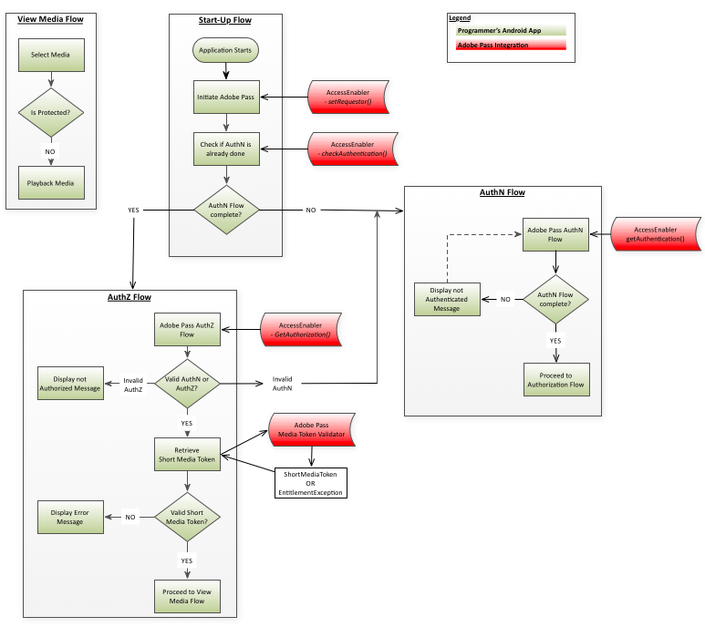

# Amazon FireOS整合逐步指南 {#amazon-fireos-integration-cookbook}

>[!NOTE]
>
>此頁面的內容僅供參考。 若要使用此API，必須具備目前的Adobe授權。 不允許未經授權使用。

 

## 簡介 {#intro}

本文檔描述了程式設計師的高級應用程式可以通過Amazon FireOS AccessEnabler庫公開的API來實施的權限工作流。

Amazon FireOS的Adobe Primetime驗證權限解決方案最終分為兩個網域：

- UI域 — 這是實現UI的高級應用層，使用AccessEnabler庫提供的服務來提供對受限內容的訪問。
- AccessEnabler域 — 在此處，權限工作流以以下形式實施：
   - 對Adobe後端伺服器進行的網路呼叫
   - 與驗證和授權工作流程相關的業務邏輯規則
   - 管理各種資源並處理工作流程狀態（例如權杖快取）

AccessEnabler域的目標是隱藏權限工作流的所有複雜內容，並（通過AccessEnabler庫）向上層應用程式提供一組簡單權限原語，您可以用這些原語來實施權限工作流：

1. 設定請求者身分
1. 檢查並獲取對特定身份提供程式的身份驗證
1. 檢查並獲取特定資源的授權
1. 登出

AccessEnabler的網路活動發生在不同的線程中，因此UI線程不會被阻止。 因此，兩個應用程式網域之間的雙向通訊通道必須遵循完全非同步的模式：

- UI應用層通過AccessEnabler庫公開的API調用將消息發送到AccessEnabler域。
- AccessEnabler通過AccessEnabler協定中包含的回調方法響應UI層，UI層向AccessEnabler庫註冊該回調方法。

## 權利流 {#entitlement}

1. [必要條件](#prereqs)
1. [啟動流程](#startup_flow)
1. [驗證流程](#authn_flow)
1. [授權流程](#authz_flow)
1. [檢視媒體流量](#media_flow)
1. [登出流程](#logout_flow)

 

### A.先決條件 {#prereqs}

1. 建立回呼函式：
   - [&#39;setRequestorComplete()&#39;](#$setRequestorComplete)

      - 觸發者 `setRequestor()`，則傳回成功或失敗。     成功表示您可以繼續進行權限呼叫。
   - [displayProviderDialog(mvpds)](#$displayProviderDialog)

      - 觸發者 `getAuthentication()` 僅當使用者尚未選取提供者(MVPD)且尚未驗證時。 此 `mvpds` 參數是使用者可用的提供者陣列。
   - [&#39;setAuthenticationStatus(status, reason)&#39;](#$setAuthNStatus)

      - 觸發者 `checkAuthentication()` 每次。 觸發者 `getAuthentication()` 只有在使用者已驗證且已選取提供者時。

      - 返回的狀態被驗證或未驗證，原因描述驗證失敗或註銷操作。
   - [navigateToUrl(url)](#$navigateToUrl)

      - 方法會在AmazonFireOS SDK中忽略，而在Android平台上使用，其中觸發者 `getAuthentication()` 使用者選取MVPD後。  此 `url` 參數提供MVPD登入頁面的位置。
   - [&#39;sendTrackingData(event, data)&#39;](#$sendTrackingData)

      - 觸發者 `checkAuthentication(), getAuthentication(), checkAuthorization(), getAuthorization(), setSelectedProvider()`.
此 `event` 參數會指出發生了哪個權利事件； `data` 參數是與事件相關的值清單。 
   - [&#39;setToken(token, resource)&#39;](#$setToken)

      - 觸發者 `checkAuthorization()` 和 `getAuthorization()` 在成功授權以檢視資源後。
      - 此 `token` 參數是短期媒體代號； `resource` 參數是使用者有權檢視的內容。
   - [&#39;tokenRequestFailed(resource, code, description)&#39;](#$tokenRequestFailed)

      - 觸發者 `checkAuthorization()` 和 `getAuthorization()` 授權失敗後。
      - 此 `resource` 參數是使用者嘗試檢視的內容；the `code` 參數是錯誤碼，指出發生的故障類型；the `description` 參數描述了與錯誤代碼相關的錯誤。
   - [&#39;selectedProvider(mvpd)&#39;](#$selectedProvider)

      - 觸發者 `getSelectedProvider()`.
      - 此 `mvpd` 參數提供有關用戶選擇的提供程式的資訊。
   - [&#39;setMetadataStatus(metadata, key, arguments)&#39;](#$setMetadataStatus)

      - 觸發者 `getMetadata().`
      - 此 `metadata` 參數提供您請求的特定資料；the `key` 參數是 `getMetadata()` 要求；和 `arguments` 參數是傳遞至的相同字典 `getMetadata()`.
   - [&#39;preauthorizedResources(resources)&#39;](#$preauthResources)

      - 觸發者 `checkPreauthorizedResources()`.
      - 此 `authorizedResources` 參數會提供使用者有權檢視的資源。\
          

\
 

### B.啟動流程 {#startup_flow}

1. 啟動高級應用程式。
1. 啟動Adobe Primetime驗證
   1. 呼叫 [`getInstance`](#$getInstance) 建立Adobe Primetime驗證AccessEnabler的單個實例。

      - **相依性：** Adobe Primetime驗證本機Amazon FireOS Library(AccessEnabler)
   2. 呼叫` setRequestor()` 確定程式設計師的身份；在程式設計師的 `requestorID` 和（可選）Adobe Primetime驗證端點的陣列。

      - **相依性：** 有效的Adobe Primetime驗證RequestorID(請與您的Adobe Primetime驗證帳戶管理員合作安排)。

      - **觸發器：** setRequestorComplete()callback

   在完全建立請求者身分之前，無法完成任何權限請求。 這實際上表示，當setRequestor()仍在執行時，所有後續權限請求(例如`checkAuthentication()`)被阻止。

   您有兩個實作選項：一旦請求者識別資訊傳送至後端伺服器，UI應用層可選擇下列兩種方法之一：

   1. 等待觸發 `setRequestorComplete()` callback（AccessEnabler委派的一部分）。  這個選項最能確定 `setRequestor()` 已完成，因此建議用於大部分實作。

   1. 繼續，而不等待 `setRequestorComplete()` 回呼，然後開始發出權限要求。 這些調用(checkAuthentication、checkAuthorization、getAuthentication、getAuthorization、checkPreauthorizedResource、getMetadata、logout)由AccessEnabler庫排入隊列，這些調用將在 `setRequestor()`. 例如，如果網路連接不穩定，此選項偶爾會中斷。

1. 呼叫 [checkAuthentication()](#$checkAuthN) 來檢查現有驗證，而不啟動完整的驗證流程。  如果此呼叫成功，您可以直接前往授權流程。  如果沒有，請繼續進行驗證流程。

- **相依性：** 成功呼叫 `setRequestor()` （此相依性也會套用至所有後續呼叫）。

- **觸發器：** setAuthenticationStatus()回呼

### C.驗證流程 {#authn_flow}

1. 呼叫 [`getAuthentication()`](#$getAuthN) 啟動驗證流程，或取得使用者已通過驗證的確認。 

   **觸發器：**  

   - 如果使用者已通過驗證，則會使用setAuthenticationStatus()回呼。  在此情況下，請直接前往 [授權流程](#authz_flow).
   - 如果使用者尚未驗證，則顯示ProviderDialog()回呼。  

1. 向用戶顯示發送到的提供程式清單 `displayProviderDialog()`.

1. 用戶選擇提供程式後，WebView將開啟提供程式頁面，供用戶登錄

   **注意：** 此時，用戶有機會取消身份驗證流。 如果發生此情況，AccessEnabler將清除其內部狀態並重置身份驗證流。

1. 用戶成功登錄後，WebView將關閉。

1. 呼叫 `getAuthenticationToken(),` 指示AccessEnabler從後端伺服器檢索身份驗證令牌。 

1. [可選] 呼叫 [`checkPreauthorizedResources(resources)`](#$checkPreauth) 檢查用戶有權查看的資源。 此 `resources` 參數是與使用者的驗證權杖相關聯的受保護資源陣列。\
   **觸發器：** `preAuthorizedResources()` 回撥\
   **執行點：** 完成驗證流程後

1. 如果驗證成功，請繼續執行授權流程。

 

### D.授權流程 {#authz_flow}

1. 呼叫 [`getAuthorization()`](#$getAuthZ) 啟動授權流程。

   相依性：與MVPD同意的有效資源ID。

   **注意：** ResourceIDs應與任何其他裝置或平台上使用的ID相同，且在MVPD間也會相同。

1. 驗證驗證和授權。

   - 若 `getAuthorization()` 呼叫成功：使用者具有有效的AuthN和AuthZ權杖（使用者已通過驗證，且已獲授權可觀看請求的媒體）。
   - 若 `getAuthorization()` 失敗：檢查擲回的例外狀況，以判斷其類型（AuthN、AuthZ或其他類型）:
      - 如果是驗證(AuthN)錯誤，則重新啟動驗證流程。
      - 如果是授權(AuthZ)錯誤，則用戶無權觀看請求的媒體，應向用戶顯示某種錯誤消息。
      - 如果有其他類型的錯誤（連線錯誤、網路錯誤等）, 然後向用戶顯示相應的錯誤消息。

1. 驗證短媒體代號。

   使用Adobe Primetime驗證媒體代號驗證程式程式庫，驗證從 `getAuthorization()` 呼叫上述：

   - 如果驗證成功：為用戶播放請求的媒體。
   - 如果驗證失敗：AuthZ代號無效，應拒絕媒體要求，且應向使用者顯示錯誤訊息。

1. 返回正常應用程式流。

### E.檢視媒體流量 {#media_flow}

1. 使用者選取要檢視的媒體。
1.  介質是否受到保護？  您的應用程式檢查所選介質是否受到保護：
   - 如果所選介質受保護，則應用程式將啟動 [授權流程](#authz_flow) 上。
   - 如果所選介質未受保護，則為用戶播放該介質。

### F.註銷流程 {#logout_flow}

1. 呼叫 [`logout()`](#$logout) 將用戶註銷。 \
   AccessEnabler會清除用戶通過單一登錄共用登錄的所有請求上為當前MVPD獲取的所有快取值和令牌。 清除快取後，AccessEnabler會發出伺服器呼叫以清除伺服器端會話。  請注意，由於伺服器呼叫可能導致SAML重新導向至IdP（這允許在IdP端清除工作階段），因此此呼叫必須遵循所有重新導向。 因此，此呼叫將在WebView控制項內處理，對用戶不可見。

   **注意：** 註銷流與驗證流不同，因為用戶無需以任何方式與WebView交互。 因此，可以（並建議）使WebView控制項不可見(即：隱藏)。

