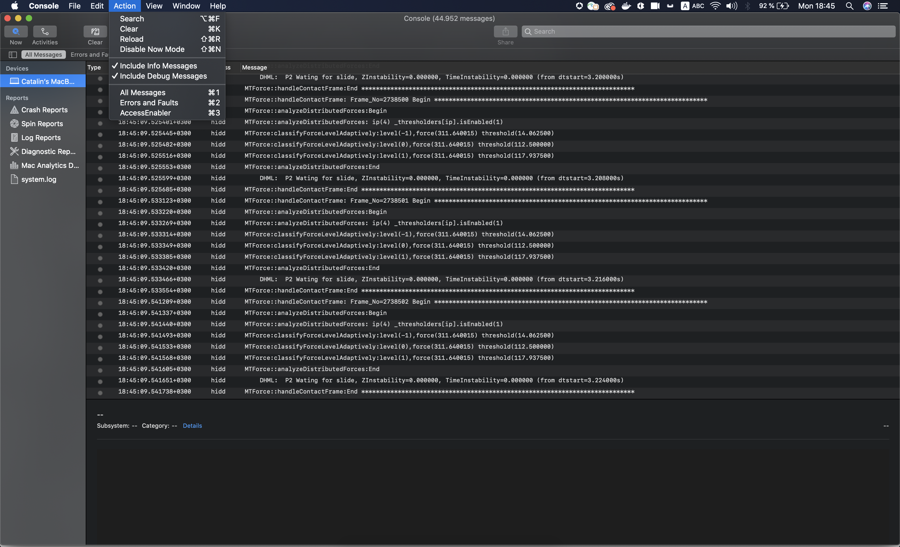
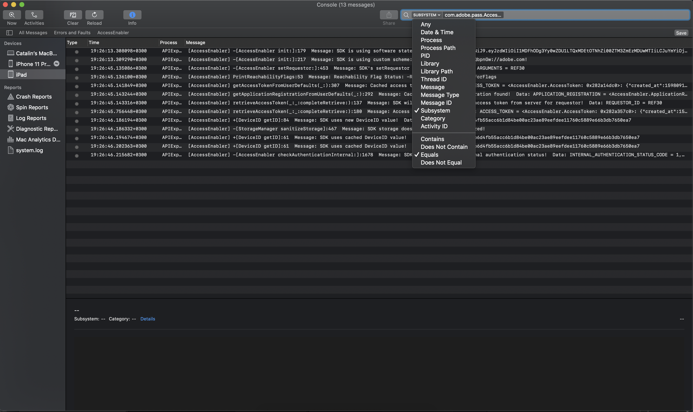
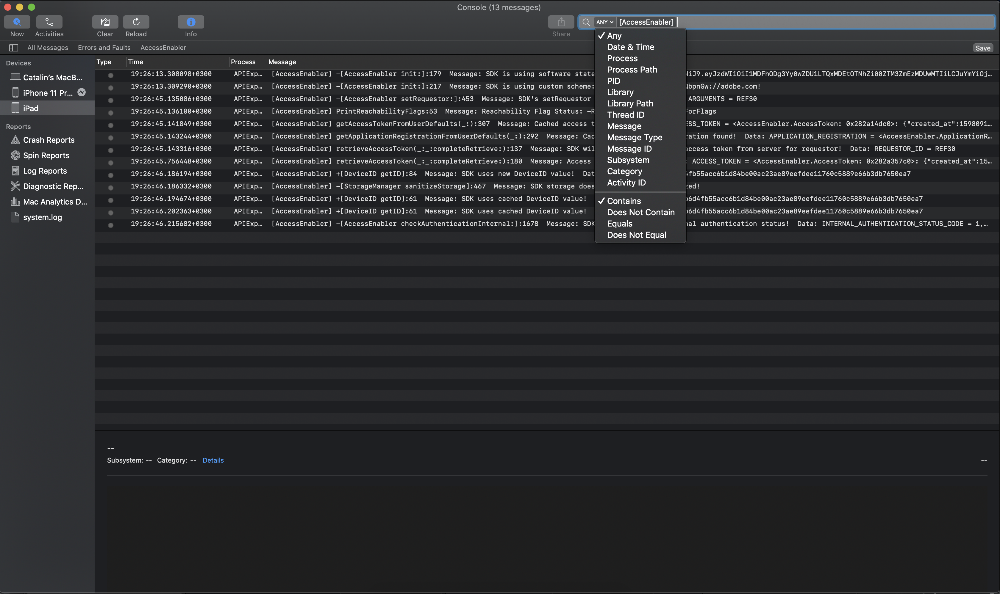

# 使用主控台應用程式記錄檔對AccessEnabler iOS/tvOS SDK進行除錯 {#debugging-the-accessenabler-iostvos-sdk-using-console-app-logs}

>[!NOTE]
>
>此頁面上的內容僅供參考之用。 使用此API需要來自Adobe的目前授權。 不允許未經授權的使用。

## 概觀

本檔案的範圍是擷取並呈現AccessEnabler的iOS/tvOS SDK記錄機制的演化，以及一些實用的詳細資訊，以便使用主控台應用程式記錄檔對AccessEnabler架構進行偵錯。

## 記錄機制狀態

AccessEnabler iOS/tvOS記錄機制的用途是發出有用的訊息，用於疑難排解使用AccessEnabler架構的應用程式可能因此而遇到的問題。

### AccessEnabler iOS/tvOS 3.5.0和更新版本

從AccessEnabler iOS/tvOS 3.5.0版開始，記錄機制會引入下列改善作為變更：

* AccessEnabler架構使用Apple的建議功能 [OSLog](https://developer.apple.com/documentation/os/oslog) 實作。

* AccessEnabler架構匯入了根據子系統篩選主控台應用程式記錄檔的功能： **com.adobe.pass.AccessEnabler**. SDK發出的所有訊息均屬於com.adobe.pass.AccessEnabler。

* AccessEnabler架構匯入了根據任何（前置詞）篩選主控台應用程式記錄檔的功能： **[AccessEnabler]**. SDK發出的所有訊息都會加上前置詞 [AccessEnabler].

* AccessEnabler架構匯入了根據類別篩選主控台應用程式記錄檔的功能： **偵錯**， **錯誤** 搭配上述兩個條件之一：「子系統」或「任何」（前置詞）。

## 使用主控台應用程式記錄檔進行偵錯

根據調查的問題，您可能希望包含或排除AccessEnabler架構發出的記錄訊息，因此您可以在下方找到一些實用的詳細資訊，這些資訊可能有助於您在調查期間和使用主控台應用程式記錄檔時使用。

### AccessEnabler iOS/tvOS 3.5.0和更新版本

#### 包含 {#including}

首先，為了能夠檢視您AccessEnabler架構所發出的任何記錄訊息 **必須** 在Console應用程式的「動作」區段中，選取「包含資訊訊息」和「包含偵錯訊息」，如下圖所示。

為了能夠偵錯AccessEnabler iOS/tvOS SDK的功能，以及 **另請參閱** AccessEnabler架構記錄您可以：

* 在主控台應用程式中搜尋，使用 **子系統** 選項等於com.adobe.pass.AccessEnabler值，如下圖所示。

* 在主控台應用程式中搜尋，使用 **任何** 包含
   [AccessEnabler] 值，如下圖所示。

除了上述兩個條件外，您也可以使用 **類別** 結合使用中的選項 **子系統** 或 **任何（前置詞）** 以明確搜尋 **偵錯** 或 **錯誤** 平準AccessEnabler iOS/tvOS SDK發出的訊息。

#### 排除

為了能夠更好地偵錯其他元件和的功能 **排除** AccessEnabler架構記錄您可以：

* 在主控台應用程式中搜尋，使用 **子系統** 不等於com.adobe.pass.AccessEnabler值的選項。
* 在主控台應用程式中搜尋，使用 **任何** 不包含 [AccessEnabler] 值。

## 報告問題

當您向Adobe Primetime驗證回報問題時，請考慮以下建議：

* 請嘗試提供重新產生步驟。
* 請嘗試提供發生問題的作業系統版本和裝置型號。
* 請嘗試提供遇到問題的AccessEnabler iOS/tvOS SDK版本。
* 請嘗試使用下列兩個選項之一，擷取並附加所有AccessEnabler iOS/tvOS SDK記錄訊息： [包含](#including) 區段。
