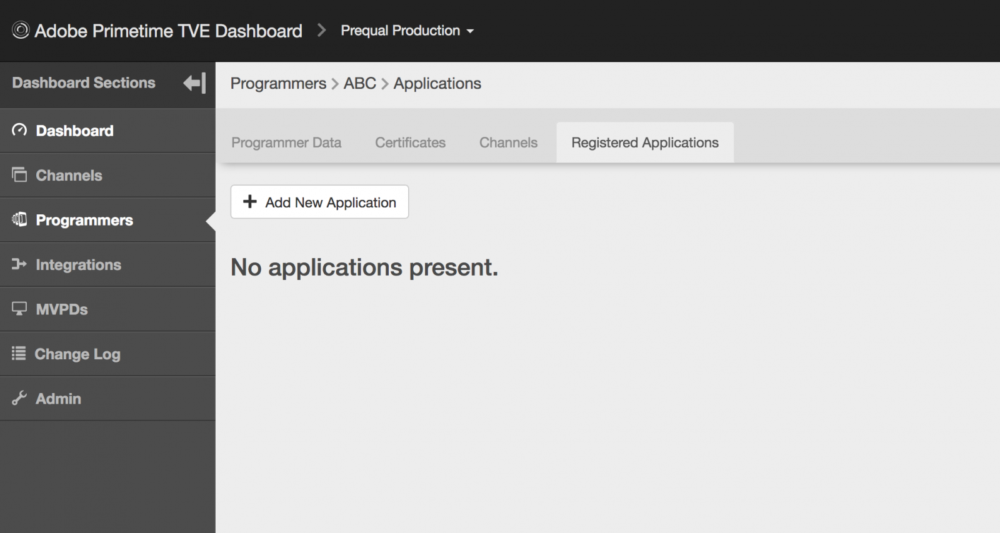
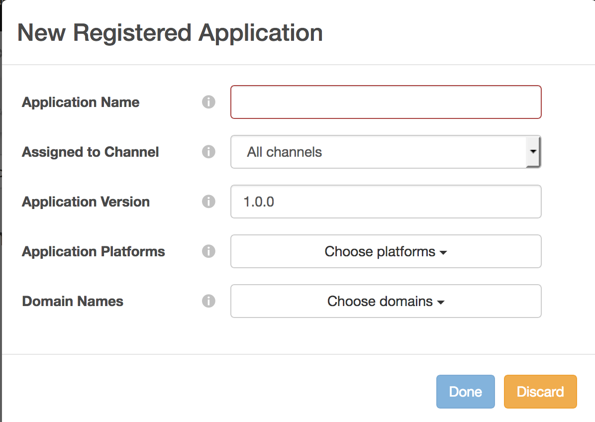
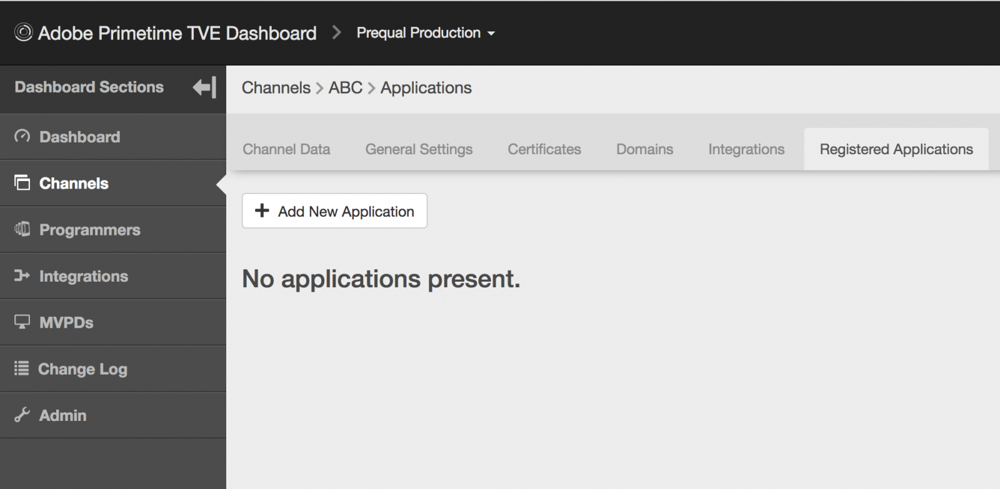
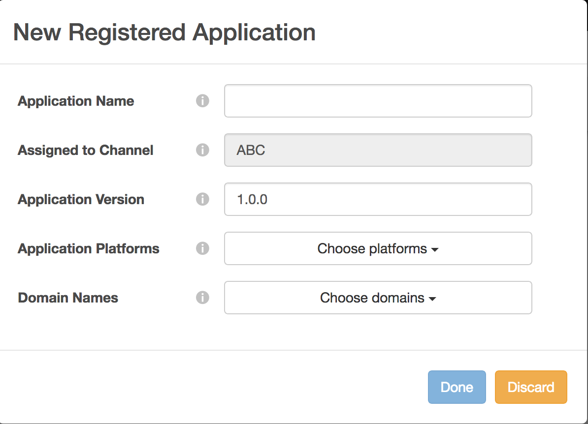
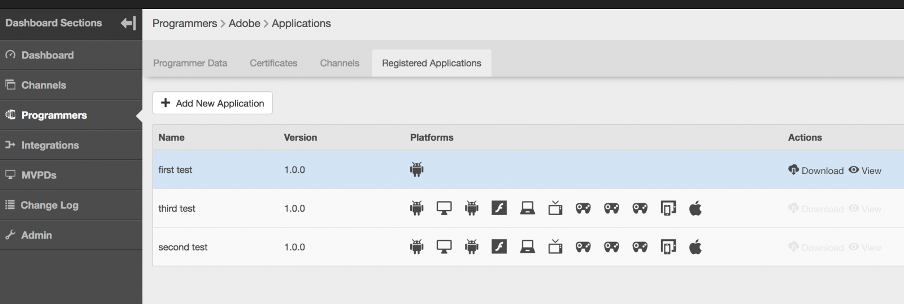
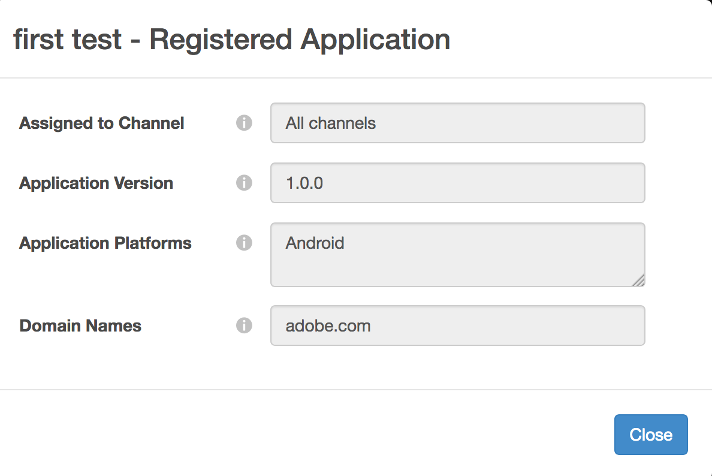
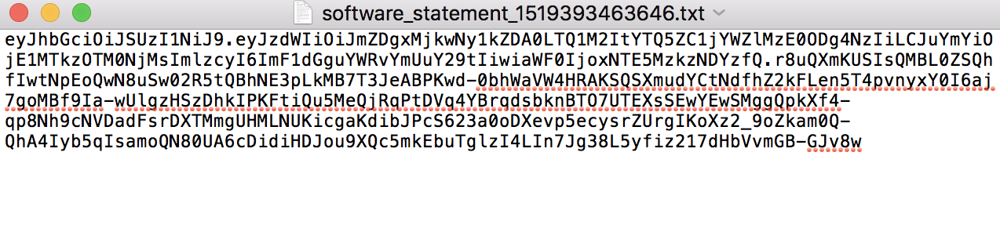
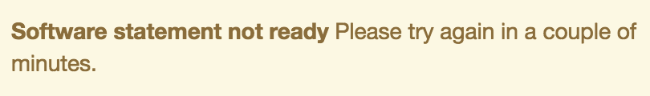

# 動態客戶端註冊管理 {#dynamic-client-registration-management}

>[!NOTE]
>
>此頁面上的內容僅供參考。 使用此API需要來自Adobe的當前許可證。 不允許未經授權使用。

## 概述 {#overview}

隨著 [Android Chrome自定義頁籤](https://developer.chrome.com/multidevice/android/customtabs){target_blanck和 [AppleSafari View控制器](https://developer.apple.com/documentation/safariservices/sfsafariviewcontroller){target_blanck}在客戶的應用程式中，我們正在更新Adobe Primetime身份驗證中的用戶身份驗證流。 更具體地說，我們不再能夠實現保持狀態的目標，以便在重定向之間跟蹤驗證MVPD用戶的用戶代理流。 以前使用HTTP Cookie完成此操作。 此限制是開始將所有API遷移到OAuth 2.0的驅動程式 [RFC6749](https://tools.ietf.org/html/rfc6749){target_blanck}。

通過此更新，Adobe身份驗證客戶端成為OAuth 2.0客戶端，並部署了自定義OAuth 2.0授權伺服器來滿足Adobe Primetime身份驗證服務的需要。

為了使客戶端應用程式能夠利用OAuth 2.0授權，伺服器必須動態註冊以獲取特定資訊（客戶端憑據），以便能夠與其交互。 作為註冊過程的一部分，客戶端必須向客戶端註冊終結點提供一組內置元資料。

此元資料作為軟體語句進行通信，該語句包含「softwareid」，以允許我們的授權伺服器使用相同的軟體語句關聯應用程式的不同實例。

A **軟體語句** 是JSON Web令牌(JWT)，它將有關客戶端軟體的元資料值聲明為捆綁。 當作為客戶端註冊請求的一部分向授權伺服器提供時，必須使用JSON Web簽名(JWS)對軟體語句進行數字簽名或MAC編輯。

您可以找到更詳細的說明，說明哪些軟體聲明以及它們在官方文檔中的工作方式 [RFC7591](https://tools.ietf.org/html/rfc7591)。

軟體語句應與用戶設備上的應用程式一起部署。

在此更新之前，我們有兩個機制允許應用程式執行對Adobe Primetime身份驗證的呼叫：

* 允許註冊基於瀏覽器的客戶端 [域清單](/help/authentication/programmer-overview.md#reg-and-init)
* 本地應用程式客戶端(如iOS和Android應用程式)通過 **簽名請求者** 機構

使用「客戶端註冊授權」機制，必須將應用程式添加到TVE儀表板。

如果客戶要開始實施新的Android SDK和即將推出的iOSSDK，他們需要一份軟體聲明。 軟體語句標識在TVE儀表板中建立的應用程式。

按照下面各節中的步驟在TVE操控板中建立註冊應用程式。

## 建立註冊的應用程式 {#create_app}

在TVE控制板中建立註冊應用程式有兩種方法：

* [程式設計師級別](#prog-level)  — 允許您建立註冊應用程式並將其連結到任何或所有程式設計師通道。

* [通道級別](#channel-level)  — 允許您建立僅永久連結到此渠道的註冊應用程式。

### 在程式設計師級別建立已註冊的應用程式 {#prog-level}

轉到 **程式設計師** > **已註冊的應用程式** 頁籤。

在「已註冊的應用程式」頁籤中，按一下 **添加新應用程式**。 在新窗口中填寫必填欄位。

如下圖所示，您應填寫的欄位包括：

* **應用程式名稱**  — 應用程式的名稱

* **已分配給通道**  — 頻道名稱， t此應用程式連結到的。 下拉蒙版中的預設設定為 **所有頻道。** 該介面允許您選擇一個通道或所有通道。

* **應用程式版本**  — 預設情況下，此值設定為「1.0.0」，但我們強烈建議您使用自己的應用程式版本對其進行修改。 作為最佳做法，如果您決定更改應用程式的版本，請通過為其建立新註冊的應用程式來反映它。

* **應用程式平台**  — 要連結的應用程式平台。 您可以選擇全部或多個值。

* **域名**  — 要連結的應用程式的域。 下拉清單中的域是所有通道中所有域的統一選擇。 您可以選擇從清單中選擇多個域。 域的含義是重定向URL [RFC6749](https://tools.ietf.org/html/rfc6749)。 在客戶機註冊處理中，客戶機應用可以請求允許使用重定向URL來最終確定認證流。 當客戶端應用程式請求特定重定向URL時，會根據與此軟體語句關聯的此註冊應用程式中列出的白色域來驗證它。

在用適當的值填充欄位後，必須按一下「完成」，才能將應用程式保存到配置中。

請注意 **沒有選項可修改已建立的應用程式**。 如果發現建立的內容不再滿足要求，則需要建立新的註冊應用程式並將其用於滿足要求的客戶端應用程式。

### 在渠道級別註冊新應用程式 {#channel-level}

為了在渠道級別建立註冊的應用程式，請導航到「渠道」菜單，然後選擇要為其建立應用程式的應用程式。 然後，在導航到「已註冊的應用程式」頁籤後，按一下「添加新應用程式」按鈕。

如下所示，與在程式設計師級別執行的相同操作相比，此處稍有不同的是未啟用的「已分配通道」下拉清單，因此沒有選項將註冊的應用程式綁定到當前通道以外的其他通道。

## 列出應用程式 {#list-reg-app}

在建立註冊的應用程式之後，有可能獲得軟體語句以作為請求的一部分呈現授權伺服器。

可以通過導航到建立註冊應用程式的程式設計師或渠道（在其中列出這些應用程式）來完成此操作。 

如下所述，清單中的每個條目都將由綁定了該條目的平台的名稱、版本和符號標識。

對於每一個，您可以：

* [視圖](#view)
* [下載軟體語句](#download-statement)

### 查看已註冊的應用程式 {#view}

在應用程式清單中，選擇其中一個應用程式並按一下「查看」按鈕將顯示建立應用程式時使用的詳細資訊。 如前所述，沒有修改任何內容的選項。

### 下載軟體語句 {#download-statement}

按一下需要軟體語句的清單項上的「下載」按鈕將生成文本檔案。 此檔案將包含類似於以下示例輸出的內容。

檔案的名稱是唯一標識的，方法是用&quot;software_statement&quot;前置詞並添加當前時間戳。

請注意，對於同一註冊的應用程式，每次按一下下載按鈕時都會收到不同的軟體語句，但這不會使先前為此應用程式獲取的軟體語句無效。 這是因為它們是按操作請求在現場生成的。

有一個 **限制** 下載操作的相關資訊。 如果在建立註冊的應用程式後不久按一下「下載」按鈕要求軟體語句，並且尚未保存該語句，且配置json未同步，則頁底部將出現以下錯誤消息。 

這將包含從核心接收的HTTP 404 Not Found（未找到）錯誤代碼，因為註冊的應用程式的ID尚未傳播，而核心對它一無所知。

解決方案是，在建立註冊的應用程式後，最多等待2分鐘以同步配置。 發生此情況後，將不再收到錯誤消息，並且帶有軟體語句的文本檔案將可供下載。

有關端到端流程如何工作的詳細資訊，或為瞭解請求的執行方式以及預期的響應，請參閱以下相關資訊中的連結以及其他有用連結。

<!--
## Related Information {#related}

* [Dynamic Client Registration API](/help/authentication/dynamic-client-registration-api.md)
* [TVE Dashboard User Guide](/help/authentication/tve-dashboard-user-guide.md)
-->

## 功能演示 {#tutorial}

請看 [本網路研討會](https://my.adobeconnect.com/pzkp8ujrigg1/) 它提供了更多功能的上下文，並包含一個演示，介紹如何使用TVE Dashboard管理軟體語句，以及如何使用Adobe作為Android SDK的一部分提供的演示應用程式test生成的語句。
