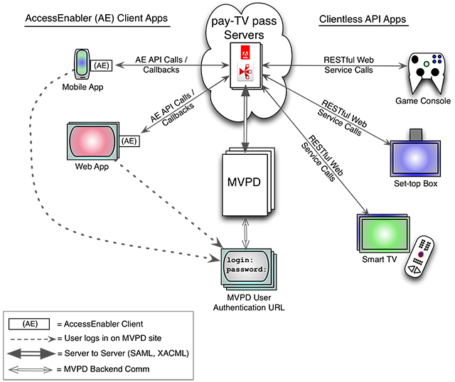

# 程式設計師權利流程 {#prog-entitlement-flow}

>[!NOTE]
>
>此頁面的內容僅供參考。 若要使用此API，必須具備目前的Adobe授權。 不允許未經授權使用。

## 概述 {#overview}

本文檔從程式設計師的角度描述了基本的權利流程。  欲知本文所介紹的TVE基本整合功能及使用案例，請參閱 [程式設計師使用案例](/help/authentication/programmer-use-cases.md).

Adobe Primetime驗證可為雙方提供安全、一致的介面，以協調程式設計人員與MVPD之間的權限流。  在程式設計師方面，Primetime身份驗證提供了兩種一般類型的權限介面：

1. AccessEnabler — 一種客戶端元件，為可呈現網頁（如網頁應用程式、智慧手機/平板電腦應用程式）的設備上的應用程式提供API庫。
2. 無用戶端API — 適用於無法呈現網頁的裝置（例如機頂盒、遊戲主機、智慧電視）的RESTful網站服務。 轉譯網頁的需求來自MVPD要求使用者在MVPD的網站上驗證。

除了此處提供的平台中性概觀外，此處還提供無用戶端API專屬概觀：無用戶端API檔案。 AccessEnabler在支援的平台上(Web上的AS / JS、iOS上的Objective-C和Android上的Java)以原生方式執行。 AccessEnabler API在支援的平台上保持一致。 所有不支援AccessEnabler的平台都使用相同的無客戶端API。

對於這兩種介面，Primetime身份驗證安全地協調程式設計師應用程式和用戶的MVPD之間的權限流：




*圖：Adobe Primetime驗證生態系統*

>[!IMPORTANT]
>
>上圖中的注意，權限流程中有一個部分不會通過Adobe Primetime驗證伺服器：MVPD登入。 使用者必須登入其MVPD的登入頁面。 因為這一要求，在無法呈現網頁的設備上，程式設計師的應用程式必須引導用戶切換到能夠使用其MVPD登錄的Web設備，然後他們返回原始設備以完成權限流程的其餘部分。

## 權利流程 {#entitlement-flow}

基本權利流程有四個不同的子流：

1. [啟動流程](/help/authentication/entitlement-flow.md#startup)
1. [驗證流程](/help/authentication/entitlement-flow.md#authentication)
1. [授權流程](/help/authentication/entitlement-flow.md#authorization)
1. [註銷FLow](/help/authentication/entitlement-flow.md#logout)

在用戶對程式設計師網站的首次訪問中，權利流按上述順序進行。 不過，在後續的造訪中，根據驗證和授權Token是否已過期，或根據檢視原則，使用者可能只會經過其中一或兩個子流程。

### 啟動流程 {#startup}

建立程式設計師和設備的身份，執行初始化任務。 這是所有後續權限呼叫的先決條件。

**AccessEnabler**

* **`setRequestor()`**  — 與AccessEnalber以及擴充功能建立您的Adobe Primetime驗證伺服器識別。 此呼叫是權利流程其餘部分的前導。 例如，在JavaScript中：

   ```JavaScript
     /* Define the requestor ID (Programmer/aggregator ID). */
       var requestorID = "sample_requestor_Id";
       ...
       // Callback indicating that the AccessEnabler swf has initialized
       function swfLoaded() {
           // AccessEnabler is loaded so we can use the API function it provides
           accessEnablerObject.setRequestor(requestorID); 
       ...
       }
   ```

**無用戶端API**

* **`\<REGGIE\_FQDN\>/reggie/v1/{requestorId}/regcode`**  — 視平台而定，應用程式呼叫重新編碼前可能需要完成先決條件任務。 請參閱 **無用戶端API檔案** 以取得詳細資訊。 例如，Xbox平台要求您在調用regcode之前完成規定的安全步驟。

### 驗證流程 {#authentication}

成功驗證會產生一個與裝置和要求者系結的AuthN代號。 成功驗證是授權的先決條件。

**AccessEnabler**

* `checkAuthentication()`  — 檢查本機Token快取中是否存在有效的快取驗證Token，而不實際觸發完整驗證流程。 這會觸發 `setAuthenticationStatus()` 回呼函式。
* `getAuthentication()`  — 啟動完整驗證流程。 如果成功，Adobe Primetime驗證會產生AuthN代號，並在用戶端上快取。 使用者登入其選取的MVPD網站，顯示在iFrame、快顯視窗或Web檢視中（視平台而定）。 這會觸發displayProviderDialog()。

**無用戶端API**

* `<FQDN>/.../checkauthn`  — 網站服務版本 `checkAuthentication()` 上。
* `<FQDN>/.../config`  — 將MVPD清單傳回至2畫面應用程式。
* `<FQDN>/.../authenticate`  — 從第2螢幕應用程式啟動驗證流程，將使用者重新導向至其選取的MVPD以供登入。 如果成功，Adobe Primetime驗證會產生AuthN代號並將其儲存在伺服器上，而使用者會返回其原始裝置以完成權限流程。

如果以下兩點為true，則AuthN代號會視為有效：

* AuthN代號未過期
* 與AuthN代號相關聯的MVPD位於目前要求者ID的允許MVPD清單上

#### 通用AccessEnabler初始身份驗證工作流 {#generic-ae-initial-authn-flow}

1. 您的應用程式會以呼叫 `getAuthentication()`，會檢查是否有有效的快取驗證Token。 此方法有選用 `redirectURL` 參數；如果您未為 `redirectURL`，在成功驗證後，會將使用者傳回驗證初始化的URL。
1. AccessEnabler確定當前的身份驗證狀態。 如果用戶當前已通過驗證，則AccessEnabler將調用 `setAuthenticationStatus()` 回呼函式，傳遞表示成功的驗證狀態。
1. 如果未驗證用戶，AccessEnabler將通過確定用戶的上次驗證嘗試是否在給定MVPD下成功來繼續驗證流。 如果已快取MVPD ID，且 `canAuthenticate` 標幟為true，或已使用 `setSelectedProvider()`，系統不會以MVPD選取對話方塊提示使用者。 驗證流程會繼續使用MVPD的快取值（亦即上次成功驗證期間使用的相同MVPD）。 系統會對後端伺服器發出網路呼叫，並將使用者重新導向至MVPD登入頁面。

1. 如果未快取任何MVPD ID，且未使用 `setSelectedProvider()` 或 `canAuthenticate` 標幟設為false, `displayProviderDialog()` 呼叫回呼。 此回呼會引導您的應用程式建立UI，為使用者提供要選擇的MVPD清單。 提供MVPD物件的陣列，其中包含您建立MVPD選取器的必要資訊。 每個MVPD物件都描述MVPD實體，並包含MVPD的ID和可找到MVPD標誌的URL等資訊。

1. 選取MVPD後，您的應用程式必須通知AccessEnabler使用者的選擇。 對於非Flash客戶端，一旦用戶選擇了所需的MVPD，您就通過對 `setSelectedProvider()` 方法。 Flash客戶端改為發送共用 `MVPDEvent` 類型&quot;`mvpdSelection`&quot;，傳遞所選提供程式。

1. 當通知AccessEnabler用戶的MVPD選擇時，會向後端伺服器發出網路呼叫，並將用戶重定向到MVPD登錄頁。

1. 在驗證工作流程中，AccessEnabler與Adobe Primetime驗證和所選MVPD通信，以徵求用戶憑據（用戶ID和密碼）並驗證其身份。 雖然有些MVPD會重新導向至其自己的網站以進行登入，但有些MVPD會要求您在iFrame中顯示其登入頁面。 您的頁面必須包含會建立iFrame的回呼，若客戶選擇其中一個MVPD，則必須包含。<!-- For more information on creating a login iFrame, see  [Managing the Login IFrame](https://tve.helpdocsonline.com/managing-the-login-iframe)-->.

1. 使用者成功登入後，AccessEnabler會擷取驗證Token，並通知您的應用程式驗證流程已完成。 AccessEnabler將調用 `setAuthenticationStatus()` 狀態代碼為1的回呼表示成功。 如果執行這些步驟期間發生錯誤，則 `setAuthenticationStatus()` 狀態碼為0時觸發回呼，表示驗證失敗，以及相應的錯誤碼。

>[!IMPORTANT]
>目前Comcast是唯一不提供標誌靜態URL的MVPD。 程式設計師應從 [XFINITY開發人員入口網站](https://developers.xfinity.com/products/tv-everywhere).

### 授權流程 {#authorization}

授權是檢視受保護內容的先決條件。 成功的授權會產生一個AuthZ代號，以及一個短期的媒體代號，此代號提供給程式設計師的應用程式以用於安全目的。 請注意，若要支援授權工作流程，您必須先執行必要的要求者設定，並整合 [媒體令牌驗證器](/help/authentication/media-token-verifier-int.md). 完成這些操作後，您就可以啟動授權。

當使用者要求存取受保護的資源時，您的應用程式會起始授權。 您需傳遞指定所請求資源的資源ID（例如頻道、集數等）。 您的應用程式會先檢查是否儲存了驗證Token。 如果找不到，則啟動身份驗證過程。

**AccessEnabler**

* `checkAuthorization()`  — 檢查授權，而不啟動完整授權流程。 這通常用於更新程式設計師應用程式的UI中顯示的狀態資訊。

* `getAuthorization()`  — 啟動完整授權流程。

您提供下列回呼函式以處理授權呼叫的結果：

* `setToken()`  — 如果先前的驗證成功且授權成功，則AccessEnabler將調用 `setToken()` 回呼函式，傳遞短期媒體代號，指出Adobe Primetime驗證權限流程的成功結論。 (在允許用戶查看受保護的內容之前，程式設計師的應用程式使用媒體令牌驗證器檢查媒體令牌的有效性。

* `tokenRequestFailed()`  — 如果用戶未獲得請求資源的授權（或者如果查詢因任何其他原因而失敗）,AccessEnabler將調用此回調函式（加上您自己的錯誤報告函式），並傳遞有關故障的詳細資訊。

**無用戶端API**

* `\<FQDN\>/.../authorize`  — 啟動完整授權流程。

#### 通用AccessEnabler授權工作流 {#generic-ae-authr-wf}

1. 提供回調函式，該函式使用 `setReqestor()`. 成功下載AccessEnabler時，將調用此回調函式。

1. 呼叫 `getAuthorization()` 當用戶請求訪問受保護的資源時。 使用 `getAuthorization()`，請傳遞指定請求資源的資源ID（例如頻道、集數等）。 AccessEnabler會查找快取的驗證令牌，以便隨授權請求傳遞。 如果找不到，則會啟動驗證流程。
1. 提供回調函式以處理授權結果：

   * `setToken()`  — 如果授權成功，或者用戶先前已被授權，則Access Enabler將通過調用 `setToken()` 回呼函式，傳遞短期授權權杖。

   * `tokenRequestFailed()`  — 如果用戶未獲得所請求資源的授權（或者如果查詢因任何其他原因而失敗），則AccessEnabler將調用您註冊的任何錯誤報告功能，加上 `tokenRequestFailed()` 回呼，傳遞失敗的詳細資料。

### 註銷流程 {#logout}

清除與目前使用者的權限流程相關聯的代號和其他資料。

**AccessEnabler**

* `logout()`

**無用戶端API**

* `\<FQDN\>/.../logout`

## 了解AccessEnabler行為 {#ae-behavior}

所有AccessEnabler API調用均為非同步（API參考中指明了一個例外）。 您可以任意呼叫API的次數，但無法保證呼叫所觸發的動作會以與呼叫相同的順序完成。 (此例外是目前的Flash Player執行階段；不是多線程，它將確保呼叫 *do* 按呼叫順序完成。)

為了區分回應，以及能夠將回應與呼叫配對，所有回呼都會回傳其輸入參數。 包括 `setToken()` 和`tokenRequestFailed()`，最終由 `checkAuthorization()`. (適用於 `checkAuthorization()` 回呼時，所用的資源會回呼)。 您可善用此功能，區分哪些回應與哪個呼叫相對應。 若要使用此功能，您可編寫下列程式碼：

```JavaScript
    for each (resource in ["TNT", "CNN", "TBS", "AdultSwim"] ) {
         ae.checkAuthorization(resource);
    }
    
    // Success callback
    function setToken(resource, token) {
         // Use "resource" to figure 
         // out which checkAuthorization
         // call triggered this response
    }
    
    // Old error callback
    function tokenRequestFailed(resource, error, details) {
         // use "resource" to figure
         // out in response to which
         // checkAuthorization call
         // this was triggered
    }
    
    // Error callback using new error api
    ae.bind("errorEvent',"errorHandler");
    
    function errorHandler(error) {
         if(error.resource) {        
              // Use error.resource to figure
              // which checkAuthorization call
              // triggered this response
         }
    }
```

### AE行為常見問題集 {#ae-beh-faq}

**問。 如果在第一次呼叫完成之前進行第二次AccessEnabler呼叫，會發生什麼情況？**

當第二呼叫執行時（非同步通訊），第一呼叫繼續執行。

**問。 AccessEnabler是否支援最多的同時呼叫數？**

AccessEnabler代碼中未明確設定任何限制，因此您僅受可用系統資源以及MVPD容量的限制。

<!--

>[!MORELIKETHIS]
>
>*   [Programmer use cases](/help/authentication/programmer-use-cases.md)
>*   Error Reporting
>**Platform Cookbooks:**
>*   Clientless integration cookbook
>*   iOS Integration Cookbook
>*   Android Integration Cookbook
>*   JavaScript Integration Cookbook
>*   ActionScript Integration Cookbook
>*   Windows 8 Integration Cookbook
>*   AIR Native Extension Overview
-->