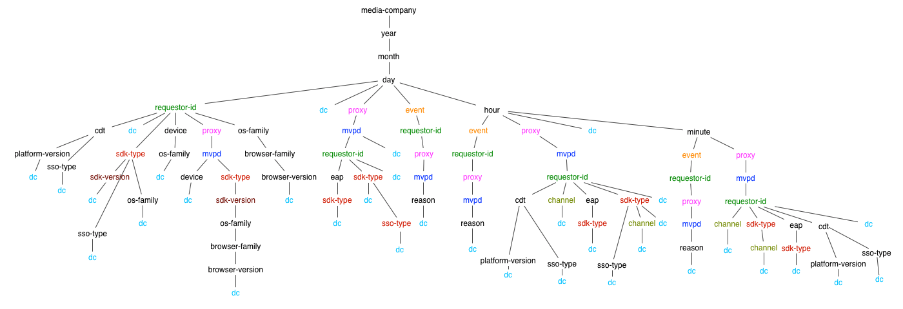
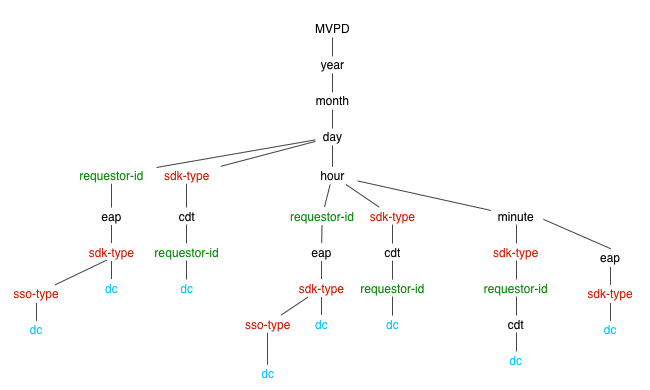

# Entitlement Service Monitoring API {#entitlement-service-monitoring-api}

>[!NOTE]
>
>此頁面的內容僅供參考。 若要使用此API，必須具備目前的Adobe授權。 不允許未經授權使用。

## API概述 {#api-overview}

權利服務監視(ESM)實施為WOLAP（基於Web） [線上分析處理](https://en.wikipedia.org/wiki/Online_analytical_processing){target=_blank})專案。 ESM是由資料倉庫支援的通用業務報告Web API。 它充當HTTP查詢語言，使典型OLAP操作能夠完全執行REST。

>[!NOTE]
>
>ESM API不普遍可用。 如有可用性問題，請聯絡您的Adobe代表。

ESM API提供底層OLAP多維資料集的分層視圖。 每個資源([維度](#esm_dimensions) 在維度階層中，對應為URL路徑區段)會產生包含（匯總）的報表 [量度](#esm_metrics) （針對當前選項）。 每個資源指向其父資源（用於累計）及其子資源（用於追溯）。 通過查詢字串參數將尺寸釘扎到特定值或範圍來實現切片和切割。

REST API會根據維度路徑、提供的篩選器和選取的量度，在請求指定的時間間隔內提供可用資料（若未提供，則回復為預設值）。 時間範圍不會套用至不包含時間維度（年、月、日、小時、分鐘、秒）的報表。

端點URL根路徑會傳回單一記錄中的整體匯總量度，以及可用向下切入選項的連結。 API版本被映射為終結點URI路徑的尾端段。 例如， `https://mgmt.auth.adobe.com/*v2*` 表示客戶端將訪問WOLAP版本2。

可用的URL路徑可透過回應中包含的連結找到。 保留有效的URL路徑，以映射包含（預先）匯總量度的基礎向下切入樹中的路徑。 表單中的路徑 `/dimension1/dimension2/dimension3` 將反映這三個維的預聚合（相當於SQL） `clause GROUP` 按 `dimension1`, `dimension2`, `dimension3`)。 如果此類預先匯總不存在，且系統無法即時計算，API會傳回404 Not Found回應。

## 向下鑽取樹 {#drill-down-tree}

以下向下鑽取樹說明了ESM 2.0中可用的維（資源） [程式設計師] (#esm_dimensions)和 [MVPD](#esm_dimensions_mvpd).


### Dimension可供程式設計師使用 {#progr-dimensions}



### Dimension可供MVPD使用 {#mvpd-dimensions}



GET `https://mgmt.auth.adobe.com/v2` API端點會傳回包含下列項目的表示法：

* 可用根向下切入路徑的連結：

   * `<link rel="drill-down" href="/v2/dimensionA"/>`

   * `<link rel="drill-down" href="/v2/dimensionB"/>`

* 所有量度的摘要（匯總值）（預設間隔內，因為未提供查詢字串參數，請參閱下文）。


遵循下鑽路徑（逐步）:
`/dimensionA/year/month/day/dimensionX` 擷取下列回應：

* 連結至「`dimensionY`&quot;和&quot;`dimensionZ`&quot;下鑽選項

* 包含每個值的每日匯總的報表 `dimensionX`


### 篩選器

除了日期/時間維度，目前投影（維度路徑）可用的任何維度都可以透過名稱作為查詢字串參數來篩選。

可使用下列篩選選項：

* **等於** 篩選器是透過將維度名稱設為查詢字串中的特定值而提供。

* **IN** 可以使用不同值多次新增相同的dimension-name參數來指定篩選器：dimension=value1\&amp;dimension=value2

* **不等於** 篩選器必須使用「\！」 尺寸名稱后的符號，導致「\！」=&#39; &quot;operator&quot;:維度\!=value

* **不在** 篩選器需要「\!=&#39;運算子，對集合中的每個值使用一次：維度\!=value1\&amp;dimension\!=value2&amp;...

查詢字串中的維度名稱也有特殊用法：如果維度名稱是作為沒有值的查詢字串參數，這會指示API傳回在報表中包含該維度的投影。

### ESM查詢示例

| *URL* | *SQL對等項* |
|---|---|
| /dimension1/dimension2/dimension3?dimension1=value1 | 從投影中選擇*，其中維度1 = &#39;value1&#39; </br> 按維度1、維度2、維度3分組 |
| /dimension1/dimension2/dimension3?dimension1=value1&amp;dimension1=value2 | 從投影中選取*，其中維度1位於(&#39;value1&#39;, &#39;value2&#39;) </br> 按維度1、維度2、維度3分組 |
| /dimension1/dimension2/dimension3?dimension1!=value1 | 從投影中選擇*，其中維度1 &lt;> &#39;value1&#39; | </br> 按維度1、維度2、維度3分組 |
| /dimension1/dimension2/dimension3?dimension1!=value1&amp;dimension2!=value2 | 從投影中選擇*，其中DIMENSION1不在(&#39;value1&#39;, &#39;value2&#39;) | </br> 按維度1、維度2、維度3分組 |
| 假設沒有直接路徑：/dimension1/dimension3 </br> 但有一條路：/dimension1/dimension2/dimension3 </br> </br> /dimension1?dimension3 | 從投影組中選擇*，按維1，維3 |

>[!NOTE]
>
>這些篩選技術都不適用於 `date/time` 維度。 篩選的唯一方法 `date/time` 維度是用來設定 `start` 和 `end` 查詢字串參數（如下所述）至所需值。

下列查詢字串參數對API具有保留的意義（因此無法將其用作維度名稱，否則無法篩選此類維度）。

### ESM API保留查詢字串參數

| 參數 | 可選 | 說明 | 預設值 | 範例 |
| --- | ---- | --- | ---- | --- |
| access_token | 是 | 如果啟用IMS OAuth保護，IMS權杖可以作為標準授權承載權杖，或作為查詢字串參數傳遞。 | 無 | access_token=XXXXX |
| dimension-name | 是 | 任何維度名稱 — 包含在目前URL路徑中，或包含在任何有效的子路徑中；該值將視為等於篩選。 如果未提供值，則這將強制將指定的維包含在輸出中，即使它未包括或與當前路徑相鄰 | 無 | someDimension=someValue&amp;someOtherDimension |
| 結束 | 是 | 以毫秒為單位的報表結束時間 | 伺服器的當前時間 | end=2012-07-30 |
| 格式 | 是 | 用於內容交涉（效果相同，但優先順序低於路徑「延伸功能」 — 請參閱下文）。 | 無：內容協商將嘗試其他策略 | format=json |
| 限制 | 是 | 要返回的最大行數 | 若請求中未指定任何限制，則伺服器在自我連結中報告的預設值 | limit=1500 |
| 量度 | 是 | 要傳回的逗號分隔量度名稱清單；這應用於篩選可用量度的子集（以縮小裝載大小），以及強制API傳回包含請求量度的投影（而非預設的最佳投影）。 | 若未提供此參數，將會傳回目前投影的所有可用量度。 | metrics=m1,m2 |
| 開始 | 是 | 報表的開始時間為ISO8601;如果僅提供前置詞，則伺服器將填入剩餘部分：例如，start=2012將導致start=2012-01-01:00:00:00 | 由伺服器在自行連結中報告；伺服器會根據所選的時間粒度，嘗試提供合理的預設值 | start=2012-07-15 |

目前唯一可用的HTTP方法是GET。 未來版本可能會支援OPTIONS/HEAD方法。

## ESM API狀態代碼 {#esm-api-status-codes}

| 狀態代碼 | 原因片語 | 說明 |
|---|---|---|
| 200 | 確定 | 回應將包含「統計」和「向下切入」連結（若適用）。 報表將呈現為資源的屬性：巢狀的「報表」元素/屬性。 |
| 400 | 錯誤請求 | 回應內文將包含文字訊息，說明要求的錯誤。 </br> </br> 400 Bad Request（錯誤請求）狀態在回應內文（純/文字媒體類型）中附有說明文字，可提供有關用戶端錯誤的有用資訊。 除了無效日期格式或套用至非現有維度的篩選器等瑣碎情況外，系統也將拒絕回應需要即時傳回或匯總大量資料的查詢。 |
| 401 | 未授權 | 由不包含正確OAuth標題的要求所導致，以便驗證使用者 |
| 403 | 禁止 | 指出目前的安全性內容不允許要求；當用戶被驗證但不允許訪問請求的資訊時，就會發生這種情況 |
| 404 | 找不到 | 當請求中提供無效的URL路徑時發生。 如果用戶端遵循隨200個回應提供的「向下切入」/「上滾」連結，就不會發生此情況 |
| 405 | 不允許的方法 | 代表要求中使用不支援方法。 雖然目前僅支援GET方法，但未來版本可能允許HEAD或OPTIONS |
| 406 | 不可接受 | 表示客戶端請求了不支援的媒體類型 |
| 500 | 內部伺服器錯誤 | 「這絕不會發生」 |
| 503 | 服務不可用 | 代表應用程式或其相依性內發生錯誤 |

## 資料格式 {#data-formats}

資料的格式如下：

* JSON（預設）
* XML
* CSV
* HTML（用於示範用途）

用戶端可以使用下列內容交涉策略（優先順序由清單中的位置指定 — 首先）:

1. 附加至URL路徑最後一個區段的「副檔名」：例如， `/esm/v2/media-company/year/month/day.xml`. 如果URL包含查詢字串，則副檔名必須位在問號之前： `/esm/v2/media-company/year/month/day.csv?mvpd= SomeMVPD`
1. 格式查詢字串參數：例如， `/esm/report?format=json`
1. 標準HTTP Accept標題：例如， `Accept: application/xml`

「擴充功能」和查詢參數都支援下列值：

* xml
* json
* csv
* html

如果任何策略未指定任何媒體類型，API依預設會產生JSON內容。

## 超文本應用語言 {#hypertext-application-language}

對於JSON和XML，裝載將編碼為HAL，如下所述：  <http://stateless.co/hal_specification.html>.

實際報表（稱為「報表」的巢狀標籤/屬性）將由實際記錄清單組成，其中包含所有選取/適用的維度和量度及其值，編碼如下：

### JSON

```JSON
 "report": [
  {
    "dimension1": "d1",
    ...
    "metric1": "m1",
    ...
  }, {
    ...
  }
]
```

### XML

```XML
 <report>
  <record dimension1="d1" ... metric1="m1" ... />
  ...
</report
```

對於XML和JSON格式，記錄中的欄位（維度和量度）順序未指定，但是一致（所有記錄的順序都相同）。 但是，客戶不應依賴記錄中欄位的任何特定順序。

資源連結（JSON中的「self」rel和XML中的「href」資源屬性）包含目前路徑和用於內嵌報表的查詢字串。 查詢字串會顯示所有的隱式和顯式參數，以便有效負載明確指出所使用的時間間隔、隱式篩選器（如果有）等。 資源內的其餘連結將包含所有可依循的可用區段，以便深入鑽研目前的資料。 也會提供統計的連結，且會指向父路徑（若有）。 此 `href` 下鑽/上滾連結的值只包含URL路徑（不包含查詢字串，因此需要時需要由用戶端附加）。 請注意，並非目前資源使用（或隱含）的所有查詢字串參數都適用於「累計」或「向下切入」連結（例如，篩選器可能不適用於子資源或超級資源）。

範例(假設我們有一個稱為 `clients` 而且， `year/month/day/...`):

* https://mgmt.auth.adobe.com/esm/v2/year/month.xml

```XML
   <resource href="/esm/v2/year/month?start=2012-07-20T00:00:00&end=2012-08-20T14:35:21">
   <links>
   <link rel="roll-up" href="/esm/v2/year"/>
   <link rel="drill-down" href="/esm/v2/year/month/day"/>
   </links>
   <report>
   <record month="6" year="2012" clients="205"/>
   <record month="7" year="2012" clients="466"/>
   </report>
   </resource>
```

* https://mgmt.auth.adobe.com/esm/v2/year/month.json 

   ```JSON
       {
         "_links" : {
           "self" : {
             "href" : "/esm/v2/year/month?start=2012-07-20T00:00:00&end=2012-08-20T14:35:21"
           },
           "roll-up" : {
             "href" : "/esm/v2/year"
           },
           "drill-down" : {
             "href" : "/esm/v2/year/month/day"
           }
         },
         "report" : [ {
           "month" : "6",
           "year" : "2012",
           "clients" : "205"
         }, {
           "month" : "7",
           "year" : "2012",
           "clients" : "466"
         } ]
       }
   ```

### CSV

在CSV資料格式中，不會內嵌提供任何連結或其他中繼資料（標題列除外）;相反，選擇元資料將以檔案名提供，其將遵循以下模式：

```CSV
    esm__<start-date>_<end-date>_<filter-values,...>.csv
```

CSV會包含標題列，然後包含報表資料作為後續列。 標題列將包含所有維度，及其後接著的所有量度。 報表資料的排序順序會反映在維度的順序中。 因此，如果資料的排序依據 `D1` 然後 `D2`，則CSV標題會如下： `D1, D2, ...metrics...`.

標題列中欄位的順序將反映表格資料的排序順序。


範例：https://mgmt.auth.adobe.com/v2/year/month.csv將產生名為 `report__2012-07-20_2012-08-20_1000.csv` 包含下列內容：


| 年 | 月 | 用戶端 |
| ---- | :---: | ------- |
| 2012 | 6 | 580 |
| 2012 | 7 | 231 |

## 資料時效性 {#data-freshness}

成功的HTTP回應包含 `Last-Modified` 表示上次更新內文中報表的時間的標題。 缺少「上次修改時間」標題表示報表資料是即時計算。

通常，粗粒度資料的更新頻率會比細粒度資料低(例如，每分鐘值或每小時值可能比每日值更新，尤其是對於無法根據較小粒度（例如唯一計數）計算的量度。

未來版本的ESM可通過提供標準「If-Modified-Since」標頭，允許客戶端執行條件式GET。

## GZIP壓縮 {#gzip-compression}

Adobe強烈建議您在擷取ESM報表的用戶端中啟用gzip支援。 這麼做會大幅縮小回應的大小，進而縮短您的回應時間。 （ESM資料的壓縮率在20-30範圍內。）

若要在用戶端中啟用gzip壓縮，請設定 `Accept-Encoding:` 標題如下：

* Accept-Encoding:gzip,defla


<!--
## Related Information {#related-information}

- [ESM Overview](/help/authentication/entitlement-service-monitoring-overview.md)
- [Degradation API Overview](/help/authentication/degradation-api-overview.md)
- [Understanding Server-side Metrics](/help/authentication/understanding-serverside-metrics.md)
-->