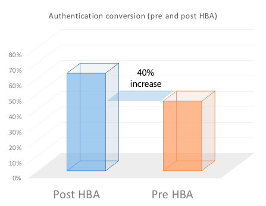
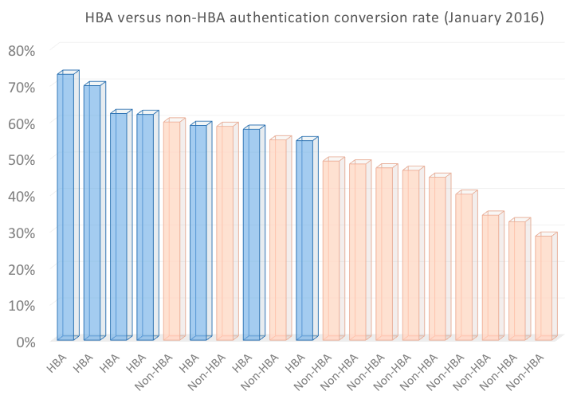
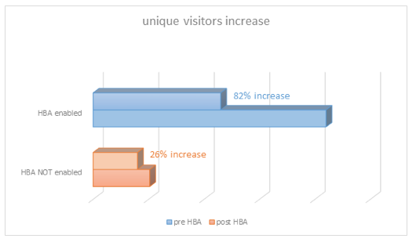
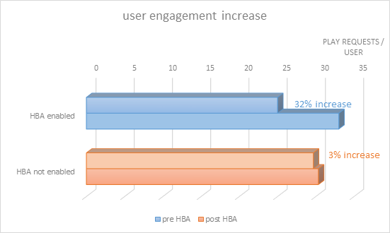

# 基於家庭的TV Everywhere驗證

>[!NOTE]
>
>此頁面的內容僅供參考。 若要使用此API，必須具備目前的Adobe授權。 不允許未經授權使用。

## 什麼是家庭式驗證？ {#whatis-home-based-authn}

基於家庭的身份驗證(HBA)是TV Everywhere功能，它使付費電視訂閱者在家時無需輸入MVPD憑據即可線上查看電視內容，從而顯著改善身份驗證流的用戶體驗。

開放認證技術委員會(OATC)基於家庭的認證定義：「家庭內自動認證是MVPD/OVD使用家庭網路的特性（或家庭網路上的設備之間自動訪問的標識符）來認證與家庭網路相關聯的用戶帳戶的過程，這樣用戶在建立TVE會話以訪問TVE受保護的內容時就不需要手動輸入憑據。」

有關HBA和行業標準的詳細資訊，請閱讀 [OATC使用案例和需求](https://dzf8vqv24eqhg.cloudfront.net/userfiles/258/326/ckfinder/files/Defining%20TVE%20Home-Based%20Authentication%20(HBA)%20%20Use%20Cases%20and%20Requirements%20Recommended%20Practice%20Version%201_0%20FINAL%20DRAFT%20FOR%20BOARD%20APPROVAL.pdf){target=_blank} 檔案與 **適用於HBA的OATC用戶體驗指南**.

>[!NOTE]
>
>某些HBA流是Premium Workflow軟體包的一部分。 如果您有興趣使用此功能，請連絡您的Primetime銷售代表。

## HBA為何對您很重要 {#why-hba}

HBA很重要，因為它實際上消除了您家中已訂購電纜的查看器的登錄障礙。 此外，家庭式驗證可大幅提升檢視者的參與度，並為您的TV Everywhere內容提供更好的使用者體驗。

目前，幾乎一半的登入嘗試都未成功。

HBA被前5個MVPD之一激活後，其驗證轉換率 **增加了40%** （45%至63%）

此外，您還可以看到與不同MVPD整合之管道的登入轉換率：為其啟用HBA的HBA以及沒有HBA的HBA。 HBA的轉換率要比沒有HBA的要高得多。

在為與此MVPD整合的大多數頻道啟用HBA後6個月，我們注意到不重複用戶增加了82%（通過此MVPD訪問TV Everywhere頻道的用戶數幾乎翻了一番）。

2w3相反，如下圖所示，未啟用HBA的其他MVPD在過去6個月中的不重複用戶數僅增加了26%。

從我們在啟用HBA前6個月和後6個月收集的資料中，我們發現已啟用HBA的通道的查看者參與度顯著增加。 實際上，已啟用HBA的MVPD的用戶通常比未啟用HBA的MVPD的用戶平均觀看內容多30%。

## Primetime身份驗證HBA支援 {#auth-hba-support}

本節介紹Primetime身份驗證提供的HBA支援、Primetime身份驗證平台在HBA流中的行為，還提供了實施HBA時有用的技術詳細資訊。

支援HBA的Primetime身份驗證功能

* 能夠為HBA驗證與非HBA驗證設定不同的驗證TTL（還需要MVPD支援）
* 在驗證過期時自動選取MVPD（略過MVPD選擇器）的功能。 這在HBA TTL較小時尤其有用。
* 在驗證是否為HBA時向程式設計師公開（還需要MVPD支援）

### Primetime驗證平台上的HBA用戶體驗 {#hba-user-exp}

下表提供了在啟用HBA和未啟用HBA時支援平台的用戶體驗的資訊：

| 使用者流程 — 平台類型 | swf,iOS,Android |
|---|---|
| 啟用HBA | 當使用者在家時，就會自動進行驗證。 HBA AuthN令牌過期後，用戶將自動重新驗證。 |
| 無HBA | 系統會要求使用者選取其MVPD並輸入其認證，即使他們在家。AuthN代號過期後，使用者必須再次輸入其認證。 |

| 使用者流程 — 平台類型 | js, Windows（原生） |
|---|---|
| 啟用HBA | 當使用者在家時，就會自動進行驗證。 HBA AuthN令牌過期後，用戶必須從選擇器中重新選擇其MVPD，並將自動進行身份驗證。 |
| 無HBA | 系統會要求使用者選取其MVPD並輸入其認證，即使他們在家中亦然。 AuthN代號過期後，使用者必須再次輸入其憑證。 |

| 使用者流程 — 平台類型 | 無用戶端REST API（第二個螢幕驗證） |
|---|---|
| 啟用HBA | 當使用者在家中且使用無用戶端REST API應用程式時，在輸入註冊代碼並選取其MVPD後，他們會自動在第二個螢幕裝置上驗證。 在HBA AuthN令牌過期後，用戶將自動重新驗證（在第二螢幕設備上）。 |
| 無HBA | 系統會要求使用者選取其MVPD並輸入其認證，即使他們在家中亦然。 AuthN代號過期後，使用者必須再次輸入其憑證。 |

### 實施HBA的技術詳細資訊 {#tech-details-hba}

#### OAuth 2.0通訊協定 {#oauth-2-protocol}

在與OAuth 2.0驗證通訊協定整合之MVPD的HBA流程中，MVPD會發出重新整理Token，而Adobe會發出HBA驗證Token:

* 重新整理代號具有由MVPD的業務需求決定的TTL。
* HBA驗證令牌TTL **必須小於或等於** 重新整理代號TTL。

*OAuth 2.0協定的HBA驗證流程說明*

| 使用者動作 | 系統動作 |
|---|---|
| 用戶導航到程式設計師的站點。 嘗試播放視訊時，會顯示MVPD選取器。 使用者會選取其MVPD並按一下登入。 | 進行背景檢查。 MVPD會套用其規則集以進行使用者偵測(例如，將使用者的IP位址對應至經銷商布建的資料機或寬頻連接的機上盒的MAC位址)。 |
| 畫面會顯示，持續存在約3秒的畫面。 可顯示插入式頁面，通知使用者正使用其MVPD帳戶自動登入。 | <ol><li>安裝在程式設計師端的AccessEnabler向Adobe Primetime Authentication端點發送身份驗證請求（作為HTTP請求）。</li><li>Primetime驗證端點會將要求重新導向至MVPD驗證端點。  **注意：** 請求包含 `hba_flag` 參數（嘗試HBA = true），表示MVPD應嘗試HBA驗證。</li><li>MVPD驗證端點會將授權代碼傳送至Adobe Primetime驗證端點。</li><li>Adobe Primetime驗證會使用授權碼，從MVPD的Token端點要求重新整理Token和存取Token。</li><li>MVPD會傳送驗證決策，而 `hba_status` (true/false)參數 `id_token`.</li><li>會傳送對MVPD使用者設定檔端點的呼叫，以公開 [用戶元資料中的hba_status鍵](/help/authentication/user-metadata-feature.md#obtaining).</li><li>MVPD會將重新整理代號TTL設為MVPD同意的值，而Adobe會將AuthN代號TTL設為小於或等於重新整理代號值的值。</li></ol> |
| 使用者已通過驗證，現在可以瀏覽已授權的TV Everywhere內容。 | 驗證令牌將傳遞給用戶，用戶現在可以成功瀏覽程式設計師的網站。 |

#### SAML通訊協定 {#saml-protocol}

SAML驗證協定的HBA驗證流描述

| 使用者動作 | 系統動作 |
|---|---|
| 用戶導航到程式設計師的站點。 嘗試播放視訊時，會顯示MVPD選取器。 使用者會選取其MVPD並按一下登入。 | 進行背景檢查。 MVPD會套用其規則集以進行使用者偵測(例如，將使用者的IP位址對應至經銷商布建的資料機或寬頻連接的機上盒的MAC位址)。 |
| 畫面會顯示，持續存在約3秒的畫面。 可顯示插入式頁面，通知使用者正使用其MVPD帳戶自動登入。 | <ol><li>安裝在程式設計師端的AccessEnabler向Adobe Primetime Authentication端點發送身份驗證請求（作為HTTP請求）。</li><li>Primetime驗證端點會將要求重新導向至MVPD驗證端點。</li><li>MVPD應以應包含HBA標幟的SAML回應的形式傳送驗證決策：hba_status(true/false)。</li><li>會傳送對MVPD使用者設定檔端點的呼叫，以公開 [用戶元資料中的hba_status鍵](/help/authentication/user-metadata-feature.md#obtaining).</li></ol> |
| 使用者已通過驗證，現在可以瀏覽已授權的TV Everywhere內容。 | 驗證令牌將傳遞給用戶，用戶現在可以成功瀏覽程式設計師的網站。 |

## 如何激活HBA {#how-to-activate-hba}

* **OAuth通訊協定：**
   * 有關啟用HBA的資訊，請參見， [Primetime TVE儀表板使用手冊](/help/authentication/tve-dashboard-user-guide.md)
* **SAML通訊協定：** 在MVPD端啟動首頁式驗證。 程式設計師或Adobe不需要任何操作。
如需支援「首頁式驗證」之MVPD的詳細資訊，請參閱 [MVPD的HBA狀態](/help/authentication/hba-status-mvpds.md).

## 常見問題集 {#faqs}

**問題：** 為何使用SAML和OAuth2通訊協定來分離首頁式驗證？

**答案：** HBA流對於兩種協定是不同的。 從程式設計師的角度來看，無需採取操作來確保HBA已啟用SAML MVPD，而對於OAuth2 MVPD,HBA可以在Primetime TVE儀表板中開啟或關閉。

**問題：** 在啟用HBA時，用戶是否需要在首次進行身份驗證時填寫用戶名和密碼？

**答案：** 否，用戶名和密碼不是必需的。

**問題：** 如何實施家長控制？

**答案1:** Adobe可禁用HBA以整合需要家長控制批准的通道。

**答案2:** Adobe正在與OATC合作，該文檔建議如何使用家長控制設定HBA體驗。

**問題：** 支援HBA的提供程式的TTL窗口是否比常規身份驗證的更短？

**答案：** TTL設定可設定。 建議您為HBA驗證Token設定較短的TTL，以防止錯誤處理。

## 實用資訊 {#useful-info}

* [即時訪問(HBA)Recommendations](http://www.ctamtve.com/instantaccess){target=_blank}  — 由CTAM提供
* [在程式設計師應用程式上實施HBA的示例](https://dzf8vqv24eqhg.cloudfront.net/userfiles/258/326/ckfinder/files/HBA_Flow_Sample.pdf?dc=201604222139-1346){target=_blank}  — 按Adobe
   <!--* [Home Based Authentication User Experience Guidelines for TV Everywhere](http://oatc.us/Standards/DownloadRecommendedPractices.aspx){target=_blank} - by OATC-->
* [基於家庭的身份驗證使用案例和要求](https://dzf8vqv24eqhg.cloudfront.net/userfiles/258/326/ckfinder/files/Defining%20TVE%20Home-Based%20Authentication%20(HBA)%20%20Use%20Cases%20and%20Requirements%20Recommended%20Practice%20Version%201_0%20FINAL%20DRAFT%20FOR%20BOARD%20APPROVAL.pdf){target=_blank} 由OATC提供
* [基於家庭的身份驗證資訊圖](https://dzf8vqv24eqhg.cloudfront.net/userfiles/258/326/ckfinder/files/AdobeNewsletterHBA.pdf?dc=201604260953-2640){target=_blank}  — 按Adobe
* [使用OAuth 2.0通訊協定進行驗證](/help/authentication/authn-oauth2-protocol.md)
* [使用SAML MVPD進行驗證](/help/authentication/authn-usecase.md)
* [Primetime TVE儀表板使用手冊](/help/authentication/tve-dashboard-user-guide.md)
* [hba_status用戶元資料](/help/authentication/user-metadata-feature.md#obtaining)

