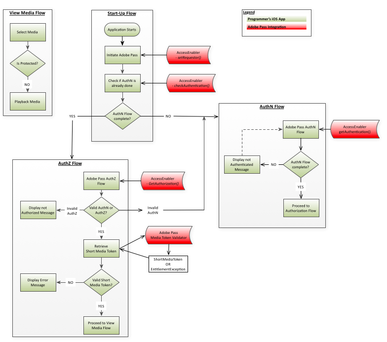

# iOS/tvOS SDK逐步指南 {#iostvos-sdk-cookbook}

>[!NOTE]
>
>此頁面上的內容僅供參考之用。 使用此API需要來自Adobe的目前授權。 不允許未經授權的使用。

## 簡介 {#intro}

本檔案說明程式設計師的上層應用程式可透過iOS/tvOS AccessEnabler資料庫公開的API實施的權益工作流程。

iOS/tvOS的Adobe Primetime驗證許可權解決方案最終分為兩個網域：

* UI網域 — 這是實作UI並使用AccessEnabler資料庫所提供之服務來提供對受限制內容的存取的上層應用程式層。

* AccessEnabler網域 — 這是軟體權利檔案工作流程的實作方式，其形式為：

   * 對Adobe後端伺服器發出的網路呼叫
   * 與驗證和授權工作流程相關的商業邏輯規則
   * 管理各種資源及處理工作流程狀態（例如權杖快取）

AccessEnabler網域的目標是隱藏軟體權利檔案工作流程的所有複雜性，並（透過AccessEnabler資料庫）提供一組簡單軟體權利檔案原件，供您實作軟體權利檔案工作流程：

1. 設定要求者身分
1. 檢查並取得特定身分提供者的驗證
1. 檢查並取得特定資源的授權
1. 登出
1. Apple SSO會藉由代理Apple VSA架構來流程

AccessEnabler的網路活動在其自己的執行緒中進行，因此不會封鎖UI執行緒。 因此，兩個應用程式網域之間的雙向通訊通道必須遵循完全非同步模式：

* UI應用程式層透過AccessEnabler程式庫公開的API呼叫，將訊息傳送至AccessEnabler網域。
* AccessEnabler會透過AccessEnabler通訊協定（UI層向AccessEnabler程式庫註冊）中包含的回呼方法回應UI層。

## 設定訪客ID {#visitorIDSetup}

設定 [Marketing CloudvisitorID](https://marketing.adobe.com/resources/help/en_US/mcvid/) 從analytics的角度來看，值非常重要。 設定visitorID值後，SDK會連同每個網路呼叫傳送此資訊，而Adobe Primetime驗證伺服器會收集此資訊。 將來，您可以將Adobe Primetime Authentication服務的分析與其他應用程式或網站的任何其他分析報表建立關聯。 如需如何設定visitorID的相關資訊，請參閱 [此處](#setOptions).

## 權益流程 {#entitlement}

答：  [必要條件](#prereqs)  
B.  [啟動流程](#startup_flow)  
C.  [沒有Apple SSO的驗證流程](#authn_flow_wo_applesso)   
D.  [在iOS上使用Apple SSO的驗證流程](#authn_flow_with_applesso)  
E.  [使用tvOS上的Apple SSO驗證流程](#authn_flow_with_applesso_tvOS)  
F.  [授權流程](#authz_flow)  
G.  [檢視媒體流程](#media_flow)  
高  [不使用Apple SSO的登出流程](#logout_flow_wo_AppleSSO)  
I.  [使用Apple SSO的登出流程](#logout_flow_with_AppleSSO)  

### A.必要條件 {#prereqs}

1. 建立回呼函式：
   * `setRequestorComplete()`  
   * 觸發者 [setRequestor()](#$setReq)，會傳回成功或失敗。  
   * 「成功」表示您可以繼續權益呼叫。

   * [`displayProviderDialog(mvpds)`](#$dispProvDialog)  
      * 觸發者 [`getAuthentication()`](#$getAuthN) 只有當使用者尚未選取提供者(MVPD)且尚未驗證時。  
      * 此 `mvpds` parameter是使用者可用的提供者陣列。
   * `setAuthenticationStatus(status, errorcode)`  
      * 觸發者 `checkAuthentication()` 每次。  
      * 觸發者 [`getAuthentication()`](#$getAuthN) 僅當使用者已經驗證並已選取提供者時。  
      * 傳回的狀態是成功或失敗，錯誤碼說明失敗的型別。
   * [`navigateToUrl(url)`](#$nav2url)  
      * 觸發者 [`getAuthentication()`](#$getAuthN) 在使用者選取MVPD之後。 此 `url` 引數會提供MVPD登入頁面的位置。
   * `sendTrackingData(event, data)`  
      * 觸發者 `checkAuthentication()`， [`getAuthentication()`](#$getAuthN)， `checkAuthorization()`， [`getAuthorization()`](#$getAuthZ)， `setSelectedProvider()`.
      * 此 `event` 引數指出已發生的權益事件； `data` parameter是與事件相關的值清單。 
   * `setToken(token, resource)`

      * 觸發者 [checkAuthorization()](#checkAuthZ) 和 [getAuthorization()](#$getAuthZ) 成功授權後檢視資源。
      * 此 `token` 引數是短期媒體權杖； `resource` 引數是使用者有權檢視的內容。
   * `tokenRequestFailed(resource, code, description)`  
      * 觸發者 [checkAuthorization()](#checkAuthZ) 和 [getAuthorization()](#$getAuthZ) 授權失敗後。
      * 此 `resource` 引數是使用者嘗試檢視的內容； `code` parameter是錯誤碼，指出發生的失敗型別； `description` 引數說明與錯誤碼相關的錯誤。
   * `selectedProvider(mvpd)`  
      * 觸發者 [`getSelectedProvider()`](#getSelProv).
      * 此 `mvpd` parameter提供使用者選取之提供者的相關資訊。
   * `setMetadataStatus(metadata, key, arguments)`
      * 觸發者 `getMetadata().`
      * 此 `metadata` 引數會提供您要求的特定資料； `key` parameter是中使用的金鑰 [getMetadata()](#getMeta) 要求；以及 `arguments` parameter是傳遞至的相同字典 [getMetadata()](#getMeta).
   * [&#39;preauthorizedResources(authorizedResources)&#39;](#preauthResources)

      * 觸發者 [`checkPreauthorizedResources()`](#checkPreauth).

      * 此 `authorizedResources` 引數會顯示使用者有權檢視的資源。
   * [&#39;presentTvProviderDialog(viewController)&#39;](#presentTvDialog)

      * 觸發者 [getAuthentication()](#getAuthN) 目前要求者至少支援具有SSO支援的MVPD時。
      * viewController引數是Apple SSO對話方塊，需要顯示在主檢視控制器上。
   * [&#39;dissistTvProviderDialog(viewController)&#39;](#dismissTvDialog)

      * 由使用者動作觸發(從Apple SSO對話方塊中選取「取消」或「其他電視提供者」)。
      * viewController引數是Apple SSO對話方塊，需要從主檢視控制器中解除。

### B.啟動流程 {#startup_flow}

1. 啟動上層應用程式。 
1. 啟動Adobe Primetime驗證  

   a.呼叫 [`init`](#$init) 建立Adobe Primetime驗證AccessEnabler的單一執行個體。
   * **相依性：** Adobe Primetime驗證原生iOS/tvOS資料庫(AccessEnabler)
   b.呼叫 `setRequestor()` 建立程式設計師的身分；傳入程式設計師的 `requestorID` 和（可選）Adobe Primetime驗證端點的陣列。 若是tvOS，您還需要提供公開金鑰和密碼。 另請參閱 [無使用者端檔案](#create_dev) 以取得詳細資訊。

   * **相依性：** 有效的Adobe Primetime驗證請求者ID (請洽詢Adobe Primetime驗證帳戶管理員以安排此作業)。

   * **觸發器：**
      [setRequestorComplete()](#$setReqComplete) callback。
   >[!NOTE]
   >
   >在完全建立請求者身分之前，無法完成任何權益請求。 這實際上意味著 [`setRequestor()`](#$setReq)  仍在執行中，所有後續的權益請求。 例如， [`checkAuthentication()`](#checkAuthN) 已封鎖。

   您有兩個實作選項：請求者識別資訊傳送至後端伺服器後，UI應用程式層可以選擇下列兩種方法之一：  

   1. 等待觸發 [`setRequestorComplete()`](#setReqComplete) 回呼（AccessEnabler委派的一部分）。 此選項最能確定 [`setRequestor()`](#$setReq) 已完成，因此建議用於大部分實作。

   1. 繼續而不等待觸發 [`setRequestorComplete()`](#setReqComplete) 回撥，並開始發出軟體權利檔案請求。 這些呼叫(checkAuthentication、checkAuthorization、getAuthentication、getAuthorization、checkPreauthorizedResource、getMetadata、logout)會由AccessEnabler程式庫排入佇列，這會在以下動作之後進行實際的網路呼叫： [`setRequestor()`](#$setReq). 例如，如果網路連線不穩定，此選項偶爾會中斷。

1. 呼叫 `checkAuthentication()` 檢查現有的驗證，而不啟動完整的驗證流程。  如果此呼叫成功，您可以直接繼續進行授權流程。 如果沒有，請繼續進行驗證流程。

   * **相依性：** 成功呼叫 [setRequestor()](#$setReq) （此相依性也適用於所有後續呼叫）。

   * **觸發器：** [setAuthenticationStatus()](#$setAuthNStatus) callback。

### C.沒有Apple SSO的驗證流程 {#authn_flow_wo_applesso}

1. 呼叫 [`getAuthentication()`](#$getAuthN) 以啟動驗證流程，或取得使用者已驗證的確認。

   **觸發器：**

   * 此 [setAuthenticationStatus()](#$setAuthNStatus) 回撥（若使用者已驗證）。 在此情況下，請直接前往 [授權流程](#authz_flow).

   * 此 [displayProviderDialog()](#$dispProvDialog) 回撥（如果使用者尚未驗證）。

1. 向使用者呈現傳送至的提供者清單
   [`displayProviderDialog()`](#dispProvDialog).

1. 使用者選取提供者後，請由下列網址取得使用者MVPD的URL： `navigateToUrl:` 或 `navigateToUrl:useSVC:` 回呼並開啟 `UIWebView/WKWebView` 或 `SFSafariViewController` 並導向該控制器至URL。

1. 透過 `UIWebView/WKWebView` 或 `SFSafariViewController` 在上一步中具現化，使用者登入MVPD的登入頁面並輸入登入認證。 控制器內會執行數個重新導向操作。 

>[!NOTE]
>
>此時，使用者有機會取消驗證流程。 如果發生這種狀況，您的UI層會負責呼叫，將此事件通知AccessEnabler [setSelectedProvider()](#setSelProv) 替換為 `null` 作為引數。 這可讓AccessEnabler清除其內部狀態並重設驗證流程。

1. 使用者成功登入後，您的應用程式層就會偵測到特定自訂URL的載入。 請注意，這個特定自訂URL實際上無效，控制器並非打算實際載入此URL。 您應用程式只能將其解譯為驗證流程已完成，且關閉是安全的訊號 `UIWebView/WKWebView` 或 `SFSafariViewController` 控制器。 如果是 `SFSafariViewController`必須使用控制器。特定的自訂URL是由 **`application's custom scheme`** (例如：`adbe.u-XFXJeTSDuJiIQs0HVRAg://adobe.com`)，否則此特定自訂URL會由 **`ADOBEPASS_REDIRECT_URL`** 常數(即 `adobepass://ios.app`)。

1. 關閉UIWebView/WKWebView或SFSafariViewController控制器，並呼叫AccessEnabler的 `handleExternalURL:url` API方法，會指示AccessEnabler從後端伺服器擷取驗證Token。

1. （選用）呼叫 [`checkPreauthorizedResources(resources)`](#$checkPreauth) 以檢查使用者有權檢視哪些資源。 此 `resources` parameter是與使用者的驗證Token相關聯的受保護資源陣列。 從使用者的MVPD取得的授權資訊的一種用途是裝飾您的UI （例如，受保護內容旁的鎖定/解鎖符號）。

   * **觸發器：** [`preauthorizedResources()`](#preauthResources) callback
   * **執行點：** 完成驗證流程後

1. 如果驗證成功，請繼續進行授權流程。

### D.在iOS上使用Apple SSO的驗證流程 {#authn_flow_with_applesso}

1. 呼叫 [`getAuthentication()`](#$getAuthN) 以啟動驗證流程，或取得使用者已驗證的確認。
   **觸發器：**

   * 此 [presentTvProviderDialog()](#presentTvDialog) 回呼（若使用者未經驗證，且目前要求者至少擁有支援SSO的MVPD）。 如果沒有任何MVPD支援SSO，則會使用傳統驗證流程。

1. 使用者選取提供者後，AccessEnabler程式庫會取得驗證權杖，其中包含Apple VSA架構提供的資訊。

1. 此 [setAuthenticationStatus()](#setAuthNStatus) 將會觸發callback。 此時，應該使用Apple SSO驗證使用者。

1. [可選] 呼叫 [`checkPreauthorizedResources(resources)`](#$checkPreauth) 以檢查使用者有權檢視哪些資源。 此 `resources` parameter是與使用者的驗證Token相關聯的受保護資源陣列。 從使用者的MVPD取得的授權資訊的一種用途是裝飾您的UI （例如，受保護內容旁的鎖定/解鎖符號）。

   * **觸發器：** [`preauthorizedResources()`](#preauthResources) callback
   * **執行點：** 完成驗證流程後

1. 如果驗證成功，請繼續進行授權流程。

### E.在tvOS上使用Apple SSO的驗證流程 {#authn_flow_with_applesso_tvOS}

1. 呼叫 [`getAuthentication()`](#$getAuthN) 以啟動驗證流程，或取得使用者已驗證的確認。
   **觸發器：**
   * 此 [`presentTvProviderDialog()`](#presentTvDialog) 回呼（若使用者未經驗證，且目前要求者至少擁有支援SSO的MVPD）。 如果沒有任何MVPD支援SSO，則會使用傳統驗證流程。

1. 使用者選取提供者後， [`status()`](#status_callback_implementation) 將會呼叫callback。 將會提供註冊碼，且AccessEnabler程式庫會開始輪詢伺服器，以順利完成第二個熒幕驗證。

1. 如果提供的註冊碼已用於在第二個畫面上成功驗證， [`setAuthenticatiosStatus()`](#setAuthNStatus) 將會觸發callback。 此時，應該使用Apple SSO驗證使用者。
1. [可選] 呼叫 [`checkPreauthorizedResources(resources)`](#$checkPreauth) 以檢查使用者有權檢視哪些資源。 此 `resources` parameter是與使用者的驗證Token相關聯的受保護資源陣列。 從使用者的MVPD取得的授權資訊的一種用途是裝飾您的UI （例如，受保護內容旁的鎖定/解鎖符號）。

   * **觸發器：** [`preauthorizedResources()`](#preauthResources) callback

   * **執行點：** 完成驗證流程後
1. 如果驗證成功，請繼續進行授權流程。

### F.授權流程 {#authz_flow}

1. 呼叫 [getAuthorization()](#$getAuthZ) 以啟動授權流程。

   * **相依性：** 與MVPD議定的有效ResourceID。
   * 資源ID應與任何其他裝置或平台上使用的資源ID相同，且在MVPD間將相同。 如需資源ID的詳細資訊，請參閱 [識別受保護的資源](/help/authentication/identify-protected-resources.md)

1. 驗證驗證和授權。

   * 如果 [getAuthorization()](#$getAuthZ) 呼叫成功：使用者擁有有效的AuthN和AuthZ權杖（使用者已驗證並獲授權觀看要求的媒體）。

   * 若 [getAuthorization()](#$getAuthZ) 失敗：檢查擲回的例外狀況，以判斷其型別（AuthN、AuthZ或其他專案）：
      * 如果是驗證(AuthN)錯誤，則重新啟動驗證流程。
      * 如果是授權(AuthZ)錯誤，則使用者無權觀看請求的媒體，並且應向使用者顯示某種錯誤訊息。
      * 如果有其他型別的錯誤（連線錯誤、網路錯誤等） 然後向使用者顯示適當的錯誤訊息。

1. 驗證短媒體權杖。\
   使用Adobe Primetime驗證媒體權杖驗證器程式庫，驗證從傳回的短期媒體權杖 [getAuthorization()](#$getAuthZ) 以上呼叫：

   * 如果驗證成功：為使用者播放要求的媒體。
   * 如果驗證失敗： AuthZ權杖無效，應拒絕媒體請求，並向使用者顯示錯誤訊息。

1. 返回正常的應用程式流程。

### G.檢視媒體流程 {#media_flow}

1. 使用者選取要檢視的媒體。
1. 媒體是否受到保護？ 您的應用程式會檢查選取的媒體是否受到保護：

   * 如果選取的媒體受到保護，您的應用程式會啟動 [授權流程](#authz_flow) 以上。

   * 如果選取的媒體未受到保護，則播放該使用者的媒體。

### H.不使用Apple SSO的登出流程 {#logout_flow_wo_AppleSSO}

1. 呼叫 [`logout()`](#$logout) 將使用者登出。 AccessEnabler會清除所有快取的值和Token。 清除快取之後，AccessEnabler會進行伺服器呼叫以清除伺服器端工作階段。 請注意，由於伺服器呼叫可能會導致SAML重新導向至IdP （這允許IdP端的工作階段清理），此呼叫必須在所有重新導向之後。 因此，必須在UIWebView/WKWebView或SFSafariViewController控制器內處理此呼叫。

   a.遵循與驗證工作流程相同的模式，AccessEnabler網域會透過 `navigateToUrl:` 或 `navigateToUrl:useSVC:` 回呼，建立UIWebView/WKWebView或SFSafariViewController控制器，並指示載入回呼中提供的URL `url` 引數。 這是後端伺服器上登出端點的URL。

   b.您的應用程式必須監視活動 `UIWebView/WKWebView or SFSafariViewController` 並偵測載入特定自訂URL的時刻，因為它經過多次重新導向。 請注意，這個特定自訂URL實際上無效，控制器並非打算實際載入此URL。 應用程式必須將其解譯為登出流程已完成，且關閉是安全的訊號 `UIWebView/WKWebView` 或 `SFSafariViewController` 控制器。 當控制器載入這個特定的自訂URL時，您的應用程式必須關閉 `UIWebView/WKWebView or SFSafariViewController` 控制器並呼叫AccessEnabler的 `handleExternalURL:url`api方法。 如果是 `SFSafariViewController`必須使用控制器。特定的自訂URL是由 **`application's custom scheme`** (例如， `adbe.u-XFXJeTSDuJiIQs0HVRAg://adobe.com`)，否則此特定自訂URL會由 **`ADOBEPASS_REDIRECT_URL`**  常數(即 `adobepass://ios.app`)。

   >[!NOTE]
   >
   >登出流程與驗證流程的不同之處在於，使用者不需要以任何方式與UIWebView/WKWebView或SFSafariViewController互動。 UI應用程式層會使用UIWebView/WKWebView或SFSafariViewController來確保遵循所有的重新導向。 因此，可以（而且建議）在登出過程中隱藏控制器。

### I.使用Apple SSO的登出流程 {#logout_flow_with_AppleSSO}

1. 呼叫 [`logout()`](#$logout) 將使用者登出。
1. 此 [status()](#status_callback_implementation) 將使用ID VSA203呼叫callback。
1. 使用者也應被指示從系統設定登入。 若未通過，應用程式重新啟動時，將會導致重新驗證。

<!--
### Related Information {#related}

- [iOS API Reference](#)

- [iOS Technical Overview](#)

- [Generating Digital Certificates](#)

- [Identifying Protected Resources](#)

- [Handling MVPDs with 'Not Trusted Certificates' in Adobe Primetime
  authentication native SDK (Tech Note)](#)

- [iOS Authentication error - adobepass.ios.app cannot be found (Tech
  Note)](#)
-->
