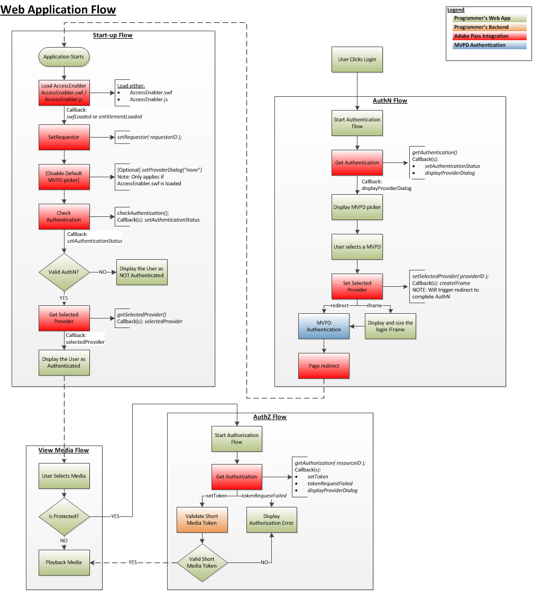

# JavaScript SDK逐步指南 {#javascript-sdk-cookbook}

>[!NOTE]
>
>此頁面的內容僅供參考。 若要使用此API，必須具備目前的Adobe授權。 不允許未經授權使用。

## 簡介(#intro)

本文檔描述了程式設計師的高級應用程式為與Adobe Primetime身份驗證服務整合的JavaScript實施的權限工作流。 JavaScript API參考資料的連結會包含在其中。

另請注意， [相關資訊](#related) 區段包含一組JavaScript程式碼範例的連結。

## 權利流(#entitlement)

1. [必要條件](#prereq)
2. [啟動流程](#startup)
3. [驗證流程](#authn)
4. [授權流程](#authz)
5. [檢視媒體流量](#logout)

</br>




## 必要條件(#prereq)

**相依性：**

- Adobe Primetime驗證庫(AccessEnabler)，請與您的Adobe Primetime驗證帳戶管理員合作安排此事。
- 有效的Adobe Primetime驗證要求者ID，請與您的Adobe Primetime驗證帳戶管理員合作安排此事。

建立回呼函式：

- `entitlementLoaded`

</br>

**觸發：** AccessEnabler已載入並完成初始化。

- `displayProviderDialog(mvpds)`

   **觸發：** `getAuthentication(),` 只有在使用者尚未選取提供者(MVPD)且尚未驗證時，mvpds參數才會是使用者可用的提供者陣列。

- `setAuthenticationStatus(status, errorcode)`

   **觸發：**
   - `checkAuthentication()`每次。
   - `getAuthentication()` 只有在使用者已驗證且已選取提供者時。

   傳回的狀態為成功或失敗；errorcode描述了失敗的類型。

- `createIFrame(width, height)`

   **觸發：** `setSelectedProvider(providerID)`，且唯若選取的提供者已設定為顯示在IFrame中。

   >[!NOTE]
   >
   >提供程式被配置為將其身份驗證螢幕呈現為重定向或iFrame，程式設計師需要考慮這兩者。

- `sendTrackingData(event, data)`

   **觸發器：** `checkAuthentication(), getAuthentication(),checkAuthorization(), getAuthorization(), setSelectedProvider()`.  此 `event` 參數指示發生了哪些權利事件；the `data` 參數是與事件相關的值清單。 
- `setToken(token, resource)`

   **觸發：** `checkAuthorization()`和 `getAuthorization()` 在成功授權以檢視資源後。   此 `token` 參數是短期媒體代號；the `resource` 參數是使用者有權檢視的內容。

- `tokenRequestFailed(resource, code, description)`

   **觸發：**`checkAuthorization()`&#x200B;和`getAuthorization()`  授權失敗後。\
   此 `resource` 參數是使用者嘗試檢視的內容；the `code` 參數是錯誤碼，指出發生的故障類型；the `description` 參數描述了與錯誤代碼相關的錯誤。

- `selectedProvider(mvpd)`

   **觸發：** [`getSelectedProvider()`](#$getSelProv `mvpd` 參數提供有關用戶選擇的提供程式的資訊。

- `setMetadataStatus(metadata, key, arguments)`

   **觸發：** `getMetadata().`\
   此 `metadata` 參數提供您請求的特定資料；key參數是 `getMetadata()`要求；和 `arguments` 參數是傳遞至的相同字典 `getMetadata()`.


## 2.啟動流程

**I.載入AccessEnabler JavaScript:**

**針對測試設定檔**

```JSON
<script type="text/javascript"         
src="https://entitlement.auth-staging.adobe.com/entitlement/v4/AccessEnabler.js">
</script>"
```

或……

**針對生產設定檔**

```JSON
<script type="text/javascript"         
src="https://entitlement.auth.adobe.com/entitlement/v4/AccessEnabler.js">
</script>"
```

**觸發器：** 初始化完成時，Adobe Primetime驗證會呼叫 `entitlementLoaded()` 回呼函式。 這是應用程式與AccessEnabler通信的入口點。 

 
**二。** 呼叫 `setRequestor()`建立程式設計師的身份；在程式設計師的 `requestorID` 和（可選）Adobe Primetime驗證端點的陣列。

**觸發器：** 無，但會啟用 `displayProviderDialog()` 需要時呼叫。


**三。** 呼叫 `checkAuthentication()` 檢查現有驗證，而不啟動完整 [驗證流程].  如果此呼叫成功，您可以直接前往 `authorization flow`.  如果沒有，請繼續 `authentication flow`.

**相依性：** 成功呼叫 `setRequestor()`（此相依性也會套用至所有後續呼叫）。

 **觸發器：** `setAuthenticationStatus()` 回撥

</br>

## 3.驗證流程</span>


**相依性：** 成功呼叫 `setRequestor()`（此相依性也會套用至所有後續呼叫）。


呼叫 `getAuthentication()` 獲取驗證狀態OR以觸發提供程式驗證流。

**觸發器：**

- `displayProviderDialog()`如果使用者尚未通過驗證
- `setAuthenticationStatus()` 如果驗證已發生

當AccessEnabler調用時，驗證流的完成 `setAuthenticationStatus()`with `isAuthenticated == 1`.

## 4.授權流程(#authz)

**相依性：**

- 成功呼叫 `setRequestor()` （此相依性也會套用至所有後續呼叫）。
- 與MVPD同意的有效資源ID。 請注意， ResourceIDs應與任何其他裝置或平台上使用的ID相同，且在各MVPD上會相同。

呼叫 `getAuthorization()` 並傳遞所請求媒體的ResourceID。 成功的呼叫會傳回短媒體代號，確認使用者已獲得檢視要求媒體的授權。

- 如果呼叫通過：用戶具有有效的AuthN令牌，並且該用戶被授權觀看請求的媒體。
- 如果呼叫失敗：檢查擲回的例外狀況，以判斷其類型（AuthN、AuthZ或其他類型）:
- 如果呼叫是AuthN錯誤，則重新啟動AuthN流程。
- 如果呼叫是AuthZ錯誤，則使用者無權觀看請求的媒體，因此應向使用者顯示某種錯誤訊息。
- 如果有其他錯誤（連線錯誤、網路錯誤等） 然後向用戶顯示相應的錯誤消息。

使用媒體代號驗證器驗證從成功 `getAuthorization()` 呼叫。

 
**相依性：** 短媒體令牌驗證器（隨AccessEnabler庫一起提供）

- 如果驗證通過：顯示/播放使用者請求的媒體。
- 如果失敗：AuthZ代號無效，應拒絕媒體要求，且應向使用者顯示錯誤訊息。

## 5.檢視媒體流量(#logout)

- 使用者會選取要檢視的媒體。
   - 介質是否受保護？\
           — 您的應用程式會檢查媒體是否受到保護：
      - 如果媒體受到保護，您的應用程式就會啟動上方的授權(AuthZ)流程。
      - 如果介質未受保護，則繼續「查看介質」流。
      - 播放媒體

## 設定訪客ID(#visitorID)

設定 [Experience CloudvisitorID](https://marketing.adobe.com/resources/help/en_US/mcvid/) 從分析的角度來看，值非常重要。 一旦設定EC visitorID值，SDK就會隨著每個網路呼叫傳送此資訊，而Adobe Primetime驗證服務會收集此資訊。 如此一來，您便能將Adobe Primetime驗證服務的分析資料與其他應用程式或網站可能提供的任何其他分析報表產生關聯。 如需如何設定EC visitorID的資訊，請參閱 [此處](https://experienceleague.adobe.com/docs/id-service/using/home.html?lang=en).

 
>[!NOTE]
>
>請注意，自JS SDK 3.1.0版開始，即提供此功能支援。 

<!--
### Related Information (#related)

* [JavaScript SDK Overview](/help/authentication/javascript-sdk-overview.md)
* [JavaScript SDK API Reference](/help/authentication/javascript-sdk-api-reference.md)
* **JavaScript SDK Code Samples**
-->