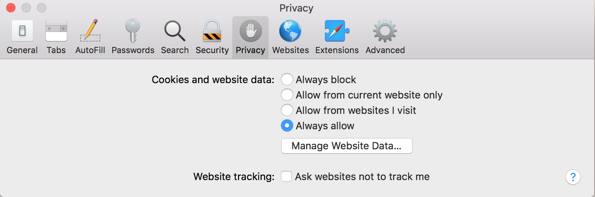
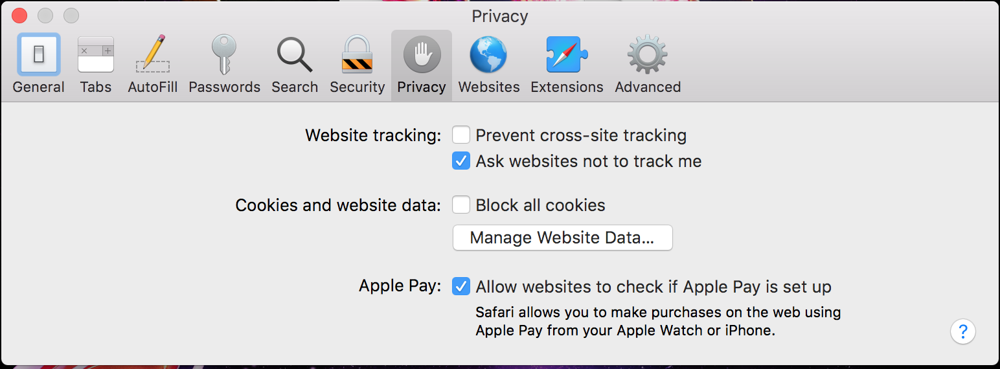
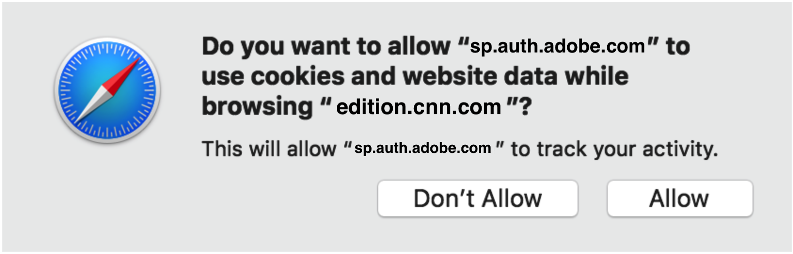

# Safari瀏覽器的JS SDK限制 {#js-sdk-limitations-for-safari-browser}

>[!NOTE]
>
>此頁面上的內容僅供參考之用。 使用此API需要來自Adobe的目前授權。 不允許未經授權的使用。

<!--
>[!IMPORTANT] 
>
>We are strongly recommending [migration to AccessEnabler JavaScript SDK versions 4.x](http://tve.helpdocsonline.com/accessenabler-js-v4-migration-guide) in order to have a stable and predictable behavior on Safari browser.-->

## Safari 10 {#safari10}

**詳細資料**

* 從Safari 10開始，預設的瀏覽器隱私權設定會導致單一登入(SSO)、單一登出(SLO)和被動驗證功能停止運作。 單一登入(SSO)和被動驗證將無法運作，即使是在多個分頁或瀏覽器視窗之間的相同工作階段中。

* 這些變更會影響並影響下列AccessEnabler JavaScript SDK版本的Adobe Primetime驗證程式： v2 （2.x版）、v3 （3.x版）、v4 （4.x版）。

### 減輕影響 {#mitigation-safari10}

* 為了減輕這些限制，您可以指示使用者變更Safari 10瀏覽器隱私權設定，並使用「**永遠允許**「 」的「 」選項&#x200B;**Cookie和網站資料**「偏好設定」中瀏覽器的「隱私權」標籤內的「 」專案，如下圖所示。

   

## Safari 11 {#safari11}

**詳細資料**

>[!IMPORTANT]
>
>Safari 10區段的所有上述詳細資料仍適用於Safari 11。

* 從Safari 11開始，瀏覽器推出 [智慧型追蹤預防](https://webkit.org/blog/7675/intelligent-tracking-prevention/)(ITP)機制，這項技術使用啟發式來防止跨網站追蹤。 這些啟發式會影響到第三方Cookie在網路呼叫上儲存和重播的方式，這表示根據ITP機制啟動，Safari瀏覽器會封鎖使用者端 — 伺服器模式通訊中的第三方Cookie。

* Adobe Primetime驗證服務使用並仰賴Cookie作為驗證程式的一部分 **才能運作**. 在驗證程式自動發生（例如Temp Pass）或使用iFrames或「無重新整理」功能的實作中，Adobe的Cookie會被視為第三方Cookie且預設為封鎖。 對於任何其他情況，Safari會使用機器學習演演算法，可能會將所有Adobe的Primetime驗證服務Cookie標幟為追蹤Cookie，因此會受到ITP的封鎖。  

* 總而言之，Safari 11瀏覽器的使用者在智慧型追蹤預防(ITP)機制啟用後，可能無法驗證已啟用Adobe Primetime驗證的網站，尤其是當使用者使用已啟用多個Adobe主要驗證的網站時。 因此，使用者的驗證體驗可能是未預期或未定義的，從無法登入到比預期短的驗證期間。

* 這些變更會影響並影響下列AccessEnabler JavaScript SDK版本的Adobe Primetime驗證程式： v2 （2.x版）、v3 （3.x版）。

### 減輕影響 {#mitigation-safari11}

* 對於AccessEnabler JavaScript SDK v3 （3.x版）和AccessEnabler JavaScript SDK v4 （4.x版），程式庫都包含能夠識別使用者驗證因缺少必要Cookie而被封鎖的狀況的機制。 在這些情況下，程式庫會觸發特定錯誤回呼 [N130](/help/authentication/error-reporting.md#advanced-error-codes-reference)，此資訊會傳回啟用Adobe Primetime驗證的網站，以用作指示使用者採取可以減輕問題的動作的訊號。 為了受益於此機制，網站必須實施 [錯誤報告](/help/authentication/error-reporting.md) 規格。

* 就AccessEnabler JavaScript SDK v2 （版本2.x）而言，程式庫不提供上述機制，因此無法在指示使用者採取行動來緩解問題時，顯示已啟用Adobe Primetime驗證的網站。

* 可緩解上述問題的動作清單 **適用於所有三個版本** AccessEnabler JavaScript SDK的。

* 時間 [N130](/help/authentication/error-reporting.md#advanced-error-codes-reference) 實作者的網站收到錯誤回呼，應指示使用者透過以下方式停用智慧追蹤預防(ITP)並啟用第三方Cookie：

* 若是Mac OS X High Sierra和更新版本：取消勾選「**防止跨網站追蹤**「 」的「 」選項&#x200B;**網站追蹤**「偏好設定」中瀏覽器的「隱私權」標籤內的「 」專案，如下圖所示。

   

* 若是Mac OS X Sierra和先前版本：檢查&quot;**永遠允許**「 」的「 」選項&#x200B;**Cookie和網站資料**「偏好設定」中瀏覽器的「隱私權」標籤內的「 」專案，如下圖所示。

   

## Safari 12 {#safari12}

**詳細資料**

>[!IMPORTANT]
>
>Safari 10區段和Safari 11區段的所有上述詳細資訊，仍適用於Safari 12。

本節詳細說明的相容性問題 **AccessEnabler JavaScript SDK 4.x版** 在Safari 12上。

>[!NOTE]
>
>請記住，如果是AccessEnabler JavaScript SDK 2.x版和AccessEnabler JavaScript SDK 3.x版，兩者都會使用第三方Cookie進行驗證程式，而且由於ITP和從Safari 11開始的第三方Cookie原則，使用者的驗證體驗可能是未預期和未定義的，從無法登入到比預期的驗證持續時間更短。

### 在Safari 12上通過AccessEnabler JavaScript SDK v4 （4.x版）功能認證 {#certified-functionality-of-accessenabler-javacscript=sdk-v4}

* **驗證** 使用使用者互動的流程將一律有效，即使使用者的瀏覽器已停用第三方Cookie，因為從4.0版開始，AccessEnabler JavaScript SDK不再將第三方Cookie用於驗證程式。

>[!NOTE]
>
>使用者必須與網站互動，才能開啟登入快顯視窗和/或與MVPD登入頁面互動。

* **授權/預檢/使用者中繼資料** 只要使用者已驗證，操作即可完全運作。

### Safari 12上的AccessEnabler JavaScript SDK v4 （4.x版）已知問題 {#known-issues-of-accessenabler-javascript-sdk-4}

* SSO和SLO

   * 由於從Safari 10開始在Safari中實施localStorage的方式，JS SDK無法再透過通用網域iFrame共用登入狀態。 這表示使用者需要登入使用AccessEnabler JavaScript SDK的每個網站。 登出也不會刪除網站間的驗證Token，因此使用者需要從每個啟用Adobe Primetime Authentication的網站登出。

* 暫時通過

   * 對於暫時傳遞，AccessEnabler JavaScript SDK會使用個人化機制，以將驗證權杖鎖定至特定裝置（瀏覽器執行個體）。 由於Safari 12中旨在防止追蹤的新機制，我們正在個人化機制中運算和使用的指紋 **對於擁有相同IP位址的所有使用者來說，都是相同的**. 我們確實會根據個人化目的考量使用者端IP，但即使如此，影響也會影響到共用相同公用IP位址的使用者。 對於這些使用者，我們會計算相同的個人化ID，而臨時通行證將繫結至此。 這表示一旦這類使用者使用臨時通行證，其他人就無法存取\！ 這尤其會影響企業使用者、教育機構，或任何其他擁有多位使用者使用NAT或通用Proxy來存取網際網路的組織。

>[!NOTE]
>
>此問題僅會在實作者因使用者互動而使用暫時通過驗證時，才會影響使用者，否則暫時通過驗證受限於以下情況 **自動流程** 下方的。

* 自動流程

   * 使用JS SDK 4.0時，在自動模式下嘗試驗證流程（沒有任何使用者互動）在Safari 12中無法成功。請注意，即將推出的JS SDK 4.1修正了自動化流程的所有問題。

受此問題影響的使用案例：

* 自動TempPass （免費預覽）驗證 — 對於這類流程，SDK會擲回N130錯誤。

* 被動驗證（無訊息失敗） — 要求使用者選取此MVPD並輸入認證

### 減輕影響 {#mitigation-safari12}

**SSO和SLO**

目前沒有已知的緩解方法可供使用，或撰寫時沒有可能使用。 Apple確實在Safari 12中推出「Storage Access API」(`https://webkit.org/blog/8124/introducing-storage-access-api`)，但目前的實作不適用於localStorage，而僅適用於Cookie。 此外，API需要使用者互動才能使用，一旦您使用，也會透過與以下對話方塊類似的許可權對話方塊提示使用者。

此時，這些Safari需求/提示不符合我們的UX需求，而且我們的行為與其他瀏覽器不一致，在前者中，只要我們在通用網域localStorage中儲存Token，SSO就「有效」。

**暫時通過**

為了緩解個人化問題並讓使用者互動，我們建議您使用 **[促銷臨時傳遞 ](/help/authentication/promotional-temp-pass.md)** 互動方式，並提供至少一項有關使用者的額外資訊（例如電子郵件地址）。

## Safari 13 {#safari13}

**詳細資料**

>[!IMPORTANT]
>
>以上從Safari 10區段到Safari 12區段的所有詳細資訊，仍適用於Safari 13。

從Safari 13開始，瀏覽器對 [智慧型追蹤預防](https://webkit.org/blog/7675/intelligent-tracking-prevention/) (ITP)，將第三方Cookie標幟為追蹤Cookie的程式中，使該機制背後的啟發式規則更為嚴格，以防止跨網站追蹤。

如先前各節所述，當實作人員使用AccessEnabler JavaScript SDK v2 （版本2.x）和AccessEnabler JavaScript SDK v3 （版本3.x）時，Adobe Primetime驗證服務會使用並依賴第三方Cookie作為驗證程式的一部分。 相較於舊版Safari瀏覽器，在ITP花了一些時間「瞭解」使用者與相關各方之間的互動(程式設計人員的網站和Adobe)後開始使用時，Safari 13瀏覽器會從一開始封鎖第三方Cookie，而這些Cookie被視為追蹤使用者端 — 伺服器模型通訊中的Cookie。

總而言之，Safari 13瀏覽器的使用者很可能無法在已啟用Adobe Primetime驗證的網站上起始新的驗證，該網站使用舊版AccessEnabler JavaScript SDK、v2 （版本2.x）或v3 （版本3.x）。 發生此狀況的原因是ITP已封鎖所有必要Adobe的Primetime驗證服務Cookie，因此導致服務無法完成驗證要求。

AccessEnabler JavaScript SDK v4 （4.x版）程式庫不會使用第三方Cookie進行驗證程式，因此其作業不會受到Safari 13變更的影響。

### 減輕影響 {#mitigation-safari13}

首先，我們強烈建議 **移轉至AccessEnabler JavaScript SDK 4.x版** 在Safari瀏覽器上擁有穩定且可預測的行為。

其次，對於AccessEnabler JavaScript SDK v3 （3.x版），資料庫包含的機制能夠識別使用者驗證因缺少必要的Cookie而被封鎖的情況。 在這些情況下，程式庫會觸發特定錯誤回呼([N130](/help/authentication/error-reporting.md#advanced-error-codes-reference))會傳回至啟用Adobe Primetime驗證的網站，以用作指示使用者採取可以減輕問題的動作的訊號。 為了受益於此機制，網站必須實施 [錯誤報告](/help/authentication/error-reporting.md) 規格。

就AccessEnabler JavaScript SDK v2 （版本2.x）而言，程式庫不提供上述機制，因此無法在指示使用者採取行動來緩解問題時，顯示已啟用Adobe Primetime驗證的網站。

時間 [N130](/help/authentication/error-reporting.md#advanced-error-codes-reference) 實作者的網站收到錯誤回呼，應指示使用者透過以下方式停用智慧追蹤預防(ITP)並啟用第三方Cookie：

* 若是Mac OS X High Sierra和更新版本：取消勾選「**防止跨網站追蹤**「 」的「 」選項&#x200B;**網站追蹤**「偏好設定」中瀏覽器的「隱私權」標籤內的「 」專案，如下圖所示。

   

* 若是Mac OS X Sierra和先前版本：檢查他」**永遠允許**「 」的「 」選項&#x200B;**Cookie和網站資料**「偏好設定」中瀏覽器的「隱私權」標籤內的「 」專案，如下圖所示。

   
