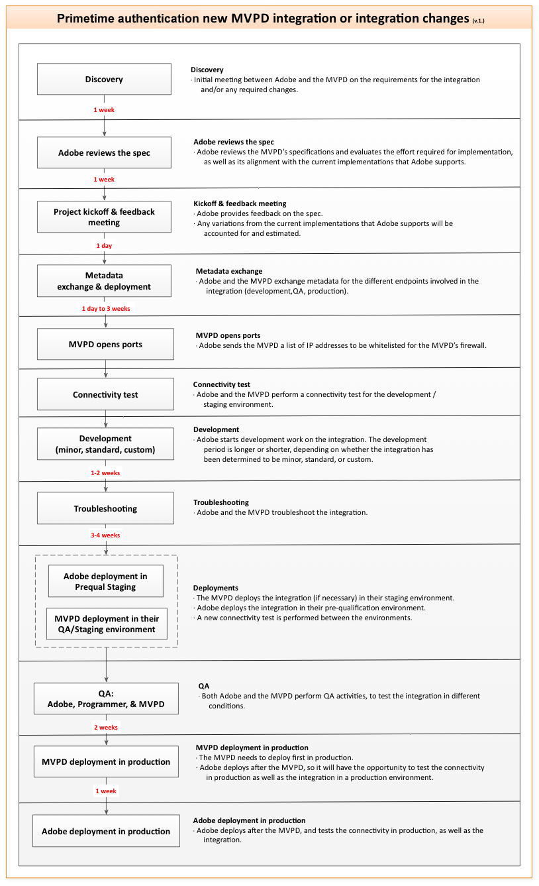

# MVPD概述 {#mvpd-overview}

>[!NOTE]
>
>此頁面上的內容僅供參考。 使用此API需要來自Adobe的當前許可證。 不允許未經授權使用。

## 導言 {#intro}

本概述適用於多通道視頻節目分發伺服器(MVPD)。 有關包括Kickstart和整合指南在內的其他文檔，請參閱本文檔末尾的「相關資訊」部分。

TV Everywhere(TVE)是現在眾所周知的產業運動它使得付費電視的訂戶能夠跨多個設備訪問他們已經付費的內容，不管是在家還是在家。  對於付費電視提供商來說， TVE創造了新的機會，既保留了現有的客戶關係，又使新的客戶關係成為可能。 然而，隨著這些機遇的出現，也帶來了挑戰。 在TVE環境中，程式設計師提供內容，但MVPD保存客戶資訊以驗證潛在查看者是否是有效訂閱者。

與一個程式設計師協調查看器身份驗證和授權可能很簡單，但與幾十個或幾百個不同程式設計師協調會變得越來越複雜。 但是，有了Adobe® Pass , MVPD只需實施單一、簡單的整合即可進入整個TVE生態系統，包括NBCUniversal Media、Turner Broadcasting(TBS、TNT、CNN)、Fox廣播網路、Hulu等程式設計師。  Adobe Primetime身份驗證提供了整合框架，使確定用戶權利變得簡單和安全。

底線：Adobe Primetime身份驗證可安全地調整程式設計師和MVPD之間的權利事務，方便查看者訪問訂閱內容。 換句話說，Adobe Primetime身份驗證使適當的客戶能夠輕鬆快速地訪問適當的內容。

通過Adobe Primetime驗證，MVPD將接收：

易於與程式設計師整合。  通過單一整合，從多個內容所有者提供即時連接。

增強客戶參與。  在客戶跨多個平台和設備查看內容時，支援流暢的品牌體驗。

安全身份驗證。  確保僅授予授權用戶和設備對高級內容的訪問權限，並（可選）限制每個家庭帳戶可以連接的設備和併發流的數量。

## 常見問題 {#faq}

Adobe Primetime身份驗證有多安全？ Adobe Primetime認證架構的首要任務是確保只有經過授權的查看者才能被認證並被授予對高級內容的訪問權限。 Adobe Primetime身份驗證將訪問視頻設備緊密綁定，並有助於限制給定家庭的流、會話和/或設備。

是否需要Flash Player? Adobe Primetime對TV Everywhere的身份驗證與播放器和平台無關，與任何播放應用程式(包括Silverlight和HTML5)整合。 此外，Adobe Primetime認證還為運行iOS和Android的手機和平板電腦等設備提供本機支援。

Adobe Primetime身份驗證支援哪些設備？ Adobe Primetime認證幾乎受任何帶有HTML5 Web工具包的設備支援，以便在瀏覽器內查看體驗。 此外，Adobe Primetime身份驗證正在繼續為各種特定於設備的平台(包括iOS、Android™、Xbox360（已棄用）和AdobeAir®（已棄用）應用程式)推出本機軟體開發套件(SDK)。 最近，Adobe Primetime身份驗證針對無法呈現瀏覽器頁面的設備（例如，「智慧」電視、機頂盒和遊戲機）推出了無客戶端解決方案。  使用MVPD驗證用戶時，必須具備呈現瀏覽器頁面的能力。

Adobe Primetime認證是否支援新興的TV Everywhere標準？ Adobe Primetime認證符合CableLabs OLCA（線上內容訪問）規範，該規範為從線上來源向付費電視客戶交付視頻提供了技術要求和體系結構。 Adobe於2011年6月參與了CableLabs的聯合互動測試項目，並通過了服務提供商實施的測試流程。 Adobe Primetime驗證是根據OLCA規範進行驗證的（完整和測試）。 授權元件已完成，但測試驗證當前正在等待CableLabs測試環境的發佈。 Adobe還是OATC（開放認證技術聯盟）的積極成員，並作為該機構的一部分參與了幾個小組委員會的規範起草項目。

什麼是身份驗證？ 驗證是MVPD確認給定用戶是已知客戶的過程。

什麼是授權？ 授權是MVPD確認已驗證用戶對給定資源具有有效預訂的過程。

## 建築 {#architecture}

Adobe Primetime身份驗證是一種托管服務，它允許基於MVPD和程式設計師所需的業務規則進行快速後端（伺服器到伺服器）整合。 這意味著需要快速向所有方面營銷，提供更安全的環境來防止欺詐，並提供卓越的客戶體驗，讓更多的電視內容能夠跨更多平台提供給更多人。

Adobe Primetime身份驗證通過「軟體即服務」(SaaS)模式提供，並使最終用戶、MVPD和程式設計師之間能夠進行更安全的通信，以驗證內容權限。 服務的核心元件包括：

伺服器端 — 托管的Adobe Primetime身份驗證伺服器。 這是一個應用伺服器，它與MVPD的驗證系統進行後通道（伺服器到伺服器）通信。
客戶端：客戶端Access Enabler - Access Enabler是一個小檔案，載入到程式設計師的網頁或播放器應用程式中。 它為程式設計師的內容查看應用程式提供權限API，並與Adobe Primetime認證伺服器通信。
無客戶端Web服務（用於非Web功能設備） — REST風格的Web服務，為智慧電視、遊戲控制台和機頂盒等設備提供權利API。

>[!NOTE]
>
>作為MVPD，您的Web服務必須能夠識別來自Adobe Primetime身份驗證的身份驗證和授權請求，並以預期格式響應所需資料。

Adobe Primetime身份驗證允許您為客戶提供聯合身份管理，也稱為單一登錄(SSO)身份驗證和授權。 使用Adobe Primetime身份驗證，用戶無需在第一次身份驗證後再次登錄，只要MVPD允許該身份驗證持續。 （通常為30天。） 為此，Adobe Primetime認證為我們的客戶提供了一個通用的認證令牌域。 此驗證狀態資訊可供與給定MVPD整合的所有參與站點使用。

目前，Adobe Primetime與MVPD的大多數身份驗證整合都使用SAML協定，SAML協定是主要的身份驗證標準之一。 Adobe Primetime驗證在SAML體系結構中充當代理服務提供程式，並將SAML驗證響應作為安全令牌在Adobe公共域中保留。 Adobe Primetime驗證符合SAML 2.0。 但是，雖然Adobe Primetime身份驗證通常在此時與SAML SSO解決方案一起使用，但Adobe Primetime身份驗證體系結構不綁定到任何特定協定。 因此，可以隨著時間的推移增加對新協定的支援，例如基於OAuth 2.0或自定義協定的協定。

Adobe與MVPD的技術團隊合作，配置Adobe Primetime身份驗證以滿足任何現有整合的需要。 MVPD的整合是免費的，假定是「標準」整合和最低支援要求（文檔和基本電子郵件支援）。 如果MVPD需要大量支援或升級時間表，則可能會收取支援費用，或者提供商可能希望與熟悉我們解決方案的第三方合作。

Adobe Primetime身份驗證還支援MVPD業務邏輯的高效處理，如下所示：

對於自包含且當接收到授權請求時可由MVPD應用的業務邏輯，當MVPD接收授權請求時，Adobe提供支援業務邏輯強制所需的必要資料。 此資料可以包括但不限於發出請求的用戶的唯一設備ID和設備的IP地址。

對於需要用戶干預和/或由Adobe解決方案進行特定處理的業務邏輯，Adobe可以為每個MVPD維護一些自定義屬性。 這些特定於MVPD的配置/策略包括啟用預定義的工作流，這些工作流可以在頂級工作流的特定點啟動。 有關自定義屬性支援的詳細資訊，請與Adobe代表聯繫。

下圖說明了MVPD和程式設計師與這些Adobe Primetime驗證元件的關係：

*圖：高級體系結構和流*

## Adobe Primetime驗證元件 {#components}

以下概述了Adobe Primetime驗證生態系統的一些主要元件。 這些包括：

* [Access Enabler / Clientless Web服務](#ae)
* [承載Adobe的後端伺服器](#backend)
* [令牌](#tokens)

### Access Enabler/無客戶端Web服務 {#ae}

Access Enabler方便了與用戶的所有身份驗證和授權交互，並在用戶的系統上本地運行。 使用MVPD處理實際權利工作流的是Access Enabler ，而程式設計師負責更高級別的網頁或播放器應用程式。

無客戶端Web服務由Adobe Primetime驗證為無法呈現網頁的設備提供。  對於這些設備，權利進程在智慧設備上啟動和查看內容，而使用MVPD的身份驗證在可使用Web的設備（PC、智慧手機和平板電腦）上進行。

Access Enabler :

* 啟動特定於MVPD的身份驗證和授權工作流。
* 快取每個程式設計師資源/通道的成功授權響應，以最小化不必要的請求流量。
* 可以為特定於每個MVPD的預定義工作流配置，如顯式設備註冊。
* 它可以在以下表單中使用：
   * SWF運行時可以執行的Flash Player檔案
   * 瀏覽器直接執行的JS檔案
   * 適用於各種平台(包括iOS、Android和Xbox)的本機Access Enabler。

### Adobe承載的後端伺服器 {#backend}

由Adobe承載的Adobe Primetime身份驗證後端伺服器：

* 使用MVPD設定身份驗證和授權工作流，這些MVPD要求Adobe Primetime身份驗證和操作員之間進行伺服器到伺服器通信。
* 維護程式設計師站點和應用程式的配置。
* 承載可下載的Access Enabler元件檔案。
* 生成驗證和授權令牌。

### 令牌 {#tokens}

Adobe Primetime認證授權解決方案的核心是在成功完成認證/授權工作流後獲得的特定資料片段的生成。 這些資料被稱為令牌。 它們的壽命有限，並且安全地儲存在與平台相關的位置。 到期後，必須通過重新啟動驗證和/或授權工作流來重新發佈令牌。

在驗證/授權工作流期間發出的令牌有三種類型。 二是&quot;長壽&quot;，提供用戶觀看體驗的連續性。 第三種是短命的令牌，它為通過流翻錄減輕欺詐的行業最佳做法提供了支援。 令牌的生存時間(「TTL」)值是基於MVPD與程式設計師之間的協定設定的。 您決定一個TTL值，它最適合您的企業和客戶。

**長壽命的身份驗證令牌**。 一旦客戶使用Adobe Primetime身份驗證成功登錄其MVPD帳戶，驗證就會成功。 Adobe Primetime認證然後產生與請求設備關聯的長壽命認證(「authN」)令牌，並（取決於MVPD）匿名標識用戶的全局唯一標識符(「GUID」)。

**長期使用的授權令牌**。 成功授權後，Adobe Primetime身份驗證將建立長期授權(「authZ」)令牌。 此令牌不可移植，因為它與請求設備和特定受保護資源（例如通道、系列或插集）相關聯。 Access Enabler使用長壽命authZ令牌建立短壽命媒體令牌，這些令牌用於實際查看訪問。

**短暫的媒體令牌**。 一旦用戶被授權，Adobe Primetime認證將生成authZ令牌，並使用該令牌生成由Adobe簽名並加密的一次性、短時間的媒體令牌，以避免在交換期間篡改。 由於短命令通過Access Enabler API或無客戶端Web服務暴露到嵌入站點，因此在提供對受保護資源的訪問之前，程式設計師的媒體伺服器必須使用Adobe Primetime驗證元件媒體令牌驗證器來驗證令牌。

## MVPD整合生命週期 {#lifecycle}

下圖顯示了Adobe Primetime身份驗證與MVPD之間整合的生命週期。

*圖：MVPD整合生命週期*

## 權利流程圖 {#chart}

以下流程圖介紹了使用Adobe Primetime身份驗證確認權利的整個過程：

*圖：使用Adobe Primetime認證確認權利的過程*

## 驗證步驟 {#authn-steps}

以下步驟提供了Adobe Primetime身份驗證流的示例。  這是權利流程的一部分，程式設計師在該流程中確定用戶是否是MVPD的有效客戶。  在此方案中，用戶是MVPD的有效訂閱者。  用戶正試圖使用程式設計師的Flash應用程式查看受保護的內容：

1. 用戶瀏覽到程式設計師的網頁，該網頁將程式設計師的Flash應用程式和Adobe Primetime驗證訪問啟用程式元件載入到用戶的電腦上。 Flash應用程式使用Access Enabler將程式設計師的標識與Adobe Primetime身份驗證一起設定，而Adobe Primetime身份驗證將Access Enabler與該程式設計師（「請求者」）的配置和狀態資料一起設定為質。 Access Enabler必須先從伺服器接收此資料，然後才能執行任何其他API調用。  技術說明：程式設計師使用Access Enabler設定其標識 `setRequestor()` 方法；有關詳細資訊，請參閱 [程式設計師整合指南](/help/authentication/programmer-integration-guide-overview.md)。
1. 當用戶嘗試查看程式設計師的受保護內容時，程式設計師的應用程式向用戶提供MVPD清單，用戶從該清單中選擇提供商。
1. 用戶被重定向到Adobe Primetime認證伺服器，在該伺服器中為用戶選擇的MVPD建立加密的SAML請求。 此請求以代表程式設計師的身份驗證請求發送到MVPD。 根據MVPD的系統，用戶的瀏覽器隨後會被重定向到MVPD的站點以登錄，或者在程式設計師的應用中建立登錄iFrame。
1. 在兩種情況下（重定向或iFrame）,MVPD都會接受請求並顯示其登錄頁。
1. 用戶使用MVPD登錄，MVPD將驗證用戶作為付費客戶的狀態，然後MVPD將建立自己的HTTP會話。
1. 驗證用戶後，MVPD將建立響應（SAML和加密）,MVPD將響應發回Adobe Primetime驗證。
1. Adobe Primetime驗證接收MVPD響應，發現有一個Adobe Primetime驗證HTTP會話已開啟，驗證 [SAML](https://en.wikipedia.org/wiki/Security_Assertion_Markup_Language) MVPD的響應，並重定向回程式設計師站點。
1. 重新載入程式設計師站點，重新載入Access Enabler，程式設計師再次調用setRequestor()。  對setRequestor()的第二次調用是必需的，因為當前配置已更改 — 現在存在一個標誌，它通知Access Enabler伺服器上正在等待生成AuthN令牌。
1. Access Enabler發現存在掛起的身份驗證，並從Adobe Primetime身份驗證伺服器請求令牌。 通過調用Flash Player的DRM功能從伺服器檢索令牌。
1. AuthN令牌儲存在程式設計師Flash PlayerLSO快取中；驗證現在已完成，會話在Adobe Primetime驗證伺服器上被銷毀。

## 授權步驟 {#authz-steps}

從上一節繼續執行以下步驟([驗證步驟](#authn-steps)):

1. 當用戶嘗試訪問程式設計師的受保護內容時，程式設計師的應用程式首先檢查用戶的本地電腦或設備上的AuthN令牌。  如果那個令牌不在，那麼 [驗證步驟](#authn-steps) 上。  如果AuthN令牌存在，則授權流將繼續由程式設計師的應用程式啟動對Access Enabler的調用，請求獲取用戶對特定受保護內容項的查看權限。
1. 受保護內容的特定項由「資源標識符」表示。  這可以是簡單的字串或更複雜的結構，但無論如何，資源標識符的性質是預先在程式設計師和MVPD之間商定的。  程式設計師的應用程式將資源標識符傳遞給Access Enabler。  Access Enabler會檢查用戶的本地電腦或設備上的AuthZ令牌。  如果AuthZ令牌不在，Access Enabler會將請求傳遞給後端Adobe Primetime身份驗證伺服器。
1. Adobe Primetime認證伺服器使用標準化協定與MVPD授權端點通信。  如果MVPD的響應指示用戶有權查看受保護的內容，則Adobe Primetime身份驗證伺服器會建立一個AuthZ令牌並將其傳回Access Enabler,Access Enabler將AuthZ令牌儲存在用戶的電腦上。
1. 使用儲存在用戶機器或設備上的AuthZ令牌，程式設計師的應用程式調用Access Enabler從Adobe Primetime認證伺服器獲取媒體令牌，並將該令牌提供給程式設計師應用程式。
1. 最後，程式設計師的應用程式使用媒體令牌驗證器元件來確認正確的用戶正在查看正確的內容，並且在媒體令牌就位後，允許用戶查看受保護的內容。

<!--
>![RELATEDINFORMATION]
>
>*   Kickstart Guides, [MVPD kickstart](/help/authentication/mvpd-kickstart-guide.md) and [programmer kickstart](/help/authentication/programmer-kickstart-guide.md). These guides explain the initial steps to take to begin integrating with Adobe Primetime authentication.
>
>*   [MVPD Integration Guide](/help/authentication/mvpd-kickstart-guide.md). This is a lower level technical guide for MVPDs, directed primarily to the software engineers who code and test the applications and systems involved in the integration.
>
>*   [Overview For Programmers](/help/authentication/programmer-overview.md). The same high level of conceptual information as in this MVPD overview, but directed toward the content providers (Programmers).
-->
