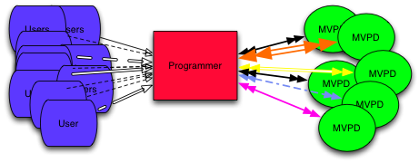
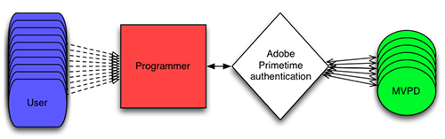
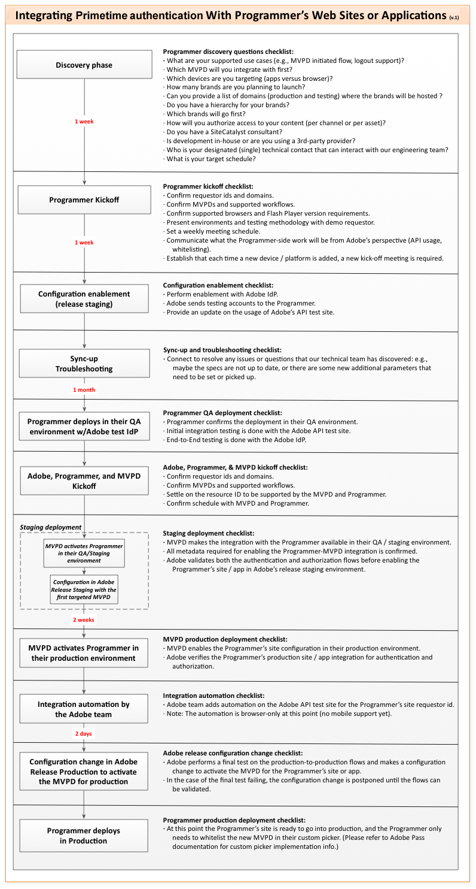

# 程式設計人員概覽 {#programmers-overview}

>[!NOTE]
>
>此頁面的內容僅供參考。 若要使用此API，必須具備目前的Adobe授權。 不允許未經授權使用。

## 簡介 {#introduction}

此概述適用於計畫將Adobe® Pass整合到其網站或應用程式的內容提供商（程式設計師）。 如需Kickstart和整合指南等其他檔案，請參閱下方的相關資訊。

如今，您的觀眾可以隨時隨地上網，並直接從您（程式設計師）請求訪問受保護的內容。 他們可能想觀看一次性的活動，或者他們可能在尋求你正在播放的整個電視劇的觀看權。

但在您允許訪問受保護的內容之前，您必須確定客戶是否有權查看該內容。 他們是否有多頻道視訊程式設計經銷商(MVPD)的訂閱？ 如果是，該訂閱是否包含您的程式設計？

對程式設計師來說，確定查看者的權利並不總是簡單的。 MVPD擁有客戶的識別資料和存取權限。  加入以下事實：嘗試存取您受保護內容的檢視器會訂閱各種MVPD，每種MVPD都有不同的系統，而且很容易看出，決定檢視器有權使用受保護內容的情形，可能會迅速變得複雜而技術上充滿挑戰：

*圖：由程式設計師直接決定的用戶權限*

Adobe Primetime TV Everywhere驗證可安全地協調程式設計師和MVPD之間的這些權利交易。 Adobe Primetime驗證可讓程式設計人員輕鬆、快速、安全地為有效的客戶提供受保護的內容：

*圖：由Adobe Primetime驗證介導的使用者權益*

Adobe Primetime驗證在與參與的MVPD交換時會充當您的代理，因此您可以透過一致的跨網站介面呈現檢視器。 Adobe Primetime驗證也可讓您為檢視器提供單一登入(SSO)驗證和授權。 所有參與服務的驗證和授權都會受到追蹤，因此訂閱者在其自己的系統上進行首次驗證後，不必再次登入。

* **驗證**  — 透過MVPD確認指定使用者為已知客戶的程式。
* **授權**  — 向MVPD確認已驗證的使用者擁有指定資源的有效訂閱的程式。

### Adobe Primetime驗證如何運作 {#HowItWorks}

程式設計師的內容查看應用程式使用Access Enabler客戶端元件或無客戶端API的RESTful Web服務（用於非Web功能的設備，如智慧電視、遊戲主機、機頂盒等）與Adobe Primetime身份驗證交互。 Access Enabler在用戶的系統上運行，便於所有權限工作流。  當客戶訪問您的站點並請求受保護的內容時，Adobe從其托管站點下載Access Enabler元件。  Adobe Primetime驗證伺服器托管無客戶端解決方案中使用的RESTful Web服務。

Adobe Primetime驗證會處理實際的權限工作流程，同時提供您用來：

* 設定您的身分。 (程式設計師是Adobe Primetime驗證權限流程中的「請求者」。)
* 使用特定MVPD驗證使用者。  (MVPD是Adobe Primetime驗證權限流程中的「身分提供者」或「IdP」。)
* 使用MVPD授權使用者使用特定資源。
* 登出使用者。

程式設計師負責執行其高級網頁或播放器應用程式，這些應用程式執行以下操作：

* 實作使用者介面
* 與Access Enabler或無客戶端API Web服務交互

Adobe Primetime驗證的目標是為程式設計人員和MVPD建立簡單、模組化的方式，以處理權限驗證。

## 了解Token {#understanding-tokens}

Adobe Primetime驗證權限解決方案以產生在驗證和授權工作流程成功完成時建立的特定資料片段為中心。 這些資料片段稱為代號。 代號的有效期有限；當權杖過期時，需透過重新啟動驗證和授權工作流程來重新核發權杖。

如需Token的詳細資訊，請參閱下列章節：

* [代號類型](#token-types)
* [代號儲存](#token-storage)
* [代號安全性](#token-security)
* [代號共用](#token-sharing)

### 代號類型 {#token-types}

在驗證和授權工作流程期間會發出三種代號。 AuthN和AuthZ代號是「長期」的，可持續提供使用者的檢視體驗。 媒體代號是短期代號，可支援業界最佳實務，以防止透過串流轉錄進行詐騙。 程式設計人員會根據與MVPD所達成的協定，指定每種類型代號的存留時間(TTL)值。 程式設計人員決定最適合您的企業和客戶的TTL值。

* **AuthN代號** （「長壽」）:成功驗證後，Adobe Primetime驗證會建立與要求裝置和全域唯一識別碼(GUID)相關聯的AuthN權杖。
   * Adobe Primetime驗證會將AuthN權杖傳送至Access Enabler,Access Enabler會在用戶端系統上安全快取該權杖。  雖然AuthN代號存在且未過期，但所有使用Adobe Primetime驗證的應用程式皆可使用。 Access Enabler使用AuthN令牌進行授權流。
   * 在任何指定時間，都只會快取一個AuthN代號。 每當有新的AuthN代號發出且舊代號已存在，Adobe Primetime驗證就會覆寫快取代號。
* **AuthZ代號** （「長壽」）:成功授權後，Adobe Primetime驗證會建立與請求裝置和特定受保護資源相關聯的AuthZ權杖。  受保護的資源由唯一的資源ID標識。
   * Adobe Primetime驗證會將AuthZ權杖傳送至Access Enabler,Access Enabler會在本機系統上安全快取AuthZ權杖。 然後，Access Enabler將使用AuthZ令牌建立用於實際查看訪問的短期媒體令牌。
   * 在任何指定時間，每個資源都只會快取一個AuthZ代號。 Adobe Primetime驗證可以快取多個AuthZ權杖，只要這些權杖與不同資源相關聯即可。 每當有新AuthZ代號發出，且相同資源已有舊代號存在時，Adobe Primetime驗證會覆寫快取代號。
* **媒體代號** （「短期」）:Access Enabler使用AuthZ令牌生成短期(預設值：7分鐘)媒體代號。 這是系統認為已發生成功播放要求的時間點。
   * 在提供對受保護資源的訪問權之前，您的媒體伺服器必須使用Adobe Primetime驗證元件（媒體令牌驗證器）來驗證媒體令牌。
   * 由於媒體代號未系結至裝置，其使用期間會顯著縮短(預設值：7分鐘)，而非長期使用的AuthN和AuthZ代號。
   * 短期媒體代號限制為一次性使用，且不會進行快取。 每次呼叫授權API時，都會從Adobe Primetime驗證伺服器擷取它。

### 代號儲存 {#token-storage}

Access Enabler將長期令牌（AuthN和AuthZ）儲存在其環境的特定位置：

* **Flash10.1** （或更高）:長期的Token會儲存為本機共用物件。
* **HTML5**:長期使用的代號會安全地保留在HTML5瀏覽器的本機存放區。
* **iOS**:長期的Token儲存在永續性貼上板上，供其他Adobe Primetime驗證用戶端應用程式存取。
* **Android**:長期的Token儲存在共用資料庫檔案中，供其他Adobe Primetime驗證用戶端應用程式存取。
* **無用戶端API裝置**:代號儲存在Primetime驗證伺服器上。

### 代號安全性 {#token-security}

Adobe Primetime驗證伺服器會使用裝置ID（衍生自裝置的硬體特性），以數位方式簽署所有長期使用的代號。 數字簽名的生成、保護和驗證方式因環境而異：

* **Flash10.1** （或更高版本） — 裝置ID需仰賴裝置憑證，這是從Adobe個人化伺服器核發的不重複憑證。 此安全性等同於FAXS DRM技術。 此伺服器端驗證會比較Token中的唯一裝置ID與裝置憑證(從Flash Player安全傳送至Adobe Primetime驗證)。 設備憑據還標識FAXS客戶端版本和其頒發的Flash Player(或AIR)版本。 裝置系結比HTML5強，因此Flash代號的存留時間(TTL)通常會更長。
* **HTML5**  — 設備在客戶端上個性化。 它使用JavaScript可用的特性來產生偽裝置ID，包含瀏覽器和作業系統版本、IP位址和瀏覽器Cookie GUID（全域唯一識別碼）。 此令牌設備ID與設備的當前偽設備ID進行比較。 因為IP位址在正常使用期間可能會變更，即使在相同的工作階段中，Adobe Primetime驗證也會將HTML5個代號儲存在兩個位置：localStorage和sessionStorage。 如果IP變更，而sessionStorage Token仍有效，則會維護工作階段。 若使用HTML5，裝置系結不會那麼強，因此代號的TTL通常比Flash的TTL短。
* **本機用戶端** (iOS和Android) — 長期使用的Token會保留原生裝置ID個人化資訊，因此會系結至請求的裝置。 驗證和授權請求通過HTTPS發送，並且設備ID資訊在發送到後端伺服器之前由Access Enabler庫進行數字簽名。 在伺服器端，會根據其相關聯的數位簽名來驗證裝置ID資訊。
* **無客戶端API客戶端**  — 無用戶端API解決方案具有其一組安全通訊協定，涉及以數位方式簽署所有API呼叫。 權限流程期間產生的代號會安全地儲存在Adobe Primetime驗證伺服器上。

Adobe Primetime驗證會驗證每個長效權杖，以確保存取內容的裝置與發出權杖的裝置相同。 對於所有Token，用戶端驗證可確保數位簽章完整無缺，並保留Token的完整性。 當裝置ID驗證失敗時，驗證工作階段會失效，且系統會提示使用者重新登入，而重設代號。

### 代號共用 {#token-sharing}

不同平台上的應用程式不會共用Token。 原因有很多，包括：

* 如 [代號儲存](#token-storage)，則儲存代號的方法會因平台而異(例如，Flash的本機共用物件、JavaScript適用的WebStorage)。
* 不同平台間的代號安全性程度不同。 例如，Flash代號會使用FAXS強制系結至裝置。 純JavaScript環境中的代號，其DRM支援的層級與Flash中不同。  與Flash應用程式共用JS代號，會增加使用更安全環境時代號可能性。

## 程式設計師整合生命週期 {#prog-integ-lifecycle}

*圖：將身份驗證與程式設計師的網站和應用程式整合*

## 邏輯流 {#logical-flows}

### 權利流程圖 {#chart}

以下流程圖介紹確認權利(使用Adobe Primetime authentication Access Enabler客戶端元件)的整個流程：

*圖：確認權利的過程*

### 驗證步驟 {#authn-steps}

下列步驟提供Adobe Primetime驗證流程的範例。  這是權限流程的一部分，程式設計師在該流程中確定用戶是否是MVPD的有效客戶。  在此案例中，使用者是MVPD的有效訂閱者。  用戶正嘗試使用程式設計師的Flash應用程式查看受保護的內容：

1. 用戶瀏覽到程式設計師的網頁，該網頁將程式設計師的Flash應用程式和Adobe Primetime身份驗證Access Enabler元件載入到用戶的電腦上。 Flash應用程式使用Access Enabler將程式設計師的標識設定為Adobe Primetime身份驗證，而Adobe Primetime身份驗證將Access Enabler的配置和狀態資料作為該程式設計師（「請求者」）的優先順序。 Access Enabler必須先從伺服器接收此資料，然後才能執行任何其他API調用。 技術說明：程式設計師使用Access Enabler設定其身份 `setRequestor()` 方法；如需詳細資訊，請參閱 [程式設計師整合指南](/help/authentication/programmer-integration-guide-overview.md).
1. 當用戶嘗試查看程式設計師的受保護內容時，程式設計師的應用程式向用戶提供MVPD清單，用戶從中選擇提供者。
1. 系統會將使用者重新導向至Adobe Primetime驗證伺服器，其中會加密 [SAML](https://en.wikipedia.org/wiki/Security_Assertion_Markup_Language) 系統會建立使用者選取的MVPD要求。 此請求以代表程式設計師的身份驗證請求的形式發送到MVPD。 根據MVPD的系統，然後將用戶的瀏覽器重定向到MVPD的站點以登錄，或在程式設計師的應用中建立登錄iFrame。
1. 在任何情況下（重新導向或iFrame）,MVPD都會接受請求並顯示其登入頁面。
1. 使用者透過MVPD登入，MVPD會驗證使用者付費客戶的狀態，然後MVPD會建立自己的HTTP工作階段。
1. 驗證使用者後，MVPD會建立回應（SAML和加密）,MVPD會將回應傳回Adobe Primetime驗證。
1. Adobe Primetime驗證會接收MVPD回應、看到有Adobe Primetime驗證HTTP工作階段已開啟、驗證來自MVPD的SAML回應，並重新導向回程式設計人員網站。
1. 重新載入程式設計師的站點，重新載入Access Enabler，並再次調用setRequestor()。  由於當前配置已更改，對setRequestor()的第二個調用是必需的 — 現在存在一個標誌，它通知Access Enabler伺服器上正在等待生成AuthN令牌。
1. Access Enabler發現有掛起的身份驗證，並從Adobe Primetime身份驗證伺服器請求令牌。 通過調用Flash Player的DRM功能從伺服器中檢索令牌。
1. AuthN令牌儲存在程式設計師的Flash PlayerLSO快取中；驗證現已完成，且工作階段會在Adobe Primetime驗證伺服器上銷毀。

### 授權步驟 {#authz-steps}

下列步驟會繼續從 [驗證步驟](#authn-steps):

1. 當用戶嘗試訪問程式設計師保護的內容時，程式設計師的應用程式首先檢查用戶的本地電腦或設備上是否有AuthN令牌。  如果代號不在，則 [驗證步驟](#authn-steps) 以上項目。  如果AuthN令牌存在，則授權流程將隨程式設計師的應用程式啟動對Access Enabler的調用，請求獲取用戶對受保護內容的特定項目的查看權限。
1. 受保護內容的特定項由「資源標識符」表示。  這可以是簡單的字串或更複雜的結構，但無論如何，資源標識符的性質是事先在程式設計師和MVPD之間商定的。  程式設計師的應用程式將資源標識符傳遞給Access Enabler。  Access Enabler會檢查用戶的本地電腦或設備上是否有AuthZ令牌。  如果AuthZ代號不存在，Access Enabler會將請求傳遞至後端Adobe Primetime驗證伺服器。
1. Adobe Primetime驗證伺服器使用標準化通訊協定與MVPD授權端點通訊。  如果MVPD的回應指出使用者有權檢視受保護的內容，Adobe Primetime驗證伺服器會建立AuthZ權杖，並傳回給存取啟用碼，該啟用碼會將AuthZ權杖儲存在使用者的電腦上。
1. 在用戶的機器或設備上儲存AuthZ令牌後，程式設計師的應用程式調用Access Enabler從Adobe Primetime驗證伺服器獲取媒體令牌，並將該令牌提供給程式設計師的應用程式。
1. 最後，程式設計師的應用程式使用媒體令牌驗證器元件來確認正確的用戶正在查看正確的內容，並且在設定了媒體令牌後，允許用戶查看受保護的內容。

## 註冊和初始化 {#reg-and-init}

使用Adobe Primetime驗證的第一步，是向Adobe或Adobe Primetime驗證授權合作夥伴註冊。

註冊時，您會提供您要與Adobe Primetime驗證通訊的網域清單。 例如，Turner廣播系統網域包含tbs.com和tnt.tv作為Adobe Primetime驗證註冊的網域。 每個內容網站都可存取Adobe Primetime驗證，並獲指派其專屬的請求者ID（例如「TBS」和「TNT」）。 如果您決定新增其他網站，您必須通知Adobe其他網域名稱，才能將它們放在允許的網域清單上，並獲得其他請求者ID。

>[!WARNING]
>
>在測試整合時，請確定測試伺服器位於您要用於生產的註冊網域上。 來自未列入白名單網域的請求（甚至測試請求）會遭忽略。 例如，如果您要求將domain.com用於生產環境，請務必將測試整合部署在domain.com、test.domain.com和staging.domain.com下。
>
>即使將網域列入白名單，URL中包含使用者名稱和/或密碼的請求也會遭到忽略。 範例： `//username@registered-domain/`

請求者ID在與Adobe Primetime驗證的Access Enabler客戶端元件的所有通信中唯一標識程式設計師的客戶端。 與程式設計師關聯的所有Adobe Primetime驗證靜態資料都被輸入到此ID中。

>[!TIP]
>
>除了請求者ID外，註冊時還會收到Access Enabler客戶端元件和媒體令牌驗證器的功能URL。

## 整合步驟 {#integration-steps}

>[!TIP]
>
>如果您將Adobe的Open Source Media Framework(「OSMF」)用於媒體播放器開發，則使用Adobe Primetime驗證的最快方式是整合OSMF外掛程式 *（已過時）* 加入你的玩家代碼。
>
><!--For details, see [Adobe Primetime authentication Plugin For OSMF](https://tve.helpdocsonline.com/9-2-2) in the Programmer Integration Guide.-->

1. [申請人設定](#requestor)
1. [處理驗證和授權](#authn-authz)
1. [支援單次註銷](#ssl)

### 1.申請人設定 {#requestor}

#### 1a。 註冊Adobe

第一步是向Adobe或Adobe Primetime驗證授權合作夥伴註冊。  註冊時，系統會向您頒發一個或多個全局唯一標識符(GUID)。 您發出的每個GUID都與允許存取Adobe Primetime驗證的網域相關聯。 您為請求域傳遞GUID（稱為請求者ID），以註冊與Access Enabler交互的每個會話的身份。 如需詳細資訊，請參閱 [註冊和初始化](#reg-and-init) （在程式設計師整合指南中）。

#### 1b. 初始Access Enabler整合

下一步是將Access Enabler整合到您現有的媒體播放器應用程式或網頁中：

* 您可以內嵌Flash版本， `AccessEnabler.swf`，或直接將其嵌入網頁的HTML中。 您可以以ActionScript或JavaScript與Access EnablerSWF通信。 基礎API為ActionScript，但若您偏好使用JavaScript，則可在您的頁面上包含完整的包裝函式程式庫。
* 對於非Flash環境，您可以：
   * 使用HTML5/JavaScript版本AccessEnabler.js，並透過JavaScript API與其通訊
   * 使用適用於Adobe Primetime驗證的AIR原生擴充功能，將原生程式碼與內建的ActionScript類別結合
   * 使用Access Enabler庫(iOS或Android)的一個本機客戶端版本

### 2.處理驗證和授權 {#authn-authz}

#### 2a。 與Access Enabler通信

Access Enabler與您的網頁或播放器應用程式之間的通訊為非同步。 您的應用程式調用Access Enabler方法，Access Enabler通過您在Access Enabler庫中註冊的回叫進行響應。

* 當您的應用程式發出授權請求時，如果本地系統上尚未存在有效的AuthN令牌，則Access Enabler會自動啟動身份驗證請求。 驗證成功時，使用者的AuthN代號會儲存在本機，因此不需要再次登入。 如果他們已在任何其他上下文（例如，通過MVPD網站或使用其他程式設計師）中通過Adobe Primetime驗證成功進行驗證，則Access Enabler可以訪問本地AuthN令牌，並且不需要附加驗證。
* 當用戶嘗試訪問您的受保護內容時，您向Access Enabler發送授權請求。 在驗證（或啟動）驗證後，Access Enabler(通過Adobe Primetime驗證伺服器)與MVPD聯繫，以確定客戶是否有權查看受保護的內容。 您的應用程式只需將請求發送到Access Enabler，然後處理響應（授權成功或失敗）。 如果授權成功，則會在用戶端系統上儲存AuthZ代號。  最後，您的應用程式會收到短期的媒體代號，以用於您自己的授權程式。

>[!NOTE]
>
>* 驗證作為SAML交換，在作為服務提供者(SP)的Adobe Primetime驗證和作為身分提供者(IdP)的MVPD之間發生。
>
>* 授權使用Adobe Primetime驗證(SP)和MVPD(IdP)之間的後通道（伺服器對伺服器）Web服務交換。

#### 2b。 提供權利用戶介面 {#entitlement-ui}

您提供您專屬的UI，供使用者存取您的內容。 MVPD會提供一些元素，例如實際登入程式，而有些元素可選擇在Adobe Primetime驗證中提供。 您至少會執行下列動作：

* **實作MVPD選取介面，讓新使用者可識別其MVPD並首次登入**. 在開發方面，Access Enabler提供了一個基本的用戶介面，該介面可讓客戶選擇MVPD並啟動登錄過程。 針對生產環境，您必須實作自己的MVPD選取器對話方塊。 有些MVPD會重新導向至自己的網站以供登入，有些則會要求其登入頁面顯示在iFrame中。 您必須實作會建立此iFrame的回呼，以處理使用者的MVPD在iFrame中顯示其登入頁面的情況。
* **識別受保護的內容**. 受保護的內容需要授權才能訪問。 您的介面應指出哪些內容受到保護，哪些內容已獲得授權。  授權狀態通常以「解除鎖定」和「鎖定」圖示表示。
* **顯示已驗證用戶**. 您應將使用者的驗證狀態指定為用來識別受保護內容的任何方法的一部分。 您可以查詢Access Enabler以確定客戶是否已通過驗證。

#### 2c。 整合媒體代號驗證器 {#int-media-token-ver}

您必須將Adobe Primetime驗證媒體權杖驗證器元件整合到媒體伺服器中。  如此一來，您現有的權杖驗證程式就能透過成功的授權，識別Adobe Primetime驗證所提供的短期媒體權杖。 媒體代號驗證器會在您提供使用者存取受保護內容之前，將媒體代號驗證為最後一個安全步驟。 您會在註冊Adobe時收到下載媒體代號驗證器的位置。

### 3.支援單次註銷 {#ssl}

在大多數情況下，您的媒體播放器需負責透過簡單的Access Enabler API處理使用者登出。 當您調用logout()時，Access Enabler將執行以下操作：

* 註銷當前用戶
* 清除已註銷用戶的所有身份驗證和授權資訊
* 從使用者的本機系統中刪除所有AuthN和AuthZ代號

如果使用者讓電腦閒置夠久，使其代號過期，則使用者仍可返回工作階段並成功起始登出。 Adobe Primetime驗證可確保刪除所有代號，並通知MVPD也刪除其工作階段。

當從未與Adobe Primetime驗證整合的網站起始登出時，MVPD可透過瀏覽器重新導向叫用Adobe Primetime驗證Single Logout服務。

## 了解使用者ID {#user-ids}

從概念上講，起始權限流程的每個使用者都與單一、唯一的使用者ID相關聯。  不過，在權限流程中，根據您從哪個API取得ID，該使用者ID可以以不同方式呈現。

短媒體代號中的sessionGUID是UserID的安全形式，可透過sendTrackingData()呼叫取得。   在所有目前的整合中，這是使用者在時間和裝置上的永久GUID，但GUID的來源會從MVPD的SAML回應中的UserID開始。   不過，有些MVPD未來可能會改變心意，開始傳送暫時GUID。  如果程式設計師想要確保AuthN回應中的MVPD來源UserID是永久性的，他們應在與MVPD的合約中安排。

以下是Adobe Primetime驗證API中呈現使用者ID的不同方式：

* `sendTrackingData()` GUID屬性 — 這是MVPD UserID的Adobe雜湊版本。  此ID會經過雜湊處理，因此無法從MVPD追蹤回來源。   此ID是唯一的，且通常具持續性，但無法與MVPD共用，以比較特定使用行為與MVPD有的。   它沒有數位簽署，因此不能防止欺詐，但它足以用於分析。  Adobe Primetime驗證在AuthN/AuthZ流程中產生的所有事件上，都會提供此使用者ID形式。
* 短媒體令牌 `sessionGUID` 屬性 — 這與UserID相同，透過 `sendTrackingData()`但是，這個檔案是用數字簽名來保護其完整性的。  這就足以讓此值適用於同時使用的欺詐追蹤。 在使用驗證器程式庫後，系統會在伺服器端處理它，且在將視訊資料流發佈至用戶端之前，可針對欺詐模式進行分析。  任何這些任務都由程式設計師負責。
* `getMetadata() userID `屬性 — 此屬性允許Adobe將實際源MVPD UserID公開給程式設計師。 它將使用程式設計師提供的證書中的公鑰進行加密，這樣，它就不會向客戶端公開。 這為程式設計師提供了來自MVPD的實際UserID，因此它可以直接與MVPD用於帳戶連結或欺詐調查。

**最後**

* MVPD使用者ID通常是永續性的唯一ID，雖然不保證 **從MVPD產生，並在成功驗證時傳遞至Adobe**. 在所有網路中，它通常都是一致的，但有些例外。
* MVPD使用者ID不包含PII，也不是帳號。 由於我們已透過所有未傳送PII的MVPD驗證，因此不需要以加密的形式公開。

使用使用者ID的方式取決於使用案例：

* 如果您需要它來追蹤/分析，最實用的地方就是從 `sendTrackingData()`.
* 若您在伺服器端需要它才能進行串流發行、詐騙或操作資料，可從媒體代號驗證器取得。
* 如果您需要它來連結帳戶和進行更深層次的欺詐，請洽詢您的Adobe聯絡人以取得可用性。

<!--
>[!RELATEDINFORMATION]
>
>* **Kickstart Guides** These guides explain the initial steps to take once you have decided to begin integrating with Adobe Primetime authentication.
>* **Programmer Integration Guide** This is a lower level technical guide for Programmers, directed primarily to the software engineers who code and test the applications and systems involved in the integration.
>* [Overview For MVPDs](/help/authentication/mvpd-overview.md) This provides a similar level of conceptual information as in this Programmer overview, but is directed toward MVPDs.
-->