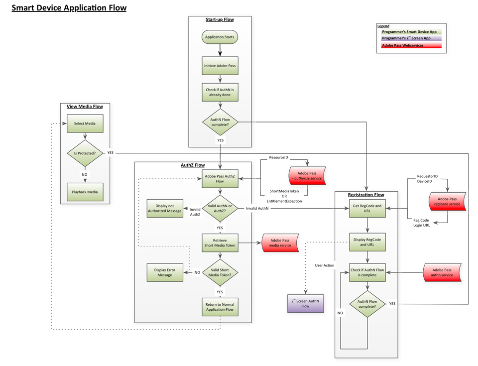
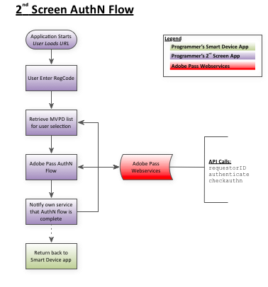
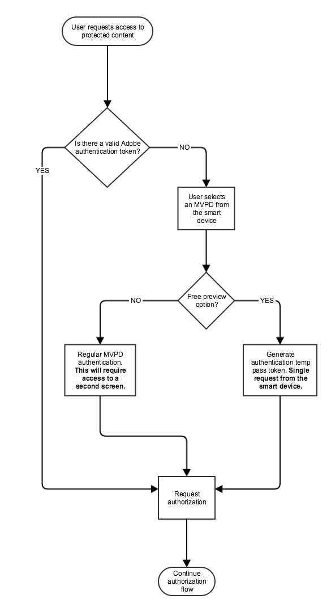

# REST API指南（客戶端到伺服器） {#rest-api-cookbook-client-to-server}

>[!NOTE]
>
>此頁面上的內容僅供參考。 使用此API需要來自Adobe的當前許可證。 不允許未經授權使用。

## 概述 {#overview}

本文檔為程式設計師的工程團隊提供了整合「智慧設備」（遊戲控制台、智慧電視應用、機頂盒等）的逐步說明 使用REST API服務進行Adobe Primetime驗證。 這種「客戶端到伺服器」方法使用REST API而不是客戶端SDK，它允許對不同平台提供更廣泛的支援，而開發大量獨特的SDK則不可行。 有關無客戶端解決方案工作原理的全面技術概述，請參見 [無客戶端技術概述](/help/authentication/rest-api-overview.md)。

此方法需要兩個元件（流應用和AuthN應用）來完成所需的流：流應用中的啟動、註冊、授權和視圖媒體流，以及AuthN應用中的身份驗證流。

## 元件 {#components}

在工作的「客戶端到伺服器」解決方案中，涉及以下元件：

 

| 類型 | 元件 | 說明 |
| --- | --- | --- |
| 流式設備 | 流式處理應用 | 駐留在用戶流設備上並播放經過驗證的視頻的程式設計師應用程式。 |
|  | \[可選\] AuthN模組 | 如果流設備具有用戶代理（即Web瀏覽器），則AuthN模組負責在MVPD IdP上驗證用戶。 |
| \[可選\] AuthN設備 | AuthN應用 | 如果流設備沒有用戶代理（即Web瀏覽器），則AuthN應用程式是使用Web瀏覽器從單獨用戶設備訪問的程式設計師Web應用程式。  |
| Adobe基礎架構 | Adobe Pass | 與MVPD IdP和AuthZ服務整合併提供身份驗證和授權決定的服務。 |
| MVPD基礎架構 | MVPD IdP | 提供基於憑據的身份驗證服務以驗證其用戶身份的MVPD終結點。 |
|  | MVPD AuthZ服務 | MVPD終結點，它根據用戶的訂閱、家長控制等提供授權決定。 |

 

在流程中使用的附加術語定義於 [辭彙表](/help/authentication/glossary.md)。

## 流{#flows}

### 動態客戶端註冊(DCR)

Adobe Pass使用DCR保護程式設計師應用程式或伺服器與Adobe Pass服務之間的客戶端通信。 DCR流是獨立的、相關的和先決條件的流，可在 [動態客戶端註冊](/help/authentication/dynamic-client-registration.md)

### 流（智慧設備）應用程式流

#### 啟動流

1. 你的應用啟動並載入其初始UI。

2. 獲取/生成設備ID。

3. 發出檢查驗證調用，以查看設備是否已經過驗證。  例如： [`<SP_FQDN>/api/v1/checkauthn [device ID]`](/help/authentication/check-authentication-token.md)

4. 如果 `checkauthn` 調用成功，從步驟2開始進入授權流。  如果失敗，請啟動註冊流。

 

#### 註冊流

1. 獲取註冊代碼和URL，供用戶用於訪問第2個螢幕登錄應用，並向用戶顯示以下內容：

   a.向POST註冊代碼服務發送Adobe請求，傳遞散列設備ID和「註冊URL」。  例如： [`<REGGIE_FQDN>/reggie/v1/[requestorId]/regcode [device ID]`](/help/authentication/registration-code-request.md)

   b.將返回的註冊代碼和URL呈現給用戶。

   c.指示用戶切換到可使用Web的設備，導航到URL，然後輸入註冊代碼。

 

#### 授權流

1. 用戶從第2個螢幕應用返回，然後在設備上按「繼續」按鈕。 或者，您可以實施輪詢機制來檢查身份驗證狀態，但Adobe Primetime身份驗證建議在輪詢上使用「繼續」按鈕方法。 <!--(For information on employing a "Continue" button versus polling the Adobe Primetime authentication backend server, see the Clientless Technical Overview: Managing 2nd-Screen Workflow Transition.)--> 例如： [\&lt;sp _fqdn=&quot;&quot;>/api/v1/tokens/authn](/help/authentication/retrieve-authentication-token.md)

2. 將GET請求發送到Adobe Primetime身份驗證授權服務以啟動授權。 例如： `<SP_FQDN>/api/v1/authorize [device ID, Requestor ID, Resource ID]`

<!-- end list -->

* 如果響應指示成功：用戶具有有效的AuthN令牌，並且用戶有權監視請求的媒體（此用戶有有效的AuthZ令牌）。

* 如果響應指示失敗：檢查引發的異常以確定其類型（AuthN、AuthZ或其他）:

   * 如果是AuthN錯誤，則重新啟動註冊流。

   * 如果是AuthZ錯誤，則用戶無權監視請求的媒體，應向用戶顯示某種錯誤消息。

   * 如果出現其他錯誤（連接錯誤、網路錯誤等） 然後向用戶顯示相應的錯誤消息。

 

#### 查看媒體流

1. 顯示介質選項。 用戶選擇要查看的介質。

2. 介質是否受到保護？

   a.你的應用會檢查媒體是否受到保護。

   b.如果媒體受到保護，則您的應用將啟動上面的授權(AuthZ)流。

   c.如果介質未受保護，則為用戶回放介質。

3. 播放媒體。

### AuthN（第2螢幕）應用程式流

1. 獲取此用戶的MVPD清單。 例如： [`<SP_FQDN>/api/v1/config/[requestorID]`](/help/authentication/provide-mvpd-list.md)

1. 啟動驗證流。  例如： [`<SP_FQDN>/api/v1/authenticate [requestorID, MVPD ID, Redirect URL, Domain name, Registration Code, "noflash=true"]`](/help/authentication/initiate-authentication.md)

1. 檢查身份驗證是否成功。 例如：[`<SP_FQDN>/api/v1/checkauthn/[registration code][requestor ID]`](/help/authentication/check-authentication-token.md)

1. 將用戶發回到您的Smart Device應用以完成授權流。

## 平台SSO {#platform-sso}

某些平台為單點登錄(SSO)提供專用支援。 可找到每個相應平台的實施詳細資訊：

* [Apple](/help/authentication/apple-sso-cookbook-rest-api.md)
* Amazon

## REST API的TempPass和提升TempPass {#temppass}

對於不需要用戶輸入憑據的TempPass和促銷TempPass實現，可以直接在流應用中實現身份驗證。

**為了使用此API，流應用需要確保設備ID的唯一性，因為此設備ID用於標識令牌以及可選的額外資料。**

