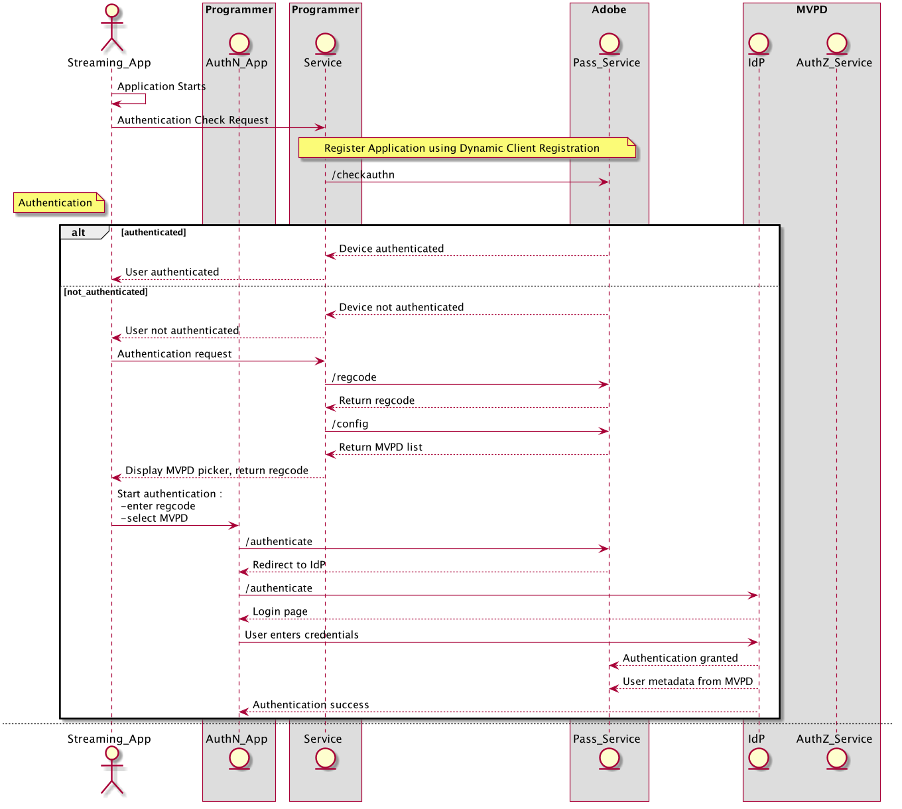
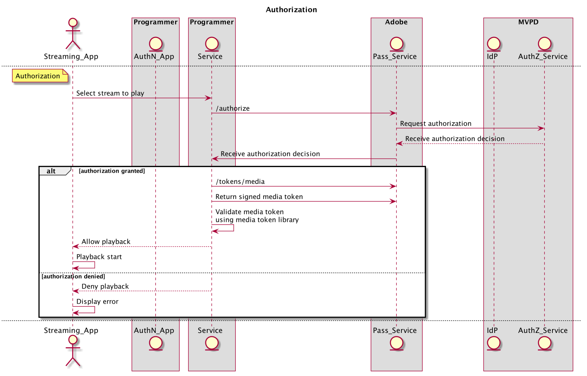
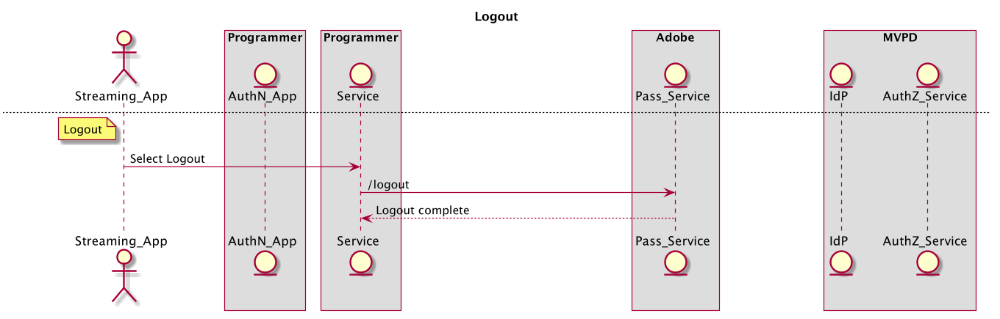
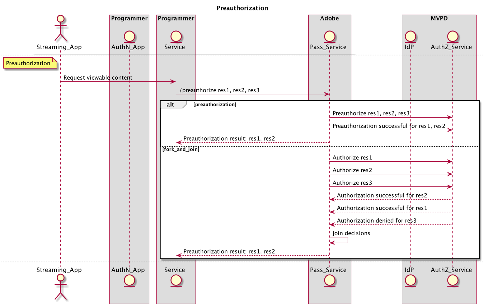
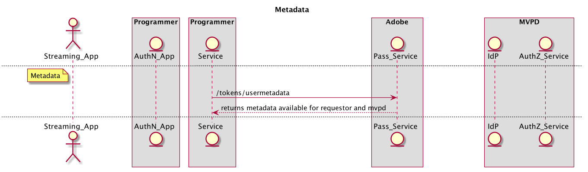

# REST API逐步指南（伺服器對伺服器） {#rest-api-cookbook-server-to-server}

>[!NOTE]
>
>此頁面上的內容僅供參考。 使用此API需要Adobe的目前授權。 不允許未經授權的使用。

## 概觀 {#overview}

本逐步指南檔案的目的，在於詳細說明使用伺服器對伺服器架構實作Adobe Primetime驗證的最佳實務。  它提供基本需求、逐步流程實作，以及生產環境和作業的一般考量事項。

## 元件 {#components}

在運作中的伺服器對伺服器解決方案中，涉及下列元件：

| 型別 | 元件 | 說明 |
| --- | --- | --- |
| 串流裝置 | 串流應用程式 | 位在使用者串流裝置上並播放已驗證視訊的程式設計師應用程式。 |
| | \[Optional\]驗證模組 | 如果串流裝置具有使用者代理（亦即Web瀏覽器），則AuthN模組須負責在MVPD IdP上驗證使用者。 |
| \[Optional\] AuthN裝置 | AuthN應用程式 | 如果串流裝置沒有使用者代理程式（亦即Web瀏覽器），則AuthN應用程式為程式設計人員網頁應用程式，可使用網頁瀏覽器從個別使用者的裝置進行存取。 |
| 程式設計師基礎結構 | 程式設計師服務 | 此服務會將串流裝置與Adobe Pass服務連結在一起，以取得驗證和授權決策。 |
| Adobe基礎結構 | Adobe Pass服務 | 與MVPD IdP和AuthZ服務整合，並提供驗證和授權決定的服務。 |
| MVPD基礎結構 | MVPD IdP | MVPD端點，提供認證型驗證服務來驗證其使用者的身分。 |
| | MVPD AuthZ服務 | MVPD端點會根據使用者的訂閱、家長監護等提供授權決策。 |

此流程中使用的其他辭彙定義於
[字彙表](/help/authentication/glossary.md).

## 流程 {#flows}

### 動態使用者端註冊(DCR)

Adobe Pass使用DCR來保護程式設計人員應用程式或伺服器與Adobe Pass服務之間的使用者端通訊。 DCR流程是獨立的、相依的且為必備的流程，可在以下位置找到： [動態使用者端註冊](/help/authentication/dynamic-client-registration.md).

### 驗證(authN)

驗證流程可讓使用者向其MVPD識別自己，以判斷使用者是否擁有有效的帳戶。

1. 使用者啟動串流裝置應用程式，並嘗試登入或檢視受保護的內容。
2. 串流裝置應用程式會向程式設計人員服務提出要求，以判斷裝置是否已驗證。
3. 程式設計人員服務會使用DCR註冊應用程式。
4. 程式設計師服務會呼叫Adobe Pass服務來檢查串流裝置驗證狀態 **檢查** API。
5. 若為 **檢查** 呼叫會傳回使用者裝置已驗證的狀態，然後應用程式可以繼續進行授權流程。
6. 若為 **檢查** 呼叫會傳回「使用者裝置未驗證」的狀態，而應用程式應等待使用者要求登入。
7. 當使用者要求直接登入（例如選取登入按鈕）或間接登入（例如尚未驗證即選取受保護的內容）時，串流裝置應用程式會向程式設計人員服務提出要求，以啟動使用者驗證。 程式設計師服務會呼叫Adobe Pass服務，要求並接收唯一的註冊代碼(regcode) **regcode** API。
8. 程式設計師服務也會呼叫Adobe Pass服務，擷取目前MVPD和屬性的清單 **設定** API。 注意：此API也可以在流程中較早呼叫並快取。
9. 程式設計師服務會將regcode傳回至串流裝置應用程式，並傳回步驟\#7中要求的已處理MVPD清單。 注意：已處理的MVPD清單格式是由程式設計師指定，而且可以篩選為明確允許或封鎖特定的MVPD （亦即允許或封鎖清單）。
10. 如果與AuthN裝置（即「第二個熒幕」）不同，則可能是出於選擇或必要（即串流裝置不支援使用者代理程式），則串流裝置應該顯示規則碼和URI，讓使用者可以存取AuthN應用程式。 使用者將URI輸入AuthN裝置上的使用者代理程式以啟動AuthN應用程式，然後將regcode輸入該應用程式。 如果串流裝置與AuthN裝置相同，則以程式設計方式將regcode傳遞至AuthN模組。
11. AuthN模組會顯示MVPD選擇器，以啟動使用者與MVPD的驗證。 使用者選取MVPD後，AuthN模組會呼叫 **驗證** 重新導向至MVPD IdP的使用者代理程式。 當使用者透過MVPD成功驗證時，使用者代理程式會透過Adobe Pass服務重新導向，其中系統會以regcode記錄成功的驗證，然後重新導向回AuthN模組。
12. 如果串流裝置與AuthN裝置不同，則AuthN裝置應該向使用者顯示成功的驗證訊息，並逐步繼續(例如「Success\！ 您現在可以返回遊戲主機以繼續\[...\]&quot;)。 如果串流裝置與AuthN裝置相同，則串流裝置可能會以程式設計方式偵測驗證完成。

下圖說明了驗證流程：

### 授權(authZ)

授權流程用於決定使用者是否有權存取請求的內容。

1. 每次使用者嘗試在串流裝置應用程式上檢視受保護的內容時，串流裝置應用程式就會呼叫程式設計服務，識別內容並請求啟動串流所需的許可權和資訊。
1. 程式設計師服務會呼叫Adobe Pass **授權** 傳遞資源ID與其他必要引數的API。 Adobe服務使用資源ID呼叫MVPD AuthZ服務，並接收及授權決定，該決定隨後傳回至程式設計人員服務。 Adobe Pass服務將在可設定的期間內快取此授權決定。 在後續 **授權** 從程式設計人員服務呼叫Adobe Pass服務，則快取值只要有效，就會傳回。
1. 如果授與授權，程式設計師服務應呼叫Adobe Pass **/tokens/media** API會傳回已簽署的媒體Token。 程式設計師服務應使用媒體權杖驗證器程式庫(JAR)來驗證媒體權杖。 如果有效，程式設計師服務應該傳回許可權，以及啟動步驟\#1中要求的資料流（例如資料流URL）所需的許可權。
1. 如果授權被拒絕， **授權** 呼叫會將錯誤碼和說明傳回至程式設計師服務。 程式設計師服務應傳回錯誤碼和說明（或程式設計師修改訊息）至步驟\#1中的要求。

下圖說明授權流程：

### 登出

登出流程可讓使用者移除目前與應用程式關聯的身分。

1. 當使用者要求登出（即從裝置移除與應用程式相關聯的目前MVPD帳戶）時，串流裝置應用程式會呼叫程式設計人員服務，告知其登出裝置。
1. 程式設計師服務應呼叫Adobe Pass **登出** API。

下圖說明登出流程：

### \[Optional\]預先授權（又稱為預檢）

預先授權可用於從一組資源中快速判斷使用者可能擁有存取權。  此呼叫的結果通常用於自訂個別使用者的UI。

1. 一旦使用者通過驗證，串流裝置就會呼叫程式設計人員服務，請求使用者有權串流的內容。

1. 程式設計師服務應呼叫Adobe Pass **預先授權** 具有資源ID清單的API，這些ID是簡單字串，通常代表使用者可能有權進行資料流的管道。 *附註：目前，* ***預先授權*** *呼叫已設定為將清單限製為五(5)個資源ID。 當需要超過五個資源時，多個* ***預先授權*** *可以發出呼叫，也可以將呼叫設定為接受來自MVPD的超過五個資源。 實作者應謹記* ***預先授權*** *呼叫MVPD資源以及程式設計師的回應時間，並審慎建構其呼叫的使用。*

1. 此 **預先授權** 呼叫將會以JSON物件回應程式設計人員服務，該物件包含要求中每個資源ID的TRUE或FALSE值，用以指出使用者是否有權使用關聯的頻道。 *注意：如果MVPD沒有為指定的「資源ID」提供答案（例如，因為網路錯誤或逾時），值會預設為FALSE。*

1. 程式設計師服務應該使用 **預先授權** 呼叫回應以建立程式設計師定義的自訂回應至串流裝置，通常是根據使用者的許可權來個人化簡報。

下圖說明預先授權流程：

### \[Optional\]中繼資料

中繼資料可用來擷取MVPD共用的使用者資訊。
其範例可能包括使用者ID、郵遞區號等。

1. 一旦使用者通過驗證，程式設計師服務可能會呼叫Adobe Pass **usermetadata** API可要求已驗證身分的使用者相關資訊。

1. 回應將包含給定使用者可用的所有中繼資料。 每個程式設計師/MVPD整合會分別設定特定欄位。

下圖說明預先授權流程：

## 環境和功能需求{#environments}

程式設計師應建立至少兩個環境：一個用於生產，一個或更多用於測試。

### 生產

生產環境應具備高可用性，且規模應適合大型或意外尖峰（例如即時運動、突發新聞）。

Adobe Pass服務可在分散於美國各地的多個資料中心執行。  為了讓Adobe Pass服務達到最佳的回應時間（即最低的延遲），程式設計師也應該建立類似的地理位置分散的服務基礎架構。

如果Adobe需要重新路由流量，程式設計師服務應該將DNS快取限製為最多30秒。 如果資料中心無法使用，就可能會發生這種情況。

程式設計師應提供生產環境的公用IP範圍。 這些會輸入到Adobe Pass基礎結構中的IP允許清單中，以供存取，並由Adobe的Fair API使用原則進行管理。

### 分段

中繼環境可以是最小的，但應包括所有系統元件和業務邏輯。 其功能應與生產環境類似，並允許在生產環境之外測試版本。 理想情況下，預備環境可連線至Adobe Pass測試環境以供程式設計師使用，並在需要時透過Adobe使用，以便我們可協助測試和疑難排解。

### 功能需求

程式設計師服務必須傳遞其執行流程之裝置的正確裝置識別資訊。 此外，程式設計師服務必須傳遞他們執行流程的裝置的IP （在x-forwarded-for標頭中）以及連線來源連線埠（在裝置資訊欄位中）：

    **X-Forwarded-For ： \&lt;client _ip=&quot;&quot;>**
    
    其中\&lt;client _ip=&quot;&quot;> 是使用者端公用IP位址
    
    
    
    需要在**regcode**和**authorize**呼叫上新增標頭
    
    範例：
    
    POST/reggie/v1/{req\_id}/regcode HTTP/1.1
    
    X-Forwarded-For：203.45.101.20
    
    
    
    GET/api/v1/authorize HTTP/1.1
    
    X-Forwarded-For：203.45.101.20

程式設計師服務應傳送個別MVPD或整合式應用程式所需的資料和格式（例如裝置IP、來源連線埠、裝置資訊、MRSS、選用資料，例如ECID）。 <!--Please see the documentation for [Passing Device and Connection Information Cookbook](http://tve.helpdocsonline.com/passing-device-information-cookbook)-->.

程式設計師服務必須在快取時遵守authN和authZ TTL，並在收到通知時使authN或authZ工作階段失效。

程式設計師必須維護與Adobe共用的憑證。

<!--
## Related Information {#related}

* [REST API Reference](/help/authentication/rest-api-reference.md)
* [Glossary of Terms](/help/authentication/adobe-pass-glossary.md)
-->
