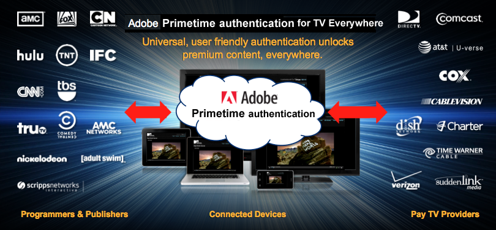
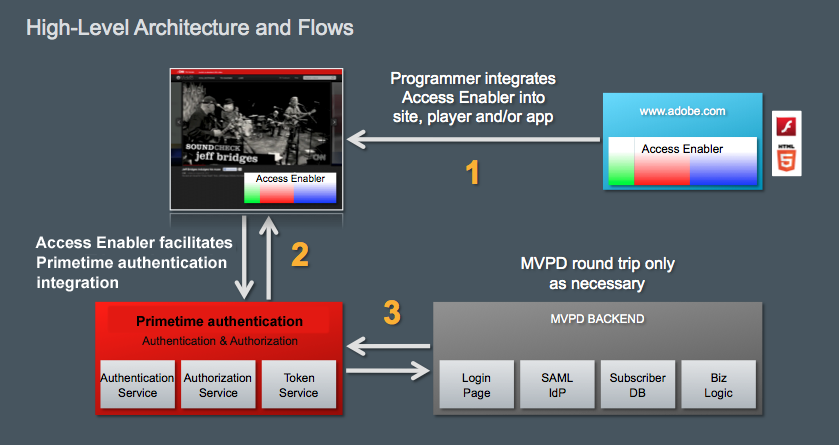
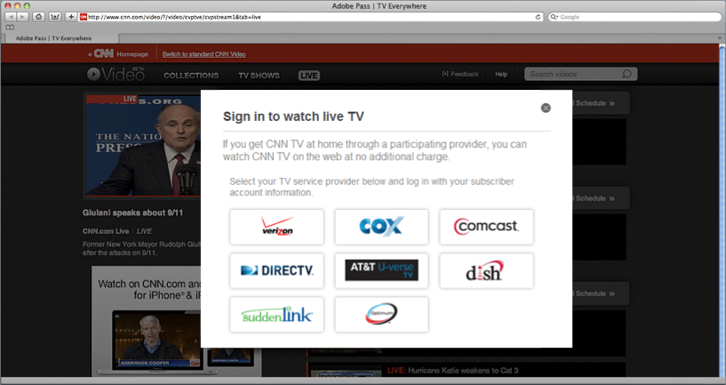
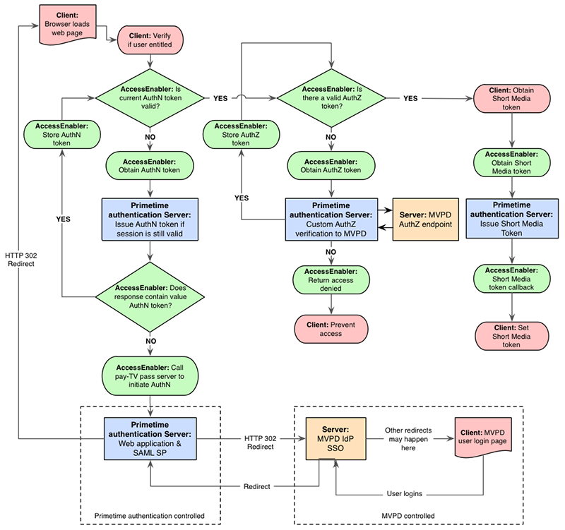

# 關於Adobe Primetime驗證和隨處電視 {#about-auth-tve}

>[!NOTE]
>
>此頁面上的內容僅供參考。 使用此API需要Adobe的目前授權。 不允許未經授權的使用。

## 關於所有地方的電視 {#about-tve}

現今的電視觀眾可以隨時隨地上線，而且他們希望能隨時存取付費電視內容。 此外，受眾檢視內容的裝置範圍不斷擴大，支援網際網路的裝置不斷增加，包括：

* 筆記型電腦
* 平板電腦
* 智慧型手機
* 網站
* 同盟應用程式
* 遊戲主機
* 機上盒
* 智慧型電視

TV Everywhere是產業運動，支援Pay TV訂閱者透過多部裝置（不論家中）存取已付費的相同內容。 雖然大部分的電視觀看仍發生在傳統的線性電視上，但觀看量的增長發生在時移內容、線上視訊和替代熒幕上。 因此，現今的視訊發佈市場處於中斷狀態，而TV Everywhere則成為協調程式設計師、付費電視供應商和付費電視訂閱者利益的解決方案。

TV Everywhere的技術目標是讓Pay TV客戶能夠存取其所有裝置和平台上已訂閱的內容。

TV Everywhere的業務目標為：

* **保留現有客戶關係並啟用新客戶關係**
* 讓程式設計師和內容擁有者觸及最廣大的受眾，並從高階內容中獲得更多價值
* 透過與檢視者的直接線上互動來擴展品牌

## TV Everywhere挑戰 {#tve-challenges}

隨處可見的電視機會也帶來了挑戰。 這些專案的核心是權益。 在檢視器存取訂閱內容之前，必須判斷使用者是否有權存取該內容。

使用者是否與付費電視提供者訂用？ 如果是，該訂閱是否包含正在要求的內容？ 程式設計師和內容擁有者尤其難以直接判斷軟體權利檔案，因為付費電視操作員擁有客戶身分識別資料，以及其客戶的存取許可權。

除了權益之外，還有許多相關的技術和整合挑戰，包括：

* 制定並頒佈完整的多裝置策略
* 協調程式設計師和付費電視提供者之間的各種關係
* 防止詐騙存取或濫用服務條款
* 為跨網站和應用程式的使用者提供一致且順暢的驗證體驗
* 維持快速上市時間，以跟上關係企業交易的步伐
* 管理與多項整合相關的成本

這些挑戰使得程式設計師與多個付費電視提供者的驗證系統之間執行和維護複雜而直接的整合需要大量資源，需要時間和精湛的技術。

解決方案？ **Adobe® Primetime驗證**.

## Adobe Primetime驗證簡介 {#authentication-intro}

透過Adobe Primetime驗證，程式設計師和付費電視提供者只需要使用Adobe Primetime驗證API進行簡單的整合，即可存取整個生態系統，包括：

* 程式設計師，例如Turner Broadcast (TBS、TNT、CNN)、Fox Broadcast Networks和Hulu

* 所有美國付費電視供應商，佔所有付費電視家庭的90%以上

此外，Adobe Primetime驗證提供架構，讓使用者驗證和授權變得簡單而安全。

*圖1：透過Adobe Primetime驗證連線的部分程式設計師和付費電視提供者……*

Adobe Pass安全地協調程式設計師與付費電視提供者之間的權益交易，方便檢視者存取訂閱內容。 或者，換句話說……

**Adobe Primetime驗證可讓適當的客戶輕鬆快速地存取適當的內容。**

**Adobe Primetime的驗證對象為誰？**

* **程式設計師** 想要輕鬆與付費電視供應商（也稱為「MVPD」或「多頻道視訊節目經銷商」）整合的對象，以觸及最廣的受眾，獲得最佳收入。 使用Adobe Primetime驗證，程式設計師可以驗證所有主要提供者中的檢視者，不受使用者端平台影響。

* **付費電視供應商/MVPD** 透過促進線上訂閱內容的存取，尋求與多位程式設計師的無痛連線及更高的客戶滿意度。

* **付費電視客戶** 無論身在何處，只要想輕鬆存取已訂閱的內容，不需額外付費。 單一登入可跨網頁或行動應用程式提供安全的檢視器驗證，而不需要使用者端下載或重複登入，以及良好的使用者體驗。

的 **程式設計師**，Adobe Primetime驗證會提供：

* 與頂級付費電視提供者輕鬆整合併立即連線，無需多重直接整合的煩惱
* 透過支援內容的最大受眾，將訂閱（授權）和廣告收入最佳化
* 安全驗證，僅授權使用者/裝置可存取進階內容
* 開放且靈活的架構，不受玩家和DRM平台限制；可在多種平台上播放，包括iOS、Android、Windows 8、遊戲主機、機上盒等。
* 與任何DRM技術(例如AdobeFlash Access®或「播放就緒」®的相容性。
* 支援單一登入(SSO)驗證和授權，讓訂閱者在自己的系統上完成首次驗證後，不需要再次登入。

的 **付費電視供應商/MVPD**，Adobe Primetime驗證會提供：

* 與內容擁有者輕鬆整合，透過單一整合提供與多位程式設計師的即時連線
* 提升客戶參與度，提供順暢的品牌體驗，方便客戶檢視跨多個平台和裝置的內容
* 安全驗證可確保僅授權的使用者/裝置被授與高階內容的存取權，並（可選）限制每個家庭帳戶可連線的裝置和同時串流的數量。

的 **付費電視客戶**，Adobe Primetime驗證會提供：

* **到處都是電視！**

本文章的其餘部分將提供Adobe Primetime驗證的技術簡介。  雖然下列許多專案著重於程式設計師整合，但也有適用於付費電視提供者的一般和特定資訊。 本檔案也強調Adobe Primetime驗證作為隨時隨地播放電視解決方案時的安全性和完整性。 如需更多本文以外的詳細資訊，請聯絡您的Adobe代表或填寫「索取資訊表單」 [此處](https://www.adobe.com/).

## 建築建置區塊 {#arch-building-blocks}

 以下討論驗證和授權的中心軟體權利檔案交易。 驗證是指向付費電視提供者確認指定使用者為已知客戶的程式。 授權是付費電視提供者確認已驗證的使用者是否擁有指定資源的有效訂閱的程式。
Adobe Primetime驗證包含下列基本元件：

* 使用者端元件（下列其中一項）：

   * Access Enabler — 平台專屬程式庫；提供易用的API和程式碼範例，用於實作權益流程
   * 無使用者端API - RESTful Web服務；為沒有網頁轉譯功能的平台（例如遊戲機、機上盒等）提供許可權流程端點

* Adobe代管的後端伺服器
* 媒體權杖驗證器
* 安全的中央交換媒體(Token)

從基本層面來看，Adobe Primetime驗證包含三個元件(存取啟用程式、Adobe代管的後端伺服器，以及媒體權杖驗證器)和交換的核心專案（權杖）。

### 使用者端元件 {#client-components}

* 存取啟用程式
* 無使用者端API

#### 存取啟用程式 {#access-enabler}

在完整支援的平台(包括網頁、iOS、Android、Windows 8)上，程式設計師會透過Access Enabler使用者端元件與Adobe Primetime驗證互動。 此元件有助於與客戶的所有驗證和授權互動。  Access Enabler會在其系統上本機執行。 當使用者存取程式設計師網站或應用程式並請求內容時，Adobe代管/維護的Access Enabler元件會在背景自動載入。

「存取啟用程式」會處理實際權益工作流程，而「程式設計人員」則負責執行使用者介面並與存取啟用程式互動的較高層網頁或播放器應用程式。 這些互動是透過Access Enabler API定義的非同步函式系統和回呼進行。

以下是基本權益流程，使用Access Enabler API即可輕鬆實作：

* 設定要求者（程式設計師）身分
* 檢查/取得特定付費電視操作員（「身分提供者」）的使用者驗證
* 檢查/取得特定資源的使用者授權
* 登出使用者

Access Enabler還提供下列服務：

* 它會驗證來自程式設計師的查詢，包括特定使用者端、其網域及其資源/頻道的註冊狀態。
* 它會提供建立付費電視運運算元清單的資料，使用者可從中選取其提供者。 此清單也會根據請求所來自的程式設計師的需要加以驗證和定義。
* 它會啟動付費電視操作員特定的驗證和授權工作流程。
* 它會根據程式設計師資源/通道快取成功的授權回應，以將不必要的請求流量減至最低。
* 您可以針對每個付費電視運運算元的特定預先定義工作流程進行設定，例如明確裝置註冊。

根據您的網站或播放器應用程式， Access Enabler可採用下列形式：

* Flash Player執行階段可執行的SWF檔案
* 由瀏覽器直接執行的JS檔案
* 支援平台(包括iOS、Android和Windows 8)的原生Access啟用程式

#### 無使用者端API {#clientless-api}

無使用者端API方法適用於不支援網頁瀏覽器（使用MVPD進行驗證所需）的「智慧型裝置」（遊戲主機、機上盒和智慧型電視）。  使用無使用者端方式時，智慧型裝置應用程式會透過RESTful網頁服務API，直接與Adobe Primetime驗證通訊，除了驗證以外(會在第二個畫面（瀏覽器）應用程式上執行)，執行其他所有動作。 換句話說，不會使用Access Enabler使用者端資料庫。 智慧型裝置應用程式的開發人員會直接使用Adobe Primetime驗證Web服務API來實作權益流程。

### Adobe代管的後端伺服器 {#adobe-backend-servers}

Adobe Primetime驗證後端伺服器，由Adobe託管：

* 與付費電視提供者布建驗證和授權工作流程，這些提供者需要Adobe Primetime驗證和操作員之間的伺服器對伺服器通訊。
* 維護程式設計師網站和應用程式的設定。
* 主控可下載的Access Enabler元件檔案。
* 提供RESTful Web服務端點，以進行無使用者端API整合。
* 產生（在某些情況下，還儲存）驗證和授權權杖。

### 權杖和媒體權杖驗證器 {#tokens-media-token-verifier}

Adobe Primetime驗證權利解決方案的中心，在於產生特定資料片段，這些片段是成功完成驗證/授權工作流程後所取得的。 這些資料片段稱為Token。 其生命週期有限，若為無使用者端API解決方案，則儲存在使用者端上相依於平台的位置，或Adobe伺服器上，並會安全地儲存。 到期後，必須透過重新初始化驗證和/或授權工作流程重新核發權杖。

在驗證/授權工作流程期間，Adobe Primetime驗證會針對三種型別的權杖提出問題。 其中兩個是「長期」的，可提供使用者觀看體驗的連續性。 第三種是短效代號，可支援減少欺詐的業界最佳實務（例如，欺詐包括串流擷取之類的木馬程式）。 存留時間(「TTL」)值是根據程式設計師和付費電視提供者之間的合約所設定，這些提供者就最適合所有相關人員的價值達成共識。

#### （長期）驗證Token {#long-lived-auth-token}

客戶使用Adobe Primetime驗證成功登入其付費電視帳戶後，驗證就會成功。 Adobe Primetime驗證接著會產生繫結至請求裝置的長期驗證(AuthN)權杖，以及（視付費電視提供者而定）可匿名識別使用者的全域唯一識別碼(「GUID」)。

* Adobe Primetime驗證會將AuthN權杖安全地儲存在所有使用Adobe Primetime驗證的應用程式都可使用的位置。 針對Access Enabler整合，權杖會安全地儲存在使用者端上。  Adobe Primetime驗證會使用AuthN權杖代表使用者進行後續授權查詢。
* 在任何指定時刻，只會儲存一個AuthN權杖。 每當核發新的AuthN權杖且舊權杖已存在時，新權杖就會覆寫現有的儲存值。

#### （長期）授權Token {#long-lived-authriz-token}

在成功授權後，Adobe Primetime驗證會建立長效授權(「AuthZ」)權杖。 此權杖無法攜帶，因為它繫結至請求裝置和特定的受保護資源（例如，頻道、系列或集數）。

* Adobe Primetime驗證會安全地儲存AuthZ權杖，以及其他資源的其他授權權杖。  同樣地，和AuthN權杖一樣，在使用Access Enabler的平台上，權杖會儲存在使用者端上的本機；在使用無使用者端API的平台上，權杖會儲存在Adobe Primetime驗證伺服器上。
* 根據付費電視提供者與程式設計師之間的特定合約，長壽命AuthZ權杖的存留時間(TTL)通常定義為數天至數週之間。
* 在任何指定時間，每個資源僅儲存一個AuthZ權杖。 可以儲存多個授權權杖，前提是這些權杖與不同資源相關聯。 每當核發新的授權權杖且同一資源已存在舊授權權杖時，新權杖就會覆寫現有的快取值。
* Adobe Primetime驗證會使用長效的AuthZ權杖建立用於實際檢視存取的短效媒體權杖。

#### 短期媒體Token {#short-lived-media-token}

在Adobe Primetime驗證產生AuthZ權杖後，它會使用該權杖產生單一使用、短暫的媒體權杖，並由Adobe簽署及加密，以避免在交換期間遭到竄改：

* 短期權杖的TTL （預設值： 5分鐘）設定為允許在產生權杖的伺服器和驗證權杖的伺服器之間發生時鐘同步問題。
* 在提供受保護資源的存取權之前，短期權杖會公開給內嵌網站，因此程式設計師必須使用媒體權杖驗證器來驗證權杖，以進行Access Enabler整合，或在無使用者端API整合時使用權杖驗證器服務。

#### 媒體權杖驗證器 {#media-token-verifier}

程式設計師負責將「媒體代號驗證器程式庫」整合到其現有的應用程式伺服器中，以便驗證器能在視訊串流實際開始之前執行最終使用者驗證。 媒體權杖驗證器程式庫會定義：

* 權杖驗證API會從權杖中擷取資訊，例如是否有效、權杖簽發的時間以及其他相關資料
* 用來驗證權杖是否確實來自Adobe的Adobe公開金鑰
* 此參考實作會顯示如何使用驗證器API，以及如何使用程式庫中包含的Adobe公開金鑰來驗證其來源

*圖2： Access Enabler整合中Adobe Primetime驗證生態系統的高階架構*

## 整合Adobe Primetime驗證 {#integrate-auth}

無論您是付費電視提供者或程式設計人員，與Adobe Primetime驗證整合的程式都需要您一定程度的主動參與。 以下逐一說明這些程式。

### 付費電視提供者程式

付費電視提供者對Adobe Primetime驗證的主要責任是驗證提出請求的使用者是否確實是有權存取程式設計師內容的已知訂閱者。 整體而言，整合至付費電視供應商的Adobe Primetime驗證程式需要下列步驟：

1. 提供者簽署Adobe Primetime驗證保密協定(NDA)。
1. 提供者會為Adobe提供其驗證與授權系統的規格。 為了最簡單的整合，建議付費電視營運商具有用於驗證的SAML型身分提供者(IdP)，以及透過SOAP存取通訊協定進行通訊以取得授權的能力。
1. 提供者會在其伺服器與Adobe Primetime驗證伺服器之間建立連線。 這包括提供端點和列出IP。
1. 資格預審版本與QE。
1. 生產版本與QE。

雖然Adobe Primetime驗證可能會取代程式設計人員的現有整合，但付費電視提供者通常不需要進行此作業。 Adobe會與提供者的技術團隊合作，設定Adobe Primetime驗證以滿足任何現有整合的需求。 假設採用「標準」整合且支援需求最少（檔案和基本電子郵件支援），付費電視提供者可免費整合。 如果提供者需要大量支援或升級的時間表，可能需要支付支援費用，或提供者可能想要與熟悉我們的解決方案的協力廠商合作，例如Synacor。

Adobe Primetime驗證也支援有效率地處理付費電視提供者的商業邏輯，如下所示：

* 對於自含的商業邏輯，如果運運算元在收到授權請求時可以套用，Adobe會在運運算元收到授權請求時，提供支援商業邏輯執行所需的必要資料。 此資料可包含（但不限於）提出請求之使用者的唯一裝置ID，以及裝置的IP位址。
* 對於需要使用者介入和/或Adobe解決方案特定處理的商業邏輯，Adobe可以維護每個付費電視提供者的某些自訂屬性。 這些操作員專屬的設定/原則包括啟用預先定義的工作流程，這些工作流程可在頂層工作流程的特定點啟動。 如需自訂屬性支援的詳細資訊，請聯絡您的Adobe代表。

Adobe也提供詐騙限制服務。 如需詳細資訊，請聯絡您的Adobe代表。

### 程式設計師流程 {#programmer-process}

為了成功整合Adobe Primetime驗證，程式設計師必須設定其媒體播放器應用程式或網頁，以使用Adobe Primetime驗證來處理核心權利程式：驗證、授權和登出。

在開始與Adobe Primetime驗證整合之前，程式設計師應該：

* 現有的線上視訊平台，包括媒體播放器，可作為網站的一部分或作為獨立應用程式
* 內容管理系統
* 傳遞機制，可能包含也可能不包含協力廠商內容傳遞網路(CDN)

程式設計師應該會執行一些整合工作，做為提供Adobe Primetime驗證的TV Everywhere服務的一部分。 這些工作包括：

* 將Adobe Primetime驗證的Access Enabler程式庫整合至您的網頁或媒體播放器，或針對不支援Web功能的「智慧型裝置」，使用無使用者端方法實作整合
* 伺服器端工作可將Adobe Primetime驗證權杖驗證器元件整合至您的視訊串流工作流程
* 建立UI以將存取工作流程放入您的網站或應用程式(其中的某些元素（例如實際登入程式）由付費電視操作員提供，而某些元素可選擇性作為Adobe Primetime驗證的一部分使用)

本文提供程式設計師流程的概觀，而Adobe則提供正式啟動整合的額外指引。

#### 請求者（程式設計師）設定 {#requester-prog-setup}

##### 向Adobe註冊 {#registering}

首先，程式設計師必須向Adobe或Adobe授權的合作夥伴註冊，並指定要用於Adobe Primetime驗證的網域。 接著，程式設計師會收到唯一的要求者ID，並針對程式設計師與Access Enabler互動的每個工作階段，提供給Adobe Primetime驗證。

##### 設定Initial Access Enabler整合 {#access-enabler-int-setup}

在請求存取內容的任何客戶之前，程式設計師必須將Adobe Primetime驗證使用者端元件（存取啟用程式）整合到其現有的媒體播放器應用程式或網頁中。 有多種選項可讓您執行此操作：

* 您可以將Flash版本AccessEnabler.swf內嵌在網頁上的Flash式視訊播放器中，或直接內嵌在HTML中。 您可以使用ActionScript或JavaScript與SWF通訊。 基礎APIActionScript，但可使用完整的JavaScript包裝函式庫。
* 對於非Flash裝置，您可以：
   * 使用HTML5/JavaScript版本AccessEnabler.js，並透過JavaScript API與其通訊，或
   * 使用原生Access Enabler程式庫，例如iOS、Android或Windows 8

##### 初始無使用者端API整合的設定 {#clientless-api-int-setup}

在任何客戶請求存取內容之前，程式設計師必須使用無使用者端API在其媒體播放器應用程式中實作RESTful網路服務呼叫，並設定「第二熒幕」應用程式來處理使用者透過網路登入其付費電視提供者的情況。

#### 處理驗證和授權 {#auth-authr-handling}

當客戶首次向程式設計師請求受保護資源時，程式設計師會向客戶呈現付費電視提供者清單，以供客戶選擇。 選取提供者時，使用者會重新導向至該運運算元，以進行初始使用者驗證。 驗證成功後，Adobe Primetime驗證會與選取的付費電視提供者通訊，以授權存取指定資源。 這些流程的詳細資訊如下。

*圖3：提供者選擇UI範例*

>[!NOTE]
>
>* 驗證是作為服務提供者（或「SP」）的Adobe Primetime驗證和作為身分提供者（或「IdP」）的付費電視提供者之間的SAML交換。
>* 授權會使用Adobe Primetime驗證(SP)和付費電視提供者(IdP)之間的後端頻道（伺服器對伺服器） Web服務交換。

##### 使用Access Enabler的程式設計師通訊

Access Enabler和程式設計師的網頁或播放器應用程式之間的雙向通訊通道會遵循完全非同步模式。 程式設計師透過Access Enabler API公開的方法，將訊息傳送至Access Enabler。 Access Enabler會透過在Access Enabler程式庫註冊的回呼回應。

* 如果在本機系統上找不到驗證Token，任何授權請求都會先自動請求驗證。 驗證成功時，客戶的Token會儲存在本機，因此他們不需要在指定的時間內再次登入。 如果他們已透過任何其他內容中的Adobe Primetime驗證權益解決方案成功驗證（例如，透過付費電視提供者的網站或其他程式設計人員），則Access Enabler可存取本機Token，而不需要執行額外的驗證。
* 當客戶要求特定資源時，程式設計師會透過存取啟用程式向付費電視提供者要求授權。 驗證（或起始）驗證後，Access Enabler會連絡付費電視提供者(透過Adobe Primetime驗證)，以判斷客戶是否有權檢視資源。 Adobe Primetime驗證會處理與付費電視提供者通訊以取得授權。 程式設計師只需要將要求傳送至存取啟用程式並處理回應（授權成功或失敗）。 如果授權成功，授權權杖會儲存在使用者端系統上，而回呼會接收短期的媒體權杖。

##### 使用無使用者端API的程式設計師通訊 {#progr-comm-clientless-api}

程式設計師的應用程式與Adobe Primetime驗證之間的通訊是透過RESTful Web服務進行。  對Adobe Primetime驗證端點的所有API呼叫均已就緒安全性通訊協定。  無使用者端API檔案中會說明安全性需求。

##### 使用SAML網頁瀏覽器SSO型驗證的範例工作流程 {#sample-wf}

1. 檢視器導覽至網站(dummy1.com)並嘗試存取已授權的內容。
1. 影片頁面/播放器會從adobe.com載入存取啟用程式，並在使用者提示時，要求授權請求的內容。
1. Access Enabler會執行並驗證要求者和要求。
1. Access Enabler會檢查本機存放區中是否有有效的授權權杖。 如果找到有效的授權，則Access Enabler會產生短暫的媒體權杖（請參閱步驟14）。
1. 如果找不到請求資源的有效授權，但存在有效的驗證Token，則Access Enabler會向付費電視提供者起始授權請求，使用者將針對該提供者進行驗證。 Adobe伺服器會布建與付費電視提供者的授權要求/回應交換。
1. 如果找不到有效的驗證Token，「存取啟用程式」會提示使用者輸入其付費電視提供者。 (選取支援SAML網頁瀏覽器SSO型驗證的提供者，會觸發SAML型驗證工作流程。 對於非SAML提供者，Adobe會處理類似的自訂工作流程。)
1. Access Enabler會導覽瀏覽器至Adobe的SAML SP （服務提供者）服務，並傳遞所有適當的引數。
1. SAML SP會使用SAML Web瀏覽器設定檔，在使用者的付費電視提供者叫用適當的SAML IdP （身分提供者），如IdP中繼資料所示。 這會有效地將使用者導覽至IdP （付費電視提供者）網站，讓使用者在該網站進行驗證。
1. 成功驗證後，系統會將使用者重新導向回Adobe的SAML SP，並在SAML回應中向其傳遞驗證GUID。
1. Adobe的SAML SP會在伺服器端建立工作階段，驗證GUID會儲存於此處，並將使用者重新導向回原始程式設計師頁面。 （伺服器工作階段會在Access Enabler擷取authN權杖時刪除。）
1. Access Enabler會從Adobe伺服器擷取驗證GUID，以包含在權杖中，其裝置ID是由Adobe Primetime驗證所維護。 當FlashDRM位於裝置上時，可透過Flash AccessAPI (Flash Player的DRM元件)完成這項作業，這些API可將GUID繫結至裝置ID並傳回驗證權杖。 否則，這是透過HTTPS使用HTML5型儲存空間或特定原生元件的JS API完成。
1. Access Enabler會使用驗證權杖向付費電視提供者提出授權要求。 在啟用Flash Access的裝置上，要求一律透過Flash AccessAPI提出，以便產生的授權權杖繫結至裝置。 在非Flash Access裝置上，HTTPS用於使用者端與伺服器的安全通訊。
1. 在成功獲得授權後，Adobe Primetime驗證會建立長效授權(「authZ」)權杖，並將其傳遞給Access Enabler，後者會將其儲存在本機系統上。
1. 存取啟用程式會使用authZ權杖建立用於實際檢視存取的短期媒體權杖。 為了安全起見，這些短期權杖必須由另一個Adobe Primetime驗證元件（媒體權杖驗證器）驗證。

*圖4：驗證和授權存取啟用程式工作流程*

##### 提供軟體權利檔案使用者介面 {#entitlement-ui}

程式設計師必須建立自己的UI，才能將存取工作流程匯入其網站或應用程式中。 某些元素（例如實際登入程式）由付費電視提供者提供，而某些元素可選擇性作為Adobe Primetime驗證的一部分提供。 程式設計師至少會執行下列動作：

* **實作提供者選擇介面** 這可讓新使用者識別其付費電視提供者，並首次登入。 對於開發而言，Access Enabler提供基本的使用者介面，讓客戶可以選擇付費電視提供者，並啟動登入程式。 對於生產環境，程式設計師必須實作他們自己的提供者選擇器對話方塊。 有些付費電視提供者會重新導向至自己的網站登入，有些則會要求在iframe中顯示登入頁面。 程式設計師必須實施建立此iframe的回呼，以備客戶選擇其中一個提供者時使用。
* **識別受保護的資源。** 受保護的資源是需要授權才能存取的資源。 提供這些資源時，程式設計師介面應指出檢視之前需要授權。 授權成功後，介面應會顯示資源現在已獲得授權。
* **建立和維護付費電視提供者清單** 僅控制使用者存取您指定的那些提供者。
* **顯示使用者已驗證。** 程式設計師應指出客戶的驗證狀態，作為識別受保護資源的任何方法的一部分。 程式設計師可以查詢Access Enabler來判斷客戶是否已驗證。

#### 支援單一登出 {#single-logout-support}

在大多數情況下，程式設計師負責透過簡單的API呼叫處理使用者登出。 logout()呼叫會指示Primetime驗證透過以下方式登出目前的使用者：

* 刪除所有AuthN和AuthZ權杖
* 清除該使用者的所有驗證和授權資訊
* 啟動付費電視提供者特定的工作流程，以清除使用者與提供者的驗證工作階段（例如，如果驗證是使用SAML驗證請求通訊協定完成的，則登出可使用SAML單一登出通訊協定完成）。

如果使用者讓電腦閒置足夠長的時間，讓他們的權杖過期，他們仍可返回工作階段並成功起始登出。 Adobe Primetime驗證可確保刪除所有權杖，並通知付費電視提供者將其工作階段也刪除。

從未與Adobe Primetime驗證整合的網站起始登出時，付費電視提供者可以透過瀏覽器重新導向來叫用Adobe Primetime驗證單一登出服務。

## 基本權益流程之外 — 其他功能 {#beyond-basics}

基本權益流程為「啟動」、「驗證」、「授權」和「登出」。  隨著Adobe Primetime驗證的發展和成熟，基本流程已經並正在新增許多其他功能。  這些功能包括：

* **使用者中繼資料**  — 根據MVPD和程式設計師之間的合約，MVPD可以安全地交換中繼資料，例如郵遞區號、最高評分、管道ID等。 中繼資料可啟用各種使用案例，包括家長監護、體育活動的區域凍結期等。
* **臨時免費存取**  — 可讓程式設計師暫時免費存取其受保護的內容（例如，每日程式設計的簡短範例，或免費呈現大型事件）。
* **Proxy MVPD** - MVPD可以管理自己與Adobe Primetime驗證的整合，也可以代表一組相關聯的「ProxiedMVPDs」管理權益程式。

## 安全性 {#security}

本節著重說明Adobe Primetime驗證基礎結構的安全性和完整性。

### 權杖安全性 {#token-security}

Adobe Primetime驗證的主要目標之一，是確保系統可抵禦惡意使用者或內容彙總程式對內容軟體權利檔案資料的攻擊。 因此，在工作流程中的不同層級保護資料存取的安全，並保護具有最高重要性的授權權杖資料的產生和使用。 Adobe Primetime驗證架構的設計目的，是要確保權杖內容受到安全維護，而且該權杖會保留在發行它的裝置上。

* **長效的AuthN和AuthZ權杖安全性**  — 所有長效權杖都會由Adobe Primetime驗證伺服器數位簽署。 然而，數位簽章因平台而異，因為它使用的裝置ID在產生、保護和驗證的方式上有所不同。 在所有情況下，使用者端驗證會確保數位簽名完整，並保留權杖的完整性。 Access Enabler會將驗證過的權杖安全地儲存在其執行環境的特定位置。 如果裝置ID驗證失敗，驗證工作階段會失效、權杖會重設，並提示使用者重新登入。
* **短期媒體權杖安全性**  — 短效媒體權杖（在內容存取前的最後一個步驟產生）會由Adobe簽署並加密，以避免在交換期間遭到竄改。 短期媒體權杖也需要其他Adobe Primetime驗證元件（媒體權杖驗證器）的額外驗證步驟。 短期權杖的TTL預設為5分鐘，如有需要，可縮短。 不會快取短暫的媒體權杖；每次呼叫授權API時，都會從伺服器擷取新的權杖。

### 平台特定裝置安全性 {#platform-sp-security}

Adobe Primetime驗證使用的安全性措施因平台而異，但全都強大且最尖端。

* **啟用Flash的裝置**  — 當裝置上有Flash Player10.1+或AIR 2.5+時，Adobe Primetime驗證會使用Flash PlayerDRM功能進行保護，也稱為Flash Access。 Flash可提供額外的保護等級；Flash型權杖的裝置繫結有強大的保證，這表示在大部分情況下，存留時間可能會更長、使用者不必經常登入，且使用者體驗通常會更順暢。
* **支援HTML5功能的裝置上的瀏覽器內體驗** — 在包含HTML5瀏覽器功能的非Flash裝置上，Adobe Primetime驗證有另一種方法可針對瀏覽器整合提供有限的保護。 不過，由於HTML5的裝置繫結不夠牢固，HTML5平台上權杖的存留時間(TTL)通常較短。
* **適用於住家內和住家外裝置的原生應用程式支援** -Adobe提供每個作業系統的原生SDK (iOS、Android、Windows 8等) 提供比HTML5解決方案更強大的安全性。 這些SDK會使用原生API來擷取裝置ID，並將其安全地傳遞至Adobe Primetime驗證伺服器。
* **無使用者端** - Adobe Primetime驗證會使用HTTPS通訊協定進行安全通訊。 此外，所有來自智慧型裝置的呼叫都必須經過數位簽署。

## 常見問題集 {#faqs}

**哪裡都有電視？**
這項名為「TV Everywhere」的產業運動可讓付費電視客戶透過各種網際網路連線裝置，存取他們已訂閱的優質內容，包括個人電腦、平板電腦、智慧型手機、遊戲主機、機上盒和「智慧」電視。 此計畫面臨的挑戰是儘可能簡化驗證程式，避免不必要的麻煩，讓客戶能夠順利存取其訂閱內容，無需設定阻礙性障礙及多次登入。

**什麼是Adobe Primetime驗證，它和世界各地的電視有什麼關係？**
Adobe Primetime驗證以簡單且安全的方式順暢驗證使用者的內容權利，將電視從概念帶入現實。 Adobe Primetime驗證是一項託管服務，可根據程式設計師和付費電視提供者所需的商業規則進行快速後端整合。 這表示所有各方都能快速進入市場，並提供更安全的環境以防止詐騙，以及更卓越的客戶體驗，讓更多的人可在更多平台上使用更多電視內容。

**如何提供/傳遞Adobe Primetime驗證？**
Adobe Primetime驗證透過軟體即服務(SaaS)模式提供。 這可讓一般使用者、程式設計師和付費電視提供者之間進行更安全的通訊，以驗證內容的權益。 服務的核心元件包括使用者端存取啟用程式（或某些裝置的無使用者端API）和託管的Adobe Primetime驗證伺服器。 Access Enabler是載入程式設計師網頁或播放器應用程式中的小型檔案。 它會與Adobe Primetime驗證伺服器通訊，而伺服器又會將連線內建於各種付費電視提供者的驗證系統中。 Adobe Primetime驗證也提供無使用者端API方法，來整合某些不支援Web功能的「智慧裝置」（智慧電視、機上盒、遊戲主機等）。 無使用者端方法提供RESTful Web服務，開發人員可透過這些服務在這些裝置上實作Adobe Primetime驗證權益流程。

**Adobe Primetime驗證與其他所有電視解決方案有何不同？**
Adobe Primetime驗證比替代的TV Everywhere解決方案有明顯的優勢。 直接整合個別提供者無法提供單一、持續性登入(SSO)的彈性，因為使用者會透過網際網路在不同網站之間穿行。 Adobe Primetime驗證也有顯著的市場滲透率；程式設計師在整合Adobe Primetime驗證後，就會立即與付費電視營運商連線，服務超過90%的美國家庭。 此外，Adobe Primetime驗證運用內建在Flash執行階段（如果有的話）的獨特安全性功能，有助於減少詐騙，同時提供SDK，讓程式設計師針對無法使用Flash的行動或家用裝置，可在原生應用程式中內建相同的TV Everywhere功能。 最後，雖然Adobe Primetime驗證可作為獨立服務使用，但我們也提供選項與其他Adobe產品及服務(包括Primetime和Adobe Analytics)緊密整合，以提供、保護並營收TV Everywhere內容。

**Adobe Primetime驗證的安全程度如何？**
Adobe Primetime驗證架構的首要任務是確保僅授權檢視者通過驗證並被授予存取優質內容的許可權。 Adobe Primetime驗證會將檢視裝置的存取許可權緊密繫結，有助於限制特定家庭的串流、工作階段和/或裝置。

**是否需要Flash Player？**
若要使用最嚴格的裝置繫結安全性，需要AdobeFlash Player11.x或更新版本。 不過，適用於TV Everywhere的Adobe Primetime驗證不受播放器和平台限制，可與任何播放應用程式(包括Silverlight和HTML5)整合。 此外，Adobe Primetime驗證還為iOS、Android和Xbox等無法使用Flash Player的裝置提供原生支援。  最後，Adobe Primetime驗證針對無法轉譯網頁的裝置（遊戲主機、智慧型電視、機上盒），提供無使用者端方法。

**Adobe Primetime驗證支援哪些裝置？**
幾乎任何具備HTML5 Web套件，可在瀏覽器內檢視體驗的裝置皆支援Adobe Primetime驗證。 此外，Adobe Primetime驗證持續推出適用於各種裝置特定平台的原生軟體開發套件(SDK)，包括iOS、Android™和Windows 8。 Adobe Primetime驗證部分支援某些不支援Web的裝置（智慧型電視、機上盒、遊戲主機等） 透過其RESTful Web服務API。

**Adobe Primetime驗證是否支援各個地方電視的新興標準？**
Adobe Primetime驗證符合 **CableLabs OLCA （線上內容存取）** [規格](https://www.cablelabs.com/specifications)，針對從線上來源傳送視訊給付費電視客戶提供技術需求和架構。 Adobe於2011年6月參與了CableLabs的Interopt聯合測試專案，並通過了服務供應商實作的測試程式。 Adobe Primetime驗證是根據OLCA的驗證規格來驗證（完成和測試）。 授權元件已完成，但測試驗證將等待CableLabs測試環境（ETA 2011年11月）的發行。

Adobe也是 **OATC （開放式驗證技術聯盟）** 並參與幾個小組委員會的規格起草專案，作為該機構的一部分。

**Adobe Primetime驗證如何處理同盟身分管理/單一登入(SSO)？**
Adobe Primetime驗證可讓您透過Adobe Primetime驗證與參與付費電視營運商之間的後端頻道（伺服器對伺服器）通訊，為客戶提供單一登入(SSO)驗證和授權。 因此，透過Adobe Primetime驗證，只要付費電視運運算元允許持續使用該驗證，訂閱者就不需要在首次驗證後再次登入。 此限制通常設定為30天。 為了完成這點，Adobe Primetime驗證會為我們的客戶提供驗證權杖的共同網域。 所有與指定付費電視營運商整合的參與網站都可以使用此驗證狀態資訊。

目前，與付費電視營運商整合的大多數Adobe Primetime驗證都使用SAML通訊協定，這是主要驗證標準之一。 Adobe Primetime驗證會成為SAML架構中的Proxy服務提供者，並將SAML驗證回應儲存為Adobe通用網域中的安全權杖。 Adobe Primetime驗證符合SAML 2.0規範。

雖然Adobe Primetime驗證目前通常與SAML SSO解決方案搭配使用，但Adobe Primetime驗證架構會從程式設計師整合中抽象出任何通訊協定細節。 因此，可以隨時間新增對新通訊協定的支援，例如基於OAuth 2.0或自訂通訊協定的支援。

**一般使用者使用TV Everywhere的Adobe Primetime驗證需要多少費用？**
一般使用者不需額外付費即可使用Adobe Primetime驗證。

>[!NOTE]
>
>**後續步驟：** 如需詳細資訊，請聯絡您的Adobe代表或填寫「資訊請求」表單 [此處](https://www.adobe.com/cfusion/mmform/index.cfm?name=adobepass_rfi).
>
