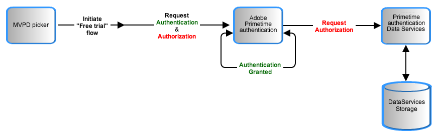

# 暫時通過 {#temp-pass}

>[!NOTE]
>
>此頁面上的內容僅供參考之用。 使用此API需要來自Adobe的目前授權。 不允許未經授權的使用。

## 功能摘要 {#tempass-featur-summary}

Temp Pass可讓程式設計師為沒有MVPD帳戶憑證的使用者提供對其受保護內容的暫時存取權。  臨時通行證包含下列功能：

* Temp Pass可設定為提供暫時存取權，以涵蓋各種案例，包括：
   * 程式設計師可以提供其網站之一的每日簡短（例如10分鐘預覽）。
   * 程式設計師可提供大型體育活動（例如奧運會）的單次長報告（例如四小時），或NCAA March Madness。
   * 程式設計師可以提供前兩種情況的組合；例如，初始的較長的檢視期間，然後是一連串的較短期間，這些期間會在隨後的某些天中每天重複。
* 程式設計師指定其臨時通過的持續時間（存留時間或TTL）。
* 臨時傳遞會依每個請求者操作。  例如，NBC可以為請求者「NBCOlympics」設定4小時的臨時通過。
* 程式設計師可以重設授與特定請求者的所有Token。  用於實作Temp Pass的「臨時MVPD」必須設定為啟用「每個請求者的驗證」。
* **臨時傳遞存取權已授予特定裝置上的個別使用者**. 在使用者的Temp Pass存取權過期後，該使用者將無法取得相同裝置上的暫時存取權，直到該使用者過期為止 [授權權杖](/help/authentication/glossary.md#authz-token) 會從Adobe Primetime驗證伺服器清除。


>[!NOTE]
>
>Temp Pass是Premium Workflow封裝的一部分。 如果您有興趣使用此功能，請聯絡您的Primetime銷售代表。

## 功能詳細資料 {#tempass-featur-details}

* **檢視時間的計算方式** - Temp Pass保持有效的時間與使用者在程式設計人員應用程式上檢視內容所花的時間無關。  在透過Temp Pass的授權初始使用者請求時，到期時間透過將初始目前請求時間加到程式設計師指定的TTL來計算。 此到期時間與使用者的裝置ID和程式設計師的請求者ID相關聯，並儲存在Primetime驗證資料庫中。 每次使用者嘗試使用來自相同裝置的Temp Pass存取內容時，Primetime驗證都會比較伺服器請求時間與使用者裝置ID和程式設計人員請求者ID相關聯的到期時間。 如果伺服器要求時間小於到期時間，則會授與授權；否則，會拒絕授權。
* **設定引數**  — 程式設計師可指定下列Temp Pass引數，以建立Temp Pass規則：
   * **權杖TTL**  — 允許使用者在未登入MVPD的情況下觀看的時間長度。 此時間以時鐘為基礎，無論使用者是否觀看內容，都會過期。
   >[!NOTE]
   >要求者ID不能有一個以上的暫時通過規則與其相關聯。
* **驗證/授權**  — 在Temp Pass流程中，您將MVPD指定為「Temp Pass」。  Primetime驗證不會與Temp Pass流程中的實際MVPD通訊，因此「Temp Pass」MVPD會授權任何資源。 程式設計師可以指定可使用Temp Pass存取的資源，就像他們對其網站上的其他資源所做的一樣。 媒體驗證器程式庫可照常使用，以驗證Temp Pass短媒體權杖，並在播放前強制執行資源檢查。
* **在暫時傳遞流程中追蹤資料**  — 關於在Temp Pass權益流程期間追蹤資料的兩點：
   * 從Primetime驗證傳遞至您的的追蹤ID **sendTrackingData()** callback是裝置ID的雜湊。
   * 由於Temp Pass流程中使用的MVPD ID是「Temp Pass」，因此會將相同的MVPD ID傳回 **sendTrackingData()**. 大多數程式設計師可能會想要以不同的方式處理「暫時通過」量度與實際MVPD量度。 這需要在您的Analytics實作中進行一些額外工作。

下圖顯示「暫時通過」流程：



*圖：溫度傳遞流程*

## 實作暫時傳遞 {#implement-tempass}

在Primetime驗證方面，Temp Pass是在參與的程式設計師伺服器設定中新增名為「TempPass」的偽MVPD來實作。  這個偽MVPD的作用就像一個實際的MVPD，會暫時授予程式設計師受保護內容的存取權。

在程式設計師方面，Temp Pass的實作方式如下，適用於MVPD用於驗證的兩種情況：

* **程式設計師頁面上的iFrame**. 不論MVPD的驗證型別為何，暫時傳遞都能運作，但若是iFrame案例，則需要執行其他步驟來取消目前的驗證流程，並使用暫時傳遞進行驗證。 這些步驟顯示於 [iFrame登入](/help/authentication/temp-pass.md) 下方的。
* **重新導向至MVPD登入頁面**. 在較傳統的情況下，在開始使用MVPD驗證之前會顯示用於觸發Temp Pass的UI，無需採取任何特殊步驟。 臨時傳遞的處理方式應像一般MVPD一樣。

下列幾點適用於兩種實施案例：

* 只有尚未請求臨時通行授權的使用者，「臨時通行證」應該顯示在MVPD選擇器中。 可藉由在Cookie上保留標幟來封鎖後續請求的顯示。 只要使用者未清除瀏覽器快取，此功能就會運作。 如果使用者清除其瀏覽器快取，選擇器中會再次顯示「暫時通過」，使用者將能夠再次請求。 只有在「臨時通過」時間尚未過期時，才會授予存取權。
* 當使用者透過Temp Pass請求存取時，Primetime驗證伺服器不會在驗證過程中執行其常用的安全性宣告標籤語言(SAML)請求。 而是每次在權杖對裝置有效時叫用驗證端點時，驗證端點都會傳回成功。
* Temp Pass過期時，將不再驗證其使用者，因為在Temp Pass流程中，驗證Token和授權Token具有相同到期日。 為了向使用者說明他們的臨時通行證已過期，程式設計師必須在呼叫後立即擷取所選的MVPD `setRequestor()`，然後呼叫 `checkAuthentication()` 如往常一樣。 在 `setAuthenticationStatus()` 回呼可執行檢查以判斷驗證狀態是否為0，如此一來，如果選取的MVPD為「TempPass」，便可以向使用者顯示訊息，指出其Temp Pass工作階段已過期。
* 如果使用者在到期前刪除Temp Pass權杖，後續權益檢查將產生TTL等於剩餘時間的權杖。
* 如果使用者在到期後刪除Temp Pass權杖，後續的軟體權利檔案檢查將傳回「使用者未授權」。

請參閱中的範例 [程式碼範例](/help/authentication/temp-pass.md#tempass-sample-code) 以下是如何編寫本節所述實作詳細資訊的範例。

## 程式碼範例 {#tempass-sample-code}

以下各節說明如何呼叫Primetime驗證API以實作Temp Pass流程：

* [iFrame登入範例](/help/authentication/temp-pass.md#iframe-login-sample)
* [自動登入範例](/help/authentication/temp-pass.md#auto-login-sample)

### iFrame登入範例 {#iframe-login-sample}

此範例說明如何在MVPD支援iFrame整合的情況下實作Temp Pass：

```HTML
<!DOCTYPE HTML PUBLIC "-//W3C//DTD HTML 4.01 Transitional//EN"
        "http://www.w3.org/TR/html4/loose.dtd">
<html>
<head>
    <title>Temp Pass Sample</title>
    <script type="text/javascript" src="https://ajax.googleapis.com/ajax/libs/jquery/1.7.2/jquery.min.js"></script>
    <script type="text/javascript" src="https://raw.github.com/carhartl/jquery-cookie/master/jquery.cookie.js"></script>
    <script type="text/javascript" src="http://ajax.googleapis.com/ajax/libs/swfobject/2.2/swfobject.js"></script>
 
    <script type="text/javascript">
        var ae, ifrm, providersMenu, previousSelectedProvider;
        var tempassSelected = false;
 
        $(document).ready(function() {
            ifrm = $('#ifrm');
            swfobject.embedSWF("http://entitlement.auth.adobe.com/entitlement/AccessEnablerDebug.swf"
                    , "ae", "1", "1", "11.0.0", "expressinstall.swf", {}
                    , {wmode: "transparent", allowScriptAccess: "always"}
                    , {id: "accessEnabler", name: "accessEnabler"});
        });
 
        function swfLoaded() {
            ae = $('#accessEnabler')[0];
            ae.setProviderDialogURL("none");
            ae.setRequestor("sample_requestor_Id");
            previousSelectedProvider = ae.getSelectedProvider(); 
            ae.checkAuthentication();
        }
 
        function createIFrame() {
            providersMenu.hide();
 
            // If the user already used TempPass once, hide the button
            if ($.cookie("TPSelected") == "1"){
                $('#tempassBtn').hide();
            }
            ifrm.show();
        }
 
        function displayProviderDialog(providers) {
            if (tempassSelected) {
                // Remember in a cookie that the user selected temp pass
                $.cookie("TPSelected", "1", {expires: 366, path: '/'});
 
                // Authenticate with temp pass
                ae.setSelectedProvider("TempPass");
            } else {
                $('#loginBtn').hide();
                providersMenu = $('<select></select>');
 
                providersMenu.change(function(event){
                    ae.setSelectedProvider(event.target.value);
                });
 
                $.each(providers, function(k, v) {
                    // Add the MVPDs to the menu while making
                    //   sure that the Temp Pass entry is skipped
                    if(v.ID != "TempPass") {
                        providersMenu.append($('<option></option>', {value:v.ID}).text(v.displayName));                       
                    }
                });
                $('body').append(providersMenu);
            }
        }
 
        function setAuthenticationStatus(status, code) {
            loginBtn = $('#loginBtn');
            logoutBtn = $('#logoutBtn');
            console.log(previousSelectedProvider);
 
            if (status == 1) {
                $('#selectedProvider').text("Authenticated with " + ae.getSelectedProvider().MVPD + "   ");
                loginBtn.hide();
                logoutBtn.show();
 
                // Get authorization
                ae.getAuthorization("sample_requestor_Id");
            } else {
                // If selected provider is TempPass but the user is not authenticated,
                //   infer that the TempPass period has expired, so reset the MVPD selection
                if (previousSelectedProvider && previousSelectedProvider.MVPD == "TempPass") {
                    previousSelectedProvider = null;
                    ae.setSelectedProvider(null);
                    alert("Your Temp Pass has expired, please login with your regular cable provider!");
                }
                loginBtn.show();
                logoutBtn.hide();
            }
        }
 
        function selectTempPass() {
            ifrm.hide();
 
            // Signal the fact that the user selected temp pass
            tempassSelected = true;
 
            // Cancel the current authentication flow
            ae.setSelectedProvider(null);
 
            // Retry authentication
            ae.getAuthentication();
 
        }
    </script>
</head>
<body>
    <button id="loginBtn" style="display: none" onclick="ae.getAuthentication();">Login</button>
    <label id="selectedProvider" for="logoutBtn"></label><button id="logoutBtn"
           style="display: none" onclick="ae.logout()">Logout</button>
    <div id="ifrm"
         style="display: none; position: absolute; top: 50px; left:50px; width: 400px; height: 400px; border: 2px solid red;">
        <button id="tempassBtn"
           onclick="selectTempPass();"
             style="float:left">Don't know your credentials? Click here to get a Temp Pass.
        </button>
        <button onclick="window.location.reload()" style="float:right">X</button>
        <br />
        <hr />
        <iframe src="about:blank" id="mvpdframe" name="mvpdframe" width="90%" height="90%" frameborder="0"></iframe>
    </div>
    <br/>
    <div id="ae" style="display: none">
        <p>Loading Access Enabler...</p>
    </div>
</body>
</html>
```

#### iFrame登入使用案例 {#iframe-login-use-cases}

**第一次要求暫時通過：**

1. 使用者存取程式設計師頁面並按一下登入連結。
1. MVPD選擇器開啟，使用者從清單中選擇MVPD。
1. 驗證iFrame隨即顯示。 此iFrame包含「暫時通過」連結。
1. 使用者按一下「暫時通過」，程式設計師就會在Cookie中新增標幟，以防止使用者在後續造訪頁面時看到「暫時通過」連結。
1. Temp Pass驗證請求會到達Primetime驗證伺服器，並產生驗證Token。 TTL等於程式設計師為暫存階段設定的時段。
1. Temp Pass授權請求到達Primetime驗證伺服器。
1. Primetime驗證伺服器會從請求中擷取裝置和請求者ID，並將其與到期時間一起儲存在資料庫中。 到期時間的計算方式為：初始Temp Pass要求時間加上TTL （由程式設計師指定）。
1. Primetime驗證伺服器會產生授權權杖。
1. 使用者存取受保護的內容。

**若要在回訪的Temp Pass使用者刪除瀏覽器Cookie後再次要求Temp Pass：**

1. 使用者存取程式設計師的頁面並按一下登入連結。
1. MVPD選擇器開啟，使用者從清單中選擇MVPD。
1. 驗證iFrame隨即顯示。 此iFrame包含「暫時通過」連結（使用者已刪除原始Cookie，因此程式設計師不知道使用者之前是否按過「暫時通過」連結）。
1. 使用者再次點選「臨時傳遞」，因此程式設計師再次將標幟新增到Cookie，以防止使用者在後續造訪頁面時看到「臨時傳遞」連結。
1. Temp Pass驗證請求到達Primetime驗證伺服器，伺服器會產生驗證Token。 TTL現在是「暫時通過」的剩餘時間（目前時間與裝置ID相關到期時間之間的差異）。
1. Temp Pass授權請求到達Primetime驗證伺服器。
1. Primetime驗證伺服器會從請求中擷取裝置和請求者ID，並使用它們從Primetime驗證資料庫中擷取到期時間。 系統會比較目前時間與到期時間。
1. 如果使用者的暫時傳遞尚未過期，Primetime驗證伺服器會產生授權權杖。
1. 如果使用者的Temp Pass尚未過期，則使用者將能夠存取受保護的內容。

### 自動登入範例 {#auto-login-sample}

下列範例說明使用者造訪網站時，自動以TempPass登入的情況。 使用者可以隨時選擇使用一般MVPD登入，並在TempPass過期時收到警告：

```HTML
<html>
<head>
    <title>Temp Pass Sample</title>
    <script type="text/javascript"
             src="https://ajax.googleapis.com/ajax/libs/jquery/1.7.2/jquery.min.js"></script>
    <script type="text/javascript"
             src="https://raw.github.com/carhartl/jquery-cookie/master/jquery.cookie.js"></script>
    <script type="text/javascript"
             src="http://ajax.googleapis.com/ajax/libs/swfobject/2.2/swfobject.js"></script>
 
    <script type="text/javascript">
        var REQUESTOR = "REF";
        var RESOURCE = "sample_requestor_Id";
        var selectedProvider = null;
        var mvpds;
        var hasTempPassMVPD = false;
 
        // Used to cache the mvpd picker
        var picker;
 
        $(document).ready(function() {
            swfobject.embedSWF("http://entitlement.auth.adobe.com/entitlement/AccessEnablerDebug.swf"
                    , "ae", "1", "1", "11.0.0", "expressinstall.swf", {}
                    , {allowScriptAccess: "always"}
                    , {id: "accessEnabler", name: "accessEnabler"});
        });
 
        function swfLoaded(){
            console.log("AccessEnabler loaded");
            ae = $('#accessEnabler')[0];
 
            // Make sure the default picker is disabled
            ae.setProviderDialogURL("none");
 
            ae.setRequestor(REQUESTOR);
            ae.checkAuthentication();
        }
 
        /**
         * Callback received as a result of setRequestor()
         *
         * @param xml object holding the configuration for the current REQUESTOR
         * including the MVPD list
         */
        function setConfig(config) {
            // Save the mvpd list
            var mvpdList = $.parseXML(config);
            mvpds = $(mvpdList).find('mvpd');
 
            // Create the picker only once and cache it
            if(!picker) {
                picker = $('<div id="mvpdPicker"/>');
 
                var providersMenu = $('<select id="mvpdList" multiple></select>');
 
                $.each(mvpds, function(k, v) {
                    var mvpdID = $(v).find("id").text();
                    var mvpdName = $(v).find("displayName").text();
 
                    // Add the mvpd's to the menu while making
                    //   sure that the Temp Pass entry is skipped
                    if (mvpdID != "TempPass") {
                        providersMenu.append($('<option></option>', {value:mvpdID}).text(mvpdName));
                    } else {
                        hasTempPassMVPD = true;
                    }
                });
                picker.append(providersMenu);
                picker.append($('<br/>'));
                picker.append($('<input type="button" onclick="login()" value="login" />'));
                picker.append($('<input type="button" onclick="cancelPicker()" value="cancel" />'));                  
            }
 
            if (!hasTempPassMVPD) {
                $('#selectedProvider').html("FATAL ERROR: TempPass is not integrated with '" +
                  REQUESTOR + "'<br />This sample is valid only for sites integrated with TempPass !!!");             
            }
        }
 
        /**
         * Callback triggered for iFramed MVPD's
         */
        function createIFrame() {
            $('#mvpdPicker').remove();
            $('#ifrm').show();
        }
 
        /**
         * Hides the MVPD picker
         * when the user clicks "Cancel"
         */
        function cancelPicker() {
            $('#video').show();
            $('#mvpdPicker').remove();
            $('#loginBtn').show();
        }
 
        /**
         * Pops up the MVPD picker
         */
        function showPicker() {
            $('#video').hide();
            $('#loginBtn').hide();
            $('body').append(picker);
        }
 
        function logout() {
            $.removeCookie('tempPassUsed');
            ae.logout();
        }
 
        /**
         * Performs login with the selected MVPD
         */
        function login() {
            selectedProvider = $('#mvpdList').val()[0];
 
            // Make sure we clear out previously
            // selected. This is a must if we want to force
            // login with a real MVPD while still logged in with
            // TempPass, without doing an ae.logout()
            ae.setSelectedProvider(null);
            ae.getAuthentication();
        }

        /**
         * Callback triggered by AccessEnabler. This is usually
         * triggered in order to display the MVPD picker, but
         * since we already constructed, cached, and displayed the
         * picker, and the user already picked the MVPD, we don't need
         * to do anything here but state management
         */
        function displayProviderDialog() {
            // If the selected MVPD is TempPass
            // store this fact in a cookie,
            // otherwise clear it
            if (selectedProvider != 'TempPass') {
                $.removeCookie('tempPassUsed');
            } else {
                $.cookie("tempPassUsed", 1);
            }
 
            // Since the picker was already shown
            // and the user picked an MVPD,
            // just proceed to login
            ae.setSelectedProvider(selectedProvider);
        }
 
        function setAuthenticationStatus(status, code) {
            if (!hasTempPassMVPD) {
                $('#selectedProvider').html("FATAL ERROR: TempPass is not integrated with '" +
                  REQUESTOR + "'<br />This sample is valid only for sites integrated with TempPass !!!");
            } else if(status == 1) {
                selectedProvider = ae.getSelectedProvider().MVPD;
                $('#selectedProvider').text("Authenticated with " + selectedProvider + "   ");
 
                // If authenticated with TempPass
                // allow the user to login with
                // a real MVPD
                if (selectedProvider == "TempPass") {
                    $('#loginBtn').show();
                    $('#logoutBtn').hide();
                } else {
                    $('#loginBtn').hide();
                    $('#logoutBtn').show();
                }
 
                // Get authorization
                // Note: This is mandatory in order to "start" the temp pass countdown
                ae.checkAuthorization(RESOURCE);
            } else if(code != "Provider not Selected Error") {
                // Auto-authenticate with TempPass only if we infer
                // that TempPass has not expired, otherwise we
                // inform the user that TempPass has expired
                if ($.cookie('tempPassUsed') == 1) {
                   $('#selectedProvider').text("Your Temp Pass has expired, please log in with your cable provider!");
                   $('#logoutBtn').show();
                   showPicker();
                } else {
                    selectedProvider = 'TempPass';
                    ae.getAuthentication();
                }
            }
        }
 
        /**
         * Displays the picker as a result
         * of user action
         */
        function loginClicked() {
            $('#loginBtn').hide();
            showPicker();
        }
 
        /**
         * Callback triggered in case of authorization success
         */
        function setToken(token) {
            console.log(token);
            $('#video').html('');
        }
 
        /**
         * Callback triggered in case of authz failure
         */
        function tokenRequestFailed(resource, status, message) {
            console.log(resource);
            $('#video').html('<p style="color: red">' + status + ': ' + message + '</p>');
        }
 
    </script>
</head>
<body>
    <button id="loginBtn" style="display: none" onclick="loginClicked()">Login</button>
    <label id="selectedProvider" for="logoutBtn"></label><button id="logoutBtn"
        style="display: none" onclick="logout()">Logout</button>
    <div id="ifrm"
         style="display: none; position: absolute; top: 50px; left:50px;
         width: 400px; height: 400px; border: 2px solid red;">
        <button onclick="window.location.reload()" style="float:right">Close this window</button>
        <br /><hr />
        <iframe src="about:blank" id="mvpdframe" name="mvpdframe" width="80%" height="80%" frameborder="0"></iframe>  
    </div>
    <br/>
 
    <div id="video"></div>
    <div id="ae" style="display: none"><p>Loading Access Enabler...</p></div>
</body>
</html>
```

## 使用多個臨時路徑 {#use-mult-tempass}

某些事件需要分階段免費存取內容，例如免費存取的初始間隔（例如4小時），然後是每日免費存取（例如，之後每一天10分鐘）。  為了讓程式設計師實作此案例，他們必須安排其Adobe連絡人，以便為程式設計師設定兩個暫時的MVPD。

在此範例案例中（初始4小時免費工作階段，接著每日10分鐘免費工作階段），Adobe會設定名為TempPass1的MVPD，其存留時間(TTL)為4小時，並在後續期間設定名為TempPass2的TTL為10分鐘。  兩者都與程式設計人員的請求者ID相關聯。

### 程式設計師實作 {#mult-tempass-prog-impl}

在Adobe設定兩個TempPass執行個體後，兩個額外的MVPD （TempPass1和TempPass2）會出現在程式設計師的MVPD清單中。  程式設計師必須執行下列步驟，實作多個臨時通道：

1. 使用者初次造訪網站時，會自動使用TempPass1登入。 您可以使用上述自動登入範例作為此工作的起點。
1. 當您偵測到TempPass1已過期時，請將事實儲存在Cookie/本機儲存體中，並向使用者呈現您的標準MVPD選取器。 **請務必從該清單中篩選掉TempPass1和TempPass2**.
1. 在後續每一天，如果TempPass1已過期，請使用TempPass2自動登入該使用者。
1. 當TempPass2過期時，請將當天的實際值（儲存在Cookie/本機儲存體中）呈現給使用者，並提供您標準的MVPD選擇器。 請再次確定從該清單中篩選掉TempPass1和TempPass2。
1. 在每個新日00:00，使用 [重設TempPass Web API](/help/authentication/temp-pass.md#reset-all-tempass).

>[!NOTE]
>**程式設計備註：** Primetime驗證沒有內建機制可在10分鐘後停止免費串流。  一旦TempPass2過期，由程式設計師來限制存取。 為了完成此操作，程式設計師可以在他們的網站/應用程式中每X分鐘實施一次「checkAuthorization」呼叫，其中X是程式設計師認為對其應用程式有意義的時間段。

## 重設所有暫時傳遞 {#reset-all-tempass}

某些商業規則需要定期清除臨時通行證，或臨時重設針對特定請求者ID和MVPD ID發出的所有臨時通行證。 此功能支援下列使用案例：

* 每日10分鐘的臨時通過（臨時通過必須在當天開始時重置）
* 即時新聞期間可供所有使用者使用的臨時傳遞。 （突發新聞開始時，需要立即為所有裝置重設暫時通過。）
* 多重「暫時通過」情境提供某個長度的初始檢視期間組合，之後是另一個長度的後續每日期間。

為了重設所有臨時傳遞，Primetime驗證為程式設計師提供 *公共* 網頁API：

```url
DELETE https://mgmt.auth.adobe.com/reset-tempass/v2/reset
```

>[!NOTE]
>上述URL會取代先前的重設API。 舊的reset API (v1)不再受支援。

* **通訊協定：** HTTPS
* **主機：**
   * 發行版本 — mgmt.auth.adobe.com
   * 前述 — mgmt-prequal.auth.adobe.com
* **路徑：** /reset-tempass/v2/reset
* **查詢引數：** `device_id=all&requestor_id=REQUESTOR_ID&mvpd_id=TEMPPASS_MVPD_ID`
* **標頭：** ApiKey - 1232293681726481
* **回應：**
   * 成功 — HTTP 204
   * 失敗：
      * HTTP 400 （針對不正確的請求）
      * HTTP 401 （若未指定ApiKey）
      * HTTP 403 （如果ApiKey無效）

例如：

```curl
$ curl -H "Authorization: Bearer <access_token_here>" -X DELETE -v "https://mgmt.auth.adobe.com/reset-tempass/v2.1/reset?device_id=all&requestor_id=AdobeBEAST&mvpd_id=TempPass"
```

## 支援的使用者端 {#supp-clients}

平台支援暫時通過和重設工具：

| Adobe Primetime驗證使用者端 | 暫時通過 | 重設工具 |
|:--------------------------------------:|:---------:|:----------:|
| JS AccessEnabler | 是 | 是 |
| Native Client iOS | 是 | 是 |
| 原生使用者端tvOS | 是 | 是 |
| Native Client Android | 是 | 是 |
| Native Client fireTV | 是 | 是 |
| 無使用者端API | 是 | 是 |

## 限制和已知問題 {#limitations}

本節說明適用於目前實作Temp Pass的限制。

**JavaScript SDK**：支援從版本重設暫時傳遞功能 **3.X及更高版本**.

<!--For Customers migrating from the 2.X JavaScript AccessEnabler to the 3.X JavaScript AccessEnabler, see [AccessEnabler JS 2.x to JS 3.x migration guide](https://tve.helpdocsonline.com/accessenabler-js-to-js-migration-guide).-->
