# 黃金時段TVE Dashboard使用手冊 {#tve-db-user-guide}

>[!NOTE]
>
>此頁面上的內容僅供參考。 使用此API需要來自Adobe的當前許可證。 不允許未經授權使用。

## 導言 {#tve-db-intro}

[[!DNL Adobe] TVE操控板（TVE操控板）](https://console.auth.adobe.com/) 是一個自助儀表板，面向為與Adobe Primetime認證產品團隊有業務關係的媒體公司（程式設計師）工作的用戶。

請與您的技術客戶經理(TAM)聯繫以獲得訪問權限。 要獲得訪問權限，您需要在Adobe Marketing Cloud組織中配置兩個新用戶組：

* TVE儀表板讀寫 — 此組的成員對儀表板的所有可編輯部分具有完全權限
* TVE儀表板只讀 — 此組的成員僅具有整個儀表板的查看權限

在深入瞭解本使用手冊之前，我們建議您先瞭解以下資源，以便瞭解Adobe Primetime認證產品團隊提供的流程和功能，並熟悉本文檔中使用的術語：

* [TVE技術檔案](/help/authentication/technical-paper.md)
* [程式設計師啟動指南](/help/authentication/programmer-kickstart-guide.md)
* [權利流](/help/authentication/entitlement-flow.md)
* [辭彙表](/help/authentication/glossary.md)

繼續閱讀本使用手冊的下一部分，您將瞭解管理公司渠道、程式設計師或渠道與MVPD（多渠道視頻程式分銷商）之間整合的不同設定的方法。

>[!IMPORTANT]
>TVE儀表板提供了在基本工作區和高級工作區之間切換的選項。 您可以通過在右上角切換表徵圖來完成此操作。 高級工作區面向具有豐富技術知識以及Adobe Primetime認證產品團隊所提供功能的高級知識的用戶。

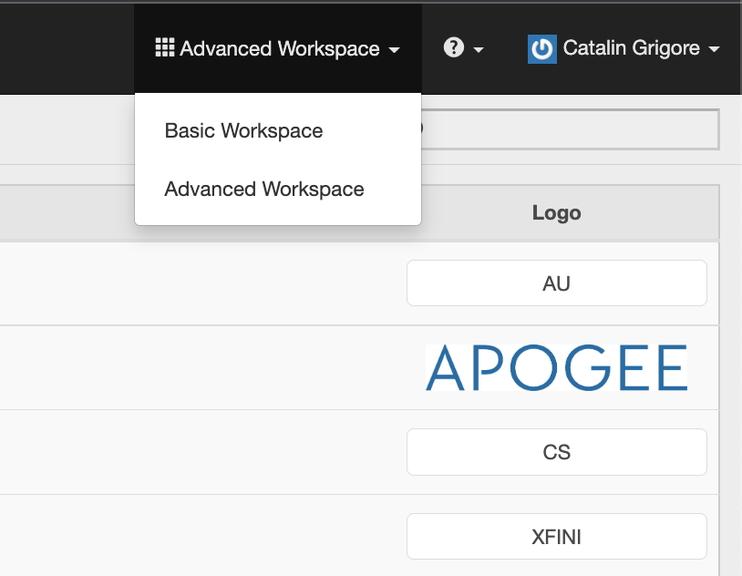

*圖1:Adobe PrimetimeTVE儀表板「基本/高級工作區」下拉清單*

## 環境 {#authn-environments}

根據用戶可能需要完成的任務，他/她可能需要在Adobe Primetime身份驗證環境之間切換。 有關Adobe Primetime驗證環境的詳細資訊，請參閱以下文檔： [瞭解Adobe Primetime身份驗證環境](/help/authentication/understanding-the-adobe-environments.md)。

TVE Dashboard提供了兩個名為「預定（預定）」和「發佈」的環境，每個環境都有兩個名為「暫存」和「生產」的配置檔案，如下所示：

* [普雷誇爾分段](https://console-prequal.auth-staging.adobe.com/)
* [預誇生產](https://console-prequal.auth.adobe.com/)
* [發佈暫存](https://console.auth-staging.adobe.com/)
* [發佈生產](https://console.auth.adobe.com/)

要在環境之間切換，用戶可以按一下下面所示下拉元素中的條目所表示的所需環境：

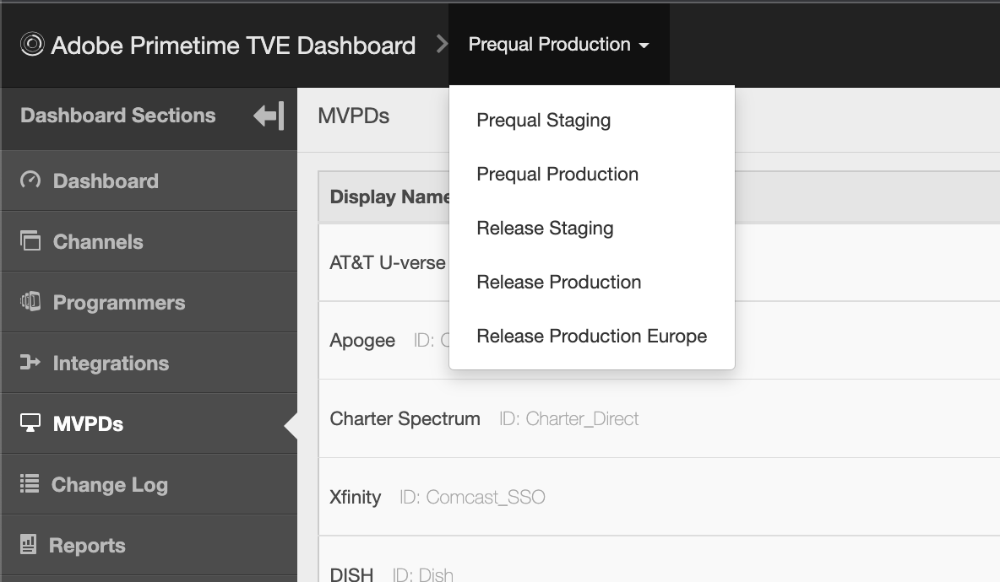

*圖2:「Adobe PrimetimeTVE Dashboard環境」下拉清單*

>[!IMPORTANT]
>請務必注意，在通過TVE控制板對您的Adobe Primetime身份驗證配置進行管理更改時，我們強烈建議您遵循以下順序以確保正確的功能。

要通過TVE控制板對您的Adobe Primetime身份驗證配置進行管理更改：

* 執行中的更改 [發放準備並驗證](http://sp.auth-staging.adobe.com/apitest/api.html)。
* 執行中的更改 [預生產並驗證](http://sp.auth-staging.adobe.com/apitest/api.html)。
* 執行中的更改 [發佈生產並驗證](http://sp.auth-staging.adobe.com/apitest/api.html)。

>[!IMPORTANT]
>要使管理更改生效，用戶必須通過選擇按鈕導航到「查看和推送更改」部分，該按鈕將顯示在邊欄左下角部分，以便查看更改、添加新建立的更改的說明，並通過選擇「推送配置」確認配置更新。

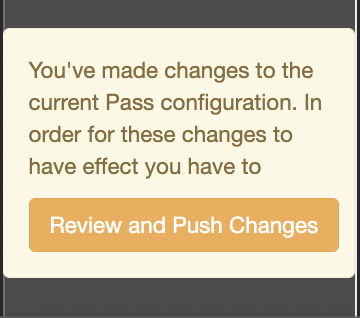

*圖3:Adobe PrimetimeTVE控制板審閱和推送更改通知*

## 節 {#sections}

為媒體公司（程式設計師）工作的用戶可以從邊欄訪問TVE Dashboard的以下部分：

* **頻道**  — 包含與內容提供程式相關的設定
* **程式設計師**  — 包含與聚合一個或多個父組織相關的設定 **頻道**
* **整合**  — 包含與整合相關的設定 **頻道** 和 **MVPD**
* **MVPD**  — 包含與可用設定相關的設定 **MVPD**
* **報告**  — 包含三種類型的報告的聚合資料：AuthN TTL、AuthZ TTL、SSO
* **更改日誌**  — 包含應用於TVE儀表板配置的最新修改

*圖4:Adobe PrimetimeTVE儀表板節*

### 頻道 {#tve-db-channels-section}

此部分允許查看和編輯可用通道的設定或建立新的通道。 按一下其中一個可用的「通道」(Channels)將返回帶有以下頁籤的螢幕：

* **通道資料**
   * **通道ID**  — 系統中使用的渠道的唯一ID，也稱為「請求者ID」。
   * **顯示名稱**  — 渠道的商業名稱。
* **常規設定**
   * **分析配置**  — 配置要轉發到Adobe Analytics的Adobe Primetime身份驗證事件。 請與Adobe聯繫，以瞭解在啟用此功能之前需要如何配置報告套件ID(RSID)的詳細資訊。
* **證書**

   包含驗證流中使用的證書清單及其頒發組織、頒發日期和到期日。 這些證書用作專用/公鑰，並用於驗證目的。
* **域**

   包含各通道將從中與Adobe Primetime身份驗證通信的域清單。
* **整合**

   包含與可用MVPD的整合清單，以及每個可能已啟用或未啟用的整合的狀態。 通過按一下特定條目，可以導航到「整合」頁。
* **已註冊的應用程式**

   包含應用程式註冊清單。 有關詳細資訊，請查看文檔 [動態客戶端註冊管理](/help/authentication/dynamic-client-registration-management.md)。

* **自定義方案**

   包含自定義方案清單。 有關詳細資訊，請參閱 [iOS/電視OS應用程式註冊](/help/authentication/iostvos-application-registration.md) 和 [動態客戶端註冊管理](/help/authentication/dynamic-client-registration-management.md)

#### 添加/刪除域 {#add-delete-domains}

要啟動為所選通道添加新域的過程，需要按一下「域」清單下的「添加新域」按鈕。 這將建立一個新的域條目，您可以在其中指定域名。 如果域清單中已存在更一般的域，則不應添加新的子域。

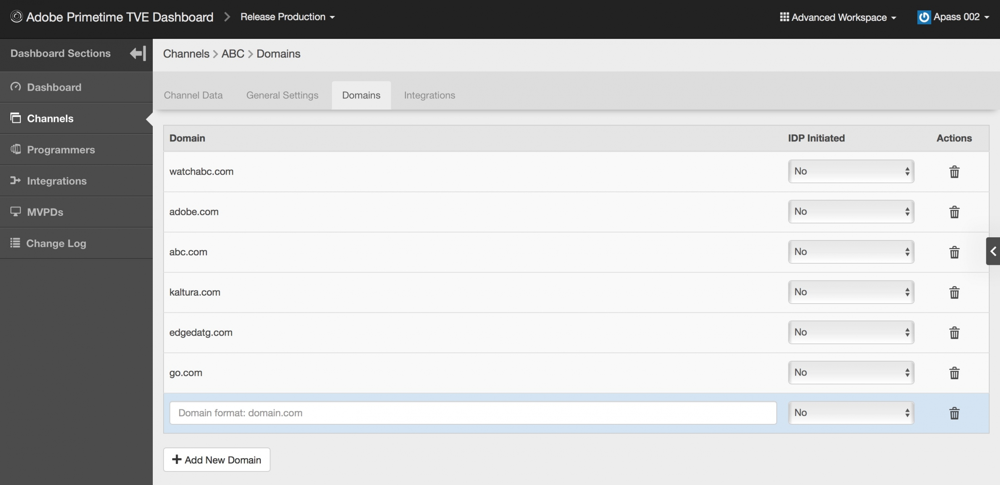

*圖：通道中的「域」頁籤*

### 程式設計師 {#tve-db-programmers-section}

此部分允許查看和編輯可用程式設計師的設定或建立新設定。 按一下可用程式設計師之一將返回帶有以下頁籤的螢幕：

* **程式設計師資料**
   * **程式設計師ID**  — 在系統中使用的程式設計師唯一ID。
   * **顯示名稱**  — 程式設計師的商業名稱。
   * **徽標URL**  — 程式設計師的商業徽標統一資源定位器(URL)。
   * **徽標預覽**  — 程式設計師的商業徽標預覽，方法是從上述統一資源定位器(URL)下載。

* **證書**

   包含驗證流中使用的證書清單及其頒發組織、頒發日期和到期日。 這些證書用作專用/公鑰，並用於驗證目的。

* **頻道**

   包含屬於此特定程式設計師的渠道清單。 通過按一下特定條目，可以導航到「通道」部分。

* **已註冊的應用程式**

   包含應用程式註冊清單。 有關詳細資訊，請參閱 [動態客戶端註冊管理](/help/authentication/dynamic-client-registration-management.md)。

* **自定義方案**

   包含自定義方案清單。 有關詳細資訊，請參閱 [iOS/電視OS應用程式註冊](/help/authentication/iostvos-application-registration.md) 和 [動態客戶端註冊管理](/help/authentication/dynamic-client-registration-management.md)。

### 整合 {#tve-db-integrations-sec}

此部分允許查看和編輯「通道」和可用MVPD之間的整合設定或建立新整合。 使用「基本工作區」時，按一下其中一個可用整合將返回單頁；使用「高級工作區」時，按一下帶有以下頁籤的螢幕將返回單頁：

* **整合資料**
   * **整合ID** — 將MVPD唯一ID附加到通道的唯一ID後，該ID由「_」字元分隔。
   * **通道顯示名稱**  — 渠道的商業名稱。
   * **通道ID**  — 系統中使用的渠道的唯一ID，也稱為「請求者ID」。
   * **MVPD顯示名稱** - MVPD的商業名稱。
   * **MVPD ID**  — 系統中使用的MVPD的唯一ID。
* **常規設定**
   * **用戶元資料鍵**  — 配置可用於特定整合的元資料鍵。
   * **平台特定設定**  — 為特定平台配置不同設定（例如TTL、SSO和IFrame）。

* **驗證設定**
   * 包含與Adobe Primetime身份驗證功能相關的設定。
* **授權設定**
   * 包含與Adobe Primetime身份驗證授權功能相關的設定。
* **註銷設定**
   * 包含與Adobe Primetime驗證註銷功能相關的設定。

#### 建立整合 {#create-integration}

要建立新整合，請執行以下步驟：

* 按一下「添加新整合」按鈕
* 搜索並選擇通道
* 搜索並選擇MVPD
* 等待TVE儀表板計算「整合ID」並顯示可用的MVPD端點
* 選擇驗證、授權和註銷終結點，或使用預設值
* 按一下「建立整合」按鈕
* 根據MVPD設定，彈出窗口可以出現並請求附加屬性，這些屬性應該事先由MVPD提供，否則將發生重定向到新建立的整合頁

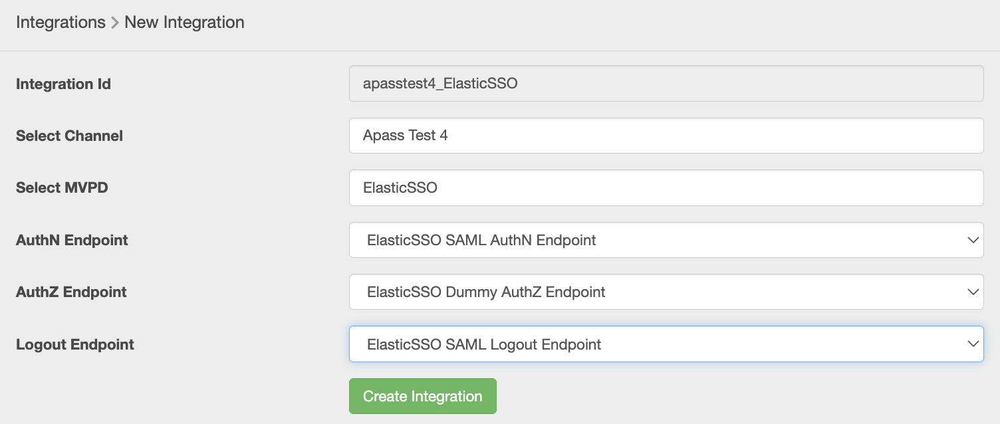

*圖5 Adobe PrimetimeTVE儀表板「新整合」窗口*

#### 更新整合 {#update-integration}

要更新現有整合，請從「整合」部分或包含「整合」頁籤的「渠道」部分按一下該特定整合的表條目。

使用「基本工作區」模式時，此部分將允許查看和編輯最常更新的設定，如驗證和授權令牌TTL（生存時間）以及iFrame設定。 請記住，與支援動態定義令牌持久性TTL的MVPD的整合可能缺少TTL設定（請參閱中的第1.19條） [MVPD整合要求](/help/authentication/mvpd-integr-features.md))。

使用「高級工作區」模式時，此部分將允許查看和編輯較少的常見設定。

在「基本」和「高級工作區」模式下，這些設定可以在平台級別進行更改（例如，為Android上的授權TTL令牌選擇一個自定義值，在其它任何平台上都是預設值）。

>[!IMPORTANT]
>瞭解設定繼承鏈非常重要：MVPD -> MVPD端點 — >整合 — >平台，其中平台具有最具體的值，MVPD是最一般的預設值。

*圖6. Adobe PrimetimeTVE儀表板屬性繼承鏈元件*

#### 平台特定設定 {#platform-sp-settings}

此子部分可用於覆蓋特定平台的設定。 可用平台包括：

* **所有平台**  — 設定將應用於所有平台的值，而不考慮程式設計師實施，以防沒有為特定平台設定其他值。
* **安卓**  — 設定將應用於通過Adobe Primetime驗證Android SDK實現的程式設計師的值。
* **無客戶端REST API**  — 設定將應用於通過Adobe Primetime驗證REST API的程式設計師實現的值。
* **消防電視**  — 設定將應用於通過Adobe Primetime驗證FireTV SDK實現的程式設計師的值。
* **FlashSDK**  — 此平台已棄用。 **棄用**
* **JavaScript SDK**  — 設定將應用於通過Adobe Primetime驗證JavaScript SDK的程式設計師實現的值。
* **羅庫**  — 設定將應用於通過Adobe Primetime驗證REST API的程式設計師實現以及將「Roku」作為設備類型發送的值。 在Roku設備的情況下，這優先於為無客戶端REST API平台設定的值。
* **Xbox本機SDK**  — 此平台已棄用。 **棄用**
* **Xbox 360 REST API**  — 設定將應用於通過Adobe Primetime認證REST API的程式設計師實現以及將「xbox」作為設備類型發送的值。 在Xbox 360設備的情況下，這優先於為無客戶端REST API平台設定的值。
* **Xbox One REST API**  — 設定將應用於通過Adobe Primetime認證REST API的程式設計師實現以及將「xboxOne」作為設備類型發送的值。 在XboxOne設備的情況下，這優先於為無客戶端REST Api平台設定的值。
* **iOS**  — 設定將應用於Adobe Primetime驗證iOSSDK上的程式設計師實施的值。
* **電視作業系統**  — 設定將應用於通過Adobe Primetime驗證tvOS SDK實現的程式設計師的值。

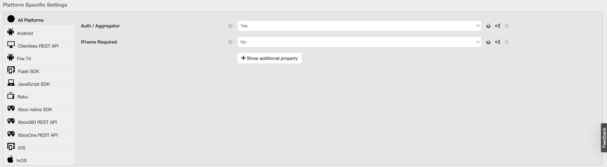

*圖7 Adobe PrimetimeTVE儀表板平台特定設定*

#### 啟用平台單一登錄 {#enable-platform-sso}

請按照以下步驟為特定整合和平台啟用/禁用單一登錄：

* 確保您正在使用「高級工作區」模式
* 導航到所需的整合
* 導航到 **常規設定** 頁籤
* 選擇要在其上啟用或禁用單一登錄的所需平台
* 切換 **啟用單一登錄** 標籤為所需值（是/否）

   >[!IMPORTANT]
   >必須指出， **啟用單一登錄** 此標誌僅適用於iOS、電視作業系統、Roku和FireTV平台，並且僅用於與支援這些平台的單一登錄的MVPD的整合。

* 切換 **強制平台權限** 標籤為所需值（是/否）

   >[!IMPORTANT]
   >必須指出， **強制平台權限** 標誌控制用戶是否將強制執行允許或拒絕平台訪問其TV Provider訂閱的決定。 在 **啟用單一登錄** 標誌設定為「是」， **強制平台權限** 標誌也設定為「是」，並且用戶選擇拒絕平台對其TV Provider訂閱的訪問，則相應的應用程式（頻道）將無法使用由另一應用程式（頻道）獲取的Adobe Primetime驗證令牌。

#### 啟用基於家庭的身份驗證 {#enable-hba}

請按照以下步驟啟用/禁用家庭基礎身份驗證 **OAuth2** 基於MVPD:

* 確保您正在使用「高級工作區」模式
* 導航到所需的整合
* 導航 **驗證設定** 頁籤
* 導航 **AuthN動態規則** 子頁籤
* 切換 **嘗試HBA** 標籤為所需值（是/否）

>[!IMPORTANT]
>請記住，「HBA AuthN TTL」值永遠不應被覆蓋，否則授權流可能會意外失敗。

伸向 **tve-support@adobe.com** 有關為基於SAML的MVPD啟用Home-Base身份驗證的資訊。

### MVPD {#tve-db-mvpds-sec}

此部分允許查看可用MVPD的設定。 按一下其中一個可用MVPD將返回帶有以下頁籤的螢幕：

* **MVPD資料**
   * **MVPD ID**  — 系統中使用的MVPD的唯一ID。
   * **顯示名稱** - MVPD的商業名稱，可能用於用戶的選取器。
   * **徽標URL** - MVPD的商業徽標統一資源定位器(URL)。
   * **徽標預覽**  — 通過從上述統一資源定位器(URL)下載MVPD的商業徽標預覽。
* **常規設定**
   * **用戶元資料鍵**
      * 可用於特定MVPD的元資料鍵。
   * **客戶端資料屬性**
      * **身份驗證/聚合器**  — 如果設定為「是」，則用戶嘗試訪問的每個新通道都需要新的身份驗證令牌。
      * **已啟用被動身份驗證**  — 如果Auth / Aggregator標誌設定為「是」，而Passive AuthN Enabled設定為「是」，則後台將發生具有其他通道的身份驗證過程，而不需要完全瀏覽器重定向並顯示選取器。
      * **驗證/瀏覽器會話**  — 如果設定為「是」，則用戶將在關閉瀏覽器後註銷。 如果設定為「否」，則用戶可以重新啟動瀏覽器並保持登錄狀態。
      * **需要IFrame**  — 如果設定為「是」，則表示MVPD登錄窗口需要iFrame。 「iFrame Width」和「iFrame Height」欄位表示載入MVPD登錄頁所需的iFrame大小。
* **驗證設定**
   * **選擇端點**
      * 此欄位指示MVPD公開的驗證終結點。 端點可以根據所使用的驗證協定而不同。
   * **AuthN常規設定**
      * 此子頁籤顯示MVPD使用的驗證協定和協定相關資訊。
   * **AuthN證書**
      * 此子頁籤顯示MVPD在驗證流中使用的證書及其頒發者組織、頒發日期和到期日。 這些證書用作專用/公鑰，並用於驗證目的。
   * **AuthN動態規則**
      * 此子頁籤顯示應用於驗證進程的規則。 通過按圖的「請求/響應/令牌」，您可以看到突出顯示的應用於驗證流程中該部分的參數。
* **授權設定**
   * **選擇端點**
      * 此欄位指示MVPD公開的授權終結點。 端點可能因所使用的授權協定而異。 可用的授權協定有SOAP、REST（用於無客戶端設備）、SAML、XACML和OAUTH。
   * **AuthZ常規設定**
      * 此子頁籤顯示MVPD使用的授權協定和協定相關資訊。
      * **印前檢查配置**
         * 它描述了MVPD在一次呼叫中可以預先授權的資源數、使用的PreFlith模型以及超時閾值。 有時，給定整合的資源數量可能不同。 可以通過編輯「 」來管理&#x200B;**印前檢查資源的最大數**&quot;屬性，可在「常規設定」頁籤下使用。 此屬性僅適用於給定的整合，如果設定了它，則將使用它，而不是授權設定 — >飛行前配置 — >飛行前最大資源中定義的值。
      * **DOS保護**
         * 它描述了MVPD授權端點上的拒絕服務保護。 有關每個欄位的確切說明，請懸停在「DOS Protection（DOS保護）」欄位上查看工具提示。
      * 如果MVPD是 **臨時傳遞**，則 **AuthZ常規設定** 還包含有關TempPass持續時間的資訊。
      * 如果MVPD是 **靈活溫度傳遞**，則 **AuthZ常規設定** 還包含有關TempPass持續時間、最大資源數和標識欄位的資訊（請參閱下圖）。
   * **AuthZ證書**
      * 此子標籤顯示MVPD在授權流中使用的證書及其頒發者組織、頒發日期和到期日。 這些證書用作專用/公鑰，並用於驗證目的。
   * **AuthZ動態規則**
      * 此子頁籤顯示適用於授權進程的規則。 按圖 **請求/響應/令牌**，可以以突出顯示的形式查看應用於授權流程的該部分的參數。
* **註銷設定**
   * **選擇端點**
      * 此欄位指示MVPD公開的註銷終結點。 提供的協定可以是SAML或OAuth2。
      * **註銷常規設定**
         * 此子頁籤顯示MVPD使用的註銷協定和協定相關資訊。
         * **要求註銷響應已簽名**  — 如果設定為「是」，則響應必須由受信任的證書籤名。
      * **註銷證書**
         * 此子標籤顯示MVPD在註銷流中使用的證書及其頒發者組織、發放日期和到期日。 這些證書用作專用/公鑰，並用於驗證目的。
      * **註銷動態規則**
         * 此子頁籤顯示應用於註銷進程的規則。 按圖 **請求/響應/令牌**，可以以突出顯示的形式查看應用於註銷流程的該部分的參數。

### 報告 {#tve-db-reports-sec}

要導航到此部分，請按一下「 」中的「 Reports 」[儀表板節](#sections)的子菜單。 這將導航到帶有3個頁籤的螢幕，將在以下子部分中詳細顯示： [AuthN TTL報告](#authn-ttl-reports)。 [AuthZ TTL報告](#authz-ttl-reports)。 [SSO報告](#sso-reports)。

本部分允許查看和導出用於所有平台上各種MVPD的Channel/s整合的多種類型的報告的聚合資料。

#### 平台 {#report-platforms}

所有報告在以下平台上聚合值：

**瀏覽器**
顯示將應用於通過Adobe Primetime驗證JavaScript SDK的程式設計師實現的值。

**移動：iOS**
顯示將應用於通過Adobe Primetime驗證iOSSDK的程式設計師實施的值。

**移動：安卓**
顯示將應用於通過Adobe PrimetimeAuthentication Android SDK實現的程式設計師的值。

**移動：其他**
顯示將應用於為移動設備開發的Adobe Primetime驗證REST API上的程式設計師實現的值。

**TVCD:羅庫**
顯示將應用於通過Adobe Primetime驗證REST API的程式設計師實現的值，並將「Roku」作為設備類型發送。

**TVCD:FIRETV**
顯示將應用於通過Adobe Primetime驗證FireTV SDK實現的程式設計師的值。

**TVCD:阿普爾特維**
顯示將應用於通過Adobe Primetime驗證tvOS SDK的程式設計師實現的值。

**TVCD:其他**
顯示將應用於通過Adobe Primetime驗證REST API為電視連接設備開發的程式設計師實現的值。

**平台：未知**
顯示將應用於Adobe Primetime認證服務檢測未知設備類型的程式設計師實現的值。

審查 [傳遞客戶端資訊](/help/authentication/passing-client-information-device-connection-and-application.md) 到Adobe Primetime驗證REST API或SDK，以瞭解有關如何發送所需設備類型（例如「Roku」）的詳細資訊。

所有報告根據每個Adobe Primetime身份驗證環境特定的配置計算的聚合值。 因此，在不同的TVE Dashboard環境之間切換時，您可以看到不同的報告資料。

請查看 [環境](#authn-environments) 的子菜單。

##### 選擇特定通道/MVPD {#selecting-specific-channels-mvpds}

所有報告都允許通過選擇特定通道或選擇要包含在結果報告中的特定MVPD來使用篩選器。

要選擇一個或多個通道/秒，請使用 **下拉清單** 位於「為報表選擇的通道」標籤後。 請參閱圖8。/9./10. 影像。

要選擇一個或多個MVPD/s，請使用 **下拉清單** 放置在「為報表選擇的MVPD」標籤之後。 請參閱圖8。/9./10. 影像。

預設情況下，資料會聚合到您公司的所有渠道（「所有渠道」）及其整合的MVPD（「所有MVPD」）中。

如果選擇取消選擇「所有通道」或「所有MVPD」而不選擇特定選項，則UI將顯示「無可用資料」佔位符。

##### 導出報告 {#export-report}

所有報告都允許以逗號分隔值(CSV)格式檔案導出資料。

要導出資料，請使用窗口右上角的「導出報告」按鈕。 請參閱圖8。/9./10. 影像。

名為 **報表.csv** 將自動下載到您的電腦。 因此，請確保瀏覽器的設定允許下載檔案。

計算Report.csv檔案時，螢幕上將顯示「導出資料」載入表徵圖，該表徵圖可以 **幾分鐘** 取決於要導出的資料大小。

#### AuthN TTL報告(#authn-ttl — 報告)

此報告顯示為所有平台上的各種MVPD的通道/s整合/s配置的驗證令牌的生存時間(TTL)。

驗證令牌Time-To-Live，也稱為 **AuthN TTL**，顯示在人類可讀的值中，例如： **天、小時、分、秒**。

根據用戶體驗，AuthN TTL報告允許您根據特定MVPD和特定平台來直觀地檢查用戶被驗證的時間。

要導航到此類型的報告，請按一下「報告」部分中的「AuthN TTL報告」頁籤。

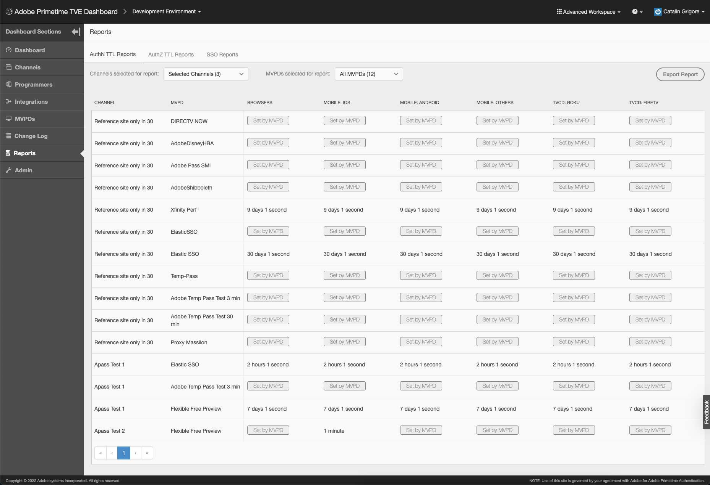

*圖8:「Adobe PrimetimeTVE儀表板身份驗證TTL報表」頁籤*

AuthN TTL報表表包含頁面，並且根據螢幕大小水準和垂直滾動。

如果您考慮更改AuthN TTL值，請查看 [整合](#tve-db-integrations-sec) 的子菜單。

>[!IMPORTANT]
>「」**由MVPD設定**&quot;佔位符用於MVPD將是強制AuthN TTL值而非Adobe Primetime身份驗證配置的佔位符。

#### AuthZ TTL報告 {#authz-ttl-reports}

此報告顯示為所有平台上具有各種MVPD的通道/s整合/s配置的授權令牌的生存時間(TTL)。

授權令牌Time-To-Live，也稱為 **AuthZ TTL**，顯示在人類可讀的值中，例如： **天、小時、分、秒**。

根據用戶體驗，AuthZ TTL報告允許您根據特定MVPD和特定平台直觀地檢查用戶將獲得授權的時間。

要導航到此類型的報告，請按一下「報告」部分中的「AuthZ TTL報告」頁籤。

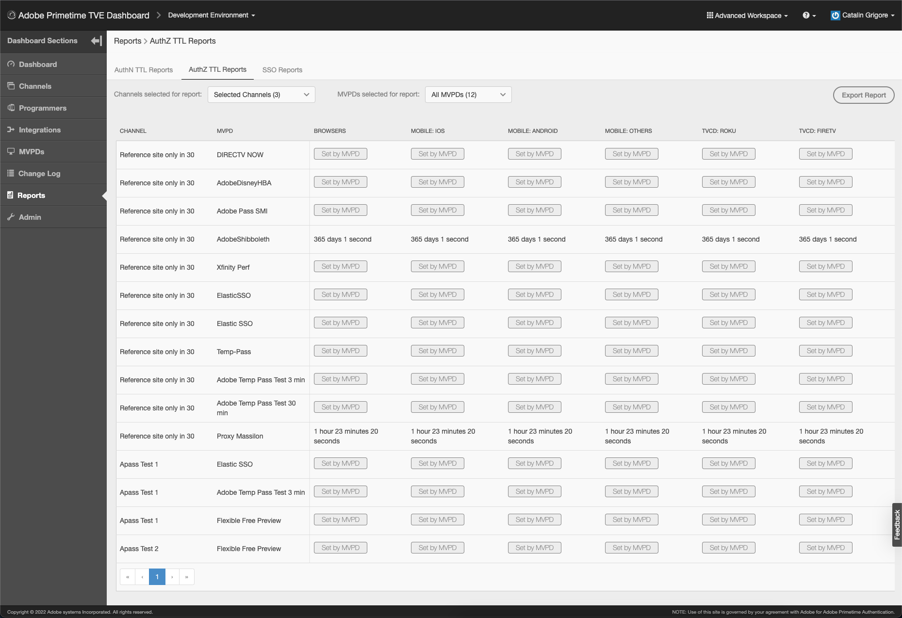

*圖9. 「Adobe PrimetimeTVE儀表板AuthZ TTL報告」頁籤*

AuthZ TTL報表表包含頁面，並且根據螢幕大小水準和垂直滾動。

如果您考慮更改AuthZ TTL值，請參見 [整合](#tve-db-integrations-sec) 的子菜單。

>[!IMPORTANT]
>「」**由MVPD設定**&quot;佔位符用於MVPD將是強制AuthZ TTL值而非Adobe Primetime身份驗證配置的佔位符。

#### SSO報告 {#sso-reports}

此報告顯示為所有平台上具有各種MVPD的Channel/s整合/s配置的單一登錄(SSO)狀態。

單一登錄狀態，也稱為 **SSO狀態**，顯示為具有以下可能值的三態： **禁用SSO、啟用SSO、不確定SSO**。

根據用戶體驗，SSO報告允許您考慮特定MVPD和特定平台，直觀地檢查預期的用戶驗證SSO體驗。

要導航到此類型的報告，請按一下「 」**SSO報告**「 」頁籤&#x200B;**報告**&#x200B;的子菜單。

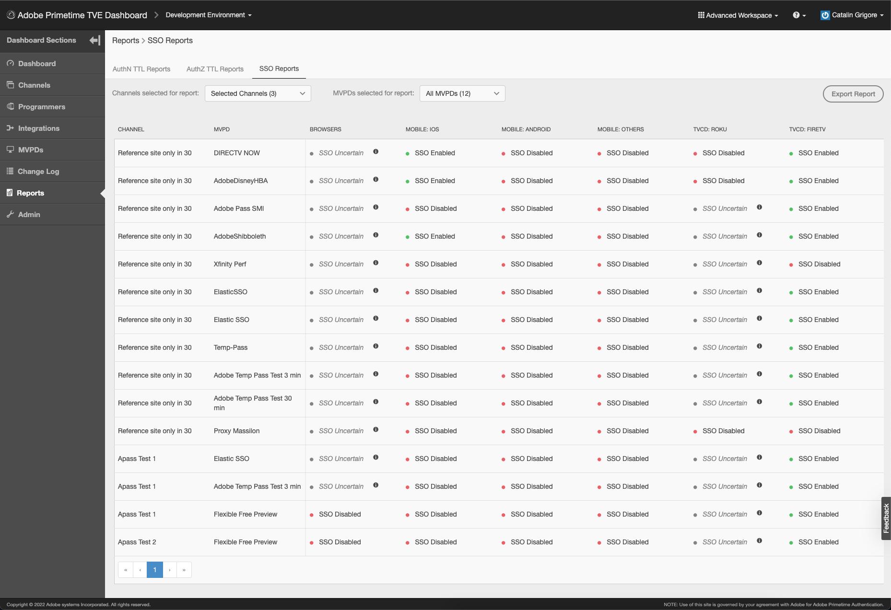

*圖10:「Adobe PrimetimeTVE儀表板SSO報表」頁籤*

「SSO報告」表包含頁面，並且根據螢幕大小水準和垂直滾動。

如果您考慮更改SSO狀態，請查看 [整合](#tve-db-integrations-sec) 的子菜單。

>[!IMPORTANT]
>&quot;**SSO不確定**「在啟用了SSO且可能的情況下，使用佔位符，但用戶平台設定/用戶決策（例如，用戶瀏覽器選項阻止第三方cookie，用戶選擇拒絕平台訪問其TV Provider訂閱）或MVPD設定（例如，請求每個頻道驗證的MVPD）可能會阻止SSO的發生。

### 更改日誌 {#tve-db-changelog-sec}

此部分顯示通過TVE Dashboard向Adobe Primetime驗證環境和配置推送的所有修改的清單。

有清單指示推送日期、操作修改的用戶和推送狀態。

此部分還允許比較兩個表條目，以縮小要檢查的特定修改範圍，甚至將比較作為郵件項共用。

### 反饋 {#tve-db-feedback-sec}

此部分允許用戶發送反饋。 按照以下步驟向Adobe Primetime驗證產品團隊提供反饋：

* 按一下螢幕右側的「反饋」按鈕
* 輸入主題
* 輸入消息
* 如果需要，請按一下「上載螢幕截圖」按鈕將螢幕截圖上載到消息
* 按一下「提交」按鈕

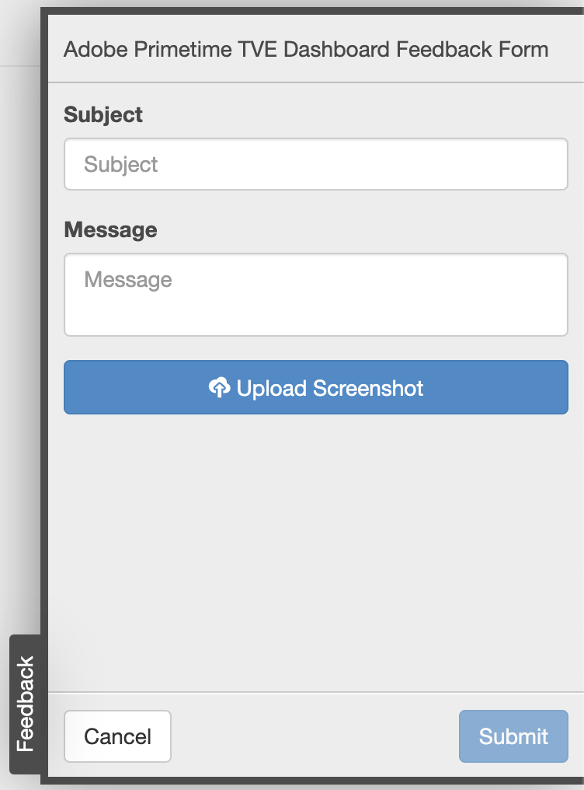

*圖11:Adobe PrimetimeTVE儀表板反饋部分*

有關如何捕獲螢幕截圖的說明，請查看以下連結：

* [如何在Windows上捕獲螢幕截圖](https://support.microsoft.com/en-us/windows/use-snipping-tool-to-capture-screenshots-00246869-1843-655f-f220-97299b865f6b#1TC=windows-7)

* [如何在Mac捕獲截屏](https://support.apple.com/en-us/HT201361)

## 故障排除 {#tve-db-troubleshoot}

### 維護模式 {#maintenance-mode}

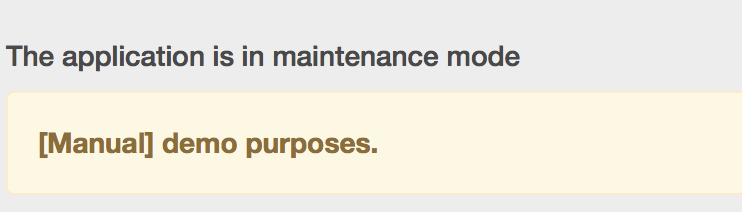

*圖：TVE應用在維護模式下*

如果TVE儀表板處於「維護模式」，則用戶將無法查看或進行新的更改。

如果發生這種情況，您將必須等待Adobe Primetime認證工程團隊在TVE儀表板上完成維護工作。

### 降級狀態 {#degraded-state}

*圖：TVE應用處於降級狀態*

如果TVE儀表板處於「降級」狀態，則用戶將缺乏搜索和排序功能，但用戶將能夠查看或進行新的更改。

如果發生這種情況，您將必須等待Adobe Primetime認證工程團隊在TVE儀表板上完成維護工作。
