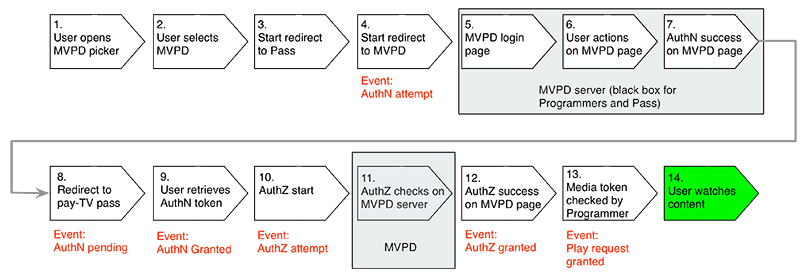
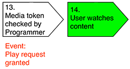
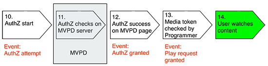

# 瞭解伺服器端量度 {#understanding-server-side-metrics}

>[!NOTE]
>
>此頁面上的內容僅供參考。 使用此API需要Adobe的目前授權。 不允許未經授權的使用。

## 簡介 {#intro}

本檔案說明「軟體權利檔案服務監視(ESM)」服務產生的Adobe Primetime驗證伺服器端測量結果。 它並未說明從使用者端角度所看到的相同事件(如果程式設計師在其頁面/應用程式上實作Adobe Analytics等測量服務，他們會看到什麼)。

## 事件摘要 {#events_summary}

從Adobe Primetime驗證伺服器端的觀點來看，會產生下列事件：

* **驗證流程中產生的事件**（使用MVPD的實際登入）

   * 驗證嘗試通知 — 這會在使用者傳送至MVPD登入網站時產生。
   * AuthN擱置通知 — 如果使用者以其MVPD成功登入，這會在使用者重新導向回Primetime驗證時產生。
   * 授權通知 — 當使用者返回程式設計師網站，並且已成功從Primetime驗證擷取驗證Token時，就會產生此通知。
* **授權流程** （只要檢查是否有MVPD授權）\
  *先決條件：* 有效的AuthN權杖
   * AuthZ嘗試通知
   * 已授予AuthZ的通知
* **播放要求成功**\
  *先決條件：* 有效的AuthN和AuthZ權杖
   * 使用Adobe Primetime驗證的檢查通知
   * 播放要求需要授與的驗證和授與的授權

不重複使用者的人數將在中詳細說明。 [不重複使用者](#unique-users) 一節。 綜上所述，由於授與的驗證和授權回應通常會進行快取，因此通常會套用下列公式：

* AuthN嘗試次數\>授與AuthN的次數
* AuthZ嘗試次數\>授與AuthZ的次數
* AuthZ嘗試次數\>授與AuthN的次數（通常是）
* 成功的播放要求數\>授與AuthZ的數量

### 範例 {#example}

下列範例顯示一個品牌一個月的伺服器端量度：

| 量度 | MVPD 1 | MVPD 2 | … | MVPD n | 總計 |
| -------------------------- | ------ | ------ | - | ------ | ---------------------------------------------- |
| 成功的驗證 | 1125 | 2892 |   | 2203 | SUM(MVP1+...MVPD n) |
| 成功的授權 | 2527 | 5603 |   | 5904 | SUM(MVP1+...MVPD n) |
| 成功的播放要求 | 4201 | 10518 |   | 10737 | SUM(MVP1+...MVPD n) |
| 不重複使用者 | 1375 | 2400 |   | 2890 | 所有MVPD使用者消除重複項的總和\* |
| 已嘗試的驗證 | 2147 | 3887 |   | 3108 | SUM(MVP1+...MVPD n) |
| 已嘗試的授權 | 2889 | 6139 |   | 6039 | SUM(MVP1+...MVPD n) |

 

在此情況下，重複資料刪除應該不會有任何影響，因為不同的MVPD使用者不應該收到相同的使用者ID。 針對兩個不同品牌但相同MVPD執行加總時，重複資料刪除效果應該要大得多。

## 事件觸發程式 {#event_triggers}

### 新使用者 — 完整流量 {#new-user-full-flow}

下表說明沒有驗證權杖的使用者（新使用者或驗證權杖的使用者已過期）的事件和步驟：

此流程包含驗證(#5為\#7)和授權(\#11)的MVPD往返。

流程完成後，驗證和授權權杖就會在使用者裝置上進行快取。 驗證權杖的存留時間(TTL)值介於6小時到90天之間。 AuthN權杖到期會自動強制AuthZ權杖到期。 授權權杖的TTL值通常為24小時。

| 已觸發伺服器端事件 | <ul><li>驗證嘗試、驗證擱置中、已授與驗證</li><li>授權嘗試，已授予授權</li><li>播放要求成功</li></ul> |
|---|---|

### 傳回的使用者 — 快取AuthZ和AuthN權杖

如果使用者具備有效的AuthZ和AuthN權杖已快取，便會發生下列步驟：

呼叫時自動觸發 `getAuthorization()`，且僅涉及使用Adobe Primetime驗證的檢查。 此流程不涉及MVPD。

| 已觸發伺服器端事件 | *成功的播放要求 |
|---|---|

### 傳回使用者 — 已快取AuthN權杖，AuthZ權杖已過期

對於仍擁有有效AuthN權杖的使用者，將進行下列步驟：

此流程涉及到MVPD的來回行程。

| 已觸發伺服器端事件 | <ul><li>授權嘗試，授權確定</li><li>播放要求成功</li> |
|---|---|

## 驗證事件 {#authn_events}

### 驗證嘗試 {#authentication-attempt}

如上圖所示，驗證事件僅在使用者對MVPD進行往返時觸發；驗證事件不包含快取的權杖驗證。

使用者從選擇器按一下特定的MVPD後，就會觸發驗證嘗試事件。

* MVPD端第一個接近這個的事件是頁面載入
* Adobe Primetime驗證不會計算使用者登入MVPD頁面的重複嘗試次數（密碼不正確，請重試）
* 多次嘗試均計為一次嘗試
* 有些MVPD也會在「驗證」步驟中執行「授權」，如果授權失敗，系統不會將使用者重新導向。

### 驗證擱置中 {#authentication-pending}

當向Adobe Primetime驗證的重新導向程式啟動時，就會發生此事件。

### 已授與驗證 {#authentication-granted}

使用者是MVPD的已知訂閱者，通常是付費電視訂閱，但有時僅能存取網際網路。 發生成功的驗證可能是因為使用者使用其MVPD明確輸入有效認證，或是因為他們之前輸入有效認證並勾選「記住我」（且先前的工作階段未過期）。

因此，MVPD會傳送Adobe Primetime驗證以肯定回應驗證請求，而Adobe Primetime驗證會建立 *AuthN權杖*.

* 驗證通常會長時間快取（一個月或更久）。 因此，在Token過期且流程重新開始之前，驗證事件將不會再存在。
* 透過單一登入從其他網站/應用程式傳入將不會觸發驗證事件。

### Comcast驗證 {#comcast-authentication}

與其他MVPD相比，Comcast具有不同的AuthN流程。

以下功能說明差異：

* **工作階段Cookie行為**：這會在使用者關閉瀏覽器後，完全移除任何驗證權杖。 此功能僅存在於網頁上。 主要目的是確保您的Comcast工作階段不會持續存在不安全的/共用電腦上。 其影響是，與其他MVPD相比，會有更多驗證嘗試/授權的流程。

* **每個requestorID的AuthN**：Comcast不允許將AuthN狀態從一個請求者ID快取至另一個請求者ID。 因此，每個網站/應用程式都必須前往Comcast取得驗證Token。 除了使用者體驗考量事項外，上述影響是會產生更多驗證嘗試/授予的事件。

* **被動驗證**：為了改善使用者體驗，同時仍維持每個requestorID的AuthN功能，被動驗證流程會在隱藏的iFrame中進行。 使用者看不到任何內容，但事件仍會像之前一樣觸發。

如果使用者在Comcast登入頁面上按一下「記住我」，則後續的此頁面造訪（在2週內）將只是快速重新導向。 否則，使用者實際上必須在頁面上進行驗證。

### 驗證失敗 {#unsuccessful-authentication}

在Adobe Primetime驗證中，不成功的驗證本身並非事件，但可計算為嘗試與成功之間的差異。

在2013年5月發行版本中，Adobe Primetime驗證將為因系統或網路錯誤(包括DRM錯誤（權杖繫結失敗）和LSO錯誤（沒有空間寫入權杖等）而導致的失敗驗證新增錯誤代碼。

### 驗證轉換率 {#authenitication-conversion-rate}

程式設計師可以追蹤的一個有趣量度是驗證轉換率，計算方式為（AuthN請求/已授與AuthN）%。

關於量度的部分注意事項：

* 由於這是以事件為基礎的量度，因此不會真正反映不重複使用者轉換率（如果使用者嘗試八次並第九次成功），這會非常嚴重地反映上述轉換率。
* 在Adobe Primetime驗證（伺服器端）中，（尚）無法計算唯一式驗證轉換。
* 如果網站/應用程式中出現自動AuthN重試，這也會扭曲上述量度。

## 授權事件 {#authorization_events}

### 授權嘗試 {#authorization_attempt}

除了取得驗證Token之外，使用者在播放內容之前也必須取得授權Token。 這通常發生在驗證之後，或授權權杖過期時。 由於此檢查是在伺服器端完成(從Adobe Primetime驗證伺服器到MVPD伺服器)，使用者不需要執行任何動作。

### 授權已授予 {#authorization-granted}

「授權已授予」表示已驗證使用者的訂閱包含請求的程式設計。

請注意，並非所有MVPD都支援個別的授權步驟；對於某些驗證，授權是等同的。 MVPD會將成功的回應傳送給Adobe Primetime驗證以回傳通道的AuthZ請求，而Adobe Primetime驗證會建立AuthZ權杖。

* AuthZ權杖會快取一段時間，通常是24小時。在此期間不會引發任何AuthZ事件。
* 有些MVPD可搭配資產層級授權使用，有些則搭配管道層級授權使用； — 視使用的授權而定，會引發更多或更少的AuthZ事件。 即使為了通道層級的授權，快取也已經就位 — 因此，如果在不到24小時內請求了相同的資產，將不會觸發任何事件。

### 授權遭拒 {#authorization-denied}

如果授權被拒絕，則已驗證的使用者對於請求的程式設計沒有已確認的訂閱。 最可能的原因是頻道不是使用者訂閱套件的一部分，但這也可能反映使用者只能從MVPD存取網際網路。

對於某些MVPD，即使使用者只有MVPD的網際網路訂閱（無付費電視訂閱），仍可成功驗證使用者。 在這種情況下，即使使用者請求授權的管道位於基本套件中，授權也會被拒絕。

有些MVPD會針對AuthZ拒絕提供自訂錯誤訊息，其中可能包含選件以升級其套件。

### 授權轉換率 {#authorization-conversion-rate}

驗證轉換率可計算為（AuthZ要求/ AuthZ已授與）%。

### 播放要求成功 {#successful-play-request}

同時經過驗證和授權的使用者可以檢視受保護的內容。

在成功的播放要求後，Adobe Primetime驗證會產生一個短暫的媒體代號，斷言使用者有權檢視要求的影片。 程式設計師使用此媒體權杖進一步驗證預期的檢視者。 媒體代號會作為成功的播放請求受到追蹤。

* Adobe Primetime驗證會 *非* 追蹤在產生媒體權杖後視訊播放是否實際開始。 例如，如果內容有地理限制，即使串流從未實際開始，交易仍會計為成功的播放請求。
* 由於AuthN和AuthZ權杖會快取一段時間的MVPD回應，因此成功的播放要求事件是量度中最常見的事件。

## 不重複使用者 {#unique-users}

### 定義 {#definition}

在成功驗證後，Adobe Primetime驗證會根據傳回的MVPD使用者ID值，追蹤唯一使用者的存在。  此值以使用者的登入資訊為基礎，但不包含任何可識別個人身份的資訊。

此值也會在sendTrackingData回呼中傳遞至網站/應用程式。

此值可以跨裝置持續存在（MVPD會為指定使用者產生相同的值，無論登入發生於何處）或暫時性(對於每個登入，都會產生新值，MVPD會在後端進行對應。 通常MVPD提供給Adobe Primetime驗證的值會在工作階段和裝置之間持續存在，但如前所述，持續性既不保證也不驗證。

此值用於計算不重複使用者。 所報告的值（每個請求者ID/間隔/MVPD）會針對特定間隔進行重複資料刪除。 因此，每天不重複使用者的總和通常與每月值不同，每月值的值較低。

此數字包含來自Adobe Primetime驗證的所有事件，減去驗證嘗試（沒有使用者ID），但包括已嘗試（也可能是失敗）的授權。

### 範例 {#examples}

#### 第1天 {#day1}

使用者XYZ前往網站觀看影片。

引發的事件：

* AuthN嘗試（尚無唯一使用者）
* 已授與AuthN
   * 此時，我們會根據MVPD傳回的內容來唯一識別使用者，因此每日不重複使用者計數會增加1
   * AuthN權杖會快取30天
* AuthZ嘗試/授予的事件
   * AuthZ權杖已快取1天
* 播放要求事件成功

#### 第1天（稍後） {#day1-later-on}

使用者XYZ觀看另一部影片。

引發的事件：

* 播放要求事件成功（其餘會快取）
* 每日或每月不重複專案沒有增加

#### 第3天 {#day3}

使用者XYZ觀看另一部影片。

引發的事件：

* AuthZ嘗試/授予的事件
   * 因為從第1天起的1天快取已過期
* 播放要求事件成功（其餘會快取）
* 每日不重複使用者增加1 — 每月不重複使用者仍為1

#### 第31天 {#day31}

使用者XYZ觀看另一部影片。

與第1天相同，因為AuthN快取已過期。

如果同一個使用者授權失敗，每月不重複使用者計數仍會增加1，因為有兩個事件包含使用者ID：授與驗證和授權嘗試。

### 單一登入(SSO) {#single-sign-on-sso}

在某些情況下，不重複使用者數可能會大於成功驗證數。 當許多使用者透過SSO從其他網站/應用程式進入時，通常就會發生這種情況，而且只需要取得目前網站/應用程式上的授權。

### 比較使用者端和伺服器端不重複使用者 {#comparing-client-side-and-server-side-unique-users}

若使用者ID值來自 `sendTrackingData()` 用於使用者端以計算不重複使用者，則使用者端和伺服器端的號碼應相符。

如果差異是主要的，則通常以下原因可以解釋差異：

* 視訊播放獨一無二與所有活動獨一無二。 如前所述，Adobe Primetime驗證會計入所有事件（AuthN嘗試除外）的不重複使用者。 這表示如果使用者僅驗證（在頁面上）但未檢視視訊，仍會觸發不重複使用者計數增加。

* 計算授權失敗的使用者數 — Adobe Primetime驗證也會計算這些使用者以及報告的數量。

<!--
## Related Information {#related-information}

- [Entitlement Service Monitoring API](/help/authentication/entitlement-service-monitoring-api.md)

-->
