# API總覽 {#api-overview}

檢視 [線上API檔案](http://docs.adobeptime.io/cm-api-v2/) 以取得更多詳細資料。

## 用途和先決條件 {#purpose-prerequisites}

本檔案可協助應用程式開發人員在實作與並行監視的整合時，使用我們的Swagger API規格。 強烈建議讀者先瞭解服務定義的概念，再遵循本指引。 為了能瞭解這點，有必要瞭解 [產品檔案](/help/concurrency-monitoring/cm-home.md) 和 [Swagger API規格](http://docs.adobeptime.io/cm-api-v2/).

## 簡介 {#api-overview-intro}

在開發過程中，Swagger公開檔案代表瞭解和測試API流程的參考指引。 這是一個絕佳的起點，以便擁有實作方法，並熟悉真實世界應用程式在不同使用者互動情境下的行為方式。

在中提交票證 [Zendesk](mailto:tve-support@adobe.com) 在並行監視中註冊您的公司和應用程式。 Adobe會將應用程式ID指派給每個實體。 在本指南中，我們將使用兩個具有id的參考應用程式 **demo-app** 和 **demo-app-2** 這些許可權將位於租使用者Adobe下。

## 使用案例 {#api-use-case}

使用Swagger測試流量的第一步是在頁面的右上角輸入應用程式ID，如下所示：

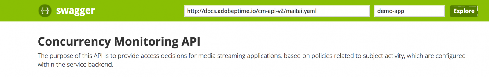

之後，我們按下 **探索** 以設定將在對REST API進行的所有呼叫的授權標頭中使用的ID。  每個API呼叫都預期應用程式ID會透過HTTP基本驗證傳入。 使用者名稱是應用程式ID，而密碼為空白。

### 第一個應用程式 {#first-app-use-cases}

具有ID的應用程式 **demo-app** 已由Adobe團隊指派一項原則，其中一項規則將同時串流數量限製為3。 會根據在Zendesk中提交的請求，將原則指派給特定應用程式。

#### 正在擷取中繼資料 {#retrieve-metadata-use-case}

我們進行的第一個呼叫是針對中繼資料資源，以便在工作階段初始化期間取得需要作為表單資料傳遞的中繼資料屬性清單。 此中繼資料將用於評估指派給此應用程式的原則。

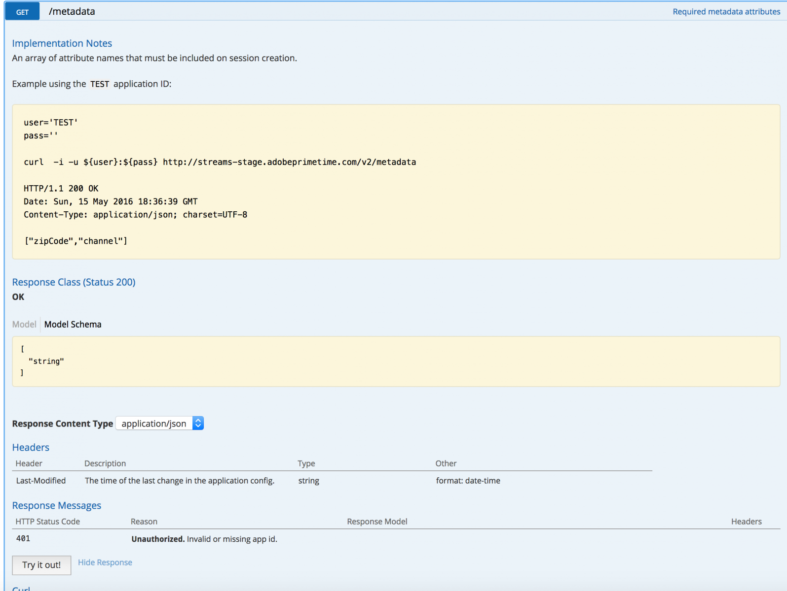

按下「試用版」後，適用於具有ID的應用程式 **demo-app** 我們會得到下列結果：

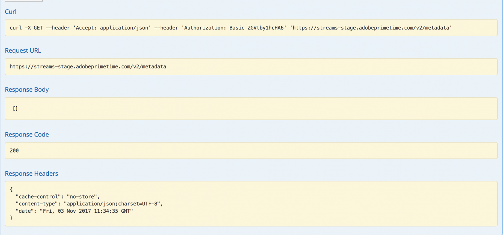

我們從回應本文欄位中看到，中繼資料屬性清單是空的。 這表示設計所需的屬性足以評估指派給此應用程式的3個串流原則。 另請參閱 [標準中繼資料欄位檔案](/help/concurrency-monitoring/standard-metadata-attributes.md). 進行此呼叫後，我們可以繼續並在「工作階段」REST資源上建立新的工作階段。

#### 工作階段初始化 {#session-initial}

工作階段初始化呼叫是在取得執行呼叫所需的所有必要資訊後，由應用程式完成的。

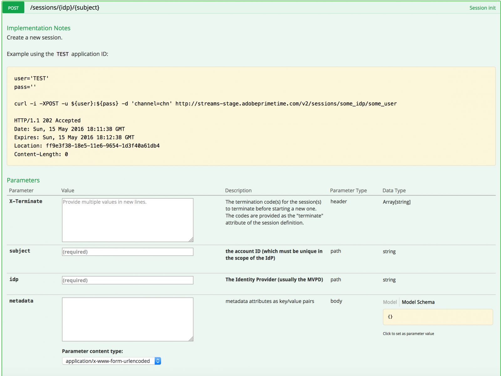

第一次呼叫時不需要提供任何終止程式碼，因為我們沒有任何其他作用中的資料流。 而且沒有中繼資料屬性，因為擷取中繼資料呼叫未傳回任何屬性。

此 **主旨** 和 **idp** 引數是必要的，將會指定為URI路徑變數。 您可以取得 **主旨** 和 **idp** 引數，方法是呼叫 **mvpd** 和 **上游使用者ID** Adobe Primetime驗證的中繼資料欄位。 另請參閱 [中繼資料API概觀](https://experienceleague.adobe.com/docs/primetime/authentication/auth-features/user-metadat/user-metadata-feature.html?lang=en#). 在此範例中，我們會提供「12345」值作為主旨，以及「adobe」值作為idp。

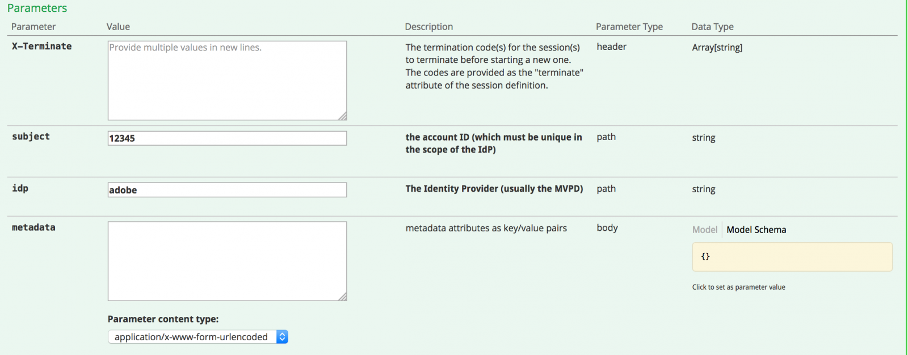

進行工作階段初始化呼叫。 您會收到下列回應：

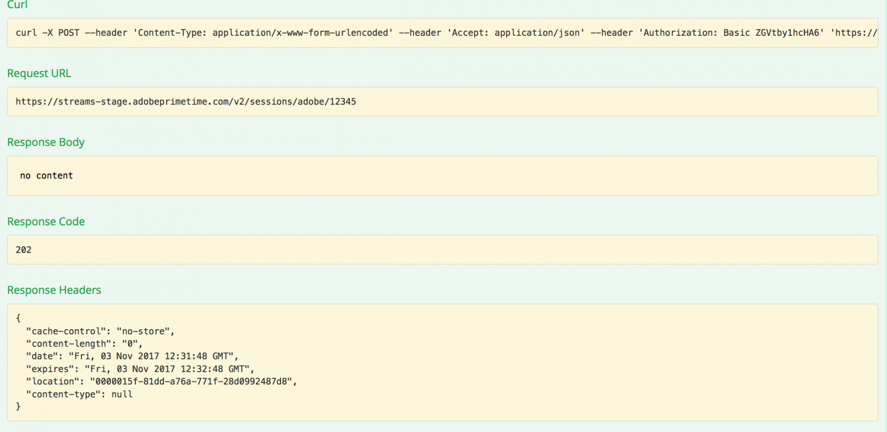

我們需要的所有資料都包含在回應標題中。 此 **位置** 標題代表新建立工作階段的id，而 **日期** 和 **過期** 標題代表用來排程應用程式進行下一個心率以保持工作階段運作的值。

#### 心率 {#heartbeat}

進行心率呼叫。 提供 **工作階段id** 取得自工作階段初始化呼叫，以及 **主旨** 和 **idp** 使用的引數。

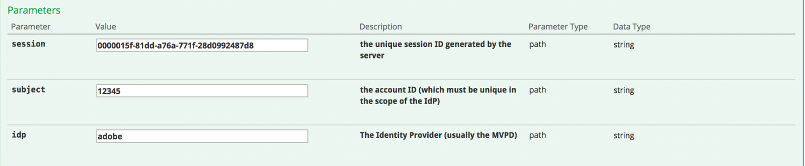

如果工作階段仍然有效（尚未過期或已手動刪除），您將會收到成功的結果：

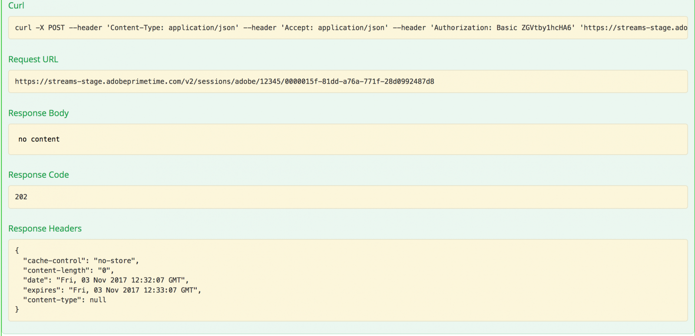

如同第一種情況，我們將使用 **日期** 和 **過期** 標頭來排程此特定工作階段的其他心率。 如果工作階段不再有效，此呼叫將會失敗，並產生410 GONE HTTP狀態代碼。

您可以使用Swagger UI中的「保持資料流作用中」選項，在特定工作階段上執行自動心率，這可幫助您測試規則，而不必擔心及時執行工作階段心率所需的樣板。 此按鈕會與「Swagger心率」標籤中的「試用」按鈕並列。 若要針對所有建立的工作階段設定自動心率，您必須在網頁瀏覽器分頁中開啟個別Swagger UI，讓工作階段分別排程每個工作階段。

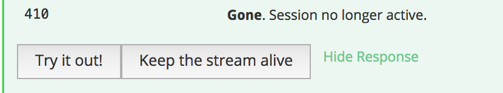

#### 工作階段結束 {#session-termination}

根據貴公司的業務案例，例如當使用者停止觀看視訊時，可能需使用並行監視來終止特定工作階段。 這可透過在工作階段資源上進行DELETE呼叫來完成。

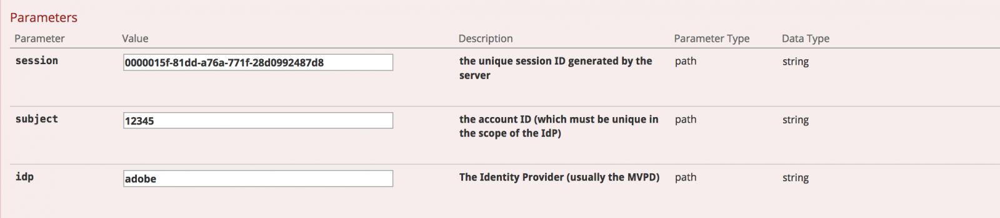

對呼叫使用和作業階段心率相同的引數。 回應HTTP狀態碼為：

* 成功回應為202 ACCEPTED
* 如果工作階段已停止，則為410 GONE。

#### 破壞原則 {#breaking-policy-app-first}

為了模擬指派給應用程式的3個資料流原則中斷時的行為，我們需要3次呼叫工作階段初始化。 為了讓原則生效，呼叫必須在其中一個工作階段因缺少心率而過期之前完成。 我們將會看到這些呼叫全部成功，但如果我們進行第4次呼叫，則會失敗並出現下列錯誤：

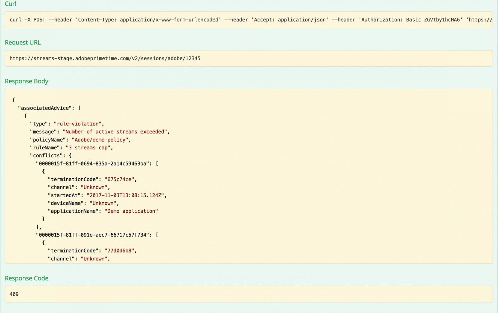

我們會收到409 CONFLICT回應，以及裝載中的評估結果物件。 閱讀以下檔案中的評估結果完整說明： [Swagger API規格](http://docs.adobeptime.io/cm-api-v2/#evaluation-result).

應用程式可使用評估結果中的資訊，在停止視訊時向使用者顯示特定訊息，並在需要時採取進一步的動作。 一個使用案例是停止其他現有的串流，以啟動新的串流。 這是透過使用 **終止代碼** 值存在於 **衝突** 特定衝突屬性的欄位。 此值將在新工作階段初始化的呼叫中作為X-Terminate HTTP標頭提供。

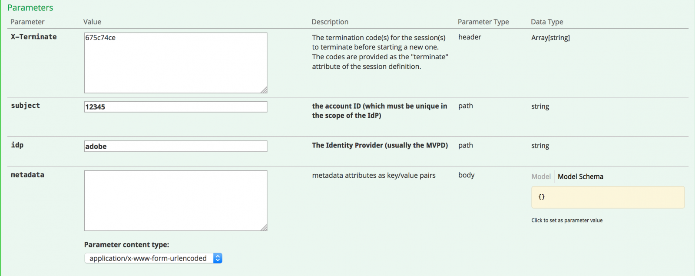

在工作階段初始化時提供一或多個終止代碼時，呼叫將會成功，並產生新的工作階段。 然後，如果我們嘗試對其中一個已從遠端停止的工作階段發出心率，我們會收到410 GONE回應，其中包含說明工作階段已從遠端終止的評估結果裝載，例如範例中的：

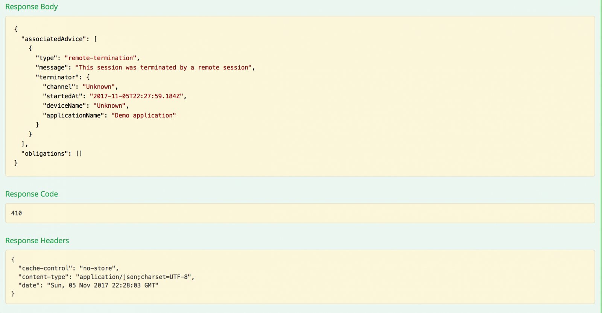

### 第二個應用程式 {#second-application}

我們將使用的另一個範例應用程式是具有ID的應用程式 **demo-app-2**. 此原則已指派給一項原則，其中一項規則會將通道可用的串流數量限製為最多2個。   您必須提供管道變數，才能評估此原則。

#### 正在擷取中繼資料 {#retrieving-metadata}

在頁面的右上角設定新的應用程式ID，並呼叫中繼資料資源。 您會收到下列回應：

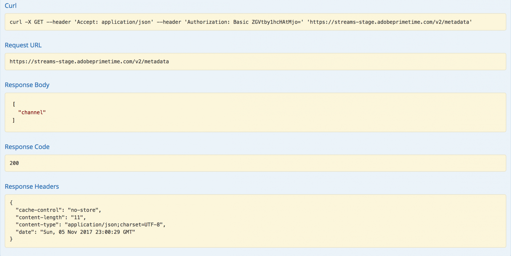

這次，回應本文不再是空白清單，就像第一個應用程式的範例一樣。 Concurrency Monitoring Service現在會在回應主體中宣告 **頻道** 工作階段初始化時需要中繼資料，才能評估原則。

如果您進行呼叫時沒有提供 **頻道** 引數，您將會收到：

* 回應代碼 — 400個錯誤請求
* 回應內文 — 在中說明的評估結果裝載 **義務** 欄位工作階段初始化的要求中預期完成的專案，以便作業成功。

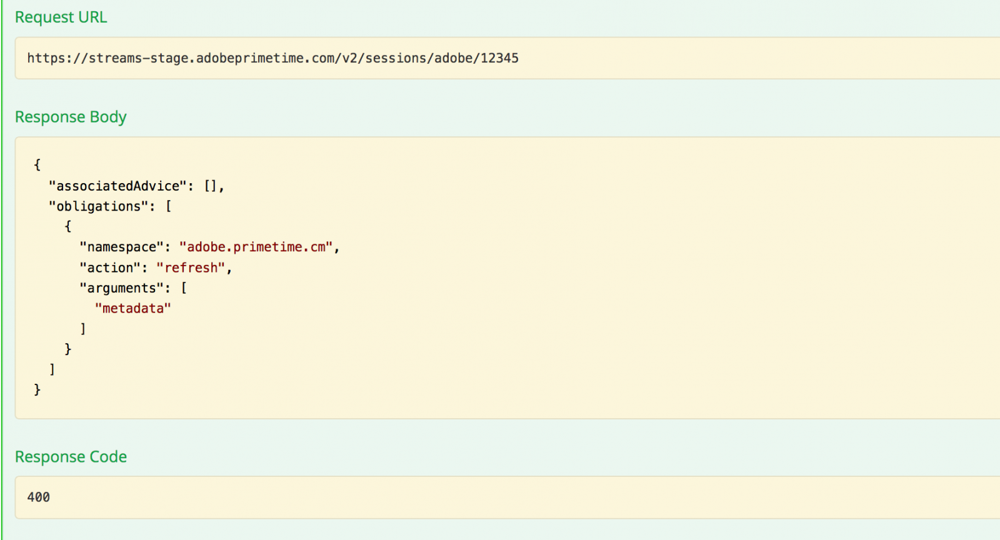

#### 工作階段初始化 {#session-init}

為所需的中繼資料金鑰指派值，並將其設定為工作階段初始化請求中的表單引數，如下所示：

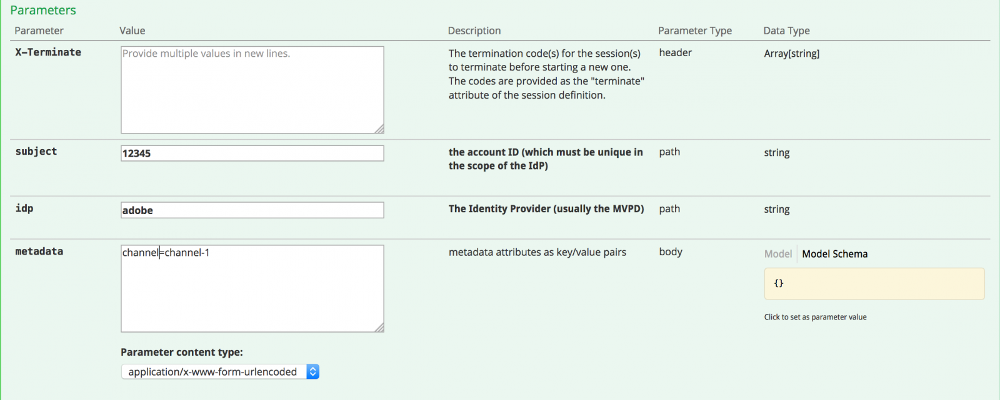

現在呼叫將成功，並產生新的工作階段。

#### 破壞原則 {#breaking-policy-second-app}

為了中斷指派給此應用程式的原則中所包含的規則，我們需要使用相同的管道值進行2次呼叫。 如同第一個範例，第二個呼叫必須在第一個產生的工作階段仍然有效時完成。

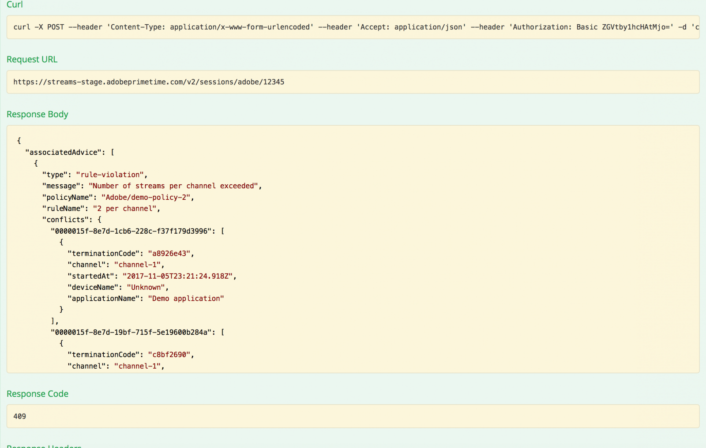

如果我們每次建立新工作階段時，都使用不同的管道中繼資料值，則所有呼叫都會成功，因為臨界值2會個別設定每個值的範圍。

就像第一個範例一樣，我們可以使用終止程式碼來遠端停止衝突的資料流，或者我們可以假設沒有心率在資料流上運作，而等待其中一個資料流過期。

