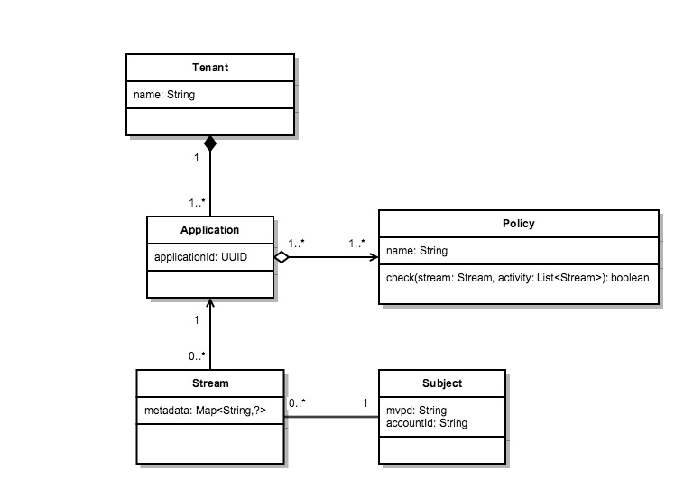
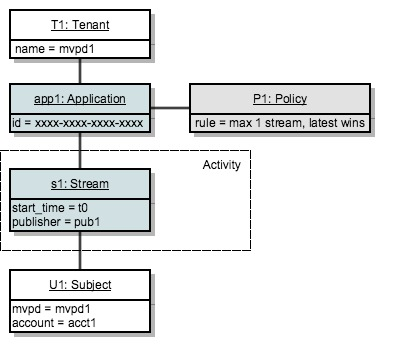
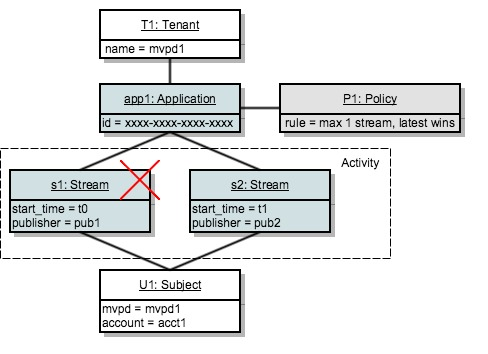
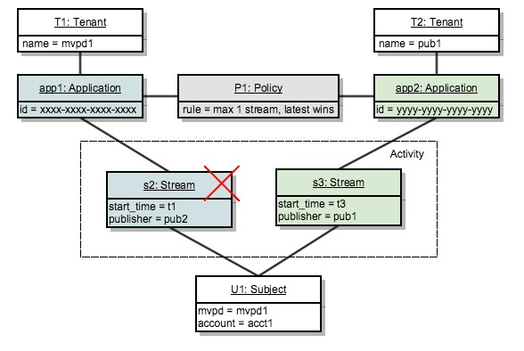
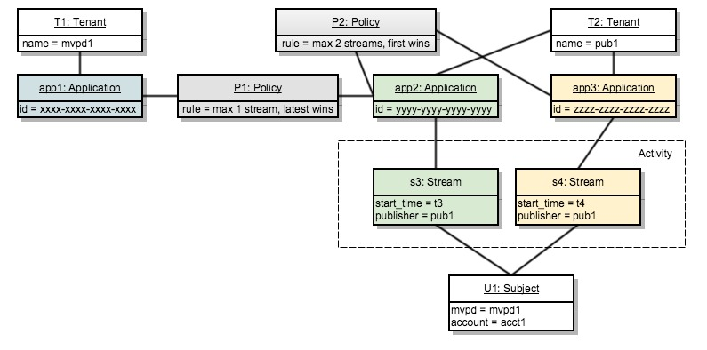
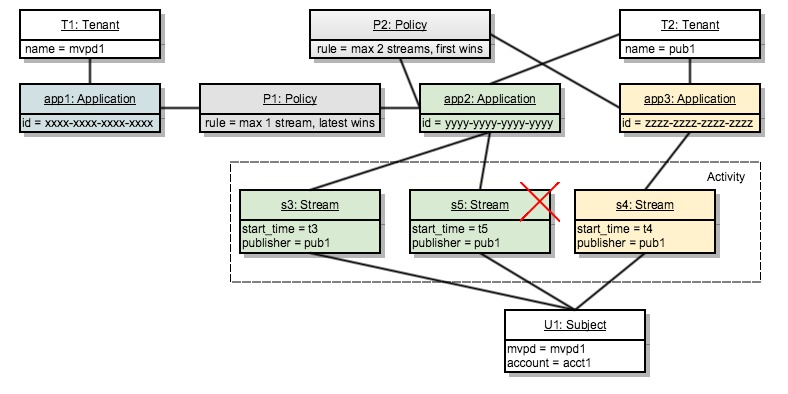
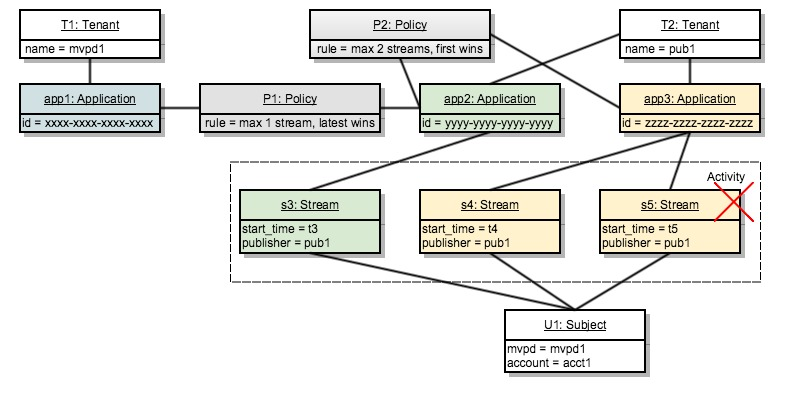
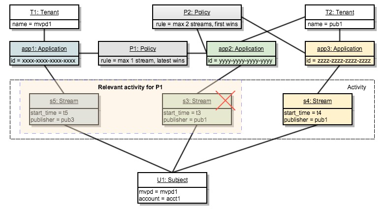

# 原則決定點 {#policy-desc-pt}

## 網域模型 {#domain-model}

本頁旨在作為不同使用案例和原則實施的參考。 我們建議您也參閱 [字彙表](/help/concurrency-monitoring/cm-glossary.md) 字詞定義檔案的一部分。

A **租使用者** 擁有 **應用計畫** 要強制執行的專案 **原則**. **使用者端應用程式** 必須設定為 **應用程式識別碼** (Adobe提供)。

租使用者接著會將每個應用程式與一個或多個原則建立關聯，這些原則可能是由他建立或由其他人建立和共用。 原則可以在多個租使用者之間連結。

此 **主題活動** 由特定主題的「並行監視」所報告的所有串流（無論應用程式為何）組成。

當要針對特定主題授權資料流時，系統將首先檢查為建立資料流的應用程式定義的所有原則。

接著，我們需要針對各項適用原則收集所有的 **相關活動** 則會傳遞至規則。 此 **相關活動** 原則P只有在符合下列條件時，才會包含資料流S：

**串流「S」由應用程式啟動，該應用程式的原則中包含原則「P」。**

## 試執行使用案例 {#dry-run-use-cases}

以下逐步說明旨在根據某些使用案例來驗證模型。 我們將從基本設定開始，以各種方式增加複雜性，逐步做到這一點。

### 1.一個租使用者。 一個應用程式。 一個原則。 一個資料流 {#onetenant-oneapp-onepolicy-onestream}

我們將從單一租使用者開始，透過單一應用程式和單一關聯原則。 我們假設原則宣告，任何使用者最多只能有一個使用中資料流（允許播放最新資料流）。

串流開始後，活動將僅包含該串流且允許播放。

### 2.一個租使用者。 一個應用程式。 一個原則。 兩個串流。 {#onetenant-oneapp-onepolicy-twostreams}

一旦第二個串流開始（由相同主體使用相同應用程式），用於驗證的活動將包含兩者 **s1** 和 **s2**.

超過限制，因為原則指出只允許播放一個資料流，所以我們將僅允許播放最新的資料流(**s2**)進行播放。

>[!NOTE]
>
>這些圖表代表使用者活動的系統檢視。 對於串流初始化嘗試，存取決定將包含在回應中。 對於作用中資料流，將會在心率回應上傳回決定。

### 3.兩個租戶。 兩個應用程式。 一個原則。 兩個串流。 {#twotenant-twoapp-onepolicy-twostreams}

現在，假設新租使用者想要在其應用程式中強制實施相同原則：

由於兩個租使用者透過相同原則連結，使用案例2中說明的情況適用於以下情況： **s3** 可以播放，因為它是最新的資料流。

### 4.兩個租戶。 三個應用程式。 兩個原則。 兩個串流。 {#twotenants-threeapps-twopolicies-twostreams}

現在，假設第二個租使用者部署了新應用程式，並且想要定義將在以下使用者之間共用的新原則： **app2** 和 **app3**.

此時，作用中的資料流 **s3** 和 **s4** 都允許。 的 **s3**，使用原則 **P1** 已評估，系統將只會計算 **s3** 作為 **相關活動** (**s4** 與原則沒有關聯 **P1**)因此沒有違規。

原則 **P2** 會套用至兩個串流，而且會包含兩者 **s3** 和 **s4** 作為相關活動。 由於此活動在兩個資料流的界限內，因此允許兩個資料流。

### 5.兩個租戶。 三個應用程式。 兩個原則。 三個串流。 {#twotenants-threeapps-twopolicies-threestreams}

現在，假設已使用執行新的資料流初始化嘗試 **app2**：

**s5** 允許開始於 **P1** （可讓較新的串流接管），但遭拒 **P2**，因此不會啟動。

如果嘗試使用app3初始化資料流，也會發生相同情況：相同原則P2會拒絕其存取。

現在，讓我們看看如果使用者嘗試使用app1建立新串流會發生什麼情況：

應用程式app1與原則沒有關聯 **P2**，因此僅套用原則 **P1**：允許新串流開始並拒絕舊串流(**s3** 在此案例中)。

