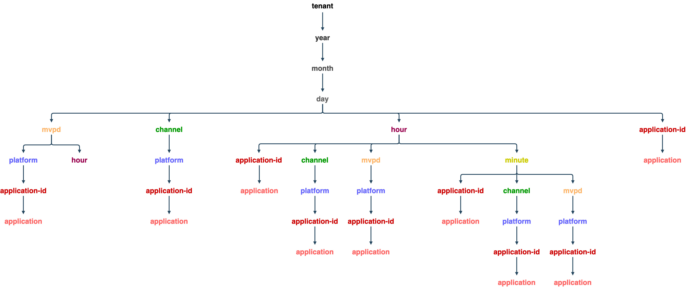

# 並行監視使用API {#cmu-api-usage}

>[!NOTE]
>
>此頁面上的內容僅供參考。 使用此API需要Adobe的目前授權。 不允許未經授權的使用。

## API總覽 {#api-overview}

Concurrency Monitoring Usage (CMU)實作為WOLAP （Web型） [線上分析處理](http://en.wikipedia.org/wiki/Online_analytical_processing))專案。 CMU是通用的業務報告Web API，由資料倉儲提供支援。 它用作HTTP查詢語言，可讓一般OLAP作業以RESTfully方式執行。


>[!NOTE]
>
>CMU API並非一般可用。 如需瞭解可用性問題，請聯絡您的Adobe代表。

CMU API提供基礎OLAP立方結構的階層檢視。 每個資源([維度](/help/authentication/entitlement-service-monitoring-overview.md#progr-filter-metrics) 在維度階層中，對應為URL路徑區段)，產生報表包含（彙總） [量度](/help/authentication/entitlement-service-monitoring-overview.md#programmers-can-monitor-the-following-metrics) 用於目前的選取範圍。 每個資源都指向其父資源（用於累計）及其子資源（用於向下鑽研）。 切片和切割是透過將維度釘選到特定值或範圍的查詢字串引數實現的。

REST API會根據維度路徑、提供的篩選器和選取的量度，在請求中指定的時間間隔內提供可用資料（如果未提供，則會退回預設值）。 時間範圍不會套用至不包含時間維度（年、月、日、小時、分鐘、秒）的報表。

端點URL根路徑會傳回單一記錄中的整體彙總量度，以及可用向下切入選項的連結。 API版本會對應為端點URI路徑的尾端區段。 例如， https://mgmt.auth.adobe.com/cmu/*v2* 表示使用者端將存取WOLAP版本2。

可透過回應中所包含的連結來探索可用的URL路徑。 有效的URL路徑會被保留，以對應基礎向下鑽研樹狀結構中包含（預先）彙總量度的路徑。 /dimension1/dimension2/dimension3格式的路徑將反映這三個維度（相當於SQL子句GROUP BY dimension1、dimension2、dimension3）的預先彙總。 如果這樣的預先彙總不存在，且系統無法即時運算它，則API將傳回「404找不到」回應。

### 向下鑽研樹狀結構 {#drill-down-tree}

下列向下展開樹狀結構說明CMU 2.0中可用的維度（資源）：

**CM租使用者可用的Dimension**



A `GET` 至 `https://mgmt.auth.adobe.com/cmu/v2` API端點將傳回包含以下內容的表示法：

* 可用根目錄向下鑽研路徑的連結：

  ```html
  <link rel="drill-down" href="/cmu/v2/dimensionA"/>
  <link rel="drill-down" href="/cmu/v2/dimensionB"/>
  ```

* 所有度量的摘要（彙總值） （在預設間隔中，由於未提供查詢字串引數，請參閱下文）。

在深入研究路徑之後（逐步執行）： /dimensionA/year/month/day/dimensionX會擷取下列回應：

* 「dimensionY」和「dimensionZ」向下切入選項的連結
* 包含dimensionX每個值的每日彙總的報表

### **篩選器**

除了日期/時間維度外，目前投影可用的任何維度（維度路徑）都可透過將其名稱作為查詢字串引數來篩選。

下列篩選選項可供使用：

* **等於** 將維度名稱設為查詢字串中的特定值可提供篩選器。
* **在** 透過使用不同的值多次新增相同的dimension-name引數可以指定篩選器： dimension=value1&amp;dimension=value2
* **不等於** 篩選器必須使用「！」 維度名稱后的符號，會產生&#39;！=&#39; &quot;operator&quot;： dimension！=value
* **不在……之內** 篩選器需要&#39;！=&#39;運運算元使用多次，每個值各使用一次： dimension！=value1&amp;dimension！=value2&amp;...


查詢字串中的維度名稱也有特殊用法：如果維度名稱用作無值的查詢字串引數，這會指示API傳回報表中包含該維度的投影。

CMU查詢範例：

| URL | SQL等同專案 |
|:---|:---|
| /dimension1/dimension2/dimension3？dimension1=value1 | 從投影中選取*，其中dimension1 = &#39;value1&#39;群組依據dimension1、dimension2、dimension3 |
| /dimension1/dimension2/dimension3？dimension1=value1&amp;dimension1=value2 | 從投影中選取*，其中dimension1在(&#39;value1&#39;， &#39;value2&#39;) GROUP BY dimension1， dimension2， dimension3 |
| /dimension1/dimension2/dimension3？dimension1！=value1 | 從投影中選取*，其中dimension1 &lt;> &#39;value1&#39;依dimension1、dimension2、dimension3分組 |
| /dimension1/dimension2/dimension3？dimension1！=value1&amp;dimension2！=value2 | 從投影中選取*，其中維度1不在(&#39;value1&#39;， &#39;value2&#39;)群組依據dimension1， dimension2， dimension3 |
| 假設沒有直接路徑： /dimension1/dimension3，但有路徑： /dimension1/dimension2/dimension3  </br></br> /dimension1？dimension3 | 選取*從投影群組BY dimension1，dimension3 |

>[!NOTE]
>
>這些篩選技術均不適用於日期/時間維度。 篩選日期/時間維度的唯一方法是將開始和結束查詢字串引數（如下所述）設定為所需的值。

下列查詢字串引數對API而言具有保留意義（因此它們無法當作維度名稱使用，否則無法對此類維度進行篩選）。

CMU API保留的查詢字串引數：

| 引數 | 可選 | 說明 | 預設值 | 範例 |
|:--------------|:--------|:---------------------------------------------------------------------------------------------------------------------------------------------------------------------------------------------------------------------------------------------------------------------------------------------------|:-------------------------------------------------------------------------------------------------------------------------------|:------------------------------------------|
| access_token | 是 | 在啟用IMS OAuth保護的情況下，IMS權杖可作為標準授權持有人權杖或查詢字串引數傳遞。 | 無 | access_token=XXXXXX |
| dimension-name | 是 | 任何維度名稱 — 包含在目前URL路徑或任何有效的子路徑中；此值將視為等於篩選器。 如果未提供值，即使指定尺寸未包含或鄰近目前路徑，也會強制將指定尺寸包含在輸出中 | 無 | someDimension=someValue&amp;someOtherDimension |
| 結束 | 是 | 報表的結束時間（以毫秒為單位） | 伺服器的目前時間 | end=2012-07-30 |
| 格式 | 是 | 用於內容交涉（具有相同效果，但優先順序低於路徑「副檔名」 — 請參閱下文）。 | 無：內容交涉將嘗試其他策略 | format=json |
| limit | 是 | 要傳回的最大列數 | 若要求中未指定限制，則為伺服器回報的預設值（在自我連結中） | limit=1500 |
| 量度 | 是 | 要傳回的量度名稱清單（以逗號分隔）；這應該用於篩選可用量度的子集（以減少裝載大小），以及強制執行API以傳回包含請求量度的投影（而不是預設的最佳投影）。 | 若未提供此引數，將會傳回目前投影可用的所有量度。 | metrics=m1，m2 |
| 開始 | 是 | 報表的開始時間設為ISO8601；若僅提供字首，伺服器會填入剩餘的部分：例如，start=2012會導致start=2012-01-01:00:00:00 | 伺服器以自我連結的方式報告；伺服器會根據選取的時間詳細程度，嘗試提供合理的預設值 | start=2012-07-15 |


目前唯一可用的HTTP方法是GET。 未來版本可能提供OPTIONS/HEAD方法的支援。


## CMU API狀態代碼 {#cmu-api-status-codes}

| 狀態代碼 | 原因片語 | 說明 |
|:-----------|:---------------------|:------------------------------------------------------------------------------------------------------------------------------------------------------------------------------------------------------------------------------------------------------------------------------------------------------------------------------------------------------------------------------------------------------------------------------------------------------------------------------------------------------------|
| 200 | 確定 | 回應將包含「統計」和「深入研究」連結（如果適用）。 報表將呈現為資源的屬性：巢狀的「report」元素/屬性。 |
| 400 | 錯誤請求 | 回應內文會包含文字訊息，說明要求的問題。  400錯誤請求狀態會在回應內文中隨附說明文字（純/文字媒體型別），提供有關使用者端錯誤的實用資訊。 除了套用至非現有維度的無效日期格式或篩選器等瑣碎情境外，系統也會拒絕回應需要即時傳回或彙總大量資料的查詢。 |
| 401 | 未獲授權 | 請求未包含正確的OAuth標頭來驗證使用者所導致 |
| 403 | 已禁止 | 指出目前的安全性內容不允許此要求；當使用者已驗證但不允許存取要求的資訊時，就會發生這種情況 |
| 404 | 找不到 | 當請求中提供了無效的URL路徑時發生。 如果使用者端遵循200個回應所提供的「深入研究」/「統計」連結，則絕不應該發生這種情況 |
| 405 | 不允許的方法 | 表示要求中使用不受支援的方法。 雖然目前僅支援GET方法，但未來版本可能允許HEAD或OPTIONS |
| 406 | 不可接受 | 代表使用者端要求的媒體型別不受支援 |
| 500 | 內部伺服器錯誤 | 「這絕不應該發生」 |
| 503 | 服務無法使用 | 代表應用程式或其相依性發生錯誤 |

## 資料格式 {#data-formats}

資料提供下列格式：

* JSON （預設）
* XML
* CSV
* HTML（供示範用途）


使用者端可使用下列內容交涉策略（優先順序由清單中的位置指定 — 優先順序）：

1. URL路徑的最後一個區段後面會加上「副檔名」：例如/cmu/v2/tenant/year/month/day.xml。 如果URL包含查詢字串，則副檔名必須位於問號之前： `/cmu/v2/tenant/year/month/day.csv?mvpd=SomeMVPD`
1. 格式查詢字串引數：例如 `/cmu/report?format=json`
1. 標準HTTP Accept標頭：例如 `Accept: application/xml`

「擴充功能」和查詢引數都支援下列值：

* xml
* json
* csv
* html

如果任何策略未指定任何媒體型別，API預設會產生JSON內容。

## 超文字應用程式語言(HAL) {#hypertext-app-lang}

針對JSON和XML，裝載將編碼為HAL，如下所述： `http://stateless.co/hal_specification.html`.

實際報表（稱為「報表」的巢狀標籤/屬性）包含實際記錄清單，其中包含所有已選取/適用的維度和量度及其值，編碼如下：

### JSON {#json}

```js
 "report": [
  {
    "dimension1": "d1",
    ...
    "metric1": "m1",
    ...
  }, {
    ...
  }
]
```

### XML {#xml}

```xml
 <report>
  <record dimension1="d1" ... metric1="m1" ... />
  ...
</report>
```

對於XML和JSON格式，記錄中的欄位（維度和量度）順序未指定，但是一致的（所有記錄的順序將相同）。 不過，使用者端不應依賴記錄中欄位的任何特定順序。

資源連結（JSON中的「本身」和XML中的「href」資源屬性）包含目前路徑和用於內嵌報告的查詢字串。 查詢字串將會顯示所有隱含和明確的引數，因此裝載將會明確指出使用的時間間隔、隱含的篩選器（如果有的話）等等。 資源內的其餘連結將包含可以依循的所有可用區段，以向下鑽研目前的資料。 也會提供彙總連結，且會指向父路徑（如果有的話）。 此 `href` 向下切入/向上連結的值僅包含URL路徑（其中不包含查詢字串，因此使用者端需要視需要附加它）。 請注意，並非目前資源使用（或暗示）的所有查詢字串引數都適用於「向上彙整」或「向下鑽研」連結（例如，篩選器可能不適用於子資源或超級資源）。

範例(假設我們有一個稱為使用者端的量度，而且有一個預先彙總 `year/month/day/...`)：

* `https://mgmt.auth.adobe.com/cmu/v2/year/month.xml`

  ```xml
  <resource href="/cmu/v2/year/month?start=2012-07-20T00:00:00&end=2012-08-20T14:35:21">
    <links>
      <link rel="roll-up" href="/cmu/v2/year"/>
      <link rel="drill-down" href="/cmu/v2/year/month/day"/>
    </links>
    <report>
      <record month="6" year="2012" clients="205"/>
      <record month="7" year="2012" clients="466"/>
    </report>
  </resource>
  ```

* `https://mgmt.auth.adobe.com/cmu/v2/year/month.json`

  ```js
  {
    "_links" : {
      "self" : {
        "href" : "/cmu/v2/year/month?start=2012-07-20T00:00:00&end=2012-08-20T14:35:21"
      },
      "roll-up" : {
        "href" : "/cmu/v2/year"
      },
      "drill-down" : {
        "href" : "/cmu/v2/year/month/day"
      }
    },
    "report" : [ {
      "month" : "6",
      "year" : "2012",
      "clients" : "205"
    }, {
      "month" : "7",
      "year" : "2012",
      "clients" : "466"
    } ]
  }
  ```

### CSV {#csv}

在CSV資料格式中，不會內嵌提供連結或其他中繼資料（標題列除外），而是會依照此模式，以檔案名稱提供選取範圍中繼資料：

```html
report__<start-date>_<end-date>_<filter-values,...>.csv
```

CSV將包含一個標題列，然後報告資料作為後續列。 標題列將包含所有維度，以及後面的所有量度。 報表資料的排序順序會反映在維度的順序中。 因此，如果資料依D1排序，然後依D2排序，CSV標題看起來會像這樣： `D1, D2, ...metrics....`

標題列中的欄位順序將反映表格資料的排序順序。

範例： https://mgmt.auth.adobe.com/cmu/v2/year/month.csv將產生一個名為 ```report__2012-07-20_2012-08-20_1000.csv``` 包含下列內容：

| 年 | 月 | 使用者端 |
|:----:|:-----:|:-------:|
| 2012 | 6 | 580 |
| 2012 | 7 | 231 |

## 資料新鮮度 {#data-freshness}

雖然請求包含Last-Modified標頭，但 **不會** 反映內文中報表的上次更新時間。 一般報表會定期計算，規則如下：

* 如果時間詳細程度為 **年** 或 **月**，則報告每2天更新一次
* 如果時間詳細程度為 **天**，則報告每3小時更新一次
* 如果時間詳細程度為 **小時**，則報告會每小時更新一次
* 如果時間詳細程度為 **分鐘**，則報告會每分鐘更新一次

此 **活動層級** 和 **並行層級** 報表會每天更新，無論時間詳細程度為何。

## GZIP壓縮 {#gzip-compression}

Adobe強烈建議您在擷取CMU報表的使用者端中啟用gzip支援。 這麼做會大幅減少回應大小，進而縮短回應時間。 （CMU資料的壓縮比在20到30的範圍內。）

若要在使用者端中啟用gzip壓縮，請依照以下方式設定Accept-Encoding：標頭：

```
Accept-Encoding: gzip, deflate
```

## 相關資訊 {#related-information}

* [CMU概述](/help/concurrency-monitoring/cm-usage-reports.md)
