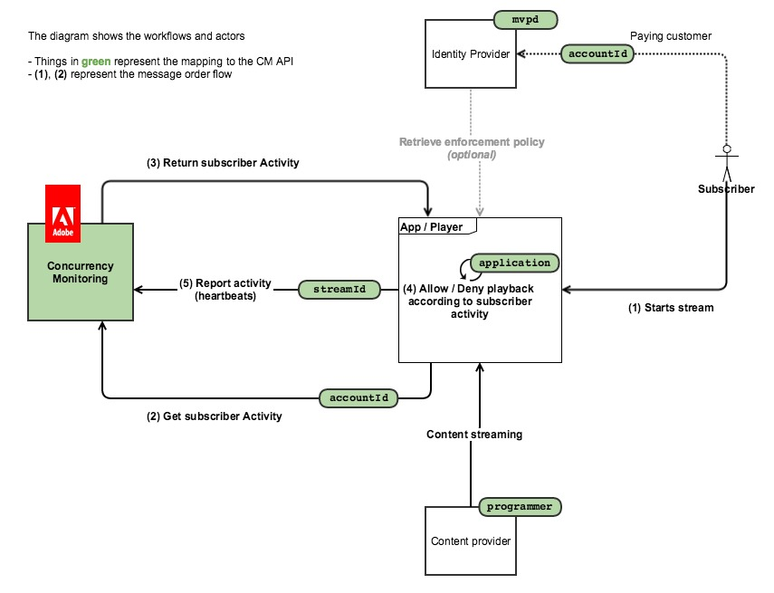
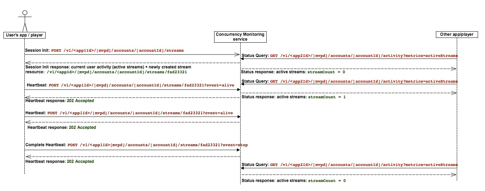

# 原則資訊點 {#pip}

>[!NOTE]
>
>此頁面已淘汰，因為它適用於不再建議用於新整合的舊版API

下圖顯示客戶選擇使用時所用的流程 **原則資訊點**（在這種情況下，CM僅用於查詢活動，並且所有存取邏輯都已嵌入客戶端應用程式中）：

下圖說明觀看來自2部裝置之內容的使用者如何進行資料流計數。

簡而言之，一般的訊息流程如下：

1. 最初，對於從未使用過服務的使用者，會載入網頁/開啟應用程式，由並行監視服務檢測的應用程式進行工作階段初始化呼叫。
1. Concurrency Monitoring Service會傳迴心率的新資料流資源，以及目前的使用者活動。
1. 在視訊播放期間，儀器的應用程式會對「並行監視服務」發出心率呼叫，指出使用者目前正在使用視訊。
1. 在任何其他時間點，其他儀表化的應用程式都可以向並行監視服務發出狀態查詢呼叫，這會傳回目前的使用者活動。
1. 在視訊播放結束時，儀器的應用程式可以使用「event=stop」發出心率呼叫，這表示視訊已停止，而且目前的資料流不應再計為作用中的資料流。

