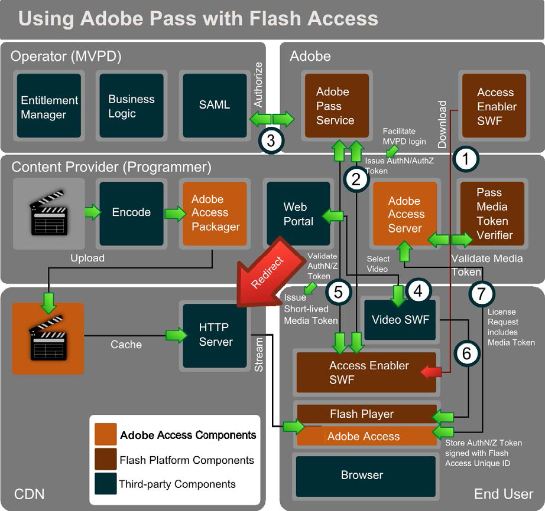

# Adobe Pass和Adobe {#adobe-pass-and-adobe-access}

Adobe Pass )跨多個內容提供程式提供用戶/設備身份驗證和授權。 用戶必須有有效的有線電視或衛星電視訂閱。

<!---->

Adobe Pass可以與Adobe訪問一起用於保護媒體內容。 在此方案中，視頻播放器(SWF)可以載入另一個SWF，稱為 *訪問啟用碼*&#x200B;由Adobe Systems主辦。 的 *訪問啟用碼* 用於連接到Adobe Pass服務，並促進SAML SSO與MVPD（多通道視頻寫程式分發伺服器）身份提供程式系統的整合。 這涉及將用戶的瀏覽器簡要重定向到MVPD登錄頁，然後保存AuthN令牌，最後使用快取的AuthN會話返回到內容網站。

的 *訪問啟用碼* 然後便於Adobe Pass服務和MVPD之間的後端授權。 MVPD維護業務邏輯並確定用戶有權訪問哪些內容。 該權利保留在該內容資源的附加AuthZ令牌中，並將其發回給客戶端。

使用Adobe訪問客戶端的唯一ID和私鑰對認證和授權令牌進行簽名以避免篡改或欺騙。 只能通過 *訪問啟用碼*。

視頻播放器可以通過呼叫來觸發該過程 `getAuthorization` 的 *訪問啟用碼*。 當存在有效的AuthN/AuthZ令牌時， *AccessEnabler* 向視頻播放器發出回叫，該視頻播放器將包含用於播放視頻內容的短時媒體令牌。

Adobe Pass提供可部署到伺服器的媒體令牌驗證程式Java庫。 使用Flass Access伺服器進行內容保護時，可以將媒體令牌驗證器與Adobe訪問伺服器端插件整合，以便在成功驗證媒體令牌後自動頒發通用許可證。 然後，內容從CDN伺服器流式傳輸到客戶機。 為了獲得內容許可，可將短壽命媒體令牌提交到Adobe訪問伺服器，其中驗證令牌的有效性並且可以頒發許可證。

長壽命AuthN令牌通常由 *訪問啟用碼* 跨所有內容開發商，以表示該MVPD訂閱伺服器的AuthN。 此外，Adobe Access Server和令牌驗證器可由CDN或服務提供商代表內容提供商操作。
