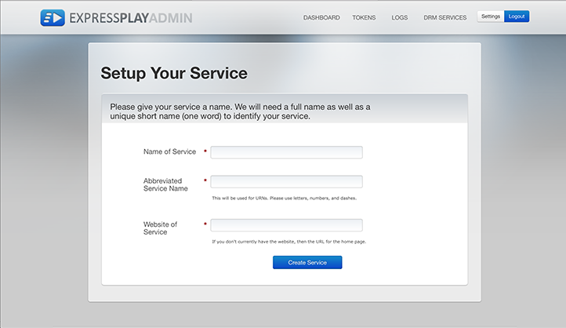

# 取得已布建（帳戶等）{#get-provisioned-accounts-etc}

若要開始使用Primetime DRM Cloud（採用ExpressPlay），您需要在Adobe代表的協助下，設定Adobe憑證和ExpressPlay帳戶。

1. 請洽詢您的Adobe代表，並要求您使用TVSDK實作多DRM時所需的Adobe憑證和ExpressPlay帳戶。

       提供您的Adobe代表您將用作聯絡點的電子郵件地址。Adobe然後為您建立兩個帳戶：
   
   * ***憑證入口帳戶*** -(https://certportal.primetime.adobe.com):Adobe *存取/ Primetime DRM認證註冊管理團* 隊會寄送電子郵件給您提供的地址。此電子郵件包含Adobe憑證入口網站的URL，以及Adobe憑證註冊檔案的連結(最新檔案位於：[證書註冊指南](../../../digital-rights-management/certificate-enrollment-guide/about-certs.md))。

   * ***ExpressPlay帳戶*** -Adobe會寄送電子郵件給您，其中包含您用來註冊ExpressPlay管理員帳戶的連結。

1. 使用您的Adobe ID登入Adobe憑證入口網站(使用您提供給Adobe代表的相同電子郵件地址)。 如果您尚未擁有Adobe ID，可以按照&#x200B;*從證書門戶獲取Adobe ID*&#x200B;連結快速建立一個：

   <!---->

   

1. 在Adobe證書門戶上，請求&#x200B;*試用*&#x200B;證書。

   對於Multi-DRM試用版，單一試用憑證將涵蓋內容保護的所有方面：包裝、授權和傳輸。 您需要提供您自己的[CSR](../../../digital-rights-management/certificate-enrollment-guide/request-certs/gen-cert-signing-req.md)才能請求證書：
   <!---->

   

   Adobe會寄送電子郵件給您，指出您接受或拒絕憑證要求。 在cert portal的&#x200B;*Request history*&#x200B;標籤上，您可以看到cert請求的狀態：
   <!---->

   

1. 建立您的ExpressPlay管理帳戶。

   請依照連結，連至該Adobe提供給您的ExpressPlay。 這會在ExpressPlay中開啟&#x200B;*建立帳戶*&#x200B;頁面。 填寫所需資訊並提交表格。 您將會收到一封來自`operations@expressplay.com`的電子郵件，其中包含一週有效的啟動連結。 啟動後，請設定您的ExpressPlay服務：
   <!---->

   

   當您建立服務後，會顯示您自己的「管理」頁面。 除了某些活動追蹤欄位外，您還會看到您的「生產與測試&#x200B;*客戶驗證器*（API金鑰）」，以及您的「生產與測試」服務URL:

   <!---->

    

1. 如果您使用FairPlay，則需執行其他步驟（在Apple開發人員網站上）以設定ExpressPlay。 如需指示，請參閱[啟用FairPlay的ExpressPlay服務](../../multi-drm-workflows/p-l-and-p/fairplay-workflow.md#enable-expressplay-service-for-fairplay)。
