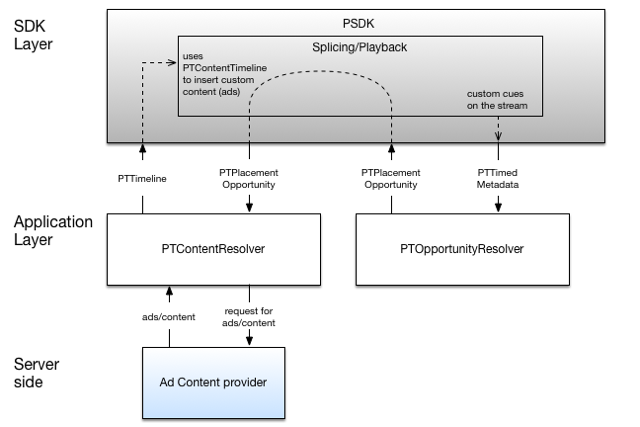

# 實作自訂商機／內容解析器{#implement-a-custom-opportunity-content-resolver}

您可以根據預設解析器實作解析器。

<!--<a id="fig_CC41E2A66BDB4115821F33737B46A09B"></a>-->



1. 擴充`PTContentResolver`抽象類別，以開發自訂廣告解析程式。

   `PTContentResolver` 是必須由內容解析器類實現的介面。同名的抽象類也可用，並自動處理配置（獲取委派）。

   >[!TIP]
   >
   >`PTContentResolver` 在班級里 `PTDefaultMediaPlayerClientFactory` 曝光。客戶端可以通過擴展`PTContentResolver`抽象類來註冊新的內容解析器。 預設情況下，除非特別刪除，`PTDefaultAdContentResolver`將在`PTDefaultMediaPlayerClientFactory`中註冊。

   ```
   @protocol PTContentResolver <NSObject> 
   @required 
   + (BOOL)shouldHandleOpportunity:(PTPlacementOpportunity *)opportunity;  
   //Detector returns YES/NO if it should handle the following placement opportunity 
   - (void)configWithPlayerItem:(PTMediaPlayerItem *)item  
                 delegate:(id<PTContentResolverDelegate> delegate); 
   - (void)process:(PTPlacementOpportunity *)opportunity; 
   - (void)timeout:(PTPlacementOpportunity *)opportunity;  
   //The timeout method gets invoked if the TVSDK decides that the  
   //PTContentResolver is taking too much time to respond. 
   @end 
   
   @interface PTContentResolver : NSObject <PTContentResolver> 
   
   @property (readonly) id<PTContentResolverDelegate> delegate; 
   @property (readonly) PTMediaPlayerItem *playerItem; 
   
   - (BOOL)shouldHandleOpportunity:(PTPlacementOpportunity *)opportunity; 
   - (void)configWithPlayerItem:(PTMediaPlayerItem *)item  
                  delegate:(id<PTContentResolverDelegate>) delegate; 
   - (void)process:(NSArray *)opportunities; 
   - (void)cancel:(NSArray *)opportunities; 
   @end
   ```

1. 實施`shouldResolveOpportunity`並傳回`YES`（如果它應處理收到的`PTPlacementOpportunity`）。
1. 實作`resolvePlacementOpportunity`，開始載入替代內容或廣告。
1. 載入廣告後，請準備`PTTimeline`，其中包含要插入之內容的相關資訊。

       以下是有關時間軸的一些有用資訊：
   
   * 前滾、中滾和後滾類型可以有多種`PTAdBreak`。

      * `PTAdBreak`包含下列項目：

         * `CMTimeRange`，包含中斷的開始時間和持續時間。

            此值設定為`PTAdBreak`的範圍屬性。

         * `NSArray` of  `PTAd`s.

            這會設為`PTAdBreak`的ads屬性。
   * `PTAd`代表廣告，而每個`PTAd`都有下列項目：

      * `PTAdHLSAsset`設為廣告的主要資產屬性。
      * 可能有多個`PTAdAsset`例項可點選廣告或橫幅廣告。

   例如：

   ```
   NSMutableArray *ptBreaks = [[[NSMutableArray alloc] init] autorelease]; 
   
   // Prepare the primary asset of the ad - links to ad m3u8 
   PTAdHLSAsset *ptAdAsset = [[[PTAdHLSAsset alloc] init] autorelease]; 
   ptAdAsset.source = AD_SOURCE_M3U8; 
   ptAdAsset.id = FAKE_NUMBER_ID; 
   ptAdAsset.format = @"video"; 
   
   // Prepare the ad itself. 
   PTAd *ptAd = [[[PTAd alloc] init] autorelease]; 
   ptAd.primaryAsset = ptAdAsset; 
   ptAd.primaryAsset.ad = ptAd; 
   
   // Prepare the break and add the ad created above. 
   PTAdBreak *ptBreak = [[[PTAdBreak alloc] init] autorelease]; 
   ptBreak.relativeRange = CMTimeRangeMake(BREAK_START_TIME, BREAK_DURATION_VALUE); 
   [ptBreak addAd:ptAd]; 
   
   // Add the break to array of breaks. 
   [ptBreaks addObject:adBreak]; 
   
   // Once all breaks have been prepared, they can be set on timeline 
   PTTimeline *_timeline = [[PTTimeline alloc] init]; 
   _timeline.adBreaks = ptBreaks;
   ```

1. 呼叫`didFinishResolvingPlacementOpportunity`，其中提供`PTTimeline`。
1. 呼叫`registerContentResolver`，將您的自訂內容／廣告解析程式註冊至預設媒體播放器工廠。

   ```
   //Remove default content/ad resolver 
   [[PTDefaultMediaPlayerFactory defaultFactory] clearContentResolvers]; 
   
   //Create an instance of your content/ad resolver (id <PTContentResolver>) 
   CustomContentResolver *contentResolver = [[CustomContentResolver alloc] init]; 
   
   //Set custom content/ad resolver 
   [[PTDefaultMediaPlayerFactory defaultFactory] registerContentResolver:[contentResolver autorelease]];
   ```

1. 如果您實作自訂機會解析器，請將它註冊至預設的媒體播放器工廠。

   >[!TIP]
   >
   >您不需要註冊自訂的銷售機會解析器，就可以註冊自訂的內容／廣告解析器。

   ```
   //Remove default opportunity resolver 
   [[PTDefaultMediaPlayerFactory defaultFactory] clearOpportunityResolvers]; 
   
   //Create an instance of your opportunity resolver (id <PTOpportunityResolver>) 
   CustomOpportunityResolver *opportunityResolver = [[CustomOpportunityResolver alloc] init]; 
   
   //Set custom opportunity resolver 
   [[PTDefaultMediaPlayerFactory defaultFactory]  
              registerOpportunityResolver:[opportunityResolver autorelease]];
   ```

當播放器載入內容時，並判斷其為VOD或LIVE類型，會發生下列其中一種情況：>
* 如果內容是VOD，則使用自訂內容解析程式來取得整個視訊的廣告時間軸。
* 如果內容為LIVE，則每次在內容中偵測到放置機會（提示點）時，都會呼叫自訂內容解析器。
